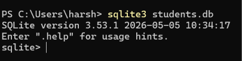
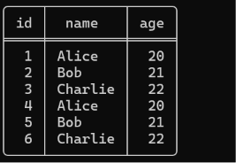
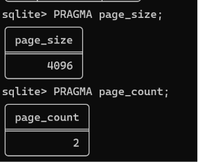
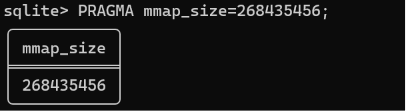
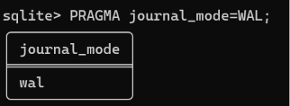
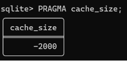
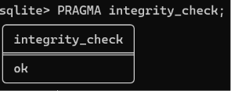
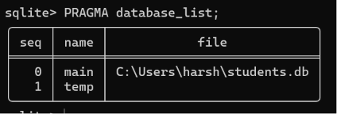
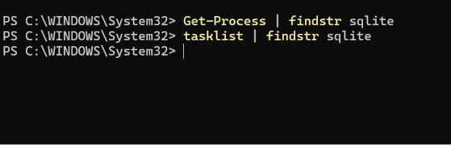
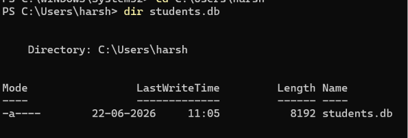

# Lab Session 2: SQLite3 Internals — mmap, Page Size, PRAGMA & Library Architecture

## Objective

- Install and verify SQLite3.
- Explore SQLite storage internals using PRAGMA commands.
- Understand memory-mapped I/O (mmap).
- Understand why SQLite is an embedded database library.
- Compare SQLite and PostgreSQL architectures.

---

# Part 1: Installation & Verification

## Command

```bash
sqlite3 --version
```

## Screenshot


---

# Part 2: Database Creation

## Command

```bash
sqlite3 students.db
```




# Part 3: Table Creation & Data Insertion

## Commands

```sql
CREATE TABLE students(
    id INTEGER PRIMARY KEY,
    name TEXT,
    age INTEGER
);

INSERT INTO students(name, age)
VALUES
('Alice',20),
('Bob',21),
('Charlie',22);

SELECT * FROM students;
```

## Screenshot



---

# Part 4: Page Size

## Command

```sql
PRAGMA page_size;
```

## Observation

- SQLite stores data in fixed-size pages.
- Default page size is usually 4096 bytes.


# Part 5: Page Count

## Command

```sql
PRAGMA page_count;
```

## Observation

Database Size Formula:

```text
Database Size = Page Size × Page Count
```


```text
4096 × 2 = 8192 bytes
```

## Screenshot



---

# Part 6: Memory-Mapped I/O (mmap)

## Commands

```sql
PRAGMA mmap_size;
```
```
0
```

Enable mmap:

```sql
PRAGMA mmap_size = 268435456;
PRAGMA mmap_size;
```

## Observation

- mmap maps database pages directly into memory.
- This can improve read performance.

## Screenshot



---

# Part 7: Journal Mode

## Commands

```sql
PRAGMA journal_mode;
```

Enable WAL:

```sql
PRAGMA journal_mode=WAL;
```

## Observation

- WAL (Write-Ahead Logging) improves concurrency.
- Readers can continue while writes occur.



---

# Part 8: Cache Size

## Command

```sql
PRAGMA cache_size;
```

## Observation

- Controls how many pages SQLite keeps in memory.

## Screenshot



---

# Part 9: Integrity Check

## Command

```sql
PRAGMA integrity_check;
```

## Observation

- Verifies database consistency and page integrity.

## Screenshot



---

# Part 10: Database List

## Command

```sql
PRAGMA database_list;
```

## Observation

- Displays attached databases and their file locations.

## Screenshot



---

# Part 11: SQLite Process Verification

## Commands

```powershell
Get-Process | findstr sqlite
tasklist | findstr sqlite
```

## Observation

- No SQLite server process was found.
- SQLite runs as an embedded library rather than a separate server process.

## Screenshot



---

# Part 12: Database File Verification

## Command

```powershell
dir students.db
```

## Observation

- SQLite stores the database in a single `.db` file.

## Screenshot



---

# SQLite vs PostgreSQL Comparison

| Feature | SQLite | PostgreSQL |
|----------|----------|------------|
| Architecture | Embedded Library | Client-Server |
| Process Model | Runs inside application | Separate server process |
| Communication | Direct function calls | TCP/Unix sockets |
| Authentication | File permissions | Roles and passwords |
| Storage | Single `.db` file | Data directory + WAL |
| Concurrency | Limited writes | MVCC with concurrent writes |
| Best Use Case | Embedded applications | Production systems |

---

# Key Insights

- SQLite is a serverless embedded database.
- SQLite stores all data in a single file.
- PRAGMA commands reveal internal database information.
- mmap can improve read performance.
- WAL mode improves concurrency.
- PostgreSQL is better suited for large multi-user applications.

---

# Conclusion

SQLite is a lightweight embedded database that operates as a library inside the application process. It is simple, portable, and ideal for local applications. PostgreSQL uses a client-server architecture and provides advanced concurrency, security, and scalability features, making it suitable for production workloads.