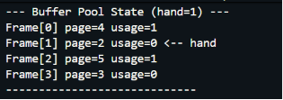

# Lab Session 3: Clock Sweep Page Replacement Algorithm in C++

## Student Details

* **Name:** Harshada
* **Roll Number:** 24BCS10408
* **Course:** Advanced Database Management Systems (ADBMS)

---

# Objective

The objective of this experiment is to implement the Clock Sweep Page Replacement Algorithm used in PostgreSQL's buffer manager and understand how it approximates the Least Recently Used (LRU) page replacement strategy while maintaining low overhead.

---

# Introduction

In a Database Management System (DBMS), the buffer pool stores frequently accessed pages in memory to reduce disk I/O operations. When the buffer pool becomes full, a page replacement algorithm is required to determine which page should be removed to make space for a new page.

PostgreSQL uses the Clock Sweep algorithm instead of traditional LRU because it provides good performance with lower maintenance costs and reduced lock contention.

---

# Clock Sweep Algorithm

The Clock Sweep algorithm maintains a circular list of buffer frames and a clock hand that continuously scans frames.

Each frame contains:

* **Page ID** – Identifies the page stored in the frame.
* **Usage Count** – Tracks how frequently the page has been accessed.
* **Pinned Status** – Indicates whether the page can be evicted.

### Working Principle

1. When a page is accessed, its `usage_count` is incremented.
2. When a page replacement is required, the clock hand scans frames sequentially.
3. If a frame has a `usage_count` greater than zero, the count is decremented and the page is given a second chance.
4. If the `usage_count` becomes zero and the page is not pinned, the frame is selected for eviction.
5. The new page is then loaded into the selected frame.

This mechanism approximates LRU behavior without maintaining an expensive ordered list of pages.

---

# Algorithm Steps

1. Initialize the buffer pool with a fixed number of frames.
2. Receive a page access request.
3. Check whether the page is already present in memory.
4. If present:

   * Report a cache hit.
   * Increment its usage count.
5. If absent:

   * Run the Clock Sweep algorithm.
   * Find a victim frame.
   * Evict the victim page.
   * Load the requested page.
6. Continue processing all page requests.
7. Display the final state of the buffer pool.

---

# Data Structures Used

## Frame Structure

The Frame structure stores information about a page present in the buffer pool.

```cpp
struct Frame {
    int page_id;
    int usage_count;
    bool pinned;
};
```

## Hash Map

```cpp
unordered_map<int, int> page_to_frame;
```

The hash map provides constant-time lookup for locating pages in the buffer pool.

---

# Time Complexity

| Operation          | Complexity |
| ------------------ | ---------- |
| Page Lookup        | O(1)       |
| Usage Count Update | O(1)       |
| Clock Sweep Search | O(n)       |
| Page Replacement   | O(n)       |

Where **n** is the number of frames in the buffer pool.

---

# Advantages of Clock Sweep

* Simple and efficient implementation.
* Lower overhead than LRU.
* Reduced lock contention.
* Suitable for large buffer pools.
* Used in PostgreSQL for real-world buffer management.

---

# Compilation

```bash
g++ -std=c++17 clocksweep.cpp -o clocksweep.exe
```

---

# Execution

```bash
.\clocksweep.exe
```

---

# Output

### Program Output Screenshot



---

# Conclusion

The Clock Sweep Page Replacement Algorithm was successfully implemented in C++. The algorithm efficiently manages buffer pool pages by maintaining a usage count and providing pages with a second chance before eviction. This approach achieves performance close to LRU while significantly reducing implementation complexity and overhead, making it suitable for high-performance database systems such as PostgreSQL.

