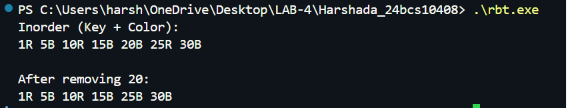
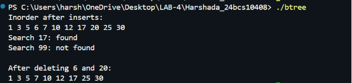

# Lab Session 4: Red-Black Tree & Full B-Tree in C++

## Objective

Implement:

1. Red-Black Tree (Self-Balancing Binary Search Tree)
2. B-Tree (Database Index Structure)

and perform insertion, search, deletion, balancing, borrowing, merging, and node splitting operations.

---

# Part 1: Red-Black Tree

## Description

A Red-Black Tree is a self-balancing Binary Search Tree that maintains balance using node colors and tree rotations.

### Properties

1. Every node is either Red or Black.
2. Root is always Black.
3. No two consecutive Red nodes.
4. Every path from a node to its NULL descendants contains the same number of Black nodes.

### Operations Implemented

- Insert
- Delete
- Left Rotation
- Right Rotation
- Recoloring
- Inorder Traversal

### Compilation

```bash
g++ -std=c++17 rbt.cpp -o rbt
```

### Execution

```bash
./rbt
```

### Output Screenshot



---

# Part 2: B-Tree

## Description

A B-Tree is a balanced multi-way search tree commonly used in database indexing systems such as PostgreSQL, MySQL, and SQLite.

### Features

- Multi-key nodes
- Efficient disk access
- Balanced height
- High fan-out
- Suitable for large datasets

### Operations Implemented

- Insert
- Search
- Delete
- Node Split
- Borrow from Sibling
- Merge Nodes
- Inorder Traversal

### Compilation

```bash
g++ -std=c++17 btree.cpp -o btree
```

### Execution

```bash
./btree
```

### Output Screenshot



---

# Comparison: Red-Black Tree vs B-Tree

| Property | Red-Black Tree | B-Tree |
|-----------|---------------|---------|
| Storage | In-Memory | Disk-Based |
| Height | O(log n) | O(logₜ n) |
| Keys per Node | 1 | Multiple |
| Balancing Method | Rotation & Recoloring | Split & Merge |
| Database Usage | In-Memory Structures | Database Indexes |
| Cache Efficiency | Lower | Higher |

---

# Learning Outcomes

- Understood Red-Black Tree balancing mechanisms.
- Implemented insertion and deletion in Red-Black Trees.
- Learned rotations and recoloring techniques.
- Implemented B-Tree insertion, search, and deletion.
- Understood node splitting, borrowing, and merging.
- Learned how modern database indexing structures work.


---

# Conclusion

This lab demonstrated the implementation of two important balanced tree data structures:

- Red-Black Tree for efficient in-memory searching.
- B-Tree for efficient database indexing and disk-based storage.

Both structures provide logarithmic-time operations while maintaining balance automatically.