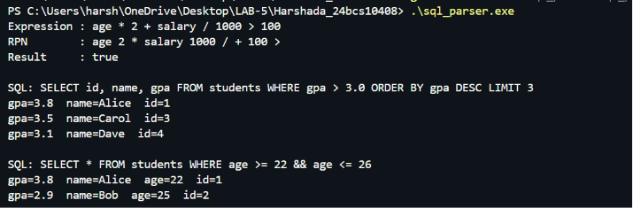

# Lab Session 5: Shunting-Yard Algorithm and Minimal SQL Parser


# Objective

The objectives of this lab are:

1. To understand the Shunting-Yard Algorithm developed by Edsger Dijkstra.
2. To convert infix expressions into Reverse Polish Notation (RPN/Postfix).
3. To evaluate arithmetic and logical expressions using stack-based processing.
4. To build a minimal SQL query parser in C++.
5. To implement filtering, sorting, projection, and limiting operations similar to a database query engine.
6. To simulate SQL query execution on an in-memory dataset.

---

# Problem Statement

Modern database systems parse SQL queries and execute them through multiple processing stages. This lab demonstrates a simplified implementation of that process.

The project consists of two major components:

### Part 1: Shunting-Yard Algorithm

Convert expressions such as:

```text
age * 2 + salary / 1000 > 100
```

into Reverse Polish Notation (RPN) and evaluate the result.

### Part 2: Minimal SQL Parser

Parse and execute SQL queries such as:

```sql
SELECT id, name, gpa
FROM students
WHERE gpa > 3.0
ORDER BY gpa DESC
LIMIT 3;
```

on a collection of records stored in memory.

---

# Theory

## Shunting-Yard Algorithm

The Shunting-Yard Algorithm is used to convert infix expressions into postfix notation.

### Advantages

* Handles operator precedence automatically.
* Handles associativity rules.
* Eliminates the need for recursive parsing.
* Simplifies expression evaluation.

### Example

#### Infix Expression

```text
age * 2 + salary / 1000 > 100
```

#### Postfix (RPN)

```text
age 2 * salary 1000 / + 100 >
```

---

## Reverse Polish Notation (RPN)

RPN places operators after operands.

Example:

```text
3 + 4
```

becomes:

```text
3 4 +
```

Evaluation is performed using a stack.

---

## SQL Parsing

The SQL parser identifies:

* Selected columns
* Source table
* WHERE condition
* ORDER BY clause
* LIMIT clause

The parser converts the WHERE condition into an expression tree represented using RPN and evaluates it against each row.

---

# Features Implemented

## Expression Processing

* Tokenization
* Operator precedence handling
* Parentheses support
* Arithmetic operators
* Comparison operators
* Logical operators

### Supported Operators

| Operator | Description        |
| -------- | ------------------ |
| +        | Addition           |
| -        | Subtraction        |
| *        | Multiplication     |
| /        | Division           |
| ^        | Power              |
| >        | Greater Than       |
| <        | Less Than          |
| >=       | Greater Than Equal |
| <=       | Less Than Equal    |
| =        | Equality           |
| !=       | Not Equal          |
| &&       | Logical AND        |
| ||       | Logical OR         |

---

## SQL Query Features

### SELECT

Select specific columns.

Example:

```sql
SELECT id, name, gpa
```

### WHERE

Filter rows using conditions.

Example:

```sql
WHERE gpa > 3.0
```

### ORDER BY

Sort query results.

Example:

```sql
ORDER BY gpa DESC
```

### LIMIT

Restrict output rows.

Example:

```sql
LIMIT 3
```

---

# Dataset Used

The project uses a student dataset stored in memory.

| ID | Name  | Age | GPA |
| -- | ----- | --- | --- |
| 1  | Alice | 22  | 3.8 |
| 2  | Bob   | 25  | 2.9 |
| 3  | Carol | 21  | 3.5 |
| 4  | Dave  | 30  | 3.1 |

---

# Project Structure

```text
Harshada_24bcs10408/
│
├── sql_parser.cpp
├── README.md
│
└── screenshots/
    └── output.png
```

---

# Compilation

Use the following command:

```bash
g++ -std=c++17 sql_parser.cpp -o sql_parser.exe
```

---

# Execution

### Windows

```powershell
.\sql_parser.exe
```

### Linux / macOS

```bash
./sql_parser
```

---

# Sample Execution

## Expression Evaluation

### Input Expression

```text
age * 2 + salary / 1000 > 100
```

### Generated RPN

```text
age 2 * salary 1000 / + 100 >
```

### Result

```text
true
```

---

## Query 1

```sql
SELECT id, name, gpa
FROM students
WHERE gpa > 3.0
ORDER BY gpa DESC
LIMIT 3;
```

### Expected Result

```text
Alice
Carol
Dave
```

---

## Query 2

```sql
SELECT *
FROM students
WHERE age >= 22 && age <= 26;
```

### Expected Result

```text
Alice
Bob
```

---

# Output Screenshot

## Program Output




---

# Learning Outcomes

After completing this lab, the following concepts were understood:

* Expression parsing
* Stack-based computation
* Shunting-Yard Algorithm
* Reverse Polish Notation
* SQL query parsing
* Data filtering
* Sorting algorithms
* Query execution workflow
* In-memory database processing

---

# Applications

The concepts implemented in this project are used in:

* Database Management Systems
* Query Optimizers
* SQL Engines
* Compilers
* Expression Evaluators
* Spreadsheet Formula Processors
* Programming Language Interpreters

---

# Conclusion

This lab successfully demonstrates the implementation of the Shunting-Yard Algorithm and a Minimal SQL Query Parser in C++. Expressions are converted into Reverse Polish Notation and evaluated efficiently using stacks. The SQL parser supports SELECT, WHERE, ORDER BY, and LIMIT clauses, providing a simplified simulation of how real database systems process and execute queries.
