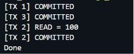

# Transaction Manager (MVCC + Strict 2PL)

This project implements a robust **Multi-Version Concurrency Control (MVCC)** database transaction manager integrated with **Strict 2-Phase Locking (Strict 2PL)** in C++. The system ensures full ACID properties, preventing dirty reads and non-repeatable reads, while managing concurrent data access and automatically detecting deadlocks.

---

## 📖 Table of Contents
- [Architecture Overview](#architecture-overview)
- [Key Features](#key-features)
- [How MVCC Works (Visibility Rules)](#how-mvcc-works-visibility-rules)
- [Locking & Deadlock Detection](#locking--deadlock-detection)
- [Code Structure](#code-structure)
- [Compilation and Execution](#compilation-and-execution)
- [Demo Output](#demo-output)

---

## Architecture Overview

This minimal database engine is composed of three main subsystems:
1. **MVCC Storage Engine**: Responsible for storing data versions and ensuring transactions only read snapshots of data that were committed before they started.
2. **Lock Manager**: Enforces Strict 2PL by acquiring Shared (Read) and Exclusive (Write) locks. It blocks transactions on conflicting locks to ensure serializability.
3. **Transaction Manager**: Coordinates the start, commit, and abort (rollback) lifecycle of transactions, acquiring locks and managing heap operations.

---

## Key Features

- **Multi-Version Heap**: Updating a row doesn't overwrite the old value. Instead, a new `RowVersion` is pushed to a chain, ensuring concurrent transactions reading older snapshots aren't blocked by writes.
- **Snapshot Isolation**: Transactions capture a `snapshot_xid` when they begin, giving them a consistent view of the database.
- **Strict 2-Phase Locking**: Locks are acquired on-the-fly as rows are accessed, but they are strictly held until the transaction finishes (commit or abort), preventing cascading rollbacks.
- **Graph-based Deadlock Detection**: Uses a dynamic `waits-for` graph. If a transaction waits for a lock held by another transaction, an edge is added. A Depth-First Search (DFS) runs to check for cycles, automatically throwing a `DeadlockException` to break ties.

---

## How MVCC Works (Visibility Rules)

Each row modification produces a `RowVersion` containing:
- `value`: The stored string data.
- `xmin`: The ID of the transaction that created this version.
- `xmax`: The ID of the transaction that deleted or updated this version (defaults to `0` if still active/latest).

When a transaction (with `snapshot_xid`) tries to read a version, the engine evaluates **visibility**:
1. **`xmin_ok`**: The version must have been created by the *current* transaction, OR by a transaction that committed *before* this snapshot began.
2. **`xmax_block`**: If the version was deleted/updated by another transaction that committed *before* this snapshot began, then it is invisible (the transaction should look further down the chain).

---

## Locking & Deadlock Detection

Data operations map to lock modes:
- **Read** -> `LockMode::SHARED` (Concurrent reads allowed)
- **Insert/Update/Delete** -> `LockMode::EXCLUSIVE` (Requires sole access)

If a conflict occurs (e.g., trying to acquire EXCLUSIVE while another transaction holds SHARED), the requesting transaction is pushed to a Wait Queue via `std::condition_variable`. 

Before waiting, the system updates the global `waits-for` graph. If a cycle is detected (e.g., T1 waits for T2, and T2 waits for T1), the system preemptively aborts the transaction to resolve the deadlock.

---

## Code Structure

- `struct Transaction`: Tracks `id`, `snapshot_xid`, and `status`.
- `struct RowVersion`: Holds the string value and MVCC metadata.
- `struct LockRequest`: Tracks the mode and status of a lock attempt.
- `TransactionManager`: Exposes the public API (`begin`, `read`, `insert`, `update`, `remove`, `commit`, `abort`).
- `g_heap`: The global multi-version hash map.
- `g_lock_table`: The global strict 2PL lock table.

---

## Compilation and Execution

### Ubuntu
The code utilizes C++17 threading features (`<mutex>`, `<shared_mutex>`, `<condition_variable>`, etc.) for thread safety. Ensure you have `g++` installed.

```bash
g++ -std=c++17 txmgr.cpp -o txmgr
./txmgr
```

---

## Demo Output

The `main()` demo executes an interleaved sequence of transactions:
1. `T1` begins, inserts `x = 100`, and commits.
2. `T2` and `T3` begin.
3. `T3` updates `x` to `200` and commits.
4. `T2` reads `x`. Because `T2` began before `T3` committed, MVCC snapshot isolation guarantees `T2` reads the old value (`100`).
5. `T2` commits.

Expected Output:

