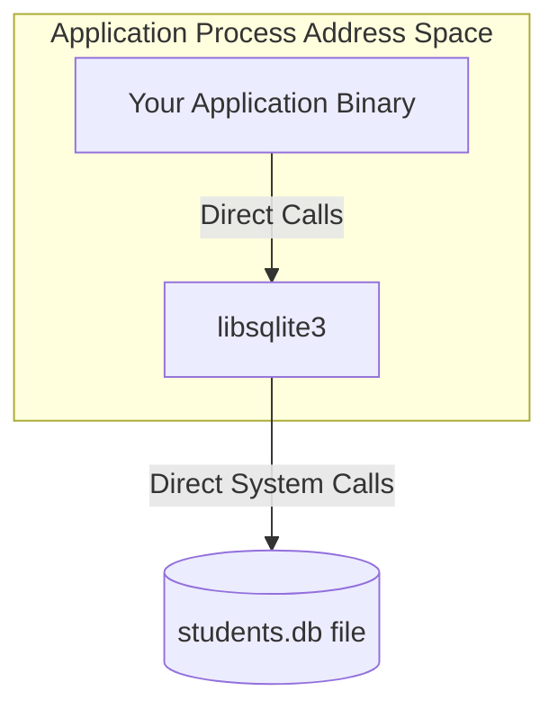

<div align="center">

# 🗄️ Lab Session 2: SQLite3 Internals — mmap, Page Size, PRAGMA & Library Architecture
### Exploring Embedded Storage Systems & PostgreSQL vs. SQLite3 System Design

[](https://sqlite.org/)
[](https://www.postgresql.org/)

</div>

---

## 👨‍🎓 Student Details
- **Name:** Siddhant Prasad
- **Roll Number:** 24BCS10255

---

## 🎯 Objective
Install SQLite3, inspect its storage internals via PRAGMA commands, understand why SQLite is an in-process library (not a server), and document findings as part of System Design Assignment 1 (PostgreSQL vs. SQLite3).

---

## 💻 Part 1: Installation & Verification

To install SQLite3 and the development libraries on a Linux environment (or WSL/Ubuntu):
```bash
sudo apt update
sudo apt install sqlite3 libsqlite3-dev
```

### Verify Installation
Check the installed version to ensure a successful setup:
```bash
sqlite3 --version
# e.g.: 3.45.1 2024-01-30 ...
```

---

## 🔍 Part 2: Storage Internals via PRAGMA

We initialize/open a database file named `students.db` and use PRAGMA statements to inspect and configure the engine.
```bash
sqlite3 students.db
```

### Page Size
```sql
PRAGMA page_size;
-- default: 4096 bytes (matches OS page size)
```
SQLite stores the entire database as a single file divided into fixed-size pages. The page size is set at database creation and cannot be changed afterwards without executing a `VACUUM INTO` command.

### Page Count
```sql
PRAGMA page_count;
-- number of pages currently allocated in the database file
```
**Formula:** $\text{Total File Size} = \text{page\_size} \times \text{page\_count}$

### mmap Size
```sql
PRAGMA mmap_size;
-- 0 by default; set to enable memory-mapped I/O
```

We can configure a memory-mapping threshold to allow the engine to bypass standard read system calls for sequential access:
```sql
PRAGMA mmap_size = 268435456;  -- 256 MB
PRAGMA mmap_size;              -- confirms configuration
```

With memory-mapping enabled, SQLite maps the database file directly into the process's virtual address space using `mmap()`. Reads are serviced directly from memory accesses in the page cache instead of invoking overhead-heavy `read()` system calls.

#### Trace Verification via `strace`
```bash
strace -e trace=mmap,open,read sqlite3 students.db "SELECT count(*) FROM students;"
```
*   **With `mmap_size = 0`**: Many `read()` system calls are triggered.
*   **With `mmap_size > 0`**: A single `mmap()` call is made, followed by direct memory operations with few or no subsequent `read()` calls.

### Other Useful PRAGMAs
| Command | Description |
| :--- | :--- |
| `PRAGMA journal_mode;` | Displays/sets transaction journal mode (e.g., `WAL`, `DELETE`, `MEMORY`). |
| `PRAGMA cache_size;` | Configures the number of database pages held in memory. |
| `PRAGMA integrity_check;` | Validates all pages and index structures for corruption. |
| `PRAGMA database_list;` | Lists all attached databases. |

---

## 🏛️ Part 3: SQLite3 is a Library, Not a Process

The most architecturally significant design difference between SQLite3 and client-server databases is that SQLite is a library.



- **In-Process**: There is no background server daemon, no TCP socket listener, and no network authentication handshake.
- **Library Integration**: The SQLite engine runs inside the same process and memory address space as your application.
- **Concurrency**: Handled purely via filesystem-level locks (Write-Ahead Logging significantly improves read-write concurrency).

### Process Verification
We can verify that there is no sqlite process daemon running in the background:
```bash
ps aux | grep sqlite
# Nothing appears except the grep command itself or active interactive shells.
```

### Shared Library Linkage Check
Confirm that the executable is linked to the shared library:
```bash
ldd $(which sqlite3)
# Output shows: libsqlite3.so.0 => /lib/x86_64-linux-gnu/libsqlite3.so.0
```

### Direct C++ Application Integration
From C++, calls are directly linked functions:
```cpp
#include <sqlite3.h>
// sqlite3_open(), sqlite3_exec(), and sqlite3_close() are all in-process function calls.
```

---

## 📊 System Design Assignment 1: PostgreSQL vs. SQLite3

### Architectural Comparison Matrix

| Dimension | 🗄️ SQLite3 | 🐘 PostgreSQL |
| :--- | :--- | :--- |
| **Process Model** | Library — runs inside the application process. | Client-server — separate `postgres` daemon coordinator. |
| **Communication** | Direct function calls / local file I/O. | TCP socket (default port 5432) or local Unix socket. |
| **Concurrency** | File locks; one writer at a time (WAL improves). | MVCC — concurrent readers + writers simultaneously. |
| **Authentication** | None (relies on underlying filesystem permissions). | Robust host-based, role, password, and SSL systems. |
| **Storage** | Single `.db` file containing all tables and metadata. | Data directory containing segmented tables (1GB limits) + WAL. |
| **Transactions** | Full ACID (serialized writes). | Full ACID with adjustable MVCC isolation levels. |

### When to Use SQLite3
- **Embedded Applications**: Mobile applications (Android/iOS), desktop software, and command-line interfaces.
- **Testing & Local Dev**: Fast, lightweight test suites and local development environments without setup overhead.
- **Single-User Workloads**: Applications with minimal concurrent writes and isolated operations.
- **Zero Administration**: Scenarios where zero configuration, zero setups, and low memory footprints are required.
- **Read-Heavy / Cache Workloads**: Excellent for read-heavy operations with occasional writes.

### When to Use PostgreSQL
- **Multi-User Environments**: Web servers, APIs, and microservices dealing with high-concurrency client pools.
- **Concurrent Writes**: High-frequency concurrent read and write operations.
- **Advanced Querying**: Complex joins, JSON indexing, geographic extensions (PostGIS), and full-text search engines.
- **Fine-Grained Locking**: Systems requiring row-level locks and high-level transaction isolation (e.g., `SERIALIZABLE`).
- **Security & Auditing**: Strict environments requiring user roles, SSL-encrypted transport, and auditing.

### How Memory Mapping (`mmap`) Fits In
*   **SQLite3**: Maps the entire `.db` file into the process virtual memory space. This eliminates context-switching and buffer-copying overheads between user-space and kernel caches.
*   **PostgreSQL**: Manages its own dedicated shared buffer pool (`shared_buffers`) inside memory allocated to the server daemon process, utilizing its own eviction algorithms and not relying primarily on OS-level `mmap()` for data I/O.

---

## 🏁 Key Insight
SQLite's single-file, in-process design makes it nearly unbeatable for portability, zero-configuration setups, and embedded software. PostgreSQL's client-server, MVCC design makes it the industry standard for high-concurrency, multi-user web backends. The right choice depends entirely on the concurrency requirements, write volumes, and operational environment of the database.
