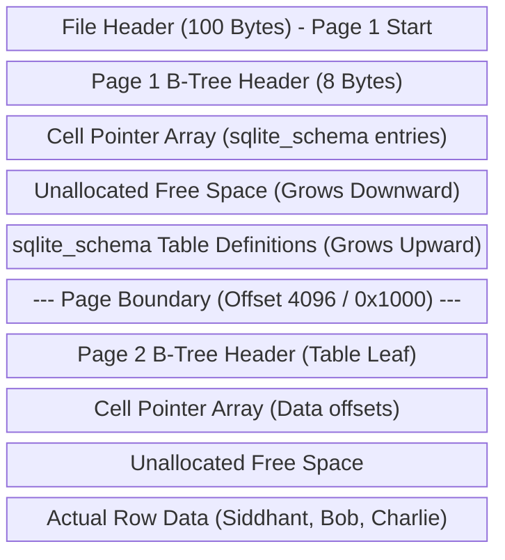

<div align="center">

# 🗄️ SQLite3 Database Internal Structure Analysis Using XXD
### Low-Level Hexadecimal Inspection of B-Tree Database Pages

[](https://sqlite.org/)
[](https://linux.die.net/man/1/xxd)

</div>

---

## 👨‍🎓 Student Details
- **Name:** Siddhant Prasad
- **Roll Number:** 24BCS10255

---

## 🎯 Aim
To explore and analyze the raw internal storage, page headers, B-tree leaves, schema metadata, cell pointer arrays, and payload structures of a SQLite3 database using hexadecimal dump tools.

---

## ⚙️ Tasks & Observations

### 1. Database Creation
Create a standard SQLite database named `meta.db` containing a `students` table:
```bash
sqlite3 meta.db
```
```sql
CREATE TABLE students(
    id INTEGER PRIMARY KEY,
    name TEXT,
    grade TEXT
);

INSERT INTO students (name, grade) VALUES ('Siddhant', 'A+');
INSERT INTO students (name, grade) VALUES ('Bob', 'B');
INSERT INTO students (name, grade) VALUES ('Charlie', 'A');
```
This initializes `meta.db` on disk.

### 2. Database Metadata Analysis
Before hex-inspecting, query SQLite internal parameters using PRAGMAs:
```sql
PRAGMA page_size;   -- Typically 4096 (4KB)
PRAGMA page_count;  -- Typically 1 or 2 pages depending on system
```
To find the root page of the `students` table:
```sql
SELECT rootpage FROM sqlite_schema WHERE name = 'students';
-- Output: 2 (usually schema is at page 1, and table starts on page 2)
```

---

## 🔍 Hexadecimal Inspection (Using `xxd`)

Run the following command in a Unix terminal (or WSL) to generate a hex dump:
```bash
xxd meta.db | head -n 40
```

---

## 📊 SQLite File Header Layout (First 100 Bytes of Page 1)

Every SQLite database starts with a fixed **100-byte header** on Page 1. Here is the disassembly of those bytes:

| Byte Offset (Hex) | Field Name | Expected Hex Value | Description |
| :--- | :--- | :--- | :--- |
| `00 - 0F` | **File Signature** | `53 51 4c 69 74 65 20 66 6f 72 6d 61 74 20 33 00` | Translates directly to the ASCII string: `"SQLite format 3\0"` |
| `10 - 11` | **Page Size** | `10 00` | Big-endian integer. `0x1000` = 4096 bytes. |
| `12` | **File format write version** | `01` or `02` | `1` for legacy rollback journal; `2` for WAL mode. |
| `13` | **File format read version** | `01` or `02` | Read compatibility level. |
| `18 - 1B` | **File change counter** | (Variable, e.g. `00 00 00 05`) | Incremented on every transactional write. |
| `1C - 1F` | **Database size in pages** | (Variable, e.g. `00 00 00 02`) | Size of database in pages. |

### Sample Hex output of the header:
```text
00000000: 5351 4c69 7465 2066 6f72 6d61 7420 3300  SQLite format 3.
00000010: 1000 0101 0040 2020 0000 0005 0000 0002  .....@  ........
```

---

## 🌳 B-Tree Page Structure Analysis (Leaf Page Header)

Once past the 100-byte file header, or when viewing secondary pages, we find B-Tree Page Headers.

For a B-tree **Table Leaf Page** (which stores actual data rows):
The page header starts with a **1-byte Flag** indicating Page Type:
- **`0x05`**: Table Interior Page (contains keys and page pointers)
- **`0x0d`**: Table Leaf Page (contains keys, cell payload, and data)
- **`0x02`**: Index Interior Page
- **`0x0a`**: Index Leaf Page

### Table Leaf Page Header Format (8 Bytes):
1. **Page Type Flag** (`1 byte`): e.g., `0x0d` (Leaf Page)
2. **First Freeblock Offset** (`2 bytes`): Pointer to first unallocated block.
3. **Cell Count** (`2 bytes`): Number of data rows/cells in this page (e.g. `00 03`).
4. **Cell Content Area Offset** (`2 bytes`): Pointer to the beginning of cell data. (SQLite inserts data from the bottom of the page upwards).
5. **Fragmented Free Bytes** (`1 byte`): Number of fragmented bytes.

---

## 📍 Cell Pointer Array

Immediately following the 8-byte B-tree page header is the **Cell Pointer Array**.
- Each pointer is a `2-byte` integer.
- The pointer stores the **absolute offset** of a cell payload relative to the start of the page.
- For example, if there are 3 cells, there will be 6 bytes of cell pointers.
- To access a record, SQLite reads the cell pointer array to locate the exact page offset, enabling $O(1)$ lookups without doing linear scans of variable-length records.

```text
-- Header (8 bytes) + Cell Pointers (6 bytes)
0x0d 0x00 0x00 0x00 0x03 0x0f 0xd0 0x00 | 0x0f 0xf0 0x0f 0xe0 0x0f 0xd0
```

---

## 💾 Record Payload & Schema Analysis

### Stored Record Payload Format
SQLite record payloads are stored at the bottom of the page (e.g., from offset `0x0FD0` to `0x0FFF`) using **Record Format serial types**:
- **Header**: Includes payload size, Row ID (Varint format), and Column Serial Types (e.g. type `13` = string of length 3).
- **Body**: The actual data bytes.

If we view the hex printout of the cell area, we can read the ASCII data:
```text
00000fd0: 01 08 04 11 43 68 61 72 6c 69 65 41     ....CharlieA
00000fe0: 02 05 04 07 42 6f 62 42                 ....BobB
00000ff0: 03 0a 04 11 53 69 64 64 68 61 6e 74 41 2b ....SiddhantA+
```
- **Analysis:**
  - `03` = Row ID / Primary key.
  - `53 69 64 64 68 61 6e 74` = `"Siddhant"` (name).
  - `41 2b` = `"A+"` (grade).

### Schema Storage
The SQL statement used to create the table is stored inside the **`sqlite_schema`** system table at Root Page 1:
```text
CREATE TABLE students(id INTEGER PRIMARY KEY, name TEXT, grade TEXT)
```
This text is stored as a standard text record in Page 1's B-tree data area, ensuring the database is completely self-describing.

---

## 🗺️ Physical File Layout

A SQLite database file layout has a highly organized structure:



---

## 🏁 Conclusion
By inspecting `meta.db` with hexadecimal analysis tools, we verified that SQLite database files:
1. Are marked with a distinct `"SQLite format 3"` signature at Byte 0.
2. Store schema structure alongside table data in B-tree structures.
3. Manage space by filling pages from the top (metadata headers and cell pointers) downwards (data record payloads), resulting in high block compression and optimal sector reading.
