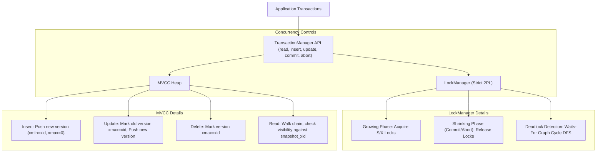

<div align="center">

# 🔒 Lab Session 6: Transaction Manager — MVCC + Two-Phase Locking in C++
### Implementing Relational Concurrency Controls, Snapshot Isolation & Strict 2PL

[](https://isocpp.org/)
[](https://www.kernel.org/)

</div>

---

## 👨‍🎓 Student Details
- **Name:** Siddhant Prasad
- **Roll Number:** 24BCS10255

---

## 🎯 Objective
Build a C++ Transaction Manager that combines:
1. **Multi-Version Concurrency Control (MVCC)**: Every write creates a new row version; readers see a consistent snapshot without blocking concurrent writers.
2. **Two-Phase Locking (2PL)**: Bounds lock acquisition to a growing phase and lock releases to a shrinking phase. Specifically, **Strict 2PL** holds all locks until the transaction commits or aborts.
3. **Deadlock Detection**: Monitors dependencies using a waits-for graph and runs cycle detection to abort conflicting transactions.

This combination mirrors the core concurrency architecture found in enterprise relational databases like PostgreSQL.

---

## 📚 Core Concepts

### 1. MVCC Version Visibility Rule
Each write operation inserts a new `RowVersion` tagged with `xmin` (creator transaction ID) and `xmax` (destructor transaction ID, initially `0`).
A version is visible to a reader transaction `T` running with `snapshot_xid` if:
*   `xmin` is committed **and** $\text{xmin} \le \text{T.snapshot\_xid}$ (or is `T`'s own write).
*   `xmax` is `0` (not deleted) **or** $\text{xmax} > \text{T.snapshot\_xid}$ (deleted after snapshot was taken) **or** `xmax` has aborted.

### 2. Two-Phase Locking (2PL)
To guarantee serializability, lock operations must follow two phases:
*   **Growing Phase**: The transaction acquires locks but cannot release any.
*   **Shrinking Phase**: The transaction releases locks but cannot acquire any new ones.
*   **Strict 2PL**: Simplifies 2PL by holding all locks until transaction termination (commit/abort), which prevents cascading aborts.

### 3. Deadlock Cycle Detection
When transaction A waits for a lock held by B, and B waits for A, a deadlock cycle forms. We track these dependencies using a **Waits-For Graph**. On every blocked request, a depth-first search (DFS) checks for cycles and throws an exception to abort the transaction if a deadlock is detected.

---

## 💻 Code Implementation

The code is located in [txmgr.cpp](file:///c:/Users/Siddhant/OneDrive/Desktop/scaler-Adv-DBMS/Lab_6/txmgr.cpp).

### Compile and Run
Compile with thread support:
```bash
g++ -std=c++17 -pthread txmgr.cpp -o txmgr
./txmgr
```

### Expected Output
```text
=== Scenario 1: MVCC Snapshot Isolation ===
[TX 3] COMMITTED
[TX 4] COMMITTED
  [TX 2] READ balance = 1000

=== Scenario 2: Concurrent Shared Locks ===
  [TX 4] READ balance = 3000
  [TX 5] READ balance = 3000
[TX 4] COMMITTED
[TX 5] COMMITTED

=== Scenario 3: Exclusive Lock + Waiting ===
  [TX 7] waiting for shared lock on balance...
[TX 6] COMMITTED
  [TX 7] READ balance = 3000
[TX 7] COMMITTED

=== Scenario 4: Deadlock Detection ===
  Deadlock detected, aborting tx 8
[TX 8] ABORTED
[TX 9] COMMITTED

All scenarios complete.
```

---

## 🏛️ Concurrency Architecture Diagram



---

## ⚖️ Concurrency Control Models Comparison

| Dimension | MVCC Alone | 2PL Alone | MVCC + Strict 2PL |
| :--- | :--- | :--- | :--- |
| **Read-Write Contention** | None. Readers bypass write locks using snapshots. | High. Readers block writers, and writers block readers. | None. Readers use snapshot visibilities. |
| **Write-Write Contention** | Low. Requires conflict resolution (first-committer-wins). | High. Blocked by exclusive locks. | Controlled. Resolved via exclusive row locks. |
| **Isolation Level** | Snapshot Isolation (SI) — vulnerable to write skew. | Full Serializability. | Full Serializability. |
| **Deadlock Potential** | N/A. | High. Requires cycle checks. | Possible. Resolved via Waits-For cycle aborts. |
| **Storage Garbage** | High. Requires background Vacuum/Garbage Collection. | None. Updates are overwritten in-place. | High. Requires background Vacuum. |

---

## 🏁 Key Takeaways
- **Visibility snap**: MVCC isolates read queries by walking version chains and matching them against transaction IDs. Readers never block writers.
- **Strict 2PL**: Holding all exclusive locks until transaction commit/abort simplifies lock management and prevents cascading aborts.
- **Waits-For cycle DFS**: Deadlock checks run in $O(V+E)$ time using graph cycle searches. PostgreSQL optimizes this by running the check periodically on a background timer rather than blocking on every lock request.
- **Rollback Operations**: Aborting a transaction requires restoring previous visibilities. The manager sets the aborted transaction's writes (`xmin`) to invisible and reverses its deletions (`xmax = 0`).
