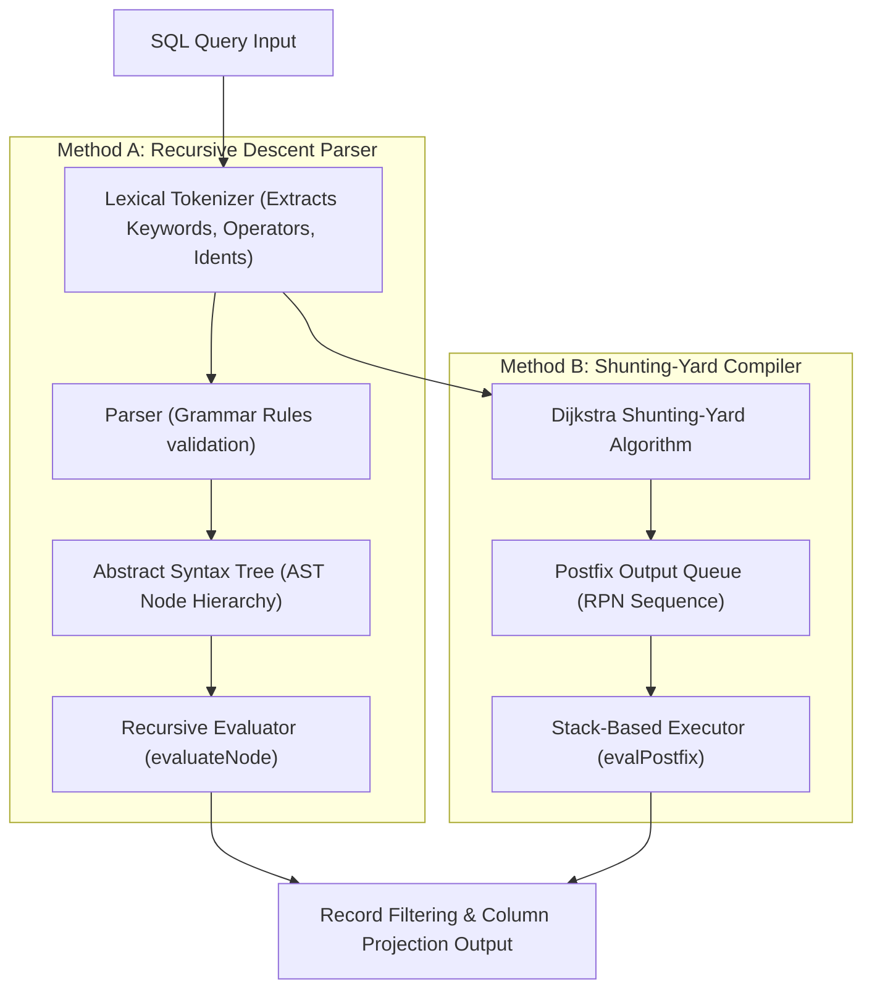

<div align="center">

# 🔎 Lab Session 7: SQL Query Parsing & Evaluation
### Implementing Recursive Descent AST Parsers & Dijkstra's Shunting-Yard Evaluators in C++

[](https://isocpp.org/)
[](https://www.kernel.org/)

</div>

---

## 👨‍🎓 Student Details
- **Name:** Siddhant Prasad
- **Roll Number:** 24BCS10255

---

## 🎯 Objective
1. **Part 1 (Query Parsing)**: Build a recursive descent parser that parses structured SQL `SELECT` queries, constructs an **Abstract Syntax Tree (AST)** for the logical expression in the `WHERE` clause, and evaluates it dynamically against in-memory record vectors.
2. **Part 2 (Dijkstra Shunting-Yard)**: Implement Dijkstra's **Shunting-Yard algorithm** to parse infix SQL conditions, convert them to **Reverse Polish Notation (RPN)**, and evaluate them in linear time $O(n)$ using a value-stack execution engine.

---

## 📚 Technical Architectures

### 1. Part 1: Recursive Descent Parser & AST Node Representation
The parser recognizes queries adhering to the following SQL-like grammar:
```text
<query>       := SELECT <col> FROM <table> WHERE <expr>
<expr>        := <orTerm>
<orTerm>      := <andTerm> ( OR <andTerm> )*
<andTerm>     := <factor>  ( AND <factor> )*
<factor>      := '(' <expr> ')' | <comparison>
<comparison>  := <ident> <op> <number>
<op>          := > | < | >= | <= | = | !=
```
The AST is modeled using node pointers:
- **Logical Nodes**: Contain operator fields (`AND`, `OR`) and left/right children (`l`, `r`).
- **Comparison Leaf Nodes**: Contain columns (`id`, `age`), comparison operators, and integer literals.

### 2. Part 2: Shunting-Yard Infix-to-Postfix Evaluator
Instead of constructing an explicit recursive node tree, Dijkstra's Shunting-Yard algorithm processes infix SQL expressions using an operator stack and an output queue. By rearranging tokens into Postfix (RPN):
- Operands are immediately output.
- Operators are pushed onto a stack after resolving precedence.
- Evaluation runs sequentially in $O(n)$ time using a evaluation stack, removing the overhead of pointer-heavy tree structures.

---

## 💻 Code Locations & Running Guide

### 📂 Directory Structure
- [Query_Parsing/main.cpp](file:///c:/Users/Siddhant/OneDrive/Desktop/scaler-Adv-DBMS/Lab_7/Query_Parsing/main.cpp): AST-based recursive descent SQL query parser.
- [Dijkstra_Shunting/main.cpp](file:///c:/Users/Siddhant/OneDrive/Desktop/scaler-Adv-DBMS/Lab_7/Dijkstra_Shunting/main.cpp): Dijkstra Shunting-Yard infix-to-postfix compiler and engine.

### 🛠️ How to Compile and Run

#### 1. Compile Query Parser (AST):
```bash
g++ -std=c++17 Query_Parsing/main.cpp -o query_parser
./query_parser
```

#### 2. Compile Shunting-Yard Evaluator (RPN):
```bash
g++ -std=std=c++17 Dijkstra_Shunting/main.cpp -o shunting_evaluator
./shunting_evaluator
```

---

## 🗺️ Execution Workflow



---

## ⚖️ Architectural Comparison

| Dimension | Recursive Descent (AST) | Shunting-Yard (RPN) |
| :--- | :--- | :--- |
| **Data Structure** | Pointer-rich Tree (`std::unique_ptr<Node>`) | Vector of strings (flat queue) |
| **Memory Allocation** | High (multiple heap allocations per node) | Low (single array allocation) |
| **Parsing Complexity** | $O(N)$ with recursion depth | $O(N)$ with auxiliary operator stack |
| **Evaluation Speed** | Moderate (virtual function calls or pointer dereference) | High (linear execution loop over stack) |
| **Flexibility** | Highly customizable for complex query planner optimizations | Ideal for compiling and executing expression terms |

---

## 🏁 Key Takeaways
- **AST Representation**: Essential for query planners (e.g., PostgreSQL, SQLite) to restructure logical conditions, apply index pushdowns, and perform semantic analyses.
- **Dijkstra Shunting-Yard**: Offers high-performance expression evaluation by translating user-written infix conditions into stack-operable postfix formats.
- **Lexical Analysis**: Standardizing keywords (`SELECT`, `AND`, `OR`) case-insensitively while preserving exact casing for values/identifiers is crucial to parsing correct query streams.
