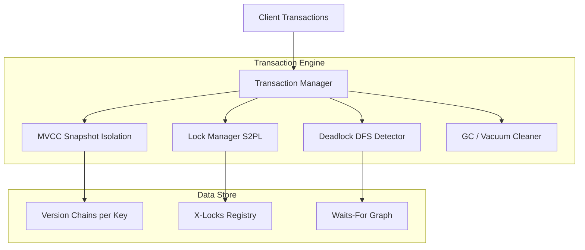

<div align="center">

# 🔄 Lab Session 8: Hybrid Transaction Manager
### Implementing MVCC Snapshot Isolation, Strict 2PL Writing & Deadlock Detection

[](https://isocpp.org/)
[](https://www.kernel.org/)

</div>

---

## 👨‍🎓 Student Details
- **Name:** Siddhant Prasad
- **Roll Number:** 24BCS10255

---

## 🎯 Objective
Design and implement a robust in-memory transaction manager in C++ that splits concurrency control mechanisms the same way PostgreSQL does:
1. **Non-Blocking Reads (MVCC)**: Readers read from a logical snapshot taken at the start of the transaction (`begin()`), ensuring they never take locks and never block or get blocked by writers.
2. **Exclusive Writes (Strict 2PL)**: Writers acquire exclusive write locks (`X-locks`) on modified keys. These locks are held throughout the transaction's lifetime and released only at commit or abort.
3. **Deadlock Detection (Waits-For Graph)**: When a transaction blocks waiting for a lock, the system runs a Depth-First Search (DFS) on the waits-for graph to detect cycles. If a cycle exists, the youngest transaction (the one with the highest ID) is selected as the victim and aborted.
4. **Serialization Validation (First-Updater-Wins)**: To prevent lost updates, commits fail with a `SERIALIZATION_FAILURE` if any key updated by the transaction has been committed by another transaction since the snapshot was taken.
5. **Garbage Collection (gc)**: Prunes old, dead tuple versions that are no longer visible to any active or future transaction snapshots.

---

## 📚 Core Concurrency Control Concepts

### 1. Multi-Version Concurrency Control (MVCC)
Every committed write creates a new `Version` containing:
- `value`: The stored string.
- `xmin`: The commit timestamp when this version was created.
- `xmax`: The commit timestamp when this version was superseded (or `0` if it is still live).

A version is visible to a transaction with snapshot `S` if:
$$\text{xmin} \le \text{S} \quad \text{AND} \quad (\text{xmax} == 0 \text{ OR } \text{xmax} > \text{S})$$

### 2. Strict Two-Phase Locking (S2PL)
- **Growing Phase**: Transactions acquire exclusive `X-locks` dynamically when performing `write` or `remove` operations.
- **Shrinking Phase**: All locks are held until the transaction finishes and are released atomically during the `commit` or `abort` call (Strict 2PL).

### 3. Waits-For Graph Cycle Detection
A directed waits-for graph represents dependency edges: $\text{T}_{\text{waiter}} \to \text{T}_{\text{holder}}$. 
Whenever an edge is added, a DFS is initiated from the waiting transaction. If a path returns to the starting node, a deadlock cycle exists:
```text
  T1 (locks A, wants B) ──> T2 (locks B, wants A)
         ▲                      │
         └──────────────────────┘
```
The deadlock resolver identifies the youngest transaction (maximum `txn_id_t`) in the cycle and aborts it to free up resources.

---

## 💻 Code Locations & Running Guide

### 📂 Files
- [txn_manager.hpp](file:///c:/Users/Siddhant/OneDrive/Desktop/scaler-Adv-DBMS/Lab_8/txn_manager.hpp): In-memory transaction coordinator, version store, and lock manager.
- [main.cpp](file:///c:/Users/Siddhant/OneDrive/Desktop/scaler-Adv-DBMS/Lab_8/main.cpp): Assertion-driven demo executing 6 transaction scenarios.
- [CMakeLists.txt](file:///c:/Users/Siddhant/OneDrive/Desktop/scaler-Adv-DBMS/Lab_8/CMakeLists.txt): Build configuration.

### 🛠️ How to Compile and Run
You can compile using a standard C++17 compiler:
```bash
g++ -std=c++17 main.cpp -o txn_demo
./txn_demo
```

---

## 🗺️ System Architecture



---

## 🧪 Verified Execution Scenarios

The simulator executes 6 classic database concurrency scenarios in order:

1. **MVCC Snapshot Isolation**: A long-running reader transaction continues to see the pre-transfer state of a bank balance even after a concurrent writer updates the balance and commits.
2. **Tombstone Visibility**: Deleting a key inserts a tombstone version. Older transaction snapshots still see the key, while new snapshots see it as absent.
3. **Strict 2PL Blocking**: Two transactions attempt to write to the same account concurrently. The second writer receives `LOCK_WAIT` and blocks until the first transaction aborts or commits.
4. **Deadlock Resolution**: Transaction 1 locks Account A and waits for B. Transaction 2 locks Account B and waits for A. A cycle forms. The younger transaction (highest ID) is aborted, allowing the older transaction to proceed.
5. **First-Updater-Wins**: Two transactions read the same version. Both attempt to update it. The first to commit succeeds; the second commit fails with `SERIALIZATION_FAILURE`.
6. **Garbage Collection (Vacuum)**: Sweeps and prunes superseded versions whose `xmax` timestamps are older than the oldest snapshot in use, ensuring memory consumption remains bounded.

---

## 🏁 Key Takeaways
- **No Reader-Writer Blocking**: By maintaining version chains, readers bypass lock acquisition entirely, which maximizes read throughput.
- **Lost Update Prevention**: Combining MVCC snapshots with first-updater-wins commit validation ensures serializability under snapshot isolation.
- **Deterministic Simulation**: Executing concurrent transactions step-by-step makes deadlock cycles and lock contention scenarios fully testable and reproducible.
