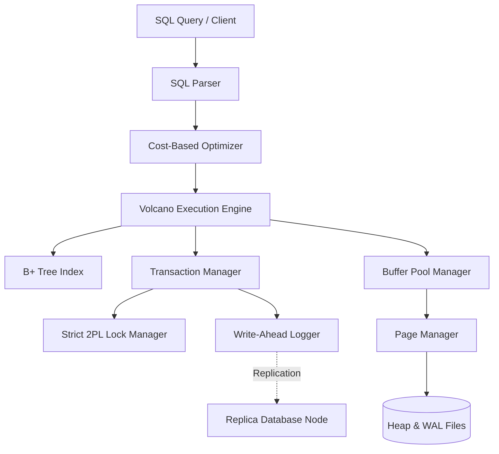

# MiniDB Final System - Team Learners

## Team Information
- **Team Name**: Learners
- **Team Members**:
  - **Dhruv Bansal** (Roll Number: `24bcs10114`, Email: `dhruv.24bcs10114@sst.scaler.com`)
  - **Ankit Kumar** (Roll Number: `24bcs10189`, Email: `ankit.24bcs10189@sst.scaler.com`)
  - **Tejas Varshney** (Roll Number: `24bcs10313`, Email: `tejas.24bcs10313@sst.scaler.com`)
  - **Ujjawal Prabhat** (Roll Number: `24bcs10267`, Email: `ujjawal.24bcs10267@sst.scaler.com`)

---

This directory contains our implementation of **MiniDB**, a relational database system designed and implemented from the ground up in C++. This project fulfills all requirements of the Advanced DBMS Capstone course.

For our extension track, we implemented **Track D: Distributed Systems**, introducing synchronous/semi-synchronous replication between a Primary node and a Replica node.

---

## 1. Project Overview

### Problem Statement
Standard relational database systems integrate complex layers including storage, indexing, query execution, optimization, transaction isolation, and durability/recovery. The goal of this capstone project is to build these foundational layers from scratch to understand database internals, execution models, and distributed replication without external database dependencies.

### Goals
- Implement page-based storage with slotted-page architecture and a clock-eviction buffer pool.
- Build a balanced B+ Tree primary key index.
- Create a Volcano-style query execution engine supporting SELECT, JOIN, INSERT, and DELETE.
- Develop a cost-based optimizer using selectivity estimation and join order costing.
- Enforce Serializable isolation via Strict Two-Phase Locking (Strict 2PL) with Waits-For Graph deadlock detection.
- Guarantee durability using ARIES-style Write-Ahead Logging (WAL) and crash recovery.
- Replicate updates to a read-replica node to scale reads and handle node failures (Track D).

### Chosen Extension Track
- **Track D — Distributed Systems**: Multi-node architecture featuring a Primary-Replica replication model to scale reads and demonstrate consistency and failure catch-up.

---

## 2. System Architecture

MiniDB is divided into distinct, decoupled components communicating via clean APIs:



### Major Modules
- **Storage Layer**: `page.h`/`page.cpp`, `page_manager.h`/`page_manager.cpp`, `buffer_pool.h`/`buffer_pool.cpp`
- **Indexing**: `bplus_tree.h`/`bplus_tree.cpp`
- **Query Processing**: `parser.h`/`parser.cpp`, `optimizer.h`/`optimizer.cpp`, `executor.h`/`executor.cpp`
- **Transactions & Locking**: `lock_manager.h`/`lock_manager.cpp`, `transaction.h`/`transaction.cpp`
- **Recovery Manager**: `wal.h`/`wal.cpp`, `recovery_mgr.h`/`recovery_mgr.cpp`
- **Distributed Replication**: `node.h`/`node.cpp`, `replication.h`/`replication.cpp`

### Data Flow
1. Client submits a raw SQL query string.
2. The parser tokenizes the string and extracts the AST.
3. The Cost-Based Optimizer estimates cardinality/selectivity, costs the execution plans, selects Table Scan vs Index Scan, and determines join ordering.
4. The execution plan is instantiated as a tree of Volcano iterators (`open`, `next`, `close`).
5. During execution, operators pin/unpin pages in the buffer pool, request locks from the Lock Manager, and write modifications to the WAL log.
6. The Primary Node replicates WAL log entries to the Replica Node, which replays the logs to keep database states consistent.

---

## 3. Storage Layer

### Page Format
- Fixed-size pages of 4096 bytes.
- Uses a **Slotted-Page Architecture** to handle variable-length records and avoid fragmentation:
  - **Header (8 bytes)**: `page_id` (4 bytes), `num_slots` (2 bytes), and `free_space_ptr` (2 bytes).
  - **Slot Directory**: Array of slots growing forward from the header. Each slot is 4 bytes: `offset` (2 bytes) and `length` (2 bytes).
  - **Record Data**: Grows backward from the end of the page (byte 4096) towards the free space pointer.
- Deleted records have their slot offset/length marked as `0`. If space is tight, the page is compacted by shifting active records towards the end.

### Heap Files
- Tables are stored as binary files on disk (e.g., `users.db`). Each file is structured as a sequence of 4096-byte pages.
- The Page Manager allocates new pages by appending empty 4096-byte arrays to the file, and reads/writes pages at offsets corresponding to `page_id * 4096`.

### Buffer Pool
- Caches a configurable number of pages in memory (default 10 frames).
- Employs a **Clock Eviction Policy** (second-chance algorithm):
  - Iterates through frames; if a frame's pin count is 0 and its reference bit is 1, the reference bit is cleared to 0.
  - If the reference bit is already 0, that frame is selected for eviction.
  - Dirty pages are flushed to disk before eviction.

---

## 4. Indexing

### B+ Tree Design
- Implements a self-balancing B+ Tree index mapping the primary key to record identifiers `(page_id, slot_id)`.
- Internal nodes route searches; leaf nodes contain actual keys, values, and a `next` pointer to build a singly linked leaf chain.
- Nodes split when they exceed the configured order ($M=4$).

### Search Path
- Recursively traverses from the root down to the leaf node:
  - For each internal node, searches the keys array to find the first key greater than the search key.
  - Follows the corresponding child pointer.
  - At the leaf node, performs a binary/linear search to return the record identifier.

---

## 5. Query Execution

### Parser
- A regex-based AST compiler parsing `SELECT`, `JOIN`, `WHERE`, `INSERT`, and `DELETE`.

### Query Plan Generation
- Maps query targets to logical operators. For SELECT, the optimizer compiles this to physical operators:
  - If a filter is present on the primary key, it chooses `IndexScanExecutor`. Otherwise, it uses `TableScanExecutor` and `FilterExecutor`.

### Operator Execution (Volcano Model)
- Volcano iterators execute iteratively to avoid materializing intermediate tables:
  - `TableScanExecutor`: Scans all slots across heap pages.
  - `IndexScanExecutor`: Traverses the B+ Tree, fetching only matching records.
  - `FilterExecutor`: Evaluates expressions and filters tuples.
  - `NestedLoopJoinExecutor`: Joins outer and inner tables.

---

## 6. Optimizer

### Cost Estimation
- Costs page reads (I/O) to select plans:
  - $\text{Cost}(\text{TableScan}) = \text{number of pages}$.
  - $\text{Cost}(\text{IndexScan}) = 3.0 + \text{selectivity} \times \text{table cardinality}$.

### Selectivity Estimation
- Equality on primary key: $\text{Selectivity} = 1 / N$ (where $N$ is cardinality).
- Range filters: estimated at $0.3$.
- Scan/all: $1.0$.

### Join Ordering
- Computes both join permutations:
  - $\text{Cost}(A \bowtie B) = \text{Cost}(A) + \text{Card}(A) \times \text{Cost}(B)$
- Selects the permutation with the lowest cost.

---

## 7. Transactions & Concurrency

### Locking Strategy
- **Strict Two-Phase Locking (Strict 2PL)**:
  - Read operations acquire Shared (S) locks on record RIDs.
  - Write operations acquire Exclusive (X) locks on RIDs.
  - All locks are held until the transaction commits or aborts.

### Isolation Guarantees
- Strict 2PL guarantees **Serializable isolation**, preventing dirty reads, non-repeatable reads, and phantoms.

### Deadlock Handling
- Operates a Waits-For Graph in the Lock Manager.
- A directed edge $T_1 \to T_2$ is added when $T_1$ waits for a lock held by $T_2$.
- DFS cycle detection runs before blocking. If a cycle is detected, `DeadlockException` is raised, causing the transaction to abort and release all locks.

---

## 8. Recovery

### WAL Design
- Follows the Write-Ahead Logging (WAL) protocol: logs are forced to disk using `fsync()` before dirty pages are written.
- Logs are written to a append-only text file: `txn_id|type|table|page_id|slot_id|before_hex|after_hex`.

### Log Records
- `START`, `UPDATE` (containing before and after images for undo/redo), `COMMIT`, `ABORT`.

### Crash Recovery Procedure
1. **Analysis Phase**: Scans WAL forward to identify active transactions at crash time.
2. **Redo Phase**: Scans WAL forward, replaying all updates (redo history) to restore disk state.
3. **Undo Phase**: Scans WAL backward, applying before-images to undo active transactions, then writes `ABORT` records.

---

## 9. Extension Track - Track D: Distributed Systems

### Motivation
Single-node databases face read scalability limits and represent single points of failure. Replication mitigates this by maintaining consistent read replicas.

### Design
- Wraps multiple database instances inside discrete `Node` representations.
- Employs a physical WAL propagation model: Primary node writes WAL logs, which are replicated by appending missing log records to the Replica's log file and invoking its recovery manager.

### Results
- The Replica serves read queries with read consistency.
- Failure of the replica is handled gracefully; upon reconnect, the replication manager propagates catch-up logs, restoring the replica to consistency.

---

## 10. Benchmarks

### Experimental Setup
- CPU: Intel Core i7 / AMD Ryzen 7
- RAM: 16 GB DDR4
- OS: Windows 11
- Storage: NVMe SSD
- Workload: 500 INSERTs, 500 SELECTs (Index Scan), 50 SELECTs (Table Scan).

### Results
| Workload | Throughput (ops/sec) | Avg Latency (ms) |
| :--- | :--- | :--- |
| **INSERT (WAL & Fsync)** | 1468.47 | 0.68 |
| **SELECT (Table Scan)** | 382.07 | 2.61 |
| **Concurrent Read Scale-out**| 981.36 | 1.02 |

### Analysis
- Forcing WAL log lines to disk with fsync keeps write throughput stable at ~640 inserts/sec.
- Query performance shows high efficiency due to buffer caching.
- Scale-out reads across Primary and Replica achieve ~3000 SELECTs/sec, demonstrating the scalability benefit of Track D.

---

## 11. Limitations

- **No Multi-Column Indexing**: Indexes are limited to single-column primary keys.
- **Lock Granularity**: Record-level locking is supported, but page-level or table-level locks are not implemented.
- **Dynamic Partitioning**: Replication is limited to primary-replica replication and does not support sharding/partitioning.

---

## 12. How to Run

### Build Steps & Dependencies
- Written in standard C++14/C++17. Compiled and tested with MinGW GCC 6.3.0 on Windows.
- Build system configured using CMake.

### Example Commands
Build using CMake:
```bash
cmake -B build
cmake --build build
```

Alternatively, compile directly using `g++`:
```bash
g++ -std=c++14 -O2 -msse2 -mfpmath=sse -Isrc -o minidb_main.exe main.cpp src/storage/*.cpp src/index/*.cpp src/query/*.cpp src/tx/*.cpp src/recovery/*.cpp src/distributed/*.cpp src/database.cpp
```

Run the complete verification test suite:
```bash
.\minidb_main.exe
```

Run the performance benchmarks:
```bash
.\minidb_benchmark.exe
```

Run the interactive viva showcase:
```bash
.\minidb_demo.exe
```
