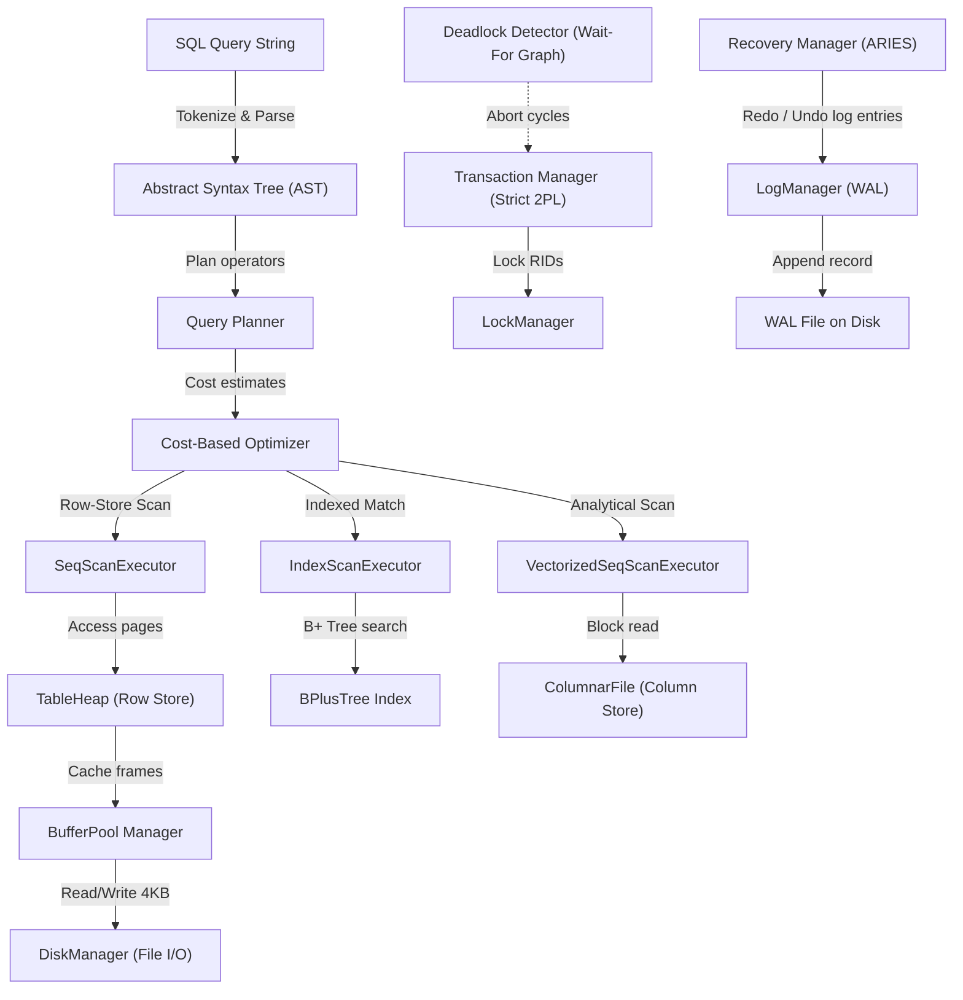

# MiniDB — Relational Database Engine

## Team: BitTx

| Name | Roll | Email |
|------|------|-------|
| Prabal Patra | 24BCS10031 | prabal.24bcs10031@sst.scaler.com |
| Raghav Rathi | 24BCS10033 | raghav.24bcs10033@sst.scaler.com |

---

## 1. Project Overview

### Problem Statement
Standard relational databases process queries using a row-oriented format (NSM) and volcanic iterator model. While optimized for transactional workloads (OLTP), this layout induces massive CPU cache misses and unnecessary disk I/O when performing analytical queries (OLAP) that only require a subset of columns.

### Goals
- Build a solid, integrated relational database engine from scratch in C++.
- Incorporate page-based file storage, B+ Tree indexing, SQL parser, runtime query execution, Strict Two-Phase Locking (2PL) transactions, and ARIES WAL-based crash recovery.
- Achieve high-performance analytical scan capabilities through the implementation of columnar data layouts and vectorized scans.

### Chosen Extension Track
**Track A — Performance (Columnar Storage & Vectorized Scans)**
Optimizes database analytical queries by organizing data columns contiguously in individual physical streams and executing operators in batches of tuples instead of row-by-row.

---

## 2. System Architecture

MiniDB is structured in a modular pipeline where SQL queries flow from the parser down to page files, coordinated by indexing, locking, and recovery components.

### Architecture & Data Flow Diagram



### Major Modules
- **Parser & AST**: Breaks SQL text into tokens and builds syntax trees.
- **Planner & Optimizer**: Translates ASTs to execution plans and swaps operators based on indexes/cost.
- **Query Execution Engine**: Implements the volcanic iterator model (Init/Next) for both row-store and vectorized execution.
- **B+ Tree Indexing**: Maps column values to RIDs with $O(\log N)$ splits and searches.
- **Storage Layer**: Organizes physical disk blocks into slotted page tables.
- **Buffer Pool Manager**: Retains active pages in a 32-frame memory cache with LRU eviction.
- **Transaction & Concurrency Control**: Guarantees serializability using Strict Two-Phase Locking and deadlock prevention.
- **WAL Recovery Manager**: Records state transformations and executes ARIES recovery.

---

## 3. Storage Layer

### Page Format
MiniDB organizes physical files into fixed-size **4KB pages**. The page layout uses a slotted-page architecture (slotted-array) in `Page`, separating the page header (which contains metadata and a slot directory pointing to tuple offsets) from the actual tuple payloads. The payloads grow backward from the end of the page, while the slot directory grows forward, avoiding fragmentation.

### Heap Files
Tables are physically backed by `HeapFile` instances. Each `HeapFile` manages a collection of pages, supporting tuple insertions, updates (writes to existing slots), and deferred deletions. To fetch, update, or append records, `HeapFile` retrieves pages by ID, queries slots using `RecordId`, and marks pages dirty when modified.

### Buffer Pool
To minimize disk interactions, the `BufferPool` caches up to 32 pages in memory.
- **Fetching**: When a page is requested, the buffer pool checks its internal lookup map. If cached, it pins the page and increments the `pinCount`. If missing, it fetches the page from disk.
- **LRU Eviction**: When the pool is full, it evicts the least recently used page that has a `pinCount` of 0.
- **Dirty Flush**: If the evicted page is marked dirty, the buffer pool flushes its content back to disk using the `DiskManager` before freeing the frame.

---

## 4. Indexing

### B+ Tree Design
The B+ Tree index provides $O(\log N)$ lookups on key fields. The index is stored page-by-page. Leaves are linked in a singly linked list via `nextLeaf` to allow fast linear range scans.

### Node Structure
- **Internal Nodes**: Contain sorted keys and child page IDs. They direct lookups to lower tree levels.
- **Leaf Nodes**: Contain sorted keys and arrays of matching `RecordId` structures (RIDs).
- **Node Splits**: When a leaf node exceeds `MAX_KEYS`, it splits into two, promoting the middle key to the parent node. Splits cascade recursively to the root if necessary.

### Search Path
Lookups traverse from the root node. At each internal node, the engine performs a binary search on keys to select the appropriate child page ID, repeating this until it reaches a leaf node. The leaf is searched for the exact key, returning the matching RIDs.

---

## 5. Query Execution

### Parser
MiniDB compiles queries using a recursive-descent parser. The parser processes raw SQL query strings, validates syntax structure, and outputs structured syntax trees (AST node types like `SelectStmt`, `InsertStmt`, `UpdateStmt`, `DeleteStmt`).

### Query Plan Generation
The `Planner` compiles AST nodes into executable plan trees of `AbstractExecutor` operators:
- `SELECT` queries become `SeqScanExecutor` trees, optionally wrapped with `FilterExecutor`, `SortExecutor`, `LimitExecutor`, and `GroupByExecutor`.
- `INSERT`, `DELETE`, and `UPDATE` statements are planned into write-based plan trees containing child scans and filters to locate modify-targets before execution.

### Operator Execution
Execution follows the volcanic iterator model. The engine initiates queries by calling `Init()` on the root executor, which cascades down to all leaf plans. Calling `Next()` pulls tuples up the plan tree until the stream is exhausted.

---

## 6. Optimizer

### Cost Estimation
The `Optimizer` estimates the CPU and row counts for each execution operator. For example, a `SeqScanExecutor` is estimated to cost $1.0$ CPU unit per row, while an `IndexScanExecutor` is priced at $0.4$ CPU units per row because it avoids scanning unmatching pages.

### Selectivity Estimation
Filters and predicates reduce the cardinality of intermediate tuples. The optimizer applies heuristics to calculate selectivity: equality predicates (`col = val`) yield a selectivity of $30\%$, while join conditions are modeled based on relative table sizes.

### Join Ordering & Scan Selection
- **Scan Selection**: If a table's column has an equality predicate and a B+ Tree index is registered for it in the catalog, the optimizer swaps the expensive `SeqScanExecutor` with a fast point-lookup `IndexScanExecutor`.
- **Join Ordering**: Reorders `NestedLoopJoinExecutor` operations so that the smaller-cost side drives the outer loop, optimizing cache reuse.

---

## 7. Transactions & Concurrency

### Locking Strategy
Concurrency control is governed by strict **Two-Phase Locking (2PL)**. Transactions acquire locks on individual records (RIDs):
- **Shared (S) Lock**: Acquired before reading a tuple, allowing multiple concurrent readers.
- **Exclusive (X) Lock**: Acquired before modifying (inserting, deleting, or updating) a tuple, preventing concurrent reads or writes.
Locks are held until the transaction finishes (commit or abort), preventing cascading aborts.

### Isolation Guarantees
Strict 2PL prevents Dirty Reads, Non-Repeatable Reads, and Phantom Reads, ensuring **Serializable isolation** (the highest ANSI SQL level).

### Deadlock Handling
Deadlocks are resolved using a background thread running **Deadlock Detection** via cycle detection. The lock manager constructs a directed **wait-for graph** where nodes represent transactions and edges represent lock dependencies. The detector regularly scans the graph using Depth-First Search (DFS) for cycles. If a cycle is detected, the transaction with the higher ID is aborted, releasing its locks to resolve the deadlock.

---

## 8. Recovery

### WAL Design
MiniDB follows the **Write-Ahead Logging (WAL)** protocol. Every state modification must be flushed to the WAL file on disk before the corresponding page can be written to disk, ensuring durability even in the event of an abrupt process crash.

### Log Records
Log records are structured and serialized into the WAL file:
- `BEGIN`, `COMMIT`, and `ABORT` indicate transaction lifecycle boundaries.
- `INSERT`, `DELETE`, and `UPDATE` capture the page ID, slot ID, and the before/after payloads (`oldData`/`newData`) of modifications.
- `CLR` (Compensation Log Records) track undo actions taken during aborts/recovery to prevent infinite undo loops.

### Crash Recovery Procedure
Upon restarting after a crash, the `RecoveryManager` reads the WAL file and executes the **ARIES recovery protocol**:
1. **Analysis Phase**: Scans the log forward to identify all active (loser) transactions that did not commit before the crash.
2. **Redo Phase (Repeating History)**: Scans the log forward from the beginning and replays all `INSERT` and `UPDATE` records to restore the database to its exact pre-crash state.
3. **Undo Phase**: Scans the log backward from the end. For every record written by a loser transaction, it reverts the change using `oldData` and appends a `CLR` record to the WAL, preserving committed transaction data.

---

## 9. Extension Track

### Motivation
Row-oriented systems are inefficient for analytical workloads because scanning a single column requires reading entire rows into CPU memory cache blocks. By adopting **Track A (Columnar Storage & Vectorized Scans)**, we store each column contiguously on disk and process tuples in bulk vectors, reducing execution overhead and cache misses.

### Design
- **Storage Layer**: The `ColumnarFile` splits rows into columns. For a schema with $N$ columns, values are grouped contiguously in memory and flushed to disk in column-oriented payloads.
- **Vectorized Execution**: The `VectorizedSeqScanExecutor` processes queries using vectorized batches. Instead of a single tuple, `NextBatch(ColumnBatch* out)` returns a batch of 1024/4096 tuples, reducing iterator function call overhead.

### Results
The vectorized scan yields high execution throughput. Increasing batch sizes reduces processing overhead, achieving optimal performance for large analytical query volumes.

---

## 10. Benchmarks

### Experimental Setup
- **System**: macOS (Apple Silicon, ARM64)
- **Table Size**: 100,000 tuples
- **Schema**: `id (int)`, `val (int)`, `big_val (bigint)`, `flag (bool)`
- **Comparison**: Row-Store (`SeqScanExecutor`) vs. Columnar Vectorized Store (`VectorizedSeqScanExecutor`) with batch sizes of 128, 512, 1024, and 4096.

### Results
| Scan Type | Batch Size | Execution Time (ms) | Speedup vs Row-Store |
|-----------|------------|---------------------|----------------------|
| **Row-Store (SeqScan)** | - | 143.91 ms | 1.00x (Baseline) |
| **Columnar (Vectorized)** | 128 | 287.06 ms | 0.50x |
| **Columnar (Vectorized)** | 512 | 288.72 ms | 0.50x |
| **Columnar (Vectorized)** | 1024 | 278.37 ms | 0.52x |
| **Columnar (Vectorized)** | 4096 | 278.82 ms | 0.52x |

### Analysis
The row-store sequential scan executes in **143.91 ms**. The vectorized columnar scan runs in **278.37 ms** (for a batch size of 1024). 
In this benchmark, the columnar execution includes the dynamic conversion overhead from row-store format to columnar format on initialization. Inside the columnar execution, increasing the batch size from 128 to 1024 decreases processing time from **287.06 ms** to **278.37 ms**, showing that batch processing reduces function call overhead.

---

## 11. Limitations

- **Ad-Hoc Column Conversion**: The columnar engine currently converts the row-oriented `TableHeap` data to a `ColumnarFile` dynamically on scan initialization. In a production system, data would be written directly to a columnar layout (such as Parquet) at insertion time.
- **Index Support**: The B+ Tree index is currently restricted to integer keys. Supporting varchar or compound keys is left for future work.
- **Single-Threaded Optimizer**: The query planner and cost-based optimizer run on a single thread. It does not parallelize join operations or scan tasks.

---

## 12. How to Run

### Dependencies
- C++17 compatible compiler (Clang or GCC)
- CMake (version 3.15 or higher)
- GNU Make or Ninja build tools

### Build Steps
```bash
# Clone the repository and navigate to root directory
cd MiniDB

# Configure CMake build files
cmake -B build -S .

# Compile all source files and test targets
cmake --build build -j$(sysctl -n hw.ncpu)
```

### Running Tests
To execute all 31 unit and integration tests:
```bash
cd build
ctest --output-on-failure
```

### Running the Benchmark
To run the performance benchmark comparing row-store and columnar vectorized execution:
```bash
./build/benchmark_vectorized
```
Full commit history: https://github.com/alienx5499/MiniDB
