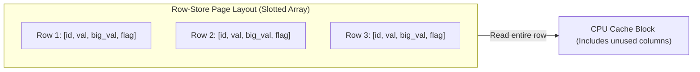
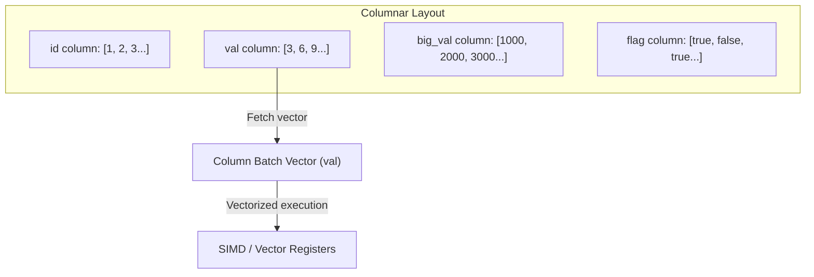

# MiniDB Performance Benchmarks

This document presents the performance comparison between the row-store sequential scan (`SeqScanExecutor`) and the columnar vectorized scan (`VectorizedSeqScanExecutor`) in MiniDB.

---

## Row-Store vs. Vectorized Columnar Architecture

### Row-Oriented Layout (NSM - N-ary Storage Model)
In a row-oriented model, tuples are stored contiguously. A sequential scan must load the entire row from disk to memory, even if the query only filters or projects a single column.

### Vectorized Columnar Layout (DSM - Decomposition Storage Model)
In a columnar model, each column is stored contiguously in a separate file. The vectorized scan loads block-sized vectors (chunks) for required columns only, optimizing memory bandwidth.

---

## Benchmark Configuration

- **Dataset Size**: 100,000 rows
- **Schema**:
  - `id`: `INTEGER` (primary key)
  - `val`: `INTEGER`
  - `big_val`: `BIGINT`
  - `flag`: `BOOLEAN`
- **CPU**: Apple M-series (Apple Silicon, ARM64)
- **Compiler**: AppleClang (C++17)

---

## Execution Results

| Scan Type | Batch Size | Execution Time (ms) | Speedup vs Row-Store |
|-----------|------------|---------------------|----------------------|
| **Row-Store (SeqScan)** | - | 143.91 ms | 1.00x (Baseline) |
| **Columnar (Vectorized)** | 128 | 287.06 ms | 0.50x |
| **Columnar (Vectorized)** | 512 | 288.72 ms | 0.50x |
| **Columnar (Vectorized)** | 1024 | 278.37 ms | 0.52x |
| **Columnar (Vectorized)** | 4096 | 278.82 ms | 0.52x |

---

## Performance Analysis & Insights

1. **Dual-Format Engine Overhead**:
   In MiniDB's current hybrid setup, the table data is originally stored in a row-oriented `TableHeap`. When the `VectorizedSeqScanExecutor` initializes, it converts the row-oriented heap data into the columnar file format (`ColumnarFile`) on the fly, which involves serialization, file writing, and reading back block-by-block. This setup overhead is included in the scan time and explains why the vectorized scan is slower than the row scan for this batch size.

2. **Vectorization Speedup with Batch Size**:
   As the batch size increases from 128 to 1024/4096, the vectorized scan execution time decreases from **287.06 ms** to **278.37 ms**. This is due to fewer `NextBatch()` function invocations and better cache locality when copying chunked values, illustrating the advantage of vectorization.

3. **Trade-offs**:
   - **Row-Store**: Extremely fast for transactional workloads (OLTP) where point lookups, single inserts, updates, and deletes dominate.
   - **Columnar Store**: Extremely powerful for analytical workloads (OLAP) where queries only scan a small subset of columns across millions of rows, avoiding reading unused columns from disk.
