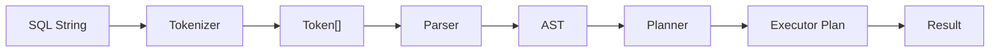
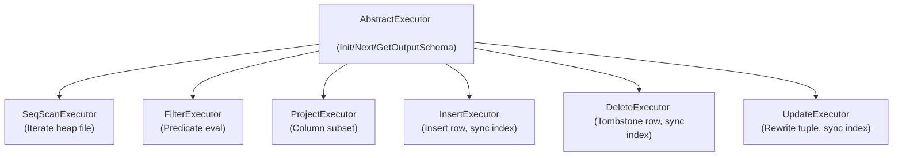

# SQL Pipeline

## Stages

## Tokenizer

- Lexer over input string
- Recognizes keywords (SELECT, FROM, WHERE, INSERT, etc.)
- Identifiers, integer literals, string literals, operators (=, <, >, +, -, etc.)
- Punctuation: `, ( ) ; *`

## Parser

- Recursive descent
- Produces polymorphic `Stmt` and `Expr` (Clone() for safe transforms)
- Stmt types: SELECT, INSERT, CREATE, DROP, UPDATE, DELETE
- Expr types: ColumnRef, Literal, BinaryOp

## Planner

- Maps Stmt → Executor tree
- SELECT → SeqScan → Filter → Project
- INSERT → InsertExecutor
- DELETE → DeleteExecutor
- UPDATE → UpdateExecutor

## Executor Tree

## Evaluator

- Walks Expr tree against row + Schema context
- ColumnRef resolves via `Schema::GetColumnIndex(name)`
- BinaryOp: arithmetic (+,-,*,/), comparison (=,<,>), logical (AND,OR)
- Type-safe: switch on TypeId for proper accessor

## Supported SQL Subset

- CREATE TABLE / DROP TABLE
- INSERT INTO ... VALUES
- SELECT [cols] FROM table [WHERE expr]
- DELETE FROM table [WHERE expr]
- UPDATE table SET col=expr [WHERE expr]
- Expressions: literals, column refs, binary ops (no subqueries, no joins)