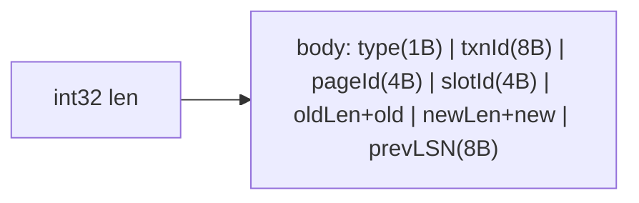

# WAL & Recovery

## Log Record Format

- Frame header: int32 byte count
- Body fields: type, txnId, pageId, slotId, oldData, newData, prevLSN

## Log Manager

- Append: `SerializeLog` → write frame to disk
- `GetLSN()` — current offset (byte position) of next append
- `ReadAll()` — parse all frames, return LogRecord vector
- `Truncate()` — clear log on checkpoint commit

## Transaction Lifecycle

- `LockShared/Exclusive` blocked if state is COMMITTED/ABORTED
- `LockExclusive` also blocked in SHRINKING (strict 2PL)
- `LogInsert` blocked in COMMITTED/ABORTED

## Lock Manager

- Per-RID entry: shared set + exclusive holder
- `LockShared(t, r)`: ok if no other exclusive; else wait
- `LockExclusive(t, r)`: ok if no other holders; else wait
- `Unlock(t, r)`: release; remove entry if empty
- `UnlockAll(t)`: iterate held set, inline unlock

## Deadlock Detection

- Wait-for graph: txn → edges → holder of contended RID
- DFS from requester; if back-edge found → cycle
- Currently victim-selection is caller's responsibility

## Recovery (ARIES-style skeleton)

- `Redo()`: replay INSERT/UPDATE from LSN 0
- `Undo()`: reverse-scan log, revert INSERT/UPDATE for uncommitted txns
- Compensation Log Records (CLR) for nested undo