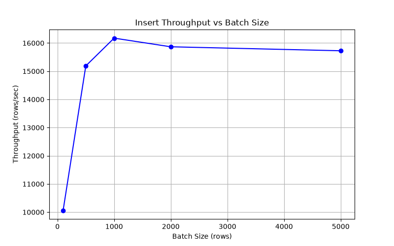
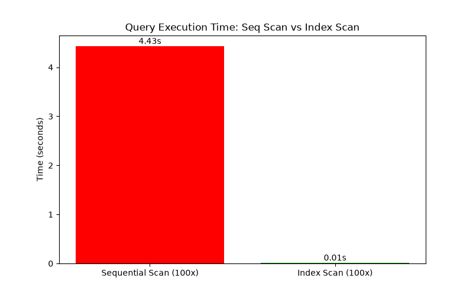
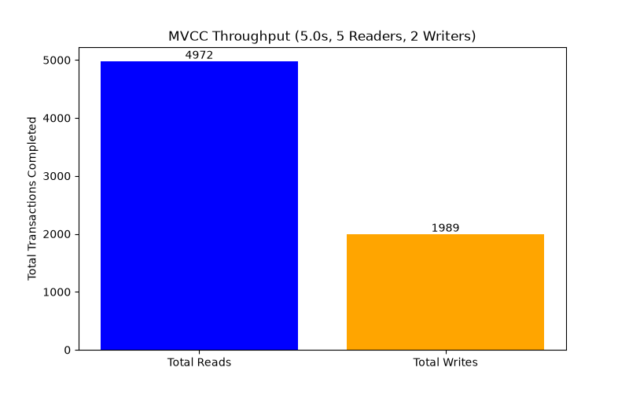

# MiniDB Performance Benchmarks

This document contains automated performance benchmarks for the MiniDB engine.

## Insert Throughput

Measures rows inserted per second inside a single transaction.

### Data

| Metric | Value |
|--------|-------|
| 100 | 10064.56 |
| 500 | 15188.28 |
| 1000 | 16174.43 |
| 2000 | 15867.44 |
| 5000 | 15725.84 |

### Visualization

---

## Sequential vs Index Scan

Compares the total time to execute 100 queries using full table scan vs B+ Tree index lookup on a 10,000 row table.

### Data

| Metric | Value |
|--------|-------|
| Sequential Scan (100x) | 4.43 |
| Index Scan (100x) | 0.01 |

### Visualization

---

## MVCC Concurrent Throughput

Measures total transactions completed with 5 concurrent readers and 2 concurrent writers operating on the same row over 5 seconds. Demonstrates that MVCC readers do not block writers and vice versa.

### Data

| Metric | Value |
|--------|-------|
| Total Reads | 4972 |
| Total Writes | 1989 |
| Read Throughput (txn/s) | 994.40 |
| Write Throughput (txn/s) | 397.80 |

### Visualization

---

