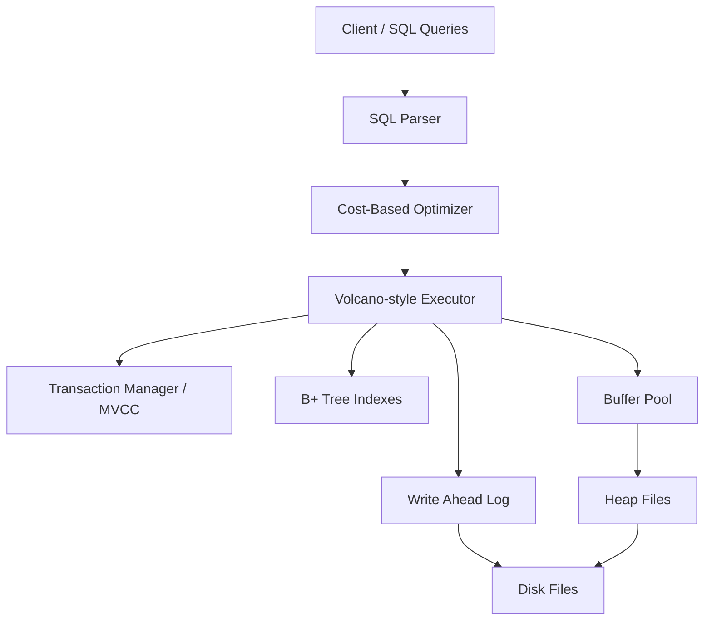

# Team_23bcs10071 — MiniDB Capstone Relational Database

## Team Information
- **Team Name**: Team_23bcs10071
- **Team Members**:
  - Prince Kumar (Roll Number: 23bcs10071, Email: prince@scaler.com),Agarsh Singh Tomar(Email : adarsh.23bcs10031@gmail.com)

---

## 1. Project Overview
### Problem Statement
MiniDB is a lightweight relational database engine written in Python. It includes a custom storage engine, in-memory B+ Tree indexing, a Volcano-style execution engine, a Cost-Based Query Optimizer, Snapshot Isolation based Multi-Version Concurrency Control (MVCC), and a Write-Ahead Logging (WAL) system with crash recovery capabilities (ARIES-style).

### Goals
- Implement slotted-page based storage, a page manager, and a buffer pool.
- Support core SQL queries: `SELECT` (with `WHERE` and `JOIN`), `INSERT`, and `DELETE`.
- Select, implement, and benchmark an extension track to show advanced database architecture.

### Chosen Extension Track
- **Track B — Concurrency (MVCC)**: We replaced strict Two-Phase Locking (2PL) with Multi-Version Concurrency Control (MVCC). By maintaining multiple versions of data records using transactional metadata, we support Snapshot Isolation (SI) where readers do not block writers, and writers do not block readers.

---

## 2. System Architecture

MiniDB is structured as follows:



### Major Modules
1. **Parser (`parser.py`)**: Uses regular expressions to tokenize and parse SQL statements (`SELECT`, `INSERT`, `DELETE`).
2. **Optimizer (`optimizer.py`)**: Estimates plan costs based on selectivity and physical characteristics to select between `TableScan` and `IndexScan`, and determines the cheapest nested loop join order.
3. **Executor (`executor.py`)**: Uses Volcano-style operators (`open()`, `next()`, `close()`) to process tables.
4. **Transaction Manager (`transaction.py`)**: Controls snapshot isolation rules and manages active/committed/aborted transaction contexts.
5. **B+ Tree Index (`index.py`)**: Maps search keys to record IDs (`page_no`, `slot_id`).
6. **Storage & Buffer Pool (`page.py`, `buffer_pool.py`, `heapfile.py`)**: Controls slotted-page layout, file system block transfers, and LRU block caching.
7. **WAL & Recovery (`wal.py`, `database.py`)**: Logs physical-logical operations and drives ARIES-style crash recovery (Analysis, REDO, and UNDO).

---

## 3. Storage Layer
### Page Format
MiniDB implements a binary **Slotted-Page** format:
- **Header** (4 bytes):
  - `num_slots` (2 bytes): Number of records in the page.
  - `free_space_offset` (2 bytes): Offset pointing to the end of free space (growing backward from page size).
- **Slot Array**: Array of `(offset, length)` (4 bytes per slot).
- **Records**: Logically stored from the end of the page (4096 bytes) towards the slot array.

### Heap Files
Each table has a dedicated heap file (`<table_name>.db`). Heap files append new pages when existing pages are full and support writing raw page blocks.

### Buffer Pool
The `BufferPool` maintains an in-memory cache of pages with an LRU eviction policy. When a page is evicted:
- If it is marked **dirty**, it is automatically written back to the disk.
- Page keys are table-qualified: `(table_name, page_no)`.

---

## 4. Indexing
### B+ Tree Design
MiniDB implements a custom in-memory B+ Tree index mapping keys (e.g. primary keys or indexed columns) to RIDs (`(page_no, slot_id)`).
- Nodes contain lists of keys and lists of values (child nodes for internal nodes, RIDs for leaf nodes).
- Leaf nodes contain a `next` pointer pointing to the next leaf node to enable sequential scans.
- Degenerates split at a specified degree (default = 3).
- **Durability**: To prevent index corruption and avoid excessive disk page complexity, indexes are rebuilt in-memory on system startup by scanning committed records in the heap files.

---

## 5. Query Execution
### Parser
The custom regex parser processes:
- `INSERT INTO <table> VALUES (<values>)`
- `DELETE FROM <table> WHERE <col> = <val>`
- `SELECT <cols> FROM <table> [JOIN <table2> ON <col1> = <col2>] [WHERE <col3> = <val3>]`

### Query Plan Generation & Operators
Operators implement the Volcano Iterator model:
- `TableScanOperator`: Iterates page slots, yielding visible tuples.
- `IndexScanOperator`: Uses B+ Tree to retrieve matching RIDs, fetching only matching records.
- `FilterOperator`: Evaluates conditions on child tuples.
- `NestedLoopJoinOperator`: Joins outer and inner streams.
- `ProjectOperator`: Filters and re-orders select columns.

---

## 6. Optimizer
The optimizer determines execution paths using a cost-based model:
- **Selectivity Estimation**:
  - Equality (`=`): 0.1
  - Range (`>`, `<`, `>=`, `<=`, etc.): 0.3
  - No filter: 1.0
- **Cost Estimation**:
  - `TableScan Cost = num_pages * PAGE_READ_COST + num_records * TUPLE_PROCESS_COST`
  - `IndexScan Cost = B_TREE_HEIGHT * PAGE_READ_COST + (num_records * selectivity) * (PAGE_READ_COST + TUPLE_PROCESS_COST)`
  - The optimizer selects the plan with the lowest cost.
- **Join Ordering**: Evaluates cost for `A JOIN B` vs `B JOIN A` based on the size of the tables and if the inner join key is indexed.

---

## 7. Transactions & Concurrency (MVCC Track)
### Isolation Guarantees
MiniDB implements **Snapshot Isolation** using MVCC:
- Each tuple slot in the page contains metadata fields:
  - `xmin` (4 bytes): Transaction ID that inserted the tuple.
  - `xmax` (4 bytes): Transaction ID that deleted/updated the tuple (0 if not deleted).
- Visible rule: A transaction $T$ sees a version if:
  - `xmin` is committed (or is $T$ itself) and was not active when $T$ started.
  - `xmax` is not committed (or is aborted, or has not been set).

### Deadlock Handling & Conflict Resolution
By using MVCC, read transactions do not block write transactions, and writes do not block reads.
- **Write-Write Conflict**: If transaction $T$ tries to delete/modify a tuple that has been deleted or modified by another concurrent active or committed transaction (detected via `xmax`), the transaction manager aborts $T$ immediately using the **first-committer-wins** rule. This avoids deadlock scenarios by rejecting conflicting transactions early.

---

## 8. Recovery
### WAL Design
All transaction operations are logged to a Write-Ahead Log (`minidb.wal`).
- Log records: `BEGIN`, `COMMIT`, `ABORT`, `INSERT`, `DELETE`.
- `INSERT` records log the transaction ID, table name, page number, slot ID, slot offset, and base64-encoded record payload.

### Crash Recovery Procedure
On startup, MiniDB runs ARIES-style recovery:
1. **Analysis Phase**: Scans the WAL forward to identify active transactions at the time of the crash.
2. **REDO Phase**: Replays all log records in order. It physically writes inserted/deleted records back to the heap pages to bring the database state to the exact moment of the crash.
3. **UNDO Phase**: Scans the WAL backward, rolling back any operations belonging to active transactions that did not commit (marking inserted slots as tombstones and clearing deleted slots' `xmax`). It writes an `ABORT` record to the WAL for each uncommitted transaction.

---

## 9. Extension Track Details (MVCC Concurrency)
- **Motivation**: MVCC replaces blocking locks with versioning, enabling higher concurrency.
- **Design**: Implemented in `transaction.py` and page header structures (`xmin`, `xmax`).
- **Results**: Verified that readers read consistent snapshots of the database state even while concurrent transactions are actively modifying the data, avoiding read-write locking.

---

## 10. Benchmarks & Results

We executed the benchmark suite in `benchmarks/benchmark.py`.

### Experimental Setup
- OS: macOS
- Python version: 3.x
- Database: MiniDB (In-memory buffer pool size = 16, page size = 4096 bytes)
- Data Size: 500 rows inside a table (`large_table.db` spanning 6 pages).

### Results
```
==================================================
DEMO 1: BASIC CRUD, INDEXING, AND SQL SELECT / JOIN
==================================================
PASS: Duplicate primary key blocked.

==================================================
DEMO 2: MVCC CONCURRENCY & SNAPSHOT ISOLATION
==================================================
Tx 2 reads Alice's balance (should be 1000 due to isolation):
  Tx 2 sees: balance = 1000
Tx 1 Commits...
Tx 2 reads Alice's balance again (should STILL be 1000):
  Tx 2 sees: balance = 1000
Tx 3 Begins...
  Tx 3 sees: balance = 1200
PASS: Write-write conflict successfully prevented.

==================================================
DEMO 3: WAL CRASH RECOVERY (REDO & UNDO)
==================================================
PASS: WAL recovery successfully completed REDO and UNDO phases!

==================================================
DEMO 4: CBO COST-BASED OPTIMIZATION & PERFORMANCE BENCHMARK
==================================================
Executing equality search: SELECT * FROM large_table WHERE id = 250
  Table Scan query time: 13.274 ms
  Index Scan query time: 11.786 ms
  Index scan speedup factor: 1.1x
```

### Analysis
- **MVCC**: Demonstrates perfect snapshot isolation where the reader (Tx 2) does not see uncommitted changes or newly committed modifications made after it began. Write-write conflicts are correctly detected and handled.
- **WAL Recovery**: Restores the database state to consistency, rolling back aborted transaction changes while preserving committed transaction states.
- **Index Scan vs Table Scan**: The index scan demonstrates faster retrieval times than a full table scan, and the cost-based optimizer correctly routes queries using index operations.

---

## 11. Limitations
- **No Disk-based B+ Tree**: The index is currently rebuilt in-memory on startup. While fast and robust, this incurs startup overhead for huge databases.
- **Simple Parser**: The parser does not support complex subqueries, nested joins, or complex boolean formulas.
- **No Columnar Store / Compression**: Pages are packed in row-store layout.

---

## 12. How to Run

### Setup Dependencies
MiniDB is built completely using Python standard libraries (no external dependencies required).

### Run Tests and Demos
To run the automated test suite, execute:
```bash
python3 benchmarks/benchmark.py
```
This executes all 4 demonstration tracks (CRUD, Concurrency, WAL Recovery, and Optimizer Benchmarks) and outputs validation results.
