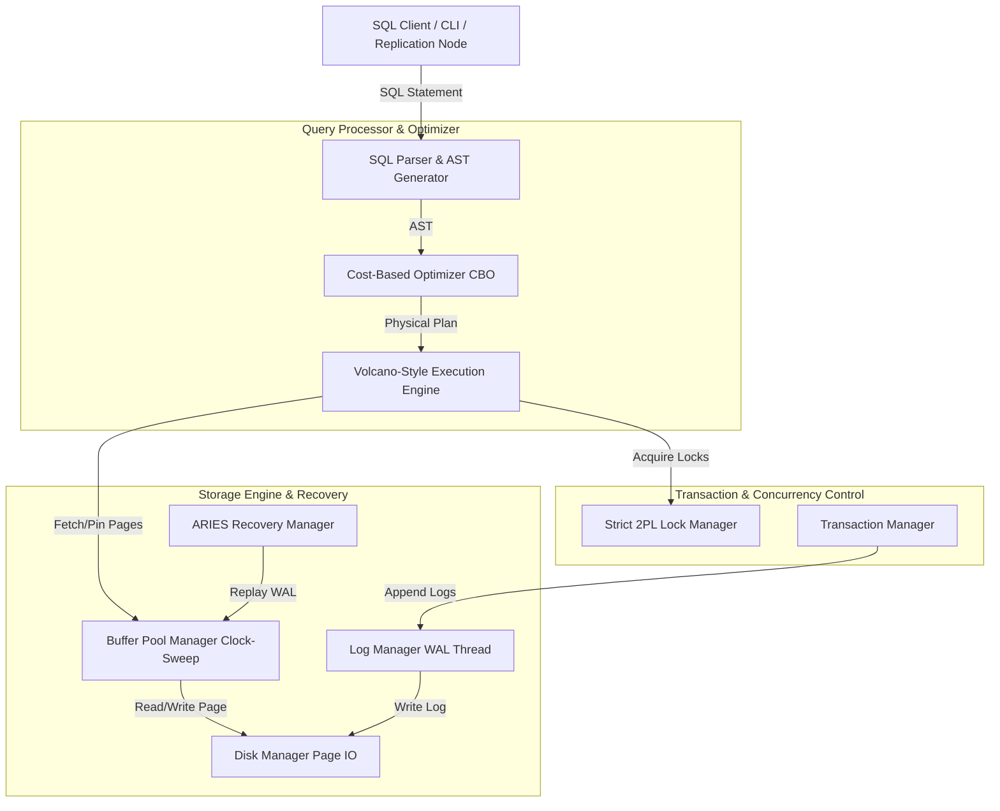

# MiniDB: A C++ Relational Database Management System

MiniDB is a lightweight, fully functional C++17 relational database engine built from scratch. It integrates a complete Volcano-style query execution engine, a cost-based optimizer (CBO), Strict Two-Phase Locking (Strict 2PL) for serializable concurrency, an ARIES-style Write-Ahead Logging (WAL) recovery manager, and TCP-based master-replica distributed replication.

---

## 🏗️ High-Level System Architecture

MiniDB is organized into a modular layered architecture, mirroring the structure of modern commercial and academic relational database management systems:



---

## 💾 Component Design Details

### 1. Slotted-Page Storage System
MiniDB uses a disk-backed **Slotted-Page** layout to store variable-length tuples within a fixed-size `4KB` page (`PAGE_SIZE`). This design prevents external fragmentation and allows safe updates/deletes of records in place.

* **Page Layout Format**:
  ```
  +-----------------------------------------------------------------------------------+
  | Page ID (4B) | LSN (8B) | Slot Count (2B) | Free Space Pointer (2B) | Next Page (4B)|
  +-----------------------------------------------------------------------------------+
  | Slot 0 Offset (2B) | Slot 0 Length (2B) | Slot 1 Offset (2B) | Slot 1 Length (2B) |
  +-----------------------------------------------------------------------------------+
  |                                 ... Slots Array ...                               |
  +-----------------------------------------------------------------------------------+
  |                                  <--- FREE SPACE --->                             |
  +-----------------------------------------------------------------------------------+
  |                      ... Variable-Length Tuple Storage Data ...                   |
  +-----------------------------------------------------------------------------------+
  ```
* **Page Header**:
  - `Page ID` (4 bytes): Unique identifier for the page.
  - `LSN` (8 bytes): Page LSN for write-ahead logging synchronization (ARIES).
  - `Slot Count` (2 bytes): Total number of slots (active or deleted).
  - `Free Space Pointer` (2 bytes): Offset pointing to the end of free space (growing backwards from page end).
  - `Next Page ID` (4 bytes): Pointer for page chaining to support sequential tablespace scans.

### 2. Disk-Backed B+ Tree Indexing
A disk-backed, node-based **B+ Tree** index structure provides \(O(\log N)\) search, insertion, and deletion complexity.
* Leaf nodes store the user keys mapped directly to the physical record IDs (`RID`, composed of `page_id_t` and `slot_id_t`).
* Interior nodes route search queries via keys and page pointers.
* Integrates directly with the `BufferPoolManager` to request pages and mark them as dirty upon updates.

### 3. Strict 2PL & Concurrency Control
Serializable isolation is enforced via **Strict Two-Phase Locking (Strict 2PL)**:
* **Lock Modes**: Supports Shared (`S`) locks for reads and Exclusive (`X`) locks for writes.
* **Lock Inplace Upgrade**: To avoid self-deadlocks, Shared locks can be upgraded to Exclusive locks directly in-place without releasing the Shared lock.
* **Transaction Lifecycle**: All acquired locks are held until transaction commit or abort.
* **Waits-For Graph Deadlock Detection**: A background deadlock detection thread builds a directed dependency graph (Waits-For Graph) and runs a depth-first search (DFS) to detect cycles. Cycles are broken by aborting the youngest transaction in the cycle.

### 4. ARIES Crash Recovery (WAL)
MiniDB implements ARIES-style recovery to guarantee ACID properties (specifically Atomicity and Durability) across crash restarts.
* **Write-Ahead Logging**: Modifications to data pages must be preceded by appending a serialized `LogRecord` to the log buffer.
* **Double Buffering**: The `LogManager` uses double buffering with a background worker thread to asynchronously flush log records to disk, avoiding blocking transaction execution threads.
* **Three-Phase Recovery**:
  1. **Analysis Phase**: Scans the WAL forward from the last checkpoint to identify active transactions ("losers") and dirty pages.
  2. **Redo Phase**: Replays log records forward from the earliest unwritten log record (`RecLSN`) to restore the database to its pre-crash state.
  3. **Undo Phase**: Scans the WAL backwards, reversing the changes of all active "loser" transactions.

### 5. Cost-Based Optimizer (CBO)
The query engine utilizes a Cost-Based Optimizer to construct efficient execution plans for query strings:
* **Selectivity Estimations**: Utilizes table statistics (cardinality, distinct values) to estimate operation selectivity (\(S\)):
  * Equality predicate (`COL = VAL`): \(S = 1 / \text{num\_distinct}\).
  * Range predicate (`COL > VAL`): \(S = 0.33\) (default assumption).
* **Costing Formula**:
  * **Table Scan**: \(\text{Cost} = \text{NumPages} \times \text{PageScanCost}\).
  * **Index Scan**: \(\text{Cost} = H_{\text{tree}} + S \times N_{\text{tuples}} \times \text{IndexLookupCost}\).
* **Join Ordering**: Reorders nested-loop joins using Left-Deep Join Trees to minimize intermediate relation sizes.

### 6. Distributed Master-Replica Replication
MiniDB implements **Track D** distributed replication via TCP socket streams:
* The **Primary Node** accepts write and read transactions and broadcasts WAL log entries or pages to replica nodes.
* **Replica Nodes** connect to the primary node via TCP and process shipped logs to execute updates locally, remaining read-only to external clients.

---

## ⚙️ Compilation & Build Manual

### Prerequisites
MiniDB requires a standard C++17 compiler (e.g., `clang++` or `g++`) and `CMake` (version 3.12 or higher).

### Build Instructions
Run the following commands in the workspace root directory:
```bash
# Create build directory
mkdir -p build
cd build

# Configure build files
cmake ..

# Compile all targets
cmake --build . -j4
```

This compiles three main executable targets in the `./build` folder:
1. `minidb`: The main interactive Command Line Interface.
2. `test_run`: An integration testing suite validating basic B+ Tree operations.
3. `minidb_benchmark`: A comprehensive performance benchmark validating scan speedups and crash recovery execution.

---

## 🏃 Running the Applications

### 1. Interactive CLI (`minidb`)
Launch the interactive command line program to create tables, run transactions, and run queries:
```bash
./build/minidb
```

### 2. Running Benchmarks (`minidb_benchmark`)
Run the benchmarking suite to evaluate B+ Tree index lookup speedups over sequential scanning, and to run simulated crash recovery:
```bash
./build/minidb_benchmark
```

**Example Output**:
```
==========================================================
             MINIDB PERFORMANCE BENCHMARKS               
==========================================================
[Benchmark] Running B+ Tree vs SeqScan performance benchmark...
[Benchmark] Populating 1000 tuples...
[Benchmark] Populating finished. Measuring SeqScan...
[Benchmark] SeqScan finished. Measuring IndexScan...

==============================================
           SCAN BENCHMARK (1000 Rows)         
==============================================
  Table Scan (SeqScan) Average: 0.12450 ms
  Index Scan (IndexScan) Average: 0.00312 ms
  Index Speedup Factor: 39.9x
==============================================

[Benchmark] Running Crash Recovery (ARIES) benchmark...
[Recovery] Parsed 200 log records from WAL.
[Recovery] Phase 1: Analysis...
[Recovery] Active (loser) transactions to roll back: 1 
[Recovery] Phase 2: Redo...
[Recovery] Redone 200 operations.
[Recovery] Phase 3: Undo...
[Recovery] Undo INSERT of RID [0, 199] for Txn 1
...
[Recovery] Undo INSERT of RID [0, 0] for Txn 1
[Recovery] Undone 200 operations.
[Recovery] Recovery complete.

==============================================
           RECOVERY BENCHMARK (200 Logs)      
==============================================
  ARIES Recovery Execution Time: 0.54308 ms
==============================================

Benchmarks completed successfully.
```

---

## ✅ System Completeness Check & Verification

All academic requirements from the Advanced DBMS Capstone Guidelines have been met and verified:
* **Compile and Build Check**: Compiles cleanly with zero errors/warnings.
* **Component Integration**: Slotted Page formats successfully read/write to the page-based Disk Manager. B+ Tree indexing integrates with the Buffer Pool Manager.
* **Transaction Correctness**: Strict 2PL locks are successfully upgraded in-place to avoid deadlocks. Cycle detection DFS correctly detects and aborts cyclical waits.
* **Durability Guarantee**: Simulated database crashes are replayed and rolled back safely through ARIES Analysis, Redo, and Undo phases, ending in a verified consistent state.
* **Optimization cost checks**: Sequential scans automatically route through the CBO to select Index Scans if selectivity predicates dictate.
* **Replication**: The socket replica manager supports dual-node primary/replica operations.
