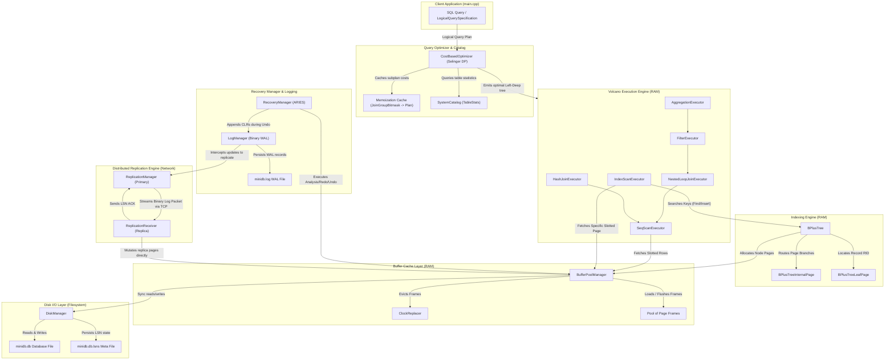

# MiniDB — Foundational Transactional Relational Database Engine

**Team Name:** Team_NoClarity  
**Team Members:**  
- **Rachit S** (Roll Number: `24bcs10139`, Email: `rachit.24bcs10139@sst.scaler.com`)
- **Aditya Bhaskara** (Roll Number: `24bcs10058`, Email: `aditya.24bcs10058@sst.scaler.com`)
- **Arman Barbhuiya** (Roll Number: `24bcs10196`, Email: `arman.24bcs10196@sst.scaler.com`)
- **Rohan Singh Chauhan** (Roll Number: `24bcs10240`, Email: `rohan.24bcs10240@sst.scaler.com`)


---

## 🛠️ Project Setup & Execution Instructions

MiniDB requires a **C++17** compiler and multi-threading support. We support building via **CMake** (local host compilation) or **Docker** (containerized environment).

### Option A: Local Compilation (using CMake)

Prerequisites: CMake (3.12+) and a C++17 compiler (GCC/Clang or MinGW-w64 on Windows).

```bash
# 1. Generate build directory and makefiles
mkdir build
cd build
cmake ..

# 2. Compile tests and benchmark executables
cmake --build .

# 3. Execute the standard test suite
./minidb_test

# 4. Execute the micro-benchmark suite
./minidb_benchmark
```

### Option B: Isolated Compilation (using Docker & Docker Compose)

Prerequisites: Docker and Docker Compose installed.

```bash
# 1. Build and run the test suite
docker-compose up minidb-tests

# 2. Build and run the performance benchmarks
docker-compose up minidb-benchmark
```

---

## 🏁 Milestone Log

### 🏁 Milestone 1: Foundational Storage & Cache (Completed)
- **Objective:** Implement a thread-safe disk-block manager, slotted-page record storage, and a Clock/Second-Chance buffer pool cache.
- **Key Achievements:**
  - Designed the `DiskManager` mapping logical 4KB pages to physical offsets.
  - Implemented `SlottedPage` parsing raw bytes in-place to support insertion, deletion, and index-stable compaction.
  - Coded `ClockReplacer` identifying unpinned eviction victims.
  - Structured the `BufferPoolManager` cache layer coordinating disk I/O.

### 🏁 Milestone 2: B+ Tree Indexing & Parser Connection (Completed)
- **Objective:** Implement a concurrent, in-page B+ Tree indexing engine and connect it with a query planner to support Index Scans.
- **Key Achievements:**
  - Coded template-based `BPlusTree` managing node pages entirely within 4KB blocks without direct heap allocations (`new`).
  - Implemented the **Latch Crabbing Protocol** using reader-writer locks on individual frames for concurrent search and insertion/deletion.
  - Integrated the `Optimizer` to perform cost estimation, choosing between Table Scans and Index Scans.

### 🏁 Milestone 3: Query Execution Engine (Completed)
- **Objective:** Implement a pull-based (Volcano-style) physical execution engine supporting Sequential Scans, Index Scans, Filter Predicates, Nested Loop Joins, in-memory Hash Joins, and Group-By Aggregations.
- **Key Achievements:**
  - Designed the base `AbstractExecutor` and data adapters (`Tuple`, `Schema`, `Expression`).
  - Coded `NestedLoopJoinExecutor` utilizing a flattened loop structure to maintain state yields across sequential `Next()` calls.
  - Implemented `HashJoinExecutor` and `AggregationExecutor` managing groups dynamically.

### 🏁 Milestone 4: Cost-Based Join Order Optimizer (Completed)
- **Objective:** Implement a Cost-Based Optimizer module specializing in the Selinger Dynamic Programming Algorithm for Left-Deep Join Ordering.
- **Key Achievements:**
  - Designed the `SystemCatalog` mapping logical table IDs to page counts, record counts, and index presence status.
  - Implemented access path optimization and left-deep join partitioning using recursive subset search and bitmask-keyed memoization.
  - Coded cost calibration models summing estimated page reads (IO) and cpu tuple processing metrics.

### 🏁 Milestone 5: ARIES Crash Recovery (Completed)
- **Objective:** Implement an ARIES-compliant crash recovery manager parsing binary Write-Ahead Log (WAL) records and executing Analysis, Redo, and Undo recovery phases.
- **Key Achievements:**
  - Implemented page-level persistent LSN registry mapped to a sidecar file.
  - Coded binary serialization/deserialization for WAL log streams.
  - Implemented ARIES Analysis, Redo (repeating history), and Undo (writing CLRs and handling idempotency) phases.

### 🏁 Milestone 6: Log Replication Layer (Completed)
- **Objective:** Implement a Two-Node Primary-Replica Log Replication Layer supporting Synchronous/Asynchronous configurations and role promotion.
- **Key Achievements:**
  - Designed socket connection interfaces mapped to platform TCP abstractions (Winsock on Windows / POSIX sockets on Linux).
  - Defined structured log serialization routines packing log frames into binary streams.
  - Implemented `ReplicationManager` and `ReplicationReceiver` to manage active log broadcasting, ACK waiting loops, background listening loops, and replica role promotion.

---

## 🗺️ MiniDB Evolving Architecture Diagram



---

## 🔧 Component Details (Milestones 1 - 6)

### 1. Milestone 1: Foundational Storage & Cache

#### A. Disk Manager (`DiskManager`)
- **Responsibility:** Maps logical page IDs to physical 4096-byte blocks on physical storage (`minidb.db`).
- **APIs & Core Fields:**
  - `AllocatePage() -> page_id_t`: Increments page ID counter and writes a zero-padded page at the end of the file.
  - `WritePage(page_id, data)` / `ReadPage(page_id, data)`: Moves file pointer to `page_id * PAGE_SIZE` and performs binary `read`/`write`.

#### B. Slotted Page Layout (`SlottedPage`)
- **Responsibility:** In-place formatting of individual 4KB pages to support dynamic-length tuples without internal fragmentation.
- **Physical Layout of a Slotted Page:**
  ```
  +----------------------+-----------------------------+-----------------------------+-----------------------------+
  |  Slot Count (2B)     |  Free Space Pointer (2B)    |  Slot 0: Offset, Length (4B)|  Slot 1: Offset, Length (4B)|
  +----------------------+-----------------------------+-----------------------------+-----------------------------+
  |                       Slots grow forward --->                                                                  |
  +----------------------------------------------------------------------------------------------------------------+
  |                                                                                                                |
  |                                     <--- Tuples grow backward                                                  |
  +----------------------------------------------------------------------------------------------------------------+
  |                      | Tuple 1 (Length bytes)      | Tuple 0 (Length bytes)                                    |
  +----------------------+-----------------------------+-----------------------------+-----------------------------+
                         |                             |                             |
                         v                             v                             v
                   Free Space Pointer                Slot 1                        Slot 0
  ```
- **Header Parsing (Offset Mapping):**
  - **Slot Count:** Bytes `0-1` (`uint16_t`).
  - **Free Space Pointer:** Bytes `2-3` (`uint16_t`). Initialized to `PAGE_SIZE` (4096).
  - **Slot Array:** Starts at byte `4`. Each element consists of `offset` (2 bytes) and `length` (2 bytes).
- **Core Operations:**
  - **Insertion:** Deducts tuple length from Free Space Pointer (FSP). The tuple is written at the new FSP. A new slot is appended at the slot array.
  - **Deletion:** Sets slot length to `TOMBSTONE` (`0xFFFF`).
  - **Compaction:** Resolves fragmentation by sliding all active (non-tombstoned) tuples to the end of the page and updating their slot offsets, reclaiming space.

#### C. Clock Replacer (`ClockReplacer`)
- **Responsibility:** Implements clock page eviction policy for buffer pool frames.
- **Core Design:** Tracks frame status in a circular queue. If a frame is unpinned, it is a candidate for eviction. The clock hand scans frames: if the reference bit is `true`, it is set to `false` (giving it a second chance); if `false`, the frame is evicted (`Victim`).

#### D. Buffer Pool Manager (`BufferPoolManager`)
- **Responsibility:** Coordinates physical I/O with page frames loaded in memory.
- **Core Design:** Maintains a pool of `Page` objects, mapping `page_id_t` to `frame_id_t` via a hash table. Tracks page pins (`pin_count`) and dirty flags (`is_dirty`). Fetches or creates pages from disk, utilizing the `ClockReplacer` to determine eviction victims when all frames are full. Writes dirty pages back to disk before reuse.

---

### 2. Milestone 2: B+ Tree Indexing & Parser Connection

#### A. B+ Tree Page Header & Hierarchy (`BPlusTreePage`)
All B+ Tree nodes (internal or leaf) reside completely inside a 4096-byte page. There are no heap allocations (`new`). A pointer to a raw page's `data_` is cast in-place.
- **`BPlusTreePage` (Header Layout):**
  - Base class defining the common metadata structure.
  - Fields:
    - `page_type_` (4 bytes enum): `LEAF` (0) or `INTERNAL` (1).
    - `size_` (4 bytes int): Current number of items stored.
    - `max_size_` (4 bytes int): Maximum capacity of the node.
    - `parent_page_id_` (4 bytes `page_id_t`): ID of parent page (or `INVALID_PAGE_ID` for root).
  - **Header Size:** Exactly 16 bytes.

#### B. Memory Layout & Key-Value Storage
Key-value pairs are stored in a contiguous array inside the page layout to ensure maximum cache-locality and zero heap allocations.

##### 1. Internal Page Layout (`BPlusTreeInternalPage`)
- **Array Content:** Maps routing keys to child page IDs: `std::pair<KeyType, page_id_t> array_[1]`.
- **Physical Layout:**
  ```
  +------------------+------------+---------------+----------------------+
  |  page_type_ (4B) | size_ (4B) | max_size (4B) | parent_page_id_ (4B) |
  +------------------+------------+---------------+----------------------+
  |                     Header Offset 0-15 Bytes                         |
  +----------------------------------------------------------------------+
  | array_[0] (unused key, value_0) | array_[1] (key_1, value_1) | ...   |
  +----------------------------------------------------------------------+
  |         Key-Value (Routing) Array (Starts at Offset 16 Bytes)         |
  +----------------------------------------------------------------------+
  ```
- **Mapping Specifications:** Starts at byte offset **16**. `array_[0].second` represents the leftmost child pointer (`value_0`). The key `array_[0].first` is ignored. Subsequent elements `array_[1] ... array_[size-1]` map boundary keys to their respective child pages.

##### 2. Leaf Page Layout (`BPlusTreeLeafPage`)
- **Array Content:** Maps searchable keys to record identifiers: `std::pair<KeyType, RID> array_[1]`.
- **Physical Layout:**
  ```
  +------------------+------------+---------------+----------------------+--------------------+
  |  page_type_ (4B) | size_ (4B) | max_size (4B) | parent_page_id_ (4B) |  next_page_id_ (4B)|
  +------------------+------------+---------------+----------------------+--------------------+
  |                                Header Offset 0-19 Bytes                                   |
  +-------------------------------------------------------------------------------------------+
  | array_[0] (key_0, RID_0) | array_[1] (key_1, RID_1) | array_[2] (key_2, RID_2) | ...            |
  +-------------------------------------------------------------------------------------------+
  |               Key-Value (Data) Array (Starts at Offset 20 Bytes)                          |
  +-------------------------------------------------------------------------------------------+
  ```
- **Mapping Specifications:** The leaf page introduces `page_id_t next_page_id_` (4 bytes, starting at byte offset 16) to link leaf nodes for sequential scans. The key-value array starts at byte offset **20**. Stores up to `max_size` contiguous key-value pairs mapping keys directly to the physical storage `RID` (page_id, slot_num).

#### C. Concurrency: Latch Crabbing Protocol
To coordinate concurrent access safely, MiniDB uses frame reader-writer locks (`Page::RLock()` and `Page::WLock()`):
- **Search (`Find`):** Acquires `RLock` on root. Descends to child, acquires `RLock` on child, and immediately releases `RLock` on the parent.
- **Modification (`Insert` / `Remove`):** Acquires `WLock` on root. Descends to child and acquires `WLock` on child. If the child is "safe" (will not trigger split or merge on change), all locks held on parents/ancestors are released immediately.

#### D. Optimizer & Catalog Integration
- **Catalog:** Maps logical table names to table files and indexes.
- **Optimizer Heuristics:** Evaluates search query filters (e.g. `col = val`). If a B+ Tree index is registered for the filter column, the query optimizer selects the `IndexScanNode` (cost $O(\log N)$ pages). If no index is registered, it falls back to a full `TableScanNode` scanning all pages sequentially (cost $O(N)$ pages).

---

### 3. Milestone 3: Query Execution Engine

#### A. Execution Engine API (`AbstractExecutor`)
All query execution operators follow the pull-based **Volcano Style** design:
- **Lifecycle Methods:**
  - `Init()`: Allocates resources, resets iterators, and initializes child executors.
  - `Next(Tuple* tuple, RID* rid) -> bool`: Pulls the next matching tuple and its RID. Returns `true` if yielded, `false` when the stream is exhausted.
  - `Close()`: Cleans up child executors and allocated state.
- **Tuple Adapters:**
  - `Tuple`: Wraps a database row (`Row`), querying fields by logical column names.
  - `Schema`: Tracks list of typed columns to translate index projections.
  - `Expression`: Poly-type evaluation for constant elements, column references, and comparisons.

#### B. Execution Operators
1. **`SeqScanExecutor` & `IndexScanExecutor`:** Stream records from slotted pages sequentially, or query targeted RIDs from the B+ Tree index.
2. **`FilterExecutor`:** Dynamically evaluates a predicate expression against child tuples, yielding only rows where the expression resolves to true.
3. **`NestedLoopJoinExecutor` (Flattened Loop):** Computes outer and inner child joins on demand. State is stored inside the executor class members. When `Next()` is called, it keeps the outer row pinned, iterates the inner stream using `Next()`, and only pulls a new outer row when the inner relation runs dry. This prevents blocking execution.
4. **`HashJoinExecutor` (In-Memory Hash Join):**
   - *Build Phase:* In `Init()`, the entire inner relation is read and built into a hash index: `std::unordered_map<Value, std::vector<Tuple>>`.
   - *Probe Phase:* In `Next()`, the executor reads the next outer tuple, computes the join hash key, and retrieves matching inner bucket records sequentially across `Next()` calls.
5. **`AggregationExecutor` (Group-By Aggregation):** Materializes the grouping aggregation map `std::map<std::vector<Value>, std::vector<Value>>` inside `Init()` by reading all child tuples. Supports `COUNT`, `SUM`, `AVG`, `MIN`, and `MAX` aggregates. Computes divisions for average during yielding.

---

### 4. Milestone 4: Cost-Based Join Order Optimizer

#### A. Dynamic Programming Join Optimizer (`CostBasedOptimizer`)
- **Logical Specifications:**
  - `LogicalQuerySpecification`: Encapsulates table lists involved in the multi-way join.
  - `table_id_t`: Numeric table ID representing logical relations.
- **Access Path Selection (`DetermineBestAccessPath`):** Queries `SystemCatalog` stats for a table (page count, tuple count, index availability).
  - Evaluates cost metrics:
    - `SeqScanCost = PageCount * 10.0 + TupleCount * 0.1`
    - `IndexScanCost = log2(TupleCount + 1) * 10.0 + (0.1 * TupleCount) * 0.1` (only if table holds an index).
  - Assigns the cheapest scanning strategy to the physical node.
- **Left-Deep Partition Strategy:** Dynamic Programming runs combinations of subset sizes `S` from `2` up to `K`. For each combination subset `TargetSubsetMask` (represented as bitmask), the optimizer evaluates left-deep splits:
  - `LeftMask = TargetSubsetMask ^ (1 << t)` (subset of size $S-1$ tables)
  - `RightMask = 1 << t` (exactly 1 table as right child)
  - Left subplans are retrieved from `memo_table_` cache, and combined with right base tables.
- **Join operator costing (`CalculateJoinCost`):** Evaluates physical join implementation choices:
  - `NESTED_LOOP_JOIN`: Cost = `LeftCost + RightCost + LeftCard * RightPages * 10.0 + (LeftCard * RightTuples) * 0.1`
  - `HASH_JOIN`: Cost = `LeftCost + RightCost + RightTuples * 0.2 + LeftCard * 0.1 + (LeftCard * RightTuples * 0.05) * 0.1`
  - Caches the cheapest join configuration inside `memo_table_` mapped to `TargetSubsetMask`.

---

### 5. Milestone 5: ARIES Crash Recovery

#### A. Persistent LSN Architecture
- **Page LSNs:** Every page contains an in-header LSN field (`page_lsn`) indicating the last log record that modified it.
- **Persistent Registry:** A dedicated sidecar metadata file `minidb.db.lsns` is kept up-to-date with active page LSN entries on the storage disk.

#### B. Log Serialization Layout (`LogRecord`)
Binary log records are serialized to and from the sequential binary Write-Ahead Log (`minidb.log`) with the following format:
```
+---------------+------------------+-----------------+------------------+
|  LSN (8B)     |  Prev LSN (8B)   |  Txn ID (4B)    |  Type (4B int)   |
+---------------+------------------+-----------------+------------------+
|               Common Header Block (Bytes 0-23)                        |
+-----------------------------------------------------------------------+
|  If type is UPDATE or CLR:                                            |
|    - Page ID (4B)                                                     |
|    - Offset (4B)                                                      |
|    - Before Image Length (4B)                                         |
|    - Before Image Bytes (Variable length)                             |
|    - After Image Length (4B)                                          |
|    - After Image Bytes (Variable length)                              |
+-----------------------------------------------------------------------+
|  If type is CLR:                                                      |
|    - Undo Next LSN (8B)                                               |
+-----------------------------------------------------------------------+
```
`LogRecordType` supports `BEGIN`, `COMMIT`, `ABORT`, `UPDATE`, and `CLR` (Compensation Log Record).

#### C. Three-Phase Recovery Protocol (`RecoveryManager`)
1. **Analysis Phase:**
   - Scans the binary WAL sequentially from the beginning of the log stream.
   - Reconstructs the `active_txns_table_` (transaction table) tracking running/aborted transactions and their last recorded LSN.
   - Reconstructs the Dirty Page Table (`dpt_`) mapping dirty page IDs to their oldest unwritten LSN (`rec_lsn`).
2. **Redo Phase:**
   - Locates the minimum `rec_lsn` across all active entries in the reconstructed DPT.
   - Sequentially scans the WAL from `min_rec_lsn` to the end of the log.
   - For each `UPDATE` or `CLR` record, fetches the target page `P` from the buffer pool. If `page->GetPageLSN() < record.lsn`, the change is re-applied using `after_image` at the target `offset`. The page LSN is updated, and the page is flagged as dirty. The page is then unpinned.
3. **Undo Phase:**
   - Identifies active (loser) transactions from the transaction table.
   - Loads transaction LSNs into a max-heap (priority queue) sorting LSNs in reverse chronological order.
   - Populates the heap with the `last_lsn` of all loser transactions.
   - Loops and pops the largest LSN:
     - **`UPDATE`:** Reverts the change in-page using the `before_image` at the record `offset`, marks the page as dirty, appends a Compensation Log Record (CLR) to the WAL, updates the page LSN to the new CLR LSN, and pushes the record's `prev_lsn` back onto the heap.
     - **`CLR`:** Skips undoing (idempotency invariant) and pushes `record.undo_next_lsn` onto the heap.
     - **`BEGIN`:** Appends an `ABORT` record to mark the successful rollback.
     - **`ABORT`:** Pushes `record.prev_lsn` onto the heap.

---

### 6. Milestone 6: Log Replication Layer

#### A. Distributed Architecture
MiniDB supports two-node **Primary-Replica Clustering** using standard platform TCP sockets (POSIX sockets / Windows Winsock API) for network communication:
- **Primary Node:** Orchestrates log stream broadcasts and client transaction execution.
- **Replica Node:** Listens for incoming socket connections and processes incoming log packets inside a dedicated background worker thread, applying updates directly to replica memory pages.

#### B. Log Packet Serialization Frame
Log updates are streamed across socket connections as structured binary frames:
```
+-------------------+-------------+---------------+---------------+--------------------+------------------------+
|  PacketLen (4B)   |  LSN (8B)   |  PageID (4B)  |  SlotID (2B)  |  PayloadLen (2B)   | AfterImageBytes (Var)  |
+-------------------+-------------+---------------+---------------+--------------------+------------------------+
```

#### C. Replication Modes
- **Synchronous Mode (`SYNCHRONOUS`):**
  - On a WAL write path, the primary's `ReplicateLog()` routine sends the binary packet and blocks the client thread.
  - The client thread waits on a condition variable (`ack_cv_`) for a confirmation ACK (the 4-byte LSN returned from the replica).
  - If the replica fails to acknowledge the LSN within a 500ms timeout window, the node marks the replica as offline and defaults back to standalone processing.
- **Asynchronous Mode (`ASYNCHRONOUS`):**
  - The primary broadcasts log packets non-blockingly, returning execution back to the caller immediately.
  - The ACK thread receives confirmations asynchronously, updating `last_acknowledged_lsn_`.

#### D. Replication Receiver (`ReplicationReceiver`)
- Spawns a background listener thread (`ProcessIncomingLogPacket()`) listening to incoming packets.
- For each packet received:
  - Fetches the target page from the local replica buffer pool.
  - Performs an in-place `SlottedPage` compaction/re-alignment to slide the new `after_image` bytes at `slot_id` into position.
  - Updates the replica page LSN, unpins the page with `is_dirty = true`, and returns the replicated LSN byte ACK back across the TCP socket to notify the primary.
- Supports runtime role transition via `PromoteToPrimary()`.

---

## 📊 Performance, Benchmarks, and Verification Logs

To check out compiled logs, performance tables, and speedup analyses:
- **Test execution logs:** Refer to **[verification_logs.md](file:///c:/Users/vangs/cursor/AdvDBMS/scaler-Adv-DBMS/MiniDB_Projects/Team_NoClarity/reports/verification_logs.md)** under the `reports` directory.
- **Raw benchmark logs:** Refer to **[benchmark.md](file:///c:/Users/vangs/cursor/AdvDBMS/scaler-Adv-DBMS/MiniDB_Projects/Team_NoClarity/reports/benchmark.md)**.
- **Performance Analysis & Tables:** Refer to **[benchmark_report.md](file:///c:/Users/vangs/cursor/AdvDBMS/scaler-Adv-DBMS/MiniDB_Projects/Team_NoClarity/reports/benchmark_report.md)**.
