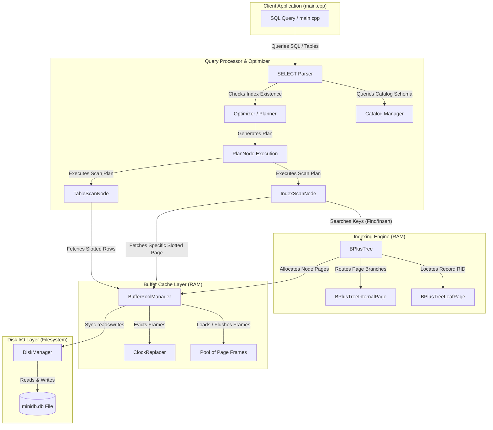

# MiniDB Project Milestone Tracker & Roadmap

**Team Name:** Team_NoClarity  
**Team Members:**  
- **Rachit S** (Roll Number: `24bcs10139`, Email: `vangsur68@gmail.com`)

---

## 1. Project Overview & Extension Track
MiniDB is a transactional relational database built from foundational components.
- **Chosen Extension Track:** **Track B — Concurrency (MVCC)** (Implementing Multi-Version Concurrency Control visibility rules and transaction isolation on top of storage/locking).

---

## 2. Milestone Log

### 🏁 Milestone 1: Foundational Storage & Cache (Completed)
- **Objective:** Implement a thread-safe disk-block manager, slotted-page record storage formatting, and a Clock/Second-Chance buffer pool cache.
- **Key Achievements:**
  - Designed the `DiskManager` mapping logical 4KB pages to physical offsets.
  - Implemented the `SlottedPage` parsing raw bytes in-place to support insertion, deletion, and index-stable compaction.
  - Coded the `ClockReplacer` using a scanning clock hand to identify unpinned eviction victims.
  - Structured the `BufferPoolManager` cache layer coordinating disk file reads/writes with memory page allocations.

### 🏁 Milestone 2: B+ Tree Indexing & Parser Connection (Completed)
- **Objective:** Implement a concurrent, in-page B+ Tree indexing engine and connect it with a query planner/optimizer to support Index Scans.
- **Key Achievements:**
  - Coded the template-based `BPlusTree` managing node pages entirely within 4KB memory blocks without direct heap allocations (`new`).
  - Implemented the **Latch Crabbing Protocol** using reader-writer locks on individual frames for concurrent search (hand-over-hand reader locks) and insertion/deletion (parent writer locks).
  - Designed a mock `Catalog` tracking tables, slotted pages, and associated B+ Tree indexes.
  - Integrated the `Optimizer` to perform cost estimation and selectivity heuristics, automatically choosing between **Table Scans** and **Index Scans** during query execution.

---

## 3. MiniDB Architecture Evolution

As the system evolves through each milestone, more components are integrated into the database engine.

### Milestone 2 Evolving Architecture Diagram

---

## 4. Component Details (Milestone 2)

### A. B+ Tree Page In-Page Casting
No B+ Tree node may allocate dynamic heap memory using `new` for storage. Instead, nodes reside in the `char data_[4096]` array of a `Page` requested from the `BufferPoolManager`. 
- **`BPlusTreePage` (Header):** Base class storing type (leaf/internal), current size, max capacity, and parent page ID link.
- **`BPlusTreeInternalPage`:** Manages parent routing keys. The slot array consists of contiguously casted `std::pair<KeyType, page_id_t>`. Element `array_[0].second` acts as `value_0` (leftmost child pointer), while other keys/values route key boundaries.
- **`BPlusTreeLeafPage`:** Stores data mappings as `std::pair<KeyType, ValueType>` where `ValueType` is `RID`. The leaf also tracks a `next_page_id_` pointer to maintain sequential link lists for range queries.

### B. Latch Crabbing Protocol (Concurrency)
To prevent thread conflicts during tree reorganization (page splits or merges), the B+ Tree employs a crabbing locking protocol using reader-writer locks (`std::shared_mutex` and `RLock/WLock` on frames):
1. **Search (`Find`):** Hand-over-hand reader locks (`std::shared_lock`). Descend from root. Lock child frame in shared mode, then immediately release parent frame reader lock.
2. **Insertion (`Insert`):** Exclusive writer locks (`std::unique_lock`). Descend keeping a list of locked parents. If a visited child page is safe (will not overflow: `size < max_size - 1`), release all parent writer locks immediately to unblock concurrent operations.

### C. Optimizer Plan Selection (Selectivity & Cost Estimation)
- **Table Scan:** Checks every record on every slotted page in the table. Running cost is $O(N)$ pages.
- **Index Scan:** Lookups the filter key in the B+ Tree in $O(\log N)$ steps, retrieves the RIDs, and fetches only the specific pages hosting the results.
- **Optimizer Heuristic:** The optimizer checks if a B+ Tree index is registered on the searched column in the Catalog. If an index is found for an equality check (low selectivity), the planner picks the `IndexScanNode`. If no index is present, it falls back to `TableScanNode`.

---

## 5. Milestone 2 Verification Log
- **Direct B+ Tree unit testing:** Insertion triggers correct page splitting and Promotions to parent nodes. Search operations correctly return mapped RIDs. Key deletes trigger redistribution or node merging.
- **Optimizer & Scan validations:** Demonstrated that the optimizer successfully chooses `IndexScan` over `TableScan` when an index is active, achieving precise record projection.
