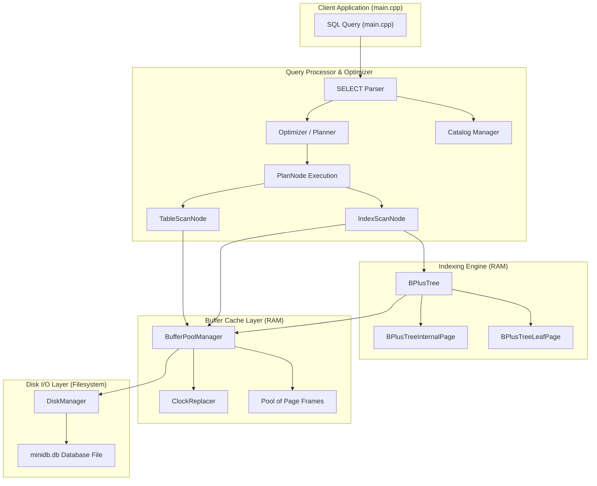

# MiniDB Project Milestone Tracker & Roadmap

**Team Name:** Team_NoClarity  
**Team Members:**  
- **Rachit S** (Roll Number: `24bcs10139`, Email: `vangsur68@gmail.com`)

---

## 1. Project Overview & Extension Track
MiniDB is a transactional relational database built from foundational components.
- **Chosen Extension Track:** **Track B — Concurrency (MVCC)** (Implementing Multi-Version Concurrency Control visibility rules and transaction isolation on top of storage/locking).

---

## 2. Milestone Log

### 🏁 Milestone 1: Foundational Storage & Cache (Completed)
- **Objective:** Implement a thread-safe disk-block manager, slotted-page record storage formatting, and a Clock/Second-Chance buffer pool cache.
- **Key Achievements:**
  - Designed the `DiskManager` mapping logical 4KB pages to physical offsets.
  - Implemented the `SlottedPage` parsing raw bytes in-place to support insertion, deletion, and index-stable compaction.
  - Coded the `ClockReplacer` using a scanning clock hand to identify unpinned eviction victims.
  - Structured the `BufferPoolManager` cache layer coordinating disk file reads/writes with memory page allocations.

### 🏁 Milestone 2: B+ Tree Indexing & Parser Connection (Completed)
- **Objective:** Implement a concurrent, in-page B+ Tree indexing engine and connect it with a query planner/optimizer to support Index Scans.
- **Key Achievements:**
  - Coded the template-based `BPlusTree` managing node pages entirely within 4KB memory blocks without direct heap allocations (`new`).
  - Implemented the **Latch Crabbing Protocol** using reader-writer locks on individual frames for concurrent search (hand-over-hand reader locks) and insertion/deletion (parent writer locks).
  - Designed a mock `Catalog` tracking tables, slotted pages, and associated B+ Tree indexes.
  - Integrated the `Optimizer` to perform cost estimation and selectivity heuristics, automatically choosing between **Table Scans** and **Index Scans** during query execution.

---

## 3. MiniDB Architecture Evolution

As the system evolves through each milestone, more components are integrated into the database engine.

### Milestone 2 Evolving Architecture Diagram


---

## 4. Component Details (Milestone 1)

### A. Disk Manager (`DiskManager`)
- **Responsibility:** Maps logical page IDs to physical 4096-byte blocks on physical storage (`minidb.db`).
- **APIs & Core Fields:**
  - `AllocatePage() -> page_id_t`: Increments page ID counter and writes a zero-padded page at the end of the file.
  - `WritePage(page_id, data)` / `ReadPage(page_id, data)`: Moves file pointer to `page_id * PAGE_SIZE` and performs binary `read`/`write`.

### B. Slotted Page Layout (`SlottedPage`)
- **Responsibility:** In-place formatting of individual 4KB pages to support dynamic-length tuples without internal fragmentation.
- **Physical Layout of a Slotted Page:**
  ```
  +----------------------+-----------------------------+-----------------------------+-----------------------------+
  |  Slot Count (2B)     |  Free Space Pointer (2B)    |  Slot 0: Offset, Length (4B)|  Slot 1: Offset, Length (4B)|
  +----------------------+-----------------------------+-----------------------------+-----------------------------+
  |                       Slots grow forward --->                                                                  |
  +----------------------------------------------------------------------------------------------------------------+
  |                                                                                                                |
  |                                     <--- Tuples grow backward                                                  |
  +----------------------------------------------------------------------------------------------------------------+
  |                      | Tuple 1 (Length bytes)      | Tuple 0 (Length bytes)                                    |
  +----------------------+-----------------------------+-----------------------------+-----------------------------+
                         |                             |                             |
                         v                             v                             v
                   Free Space Pointer                Slot 1                        Slot 0
  ```
- **Header Parsing (Offset Mapping):**
  - **Slot Count:** Bytes `0-1` (`uint16_t`).
  - **Free Space Pointer:** Bytes `2-3` (`uint16_t`). Initialized to `PAGE_SIZE` (4096).
  - **Slot Array:** Starts at byte `4`. Each element consists of `offset` (2 bytes) and `length` (2 bytes).
- **Core Operations:**
  - **Insertion:** Deducts tuple length from Free Space Pointer (FSP). The tuple is written at the new FSP. A new slot is appended at the slot array.
  - **Deletion:** Sets slot length to `TOMBSTONE` (`0xFFFF`).
  - **Compaction:** Resolves fragmentation by sliding all active (non-tombstoned) tuples to the end of the page and updating their slot offsets, reclaiming space.

### C. Clock Replacer (`ClockReplacer`)
- **Responsibility:** Implements clock page eviction policy for buffer pool frames.
- **Core Design:**
  - Tracks frame status in a circular queue.
  - If a frame is unpinned, it is candidate for eviction.
  - The clock hand scans frames: if the reference bit is `true`, it is set to `false` (giving it a second chance); if `false`, the frame is evicted (`Victim`).

### D. Buffer Pool Manager (`BufferPoolManager`)
- **Responsibility:** Coordinates physical I/O with page frames loaded in memory.
- **Core Design:**
  - Maintains a pool of `Page` objects, mapping `page_id_t` to `frame_id_t` via a hash table.
  - Tracks page pins (`pin_count`) and dirty flags (`is_dirty`).
  - Fetches or creates pages from disk, utilizing the `ClockReplacer` to determine eviction victims when all frames are full. Writes dirty pages back to disk before reuse.

---

## 5. Component Details (Milestone 2)

### A. B+ Tree Page Header & Hierarchy (`BPlusTreePage`)
All B+ Tree nodes (internal or leaf) reside completely inside a 4096-byte page. There are no heap allocations (`new`). A pointer to a raw page's `data_` is cast in-place.
- **`BPlusTreePage` (Header Layout):**
  - Base class defining the common metadata structure.
  - Fields:
    - `page_type_` (4 bytes enum): `LEAF` (0) or `INTERNAL` (1).
    - `size_` (4 bytes int): Current number of items stored.
    - `max_size_` (4 bytes int): Maximum capacity of the node.
    - `parent_page_id_` (4 bytes `page_id_t`): ID of parent page (or `INVALID_PAGE_ID` for root).
  - **Header Size:** Exactly 16 bytes.

### B. Memory Layout & Key-Value Storage
Key-value pairs are stored in a contiguous array inside the page layout to ensure maximum cache-locality and zero heap allocations.

#### 1. Internal Page Layout (`BPlusTreeInternalPage`)
- **Array Content:** Maps routing keys to child page IDs: `std::pair<KeyType, page_id_t> array_[1]`.
- **Physical Layout:**
  ```
  +------------------+------------+---------------+----------------------+
  |  page_type_ (4B) | size_ (4B) | max_size (4B) | parent_page_id_ (4B) |
  +------------------+------------+---------------+----------------------+
  |                     Header Offset 0-15 Bytes                         |
  +----------------------------------------------------------------------+
  | array_[0] (unused key, value_0) | array_[1] (key_1, value_1) | ...   |
  +----------------------------------------------------------------------+
  |         Key-Value (Routing) Array (Starts at Offset 16 Bytes)         |
  +----------------------------------------------------------------------+
  ```
- **Mapping Specifications:**
  - Starts at byte offset **16**.
  - `array_[0].second` represents the leftmost child pointer (`value_0`). The key `array_[0].first` is ignored.
  - Subsequent elements `array_[1] ... array_[size-1]` map boundary keys to their respective child pages.

#### 2. Leaf Page Layout (`BPlusTreeLeafPage`)
- **Array Content:** Maps searchable keys to record identifiers: `std::pair<KeyType, RID> array_[1]`.
- **Physical Layout:**
  ```
  +------------------+------------+---------------+----------------------+--------------------+
  |  page_type_ (4B) | size_ (4B) | max_size (4B) | parent_page_id_ (4B) |  next_page_id_ (4B)|
  +------------------+------------+---------------+----------------------+--------------------+
  |                                Header Offset 0-19 Bytes                                   |
  +-------------------------------------------------------------------------------------------+
  | array_[0] (key_0, RID_0) | array_[1] (key_1, RID_1) | array_[2] (key_2, RID_2) | ...            |
  +-------------------------------------------------------------------------------------------+
  |               Key-Value (Data) Array (Starts at Offset 20 Bytes)                          |
  +-------------------------------------------------------------------------------------------+
  ```
- **Mapping Specifications:**
  - The leaf page introduces `page_id_t next_page_id_` (4 bytes, starting at byte offset 16) to link leaf nodes for sequential scans.
  - The key-value array starts at byte offset **20**.
  - Stores up to `max_size` contiguous key-value pairs mapping keys directly to the physical storage `RID` (page_id, slot_num).

### C. Concurrency: Latch Crabbing Protocol
To coordinate concurrent access safely, MiniDB uses frame reader-writer locks (`Page::RLock()` and `Page::WLock()`):
- **Search (`Find`):** Acquires `RLock` on root. Descends to child, acquires `RLock` on child, and immediately releases `RLock` on the parent.
- **Modification (`Insert` / `Remove`):** Acquires `WLock` on root. Descends to child and acquires `WLock` on child. If the child is "safe" (will not trigger split or merge on change), all locks held on parents/ancestors are released immediately.

### D. Optimizer & Catalog Integration
- **Catalog:** Maps logical table names to table files and indexes.
- **Optimizer Heuristics:**
  - Evaluates search query filters (e.g. `col = val`).
  - If a B+ Tree index is registered for the filter column, the query optimizer selects the `IndexScanNode` (cost $O(\log N)$ pages).
  - If no index is registered, it falls back to a full `TableScanNode` scanning all pages sequentially (cost $O(N)$ pages).

---

## 6. Verification Logs

### 🏁 Milestone 1 Verification
Tests verify physical block writing, slotted-page storage management, stable-index record compaction, clock eviction, and dirty frame flushing.
- **Disk Manager Persistence:** Writes distinct pages, re-opens file, and asserts data integrity.
- **Slotted Page Record Operations:** Inserts three tuples, deletes the middle tuple (confirming it is tombstoned), and compacts the page. Validated that slot index lookup remains stable for remaining tuples post-compaction.
- **Buffer Pool Manager Eviction:** Sets pool size to 3. Fills all 3 pages, unpins them, and requests a 4th page. Asserts that page 0 is evicted by Clock Replacer. Validates that fetching page 0 successfully loads it back from physical storage.

### 🏁 Milestone 2 Verification
Tests verify B+ Tree structural operations (key routing, page splits/merges, latch concurrency), and Optimizer cost-based plan selection.
- **B+ Tree Structural Tests:** Sequential insertions trigger leaf page splits and routing key promotions up to parent pages. Successful key removal triggers node borrowing and page merging.
- **Query Optimization & Executions:**
  - **No Index Case:** Optimizer selects `TableScanNode`. Sequentially checks rows, returning correct result.
  - **Index Case:** Catalog registers a B+ Tree index. Optimizer changes execution strategy to `IndexScanNode`. Queries index, gets RID, and fetches the single page containing the record.

### Test Runner Execution Log
```
============================================
      MINIDB CAPSTONE TEST RUNNER (M2)       
============================================
--- Starting Disk Manager Tests ---
[DISK MANAGER SUCCESS] Direct block read, write, and allocation verified.

--- Starting Slotted Page Tests ---
Successfully inserted 3 tuples. Deleting middle tuple (TupleB_Longer)...
Triggering compaction...
[SLOTTED PAGE SUCCESS] Slotted layout insert, delete, and stable-index compaction verified.

--- Starting Buffer Pool Manager Tests ---
Allocating page 4 (Should trigger clock eviction of page 0)...
Fetching page 0 (Should load from disk)...
[BUFFER POOL MANAGER SUCCESS] Eviction, cache hits/misses, and dirty writeback verified.

--- Starting B+ Tree Indexing Tests ---
Inserting keys step-by-step...
Testing deletion borrows and merges...
[B+ TREE SUCCESS] Key insertion, splits, lookups, and deletions verified.

--- Starting Query Engine & Optimizer Tests ---

Executing Query: SELECT * FROM students WHERE id = 2 (NO INDEX)
[OPTIMIZER] No index found on column 'id'. Falling back to TableScan (Est. Cost: O(N)).
[SUCCESS] TableScan executed correctly. Result: Bob

Creating B+ Tree Index on 'id'...

Executing Query: SELECT * FROM students WHERE id = 2 (WITH INDEX)
[OPTIMIZER] Index found on column 'id'. Choosing IndexScan (Est. Cost: O(log N)).
[SUCCESS] IndexScan executed correctly. Result: Bob
[QUERY ENGINE SUCCESS] Optimizer plan selection and index-scans verified.

ALL MINIDB MILESTONE 2 TESTS PASSED SUCCESSFULLY!
```
