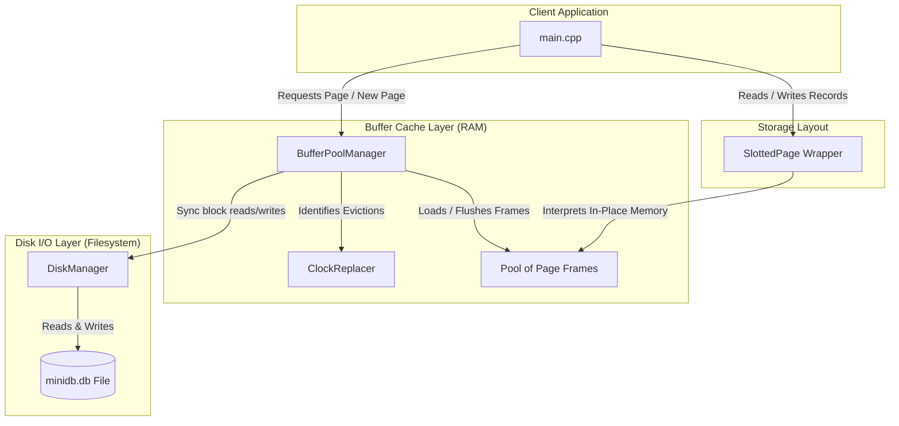

# MiniDB Project Milestone Tracker & Roadmap

**Team Name:** Team_NoClarity  
**Team Members:**  
- **Rachit S** (Roll Number: `24bcs10139`, Email: `vangsur68@gmail.com`)

---

## 1. Project Overview & Extension Track
MiniDB is a transactional relational database built from foundational components.
- **Chosen Extension Track:** **Track B — Concurrency (MVCC)** (Implementing Multi-Version Concurrency Control visibility rules and transaction isolation on top of storage/locking).

---

## 2. Milestone Log

### 🏁 Milestone 1: Foundational Storage & Cache (Completed)
- **Objective:** Implement a thread-safe disk-block manager, slotted-page record storage formatting, and a Clock/Second-Chance buffer pool cache.
- **Key Achievements:**
  - Designed the `DiskManager` mapping logical 4KB pages to physical offsets.
  - Implemented the `SlottedPage` parsing raw bytes in-place to support insertion, deletion, and index-stable compaction.
  - Coded the `ClockReplacer` using a scanning clock hand to identify unpinned eviction victims.
  - Structured the `BufferPoolManager` cache layer coordinating disk file reads/writes with memory page allocations.

---

## 3. MiniDB Architecture Evolution

As the system evolves through each milestone, more components will be integrated into the architecture.

### Milestone 1 Component Architecture

---

## 4. Component Details (Milestone 1)

### A. Disk Manager (`DiskManager`)
The `DiskManager` abstracts physical disk blocks as a sequential array of 4KB logical page frames.
- **Header:** `disk_manager.h`
- **Implementation:** `disk_manager.cpp`
- **Key Methods:**
  - `AllocatePage()`: Thread-safely increments the page count, writes a 4KB null block at the end of the file to physically grow it, and returns the new `page_id_t`.
  - `WritePage(page_id, data)`: Moves the stream pointer to `page_id * 4096` using `seekp` and writes exactly 4KB.
  - `ReadPage(page_id, data)`: Moves the stream pointer to `page_id * 4096` using `seekg` and reads exactly 4KB.

### B. Slotted Page Layout (`SlottedPage`)
Translates raw `char data_[4096]` into a variable-length record slots manager without allocating extra memory blocks (performs direct pointer casting).
- **Format:**
  - Bytes `0-1`: `slot_count` (uint16_t)
  - Bytes `2-3`: `free_space_pointer` (uint16_t, starts at 4096)
  - Bytes `4+`: Slot array of `Slot { uint16_t offset; uint16_t length; }` growing downwards.
  - Page End: Tuple records growing upwards.
- **Defragmentation (`CompactPage`):**
  - Deleted records are marked with a tombstone offset (`0xFFFF`).
  - When contiguous free space is exhausted, `CompactPage` collects all active records, packs them tightly from byte 4095 backwards, and updates their corresponding offsets, preserving the slot array indices.

### C. Clock Replacer (`ClockReplacer`)
Tracks unpinned page frames in memory to identify eviction candidates.
- **Attributes:**
  - `in_replacer_`: Boolean array tracking if a frame is unpinned.
  - `ref_flags_`: Reference bits for second-chance evaluation.
  - `clock_hand_`: Scans frames circularly.
- **Eviction (`Victim`):**
  - If a frame has `ref_flag == true`, it is given a second chance (flag cleared to `false`, hand advances).
  - If `ref_flag == false`, the frame is selected as the victim and evicted.

### D. Buffer Pool Manager (`BufferPoolManager`)
Integrates the `DiskManager` and `ClockReplacer` to manage page caching in RAM.
- **Key Methods:**
  - `FetchPage(page_id)`: Cache lookup. On a cache miss, it uses `ClockReplacer` to select an eviction victim, flushes the victim to disk if dirty, reads the new block from the filesystem, and pins the frame.
  - `UnpinPage(page_id, is_dirty)`: Decrements the frame pin count. If the pin count reaches 0, the frame is marked as an eviction candidate in `ClockReplacer`.
  - `FlushPage(page_id)`: Forces a synchronous disk write if the page is dirty.

---

## 5. Design Trade-offs & Decisions (Milestone 1)

1. **In-Place Slotted-Page Memory Allocation:**
   - Instead of heap allocating structured C++ structs and serializing them, `SlottedPage` casts the raw `char[PAGE_SIZE]` directly to slot arrays. This provides native speed matching production systems.
2. **Stable Record IDs (RID):**
   - RIDs use logical offsets `(page_id, slot_index)`. When tuples are deleted, the space becomes fragmented. Calling `CompactPage()` defragments the storage by packing tuples while keeping their slot array indexes stable. This ensures indices referencing these records are not broken during defragmentation.
3. **Double-Buffering & Eviction Safety:**
   - Eviction of page frames is strictly bounded by pinning. Pinned pages are completely hidden from the `ClockReplacer` candidates list, ensuring in-use frames are never overwritten.
