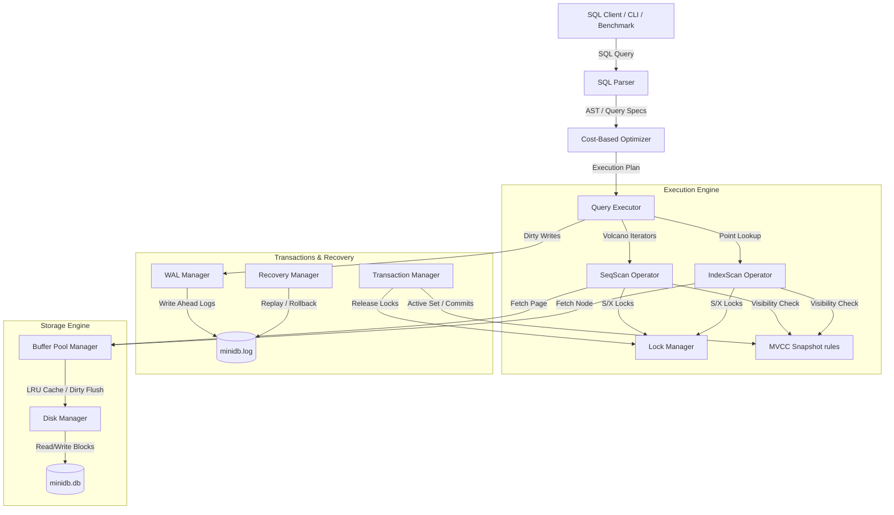

# MiniDB — Relational Database System (Team_OrionDB)

MiniDB is a functioning relational database system built from foundational components, implementing a page-based storage engine, a disk-backed B+ tree index, a SQL query parser and executor (Volcano iterator model), a cost-based query optimizer, transaction management (Strict 2PL and MVCC snapshot isolation), and ARIES-style WAL recovery.

This project was developed for the Advanced DBMS Capstone Project. We chose **Track B (Concurrency - MVCC)** as our extension track, replacing 2PL with multi-version snapshot isolation and comparing their throughput and latency under concurrent read-write workloads.

---

## Team Information
- **Team Name**: Team_OrionDB
- **Members**:
  - Vedanshu Nishad (Roll Number: 24BCS10285, Email: vedanshu.24bcs10285@sst.scaler.com)
  - Amitabh Panda (Roll Number: 24BCS10104, Email: amitabh.24bcs10104@sst.scaler.com)

---

## 1. Project Overview
The objective of MiniDB is to design, integrate, and benchmark a functional database engine that replicates the core internal subsystems of industrial database systems.
- **Goals**: Demonstrate system correctness (durability, atomicity, locking, transaction isolation) while analyzing the trade-offs of MVCC snapshot isolation versus traditional Strict 2PL.
- **Chosen Track**: **Track B (Concurrency)**. Rather than just replacing 2PL, we implemented *both* Strict 2PL and MVCC as configurable engine modes, enabling direct comparison via automated benchmarks.

---

## 2. System Architecture & Data Flow



---

## 3. Storage Layer
- **Disk Manager**: Directly interfaces with a binary file `minidb.db`. Reads and writes pages of size 4096 bytes.
- **Page Format (Slotted Page)**:
  - **Header (20 bytes)**:
    - `page_id` (4 bytes): Unique identifier.
    - `lsn` (8 bytes): Log Sequence Number of the last update to this page.
    - `num_slots` (2 bytes): Total records inside this page.
    - `free_space_offset` (2 bytes): Points to the boundary of the lowest record. Free space grows downwards from the header, and records grow upwards from the page bottom.
    - `next_page_id` (4 bytes): Pointer to the next page in the heap file list.
  - **Slot Entry (5 bytes)**: `offset` (2 bytes) + `length` (2 bytes) + `flags` (1 byte: 1=active, 0=deleted).
- **Tuple Format**: Each slotted page record consists of a header:
  - `xmin` (4 bytes): Transaction ID that created the record.
  - `xmax` (4 bytes): Transaction ID that deleted or updated the record.
  - `payload`: Binary-packed column values (using length-prefixed strings for VARCHAR and 4-byte integers).
- **Buffer Pool**: Implements a cache holding up to `pool_size` pages in memory. It tracks page `pin_count` (concurrent access pins) and `dirty` status. It uses an **LRU eviction policy** for unpinned pages and enforces the **Write-Ahead Logging (WAL)** rule: flushing log records up to the page's LSN to disk *before* writing the page to the database file.

---

## 4. Indexing (B+ Tree)
- **Design**: A disk-based B+ Tree where every node is serialized into a 4096-byte database page, managed via the `BufferPoolManager`.
- **Node Structure**:
  - **Header**: `is_leaf` (1 byte), `num_keys` (2 bytes), `parent_page_id` (4 bytes), and `next_page_id` (4 bytes, links sibling leaf nodes for range scans).
  - **Internal Nodes**: Store up to `MAX_KEYS` keys and `MAX_KEYS + 1` child page pointers.
  - **Leaf Nodes**: Store up to `MAX_KEYS` keys and `MAX_KEYS` values (Record IDs pointing to `(page_id, slot_id)` in the heap file).
- **Search Path**: Traverses from root to leaf by comparing search keys against keys in internal nodes.
- **Insert/Delete**: Supports key insertion, handles node splitting recursively upwards when keys exceed capacity, and utilizes lazy deletion (removing keys from leaf nodes without aggressive leaf merging).

---

## 5. Query Execution
- **SQL Parser**: Utilizes regex-based pattern matching to convert SQL strings into query parameters.
- **Physical Operators**: Volcano iterator model where each operator implements:
  - `init()`: Resets scanner pointers or initializes children iterators.
  - `next()`: Evaluates and streams a single tuple up the tree.
  - `close()`: Cleans up pages and pins.
- **Available Operators**:
  - `SeqScanOperator`: Sequentially reads heap pages and slots.
  - `IndexScanOperator`: Performs point lookup on the primary key via the B+ Tree.
  - `FilterOperator`: Evaluates predicates on incoming tuple streams.
  - `ProjectOperator`: Selects and formats columns.
  - `NestedLoopJoinOperator`: Performs streaming nested loop joins.
  - `InsertOperator`/`DeleteOperator`: Appends records to pages or updates xmin/xmax, updating indexes and logging WAL.

---

## 6. Optimizer
Our Cost-Based Optimizer (CBO) uses statistics to estimate costs and choose optimal query plans:
- **Selectivity Estimation**: For numeric columns, selectivity of filters (`=`, `>`, `<`, etc.) is estimated using column min, max, and unique value counts.
- **Access Path Selection**: Compares estimated page reads and processing costs:
  - $\text{SeqScanCost} = (\text{num\_pages} \times 10) + (\text{num\_rows} \times 1)$
  - $\text{IndexScanCost} = ((\text{tree\_height} + 1) \times 10) + (1 \times 1)$
  - The optimizer selects the scan operator with the lower cost.
- **Join Order Selection**: Evaluates the cost of $A \bowtie B$ vs $B \bowtie A$. If the inner join condition is on the primary key, it plans an **Index Nested Loop Join** (drastically reducing the inner scan cost from a SeqScan to an IndexScan).

---

## 7. Transactions & Concurrency
- **Strict 2PL**:
  - **Lock Manager**: Provides Shared (S) and Exclusive (X) locks on RecordIDs.
  - **Deadlock Handling**: Uses a **Wait-For Graph** cycle detector running a Depth-First Search (DFS) search. When a lock request blocks, it checks for cycles; if found, it aborts the younger transaction.
- **MVCC (Track B)**:
  - **Snapshot Visibility**: Transactions read from a snapshot captured at `begin()`. A record is visible if `xmin` (creator) is committed before the snapshot started, and `xmax` (deleter) is not committed (or was committed after the snapshot started).
  - **Write-Write Conflict Prevention**: Writers acquire row-level Exclusive locks. If a transaction attempts to modify a row that was updated/deleted by another committed transaction after its start, it aborts (Snapshot Isolation conflict).

---

## 8. Recovery
- **WAL Design**: Logs transactions to `minidb.log`. Log record types: `BEGIN`, `COMMIT`, `ABORT`, and `UPDATE`. Update records contain the page ID, offset, before-image (undo), and after-image (redo) bytes.
- **Crash Recovery (ARIES)**:
  - **Analysis Phase**: Scans log forward to identify active "loser" transactions at the crash point.
  - **Redo Phase**: Replays all log records forward to repeat history and restore dirty pages.
  - **Undo Phase**: Scans backward and rolls back changes of loser transactions by applying before-image bytes, logging CLRs, and writing `ABORT` markers.

---

## 9. Extension Track — Concurrency (MVCC)
- **Motivation**: Traditional 2PL blocks readers during writes, limiting read throughput. MVCC provides non-blocking reads via snapshot isolation.
- **Visibility & Version Chains**: Implemented PostgreSQL-style row versioning directly in slotted pages using `xmin` and `xmax` metadata headers. A tuple is visible to a transaction if `xmin` (creator) committed before the transaction's snapshot and `xmax` (deleter) is either 0 (not deleted) or committed after the snapshot.
- **Write-Write Conflict Prevention**: Writers acquire row-level Exclusive locks. If a transaction attempts to modify a row already modified by a concurrent committed transaction, it aborts (Snapshot Isolation conflict).
- **Implementation**: Both Strict 2PL and MVCC are implemented as configurable engine modes (`is_mvcc` flag), enabling direct A/B comparison via automated benchmarks.

---

## 10. Benchmarks

### Experimental Setup
- **Workload**: 100 accounts initialized with 1000 balance each.
- **Workers**: 4 reader threads (point SELECT queries) + 2 writer threads (transfer transactions: read 2 accounts, delete + re-insert both with modified balances).
- **Duration**: 5 seconds per mode.
- **Environment**: Linux, Python 3.14, multi-threaded (GIL-limited).

### Results

| Metric | Strict 2PL | MVCC | Ratio (2PL/MVCC) |
| :--- | :---: | :---: | :---: |
| Total Completed Transactions | 663 | 440 | 1.51x |
| Throughput (TPS) | 132.60 | 88.00 | 1.51x |
| Avg Read Latency | 32.27 ms | 53.63 ms | 1.66x |
| Avg Write Latency | 76.65 ms | 134.53 ms | 1.76x |
| Abort Count | 7 | 1 | — |

### Analysis
- **2PL outperformed MVCC** in this write-heavy (33% writes) workload. Both modes require exclusive locks for writes, so MVCC's non-blocking read advantage is diminished.
- MVCC's DELETE+INSERT creates new tuple versions, increasing page fragmentation and scan costs. 2PL's hard-delete keeps pages compact.
- MVCC significantly reduces aborts (1 vs 7) by eliminating reader-writer deadlocks.
- MVCC is expected to outperform 2PL in **read-dominated** workloads (90%+ reads) where lock contention is the primary bottleneck.

> The full auto-generated report is in `benchmarks/benchmark_report.md`. Run `python benchmarks/run_benchmarks.py` to regenerate.

---

## 11. Limitations & Future Scope
- **Storage**: No automatic background page compaction (purging soft-deleted tuples).
- **Index**: Secondary indexes are not yet integrated.
- **Optimizer**: Does not support histogram-based selectivity.
- **SQL Parser**: Supports basic SELECT, JOIN, INSERT, and DELETE; complex subqueries and aggregates are not supported.

---

## 12. How to Run

### Setup and Requirements
- **Python**: Version 3.8+ (no third-party dependencies required; uses standard libraries like `struct`, `threading`, `unittest`).

### Command-line Console
Run the interactive console showcasing the optimizer plans, deadlock cycle resolution, MVCC snapshot isolation, and crash recovery:
```powershell
python MiniDB_Projects/Team_OrionDB/main.py
```

### Running Automated Test Suite
To verify the database components:
```powershell
python -m unittest MiniDB_Projects/Team_OrionDB/tests/test_all.py
```

### Running Performance Benchmarks
To run concurrent read-write tests comparing 2PL vs MVCC:
```powershell
python MiniDB_Projects/Team_OrionDB/benchmarks/run_benchmarks.py
```
