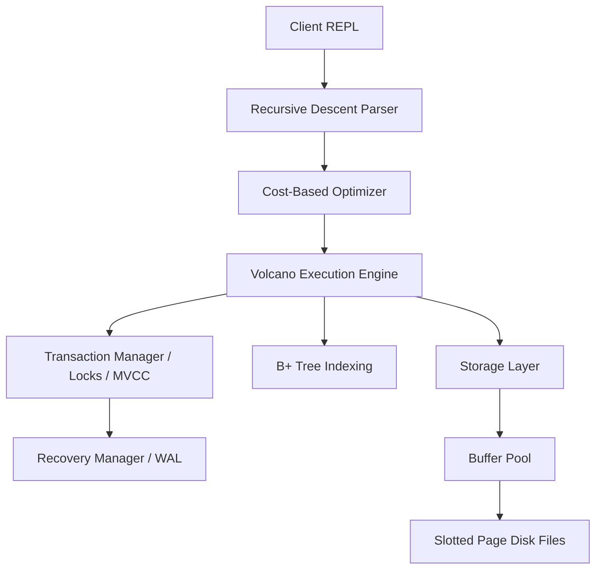

# MiniDB System Architecture

This document describes the high-level architecture, subsystem interactions, and design choices made for **MiniDB**, a relational database engine written from scratch in Python.

## Architectural Overview

MiniDB is structured into independent layers resembling a production relational database management system:

---

## 1. Storage Subsystem

The storage subsystem manages how records are organized inside files on disk and cached in memory.

*   **Slotted Page (`storage/page.py`)**: Stores records inside 4KB pages. Each page has a 16-byte header storing meta-information (page ID, slot count, free space offset, flags). A slot directory grows *forwards* from the end of the header, and record payloads grow *backwards* from the end of the page. This prevents fragmentation and allows variable-length records (JSON-encoded bytes).
*   **Heap File (`storage/heap_file.py`)**: Represents a table as a sequence of pages on disk (one `.db` file per table). It handles inserting records into pages with sufficient space, fetching page data blocks from disk, and sequential table scans.
*   **Buffer Pool (`storage/buffer_pool.py`)**: Caches up to 10 pages in memory. It uses an **LRU (Least Recently Used)** eviction policy. Pinned pages (pages currently being read/written by operators) are locked in the pool and never evicted. When a dirty page is evicted, it is flushed to disk. It enforces the **Write-Ahead Logging (WAL)** rule by ensuring that the WAL log file is flushed to disk before any dirty data page is written.

---

## 2. B+ Tree Indexing Subsystem

MiniDB uses a disk-persisted B+ Tree for indexing table records.

*   **B+ Tree Index (`indexing/bplus_tree.py`)**: An Order-4 (maximum 4 keys per node) B+ tree. Leaves store mappings from keys to record identifiers `(page_id, slot_id)`. Internal nodes store routing keys and child node references.
*   **Splits and Merges**: Handles leaf and internal splits when a node exceeds 4 keys during insertion. Handles key borrows and merges during deletions when keys fall below minimum capacity.
*   **Doubly-Linked Leaves**: All leaf nodes are linked in a doubly-linked list. This enables highly efficient range scans (`range_scan(low, high)`).
*   **Disk Persistence**: Indexes are serialized to `.idx` JSON files. Circular leaf references are reconstructed dynamically during deserialization, preventing circular reference serialization errors.

---

## 3. SQL Parser Subsystem

*   **SQL Parser (`parser/sql_parser.py`)**: A hand-written recursive descent SQL parser. It does not use any external parser libraries.
*   **AST Generation**: Tokenizes SQL strings and recursively constructs Abstract Syntax Tree (AST) nodes for `CreateTable`, `Insert`, `Select`, `Delete`, `BeginTxn`, `CommitTxn`, and `RollbackTxn`.

---

## 4. Query Execution Engine

*   **Volcano Iterator Model (`executor/operators.py`, `executor/executor.py`)**: All physical operators implement the standard Iterator interface:
    *   `open()`: Prepares the scan or child iterators.
    *   `next()`: Computes and returns the next row (a dictionary mapping columns to values) or `None` on exhaustion.
    *   `close()`: Cleans up resources.
*   **Operators**: Implements `SeqScan`, `IndexScan` (evaluates exact and range keys), `Filter` (applies predicates), `Projection` (filters output columns), `NestedLoopJoin` (correlates two tables), `Insert`, and `Delete`.

---

## 5. Cost-Based Optimizer

The query optimizer uses database catalog statistics to select the most efficient physical plans.

*   **Statistics**: Stores table row count and column-level properties (min value, max value, and distinct value set).
*   **Selectivity Estimation**:
    *   Equality (`col = val`): `1 / num_distinct_values`
    *   Range (`col > val`): `(max - val) / (max - min)`
*   **Costing & Rules**:
    *   `SeqScan cost = num_pages`
    *   `IndexScan cost = log2(num_rows) + selectivity * num_rows`
    *   If an index exists on the predicate column and `IndexScan cost < SeqScan cost`, the optimizer chooses `IndexScan`.
*   **Join Optimization**: Evaluates join orders for 2-table joins (A JOIN B vs B JOIN A) and chooses the sequence with the lowest estimated total cost.

---

## 6. Transaction & Concurrency Subsystem

MiniDB supports two distinct concurrency control modes:

### Strict Two-Phase Locking (2PL)
*   **Lock Manager (`transactions/lock_manager.py`)**: Manages table-level and row-level Shared (Read) and Exclusive (Write) locks. It blocks incompatible lock requests using condition variables.
*   **Deadlock Detection**: Builds a dynamic **Waits-for Graph** and runs DFS cycle detection. If a cycle is detected, it aborts the youngest transaction (highest transaction ID) to break the deadlock.
*   **Transaction Manager (`transactions/transaction_manager.py`)**: Ensures strict 2PL by holding all acquired locks until `COMMIT` or `ROLLBACK`.

### Multi-Version Concurrency Control (MVCC)
*   **Versioning (`extension/mvcc.py`)**: Each record payload is wrapped in a version metadata structure:
    *   `created_by_txn`: Transaction ID that inserted it.
    *   `deleted_by_txn`: Transaction ID that deleted it.
    *   `begin_ts`: Transaction ID timestamp when it became valid.
    *   `end_ts`: Transaction ID timestamp when it was invalidated.
*   **Snapshot Isolation Visibility**: Uses transaction snapshot timestamps to check if a record version is visible. Readers never block writers, and writers never block readers.
*   **Write-Conflict Detection**: Implements first-committer-wins. If a transaction attempts to update/delete a record modified by a concurrent active or committed transaction, it aborts.
*   **Garbage Collection**: Periodically scans the buffer pages and physically removes record versions that are no longer visible to any active transaction (i.e., deletion timestamp is older than the minimum active transaction snapshot).

---

## 7. Recovery Subsystem

MiniDB implements Write-Ahead Logging (WAL) and recovery to ensure ACID durability.

*   **WAL Manager (`recovery/wal.py`)**: Appends transaction modifications to an append-only `wal.log` file using JSON formatting. Log records contain LSN, Txn ID, Type, Table, Operation, Old Value, and New Value.
*   **ARIES Recovery (`recovery/recovery_manager.py`)**:
    *   **Analysis Pass**: Scans the log forward to identify transactions that were active (uncommitted) at the time of the crash.
    *   **Redo Pass**: Replays all logged modifications (inserts, updates, deletes) in chronological order to restore the database pages to their exact crash state.
    *   **Undo Pass**: Replays changes of active "loser" transactions in reverse order to rollback uncommitted state.
*   **Checkpoints**: Periodically flushes all dirty buffer pool pages to disk and writes a `CHECKPOINT` record containing active transaction lists to the WAL, shortening recovery times.
