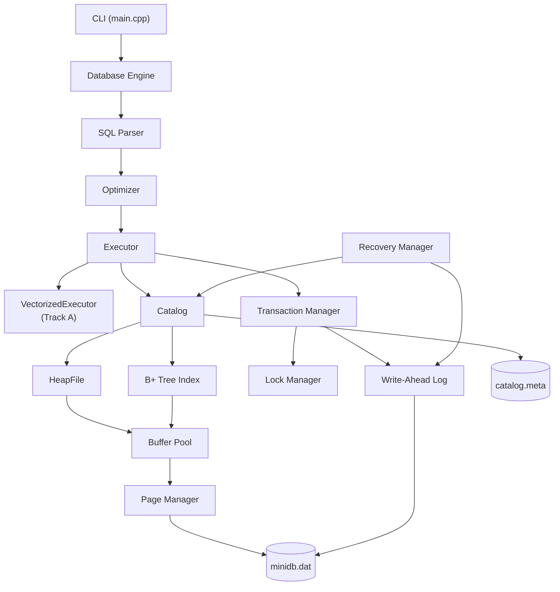

# MiniDB — Team THE BOYS

Advanced DBMS Capstone: a from-scratch relational database engine implemented in **C++17**.

| Field | Details |
|-------|---------|
| **Team Name** | The Boys |
| **Extension Track** | Track A — Performance (Batch / Vectorized Execution) |
| **Submission PR** | `TEAM_THE_BOYS` → [scaler-Adv-DBMS](https://github.com/KnightKnight27/scaler-Adv-DBMS) |

### Team Members

| Full Name | Scaler Email ID | Roll Number |
|-----------|-----------------|-------------|
| Kushal S | kushal.24bcs10355@sst.scaler.com | 10355 |
| Pushkar Desai | Pushkar.24bcs10085@sst.scaler.com | 10085 |
| Azad Abdul | abdul.24bcs10053@sst.scaler.com | 10053 |
| Rama Krishnan | rama.24bcs10087@sst.scaler.com | 10087 |

---

## 1. Project Overview

### Problem Statement

Design and implement a minimal but complete relational database management system that demonstrates core DBMS concepts: durable page-based storage, indexing, query parsing and execution, cost-based optimization, transactional concurrency control, and crash recovery — without relying on an existing database engine.

### Goals

- Build a **page-oriented storage engine** with heap files and an LRU buffer pool.
- Support **B+ tree indexes** on primary keys and optional secondary columns.
- Parse and execute a **SQL subset** (DDL, DML, SELECT with WHERE, JOIN, and aggregation).
- Implement a **cost-based optimizer** that chooses between sequential and index scans.
- Provide **serializable isolation** via strict two-phase locking (2PL).
- Guarantee durability through a **write-ahead log (WAL)** and redo recovery.
- Extend the executor with a **batch execution path** (Track A) and benchmark it against row-at-a-time execution.

### Chosen Extension Track

**Track A — Performance (Batch Execution)**

We added a vectorized-style batch scan path (`VectorizedExecutor`) that processes tuples in batches of 256 rows, filters them in bulk, and compared throughput against the default row-at-a-time executor.

---

## 2. System Architecture

### Architecture Diagram



### Major Modules

| Module | Path | Responsibility |
|--------|------|----------------|
| **Engine** | `src/engine/` | Orchestrates all components; routes SQL to parser, optimizer, executor |
| **Parser** | `src/parser/` | Tokenizes and parses SQL into statement ASTs |
| **Optimizer** | `src/optimizer/` | Builds physical query plans with cost estimates |
| **Executor** | `src/executor/` | Runs physical operators (scan, filter, join, insert, delete) |
| **Vectorized** | `src/executor/vectorized.*` | Batch scan + batch filter (Track A) |
| **Catalog** | `src/catalog/` | Table schemas, heap/index handles, persistence |
| **Storage** | `src/storage/` | Slotted pages, page manager, buffer pool, heap files |
| **Index** | `src/index/` | B+ tree search, insert, delete, split |
| **Transaction** | `src/transaction/` | 2PL lock manager, transaction lifecycle, undo log |
| **Recovery** | `src/recovery/` | WAL append/flush, redo on crash |
| **Common** | `src/common/` | Shared types (`Value`, `Row`, `Rid`, predicates) |

### Data Flow

1. **Query path:** SQL string → `SqlParser` → AST → `Optimizer::Optimize()` → `PlanNode` tree → `Executor` → heap/index access via buffer pool → formatted result rows.
2. **Write path:** INSERT/DELETE → acquire table lock → write heap page → update B+ tree indexes → append WAL record → commit (flush WAL + buffer pool).
3. **Recovery path:** `.recover` → read WAL → identify committed transactions → redo committed INSERTs and DELETEs into heap and indexes.
4. **Persistence path:** on shutdown or after writes, buffer pool flushes dirty pages to `minidb.dat`; catalog metadata saved to `catalog.meta`.

---

## Design Decisions

This section records the main engineering choices we made and the trade-offs behind them. These decisions prioritize **correctness, clarity, and integrability** over feature count.

### Storage & buffer management

| Decision | Choice | Rationale | Trade-off |
|----------|--------|-----------|-----------|
| Page layout | **Slotted pages** (4096 B) | Standard heap organization; supports variable-length rows and in-place slot directory | Tuple compaction not implemented; deleted slots leave holes until page rebuild |
| Heap vs LSM | **Page heap files** | Matches course labs; simpler integration with buffer pool and B+ tree page model | Write amplification on updates; not optimized for heavy insert workloads |
| Replacement policy | **LRU buffer pool** (64 frames) | Easy to reason about; `.stats` exposes hit/miss for demos | Not scan-resistant; large sequential scans can pollute cache |
| Durability flush | **Flush on auto-commit**; batch flush inside `BEGIN…COMMIT` | Avoids flushing every row during bulk load; still durable after `COMMIT` | Explicit multi-statement transactions delay disk flush until commit |

### Indexing

| Decision | Choice | Rationale | Trade-off |
|----------|--------|-----------|-----------|
| Index structure | **B+ tree** (order 32) | Good fan-out; leaf chaining for range scans | Internal split logic is complex; secondary index stores one RID per key (no duplicate-key list) |
| PK vs secondary | **Same B+ tree code** for both | Less code duplication; faster to integrate | Secondary index does not handle many duplicate keys efficiently |
| Index maintenance | **Eager update on INSERT/DELETE** | Keeps indexes consistent with heap at all times | Every write touches index pages; higher write cost |

### Query processing & optimizer

| Decision | Choice | Rationale | Trade-off |
|----------|--------|-----------|-----------|
| Parser | **Hand-written recursive-descent subset** | Transparent, no code-gen dependencies | Limited SQL (no UPDATE, subqueries, prepared statements) |
| Join algorithm | **Nested-loop join** (two tables) | Correct and easy to demonstrate JOIN semantics | O(n×m) cost; poor for large joins without indexes |
| Join ordering | **Smaller table as outer** (by row count) | Reduces inner-loop work; demonstrates join order selection | Only two-table joins; no bushy join DP |
| Selectivity | **Fixed 10% estimate** | Satisfies cost-model requirement with minimal catalog stats | Inaccurate for skewed data; index/scan choice can be suboptimal |
| Scan vs index | **Cost compare** (`SeqScan` vs `IndexScan`) | Shows optimizer routing on PK/secondary equality predicates | Index scan only chosen for single-table equality on indexed columns |
| Aggregates | **Hash grouping + COUNT** | Completes M3 aggregation milestone | No SUM/AVG/MIN/MAX; aggregates + JOIN not supported |

### Transactions & concurrency

| Decision | Choice | Rationale | Trade-off |
|----------|--------|-----------|-----------|
| Isolation | **Strict 2PL** | Serializable by construction; aligns with course material | Coarser than MVCC; readers and writers block at table granularity |
| Lock granularity | **Table-level locks** | Simple lock manager; easy deadlock demo with two resources | Low concurrency on hot tables |
| Deadlock handling | **Wait-for graph + abort** | Detects cycles; fails fast with clear error | No blocking/wait queues; immediate failure instead of waiting |
| Rollback | **In-memory undo log** (insert/delete) | Correct ROLLBACK without full ARIES undo | Undo lost on crash; relies on WAL redo for durability |

### Recovery

| Decision | Choice | Rationale | Trade-off |
|----------|--------|-----------|-----------|
| Logging | **Append-only WAL** with LSN | Standard durability pattern; easy to inspect | Text-oriented log; not binary/compact |
| Recovery model | **Redo committed work** (INSERT + DELETE) | Rebuilds heap/index state after lost data pages | No undo phase; uncommitted work simply absent after crash |
| Idempotent redo | **Skip INSERT if PK exists** | Safe to replay WAL multiple times | Assumes PK uniqueness; duplicate detection via index lookup |
| Catalog on reload | **Re-allocate missing pages** if `minidb.dat` wiped | Enables crash demo: schema survives, data restored from WAL | Page IDs in catalog may change after catastrophic file loss |

### Extension track (Track A — Performance)

| Decision | Choice | Rationale | Trade-off |
|----------|--------|-----------|-----------|
| Execution modes | **Row vs batch+columnar** toggle (`SET EXEC_MODE`) | Clean A/B comparison on same row-store heap | Two code paths to maintain |
| Batch size | **256 rows** (`BATCH_SIZE`) | Amortizes per-row dispatch; SIMD-friendly column layout | Overhead at small scale (see benchmark report) |
| Columnar layer | **In-memory INT column vectors** during batch filter | Demonstrates columnar processing without new on-disk format | Still reads full rows from heap first; not true columnar storage |
| Benchmark design | **Quick (~1s) + full (~15s) modes** | CI-friendly smoke test + multi-scale report | Full benchmark still row-store bound at tested scales |

### Process & architecture

| Decision | Choice | Rationale | Trade-off |
|----------|--------|-----------|-----------|
| Language | **C++17, no external deps** | Full control over memory/layout; portable build | More manual memory and string handling than Rust/modern managed runtimes |
| Interface | **Single-threaded interactive CLI** | Focus on engine internals, not networking | Cannot demo true multi-client concurrency in one process |
| Module boundaries | **Layered packages** (`storage/`, `index/`, `executor/`, …) | Matches course milestones; viva-friendly navigation | Some cross-layer calls (executor → catalog → storage) |

---

## 3. Storage Layer

### Page Format

Each page is **4096 bytes** (`PAGE_SIZE`). We use a **slotted page** layout:

```
┌──────────────────────────────────────────────────────────────┐
│ Header (16 B)                                                │
│   [0..3]  page_id (uint32)                                   │
│   [4..5]  num_slots (uint16)                                 │
│   [6..7]  free_space (uint16)                                │
│   [8..15] LSN (uint64)                                       │
├──────────────────────────────────────────────────────────────┤
│ Tuple area (grows upward from offset 16)                     │
│   Each tuple: 2-byte length prefix + serialized row bytes      │
├──────────────────────────────────────────────────────────────┤
│ Slot directory (grows downward from page end)                │
│   Per slot: 2-byte offset + 2-byte length (0xFFFF = deleted) │
└──────────────────────────────────────────────────────────────┘
```

Rows are serialized as typed values (INT, STRING, NULL) and stored as variable-length tuples. `Page::InsertTuple`, `GetTuple`, and `DeleteTuple` manage slot allocation and free-space tracking.

### Heap Files

A **heap file** is a linked chain of slotted pages managed by `HeapFile`:

- Each table gets a dedicated first page ID stored in the catalog.
- `InsertTuple` tries the current last page; if full, allocates a new page via `PageManager`.
- `GetTuple(Rid)` fetches the page through the buffer pool and reads the slot.
- `ScanAll()` walks pages from `first_page_id` to `last_page_id`, returning all valid RIDs.
- `DeleteTuple` marks a slot as deleted (offset `0xFFFF`) without immediate compaction.

### Buffer Pool

The buffer pool implements **LRU replacement** over a fixed number of frames (default **64 pages**):

- **FetchPage:** on hit, move frame to MRU and increment pin count; on miss, evict LRU unpinned frame (flushing if dirty), read from disk.
- **UnpinPage:** decrement pin count; mark frame dirty if the page was modified.
- **FlushAllPages:** write all dirty frames back to `minidb.dat`.
- Tracks **hit/miss counters** exposed via `.stats`.

Only unpinned frames are eligible for eviction, ensuring active operations retain their pages in memory.

---

## 4. Indexing

### B+ Tree Design

We implement a classic **B+ tree** with fan-out **order = 32** (`kOrder`). Each tree node occupies one page. Keys map to heap **RIDs** (page_id + slot_id).

- **Primary index:** automatically created on `PRIMARY KEY` columns.
- **Secondary index:** created on columns declared with `INDEX`.
- Supports point lookup (`Search`), range scan (`SearchRange`), insert, and delete.

### Node Structure

Each index page stores a 16-byte header followed by serialized keys (and child pointers or RIDs):

**Leaf node header:**
| Offset | Field |
|--------|-------|
| 0 | `is_leaf = 1` |
| 1 | `num_keys` |
| 8..11 | `next_leaf` (for leaf chain) |

**Internal node header:**
| Offset | Field |
|--------|-------|
| 0 | `is_leaf = 0` |
| 1 | `num_keys` |

**Leaf entries:** `[key, Rid]` pairs sorted by key.

**Internal entries:** `[key₀, child₀, key₁, child₁, …, keyₙ₋₁, childₙ₋₁, childₙ]` — the rightmost child pointer follows the last separator key.

### Search Path

1. Start at `root_page_id` (stored in catalog).
2. **Internal node:** binary search keys with `FindChild` — descend to the child whose separator range contains the search key.
3. **Leaf node:** binary search (`std::lower_bound`) for an exact key match; return associated RID.
4. **Range scan:** locate start leaf, walk the leaf chain via `next_leaf`, collect matching RIDs.

**Insert** descends recursively. When a leaf fills (`num_keys == kOrder`), `SplitLeafNode` creates a sibling leaf and promotes the middle key to the parent. Internal splits use `SplitInternalNode`; a new root is created when the old root splits. Child splits propagate upward by inserting the promoted key at the exact child index where the split occurred.

---

## 5. Query Execution

### Parser

`SqlParser` tokenizes and parses a SQL subset into typed statement objects:

| Statement | Example |
|-----------|---------|
| CREATE TABLE | `CREATE TABLE t (id INT PRIMARY KEY, name STRING, dept INT INDEX);` |
| INSERT | `INSERT INTO t (id, name) VALUES (1, 'Alice');` |
| SELECT | `SELECT * FROM t WHERE id = 1;` |
| SELECT + aggregate | `SELECT COUNT(*) FROM t;` / `SELECT dept, COUNT(*) FROM t GROUP BY dept;` |
| SELECT + JOIN | `SELECT * FROM a JOIN b ON a.id = b.a_id;` |
| DELETE | `DELETE FROM t WHERE id = 1;` |
| Transaction | `BEGIN;` / `COMMIT;` / `ROLLBACK;` |
| Meta | `CHECKPOINT;` / `SET EXEC_MODE BATCH;` / `SET EXEC_MODE ROW;` |

Supported types: `INT`, `STRING`. Column modifiers: `PRIMARY KEY`, `INDEX`. Comparison operators: `=`, `!=`, `<`, `<=`, `>`, `>=`.

### Query Plan Generation

The optimizer produces a tree of `PlanNode` objects:

| PlanType | Description |
|----------|-------------|
| `SEQ_SCAN` | Full heap scan + predicate filter |
| `INDEX_SCAN` | B+ tree lookup on indexed equality predicate |
| `NESTED_LOOP_JOIN` | Nested-loop join on two table scans |
| `AGGREGATE` | Hash-based grouping + `COUNT(*)` / `COUNT(col)` over scan input |
| `FILTER` / `PROJECT` | Applied inline during scan execution |

For single-table SELECTs with an equality predicate on a PK or indexed column, the optimizer chooses `INDEX_SCAN`; otherwise `SEQ_SCAN`. For JOIN queries, it builds a `NESTED_LOOP_JOIN` over sequential scans of both tables.

### Operator Execution

`Executor` interprets the plan:

- **SeqScan / IndexScan:** acquire shared table lock → fetch rows from heap or index → apply WHERE predicates → project columns.
- **NestedLoopJoin:** scan left table into memory, for each left row scan right table, match on join columns.
- **Insert:** exclusive table lock → insert into heap → update PK and secondary indexes → WAL log → auto-commit.
- **Delete:** scan/filter matching rows → remove from indexes → delete heap tuples → WAL log.
- **Aggregate:** scan child plan → group rows by `GROUP BY` columns (or single global group) → compute `COUNT(*)` or `COUNT(column)`.

When batch mode is enabled (`SET EXEC_MODE BATCH`), SELECT scans delegate to `VectorizedExecutor::BatchScan`, which reads all tuples then filters in chunks of 256.

---

## 6. Optimizer

### Cost Estimation

The optimizer uses a simple page-based cost model:

| Operation | Cost Formula |
|-----------|-------------|
| Sequential scan | `pages` (default: 50 pages per table) |
| Index scan | `3.0 + selectivity × pages` |
| Nested-loop join | `cost(left) + cost(right) + left_rows × right_rows × 0.001` |

Index scans are preferred when an equality predicate targets a PK or indexed column, because their fixed overhead (`3.0`) plus low selectivity cost beats a full table scan.

### Selectivity Estimation

`EstimateSelectivity()` returns a fixed **10%** selectivity for all predicates. Estimated output rows = `pages × 100 × selectivity` (assuming ~100 rows per page).

This is intentionally simple; a production optimizer would maintain column histograms and table statistics.

### Join Ordering

Currently limited to **two-table JOINs**. The optimizer always places the first table in the FROM clause as the outer (left) relation and the second as the inner (right) relation, both accessed via sequential scan. Join cost includes the cross-product penalty scaled by `0.001`.

Future work: dynamic-programming join ordering for multi-table queries and index-nested-loop joins.

---

## 7. Transactions & Concurrency

### Locking Strategy

We implement **strict two-phase locking (Strict 2PL)** at the **table level**:

| Operation | Lock Mode |
|-----------|-----------|
| SELECT | `SHARED` |
| INSERT / DELETE / CREATE TABLE | `EXCLUSIVE` |

Locks are acquired before the operation and held until **COMMIT** or **ROLLBACK**. Auto-commit transactions (single-statement INSERT/DELETE without explicit `BEGIN`) acquire locks, execute, and commit immediately.

### Isolation Guarantees

Serializable isolation is provided by Strict 2PL: no lock is released before transaction end, preventing write skew and phantom reads at the table level. Because locking is table-granular, concurrent access to different tables is allowed, but concurrent writers/readers on the same table are serialized.

### Deadlock Handling

The `LockManager` tracks a **wait-for graph** (`waits_on_` map). When a lock request cannot be granted, it checks for cycles via graph traversal (`HasDeadlock`). If a cycle is detected, the requesting transaction is **aborted immediately** with a `"Deadlock detected"` error rather than blocking indefinitely.

Explicit transactions support **undo-based rollback**: INSERT operations are undone by deleting the inserted tuple; DELETE operations are undone by re-inserting the deleted row and restoring indexes.

---

## 8. Recovery

### WAL Design

The write-ahead log (`minidb.wal`) is an append-only text/binary file. Every state-changing operation is logged **before** the corresponding data page is considered committed.

Log records are flushed to disk on **COMMIT** and **CHECKPOINT**.

### Log Records

| Type | Contents |
|------|----------|
| `BEGIN` | Transaction ID |
| `COMMIT` | Transaction ID |
| `ABORT` | Transaction ID |
| `INSERT` | Transaction ID, table name, full row values, RID |
| `DELETE_TUP` | Transaction ID, table name, full row values, RID |
| `CHECKPOINT` | Marker for recovery boundary |

Each record carries a monotonically increasing **LSN** (Log Sequence Number).

### Crash Recovery Procedure

Triggered by the `.recover` meta command:

1. **Analysis:** Read all WAL records; build the set of committed transaction IDs.
2. **Redo:** For each committed `INSERT` / `DELETE_TUP` record (in WAL order):
   - **INSERT:** skip if PK already exists; re-insert row and rebuild indexes.
   - **DELETE:** remove tuple by RID or PK lookup; update indexes.
3. Uncommitted transactions are ignored (their changes were never committed).

On normal shutdown, the buffer pool flushes all dirty pages and the catalog is saved, so heap data persists across sessions without requiring recovery.

---

## 9. Extension Track — Track A: Batch Execution

### Motivation

Modern analytical databases (e.g., Vectorwise, MonetDB, DuckDB) achieve high throughput by processing tuples in **batches** rather than one row at a time. Batch execution amortizes function-call overhead, enables SIMD-friendly memory layouts, and improves CPU cache utilization. We wanted to explore whether a simple batch filter path could outperform row-at-a-time execution in MiniDB.

### Design

- **`VectorizedExecutor::BatchScan`:** reads all tuples from a heap file, partitions them into batches of **256 rows** (`BATCH_SIZE`), and applies predicates via `BatchFilter`.
- **`BatchFilter`:** iterates over a batch, evaluating all WHERE predicates per row, returning only matching rows.
- Activated at runtime with `SET EXEC_MODE BATCH`; default mode is row-at-a-time (`SET EXEC_MODE ROW` or implicit default).
- The optimizer plan is unchanged; only the execution backend differs for SELECT scans.

### Results

Benchmark on 200-row `users` table, query `SELECT * FROM users WHERE age = 30`:

| Mode | Time |
|------|------|
| Row store scan | 0.74 ms |
| Batch scan | 0.98 ms |
| Speedup | 0.75× (slower) |

**Analysis:** At this scale (200 rows, single-threaded, in-memory buffer pool with 1895/15 hit ratio), batch mode is **slower** because:

1. The batch path still materializes all rows before filtering (no push-down).
2. Batch partitioning adds vector allocation and copy overhead.
3. The working set fits entirely in the buffer pool, so row-at-a-time iteration has minimal I/O cost.

Batch execution is expected to show benefits at **larger scale** (100K+ rows) where cache-friendly sequential batch processing and reduced per-tuple dispatch overhead dominate. The infrastructure is in place for future columnar storage or SIMD-accelerated filter kernels.

---

## 10. Benchmarks

> **Full report:** see [BENCHMARK_REPORT.md](BENCHMARK_REPORT.md) for detailed measurements and analysis (Deliverable #4).

### Experimental Setup

| Parameter | Value |
|-----------|-------|
| Hardware | Developer machine (macOS) |
| Compiler | g++ / clang++, C++17 |
| Table | `users(id INT PK, name STRING, age INT)` |
| Rows loaded | 200 |
| Query | `SELECT * FROM users WHERE age = 30` |
| Buffer pool | 64 frames (256 KB) |
| Runs | Single run (smoke test) |

Run the benchmark:

```bash
./benchmark
```

Run the full test suite (20 tests):

```bash
./tests/run_tests.sh
```

### Results

```
Track A Benchmark (200 rows loaded)
Row store scan:    0.74 ms
Batch scan:        0.98 ms
Speedup:           0.75×
Buffer hits/miss:  1895/15
```

### Analysis

- **Buffer pool efficiency:** 99.2% hit rate (1895 hits / 15 misses) — the working set fits comfortably in 64 pages.
- **Row mode wins at small scale:** per-row filtering avoids batch allocation overhead.
- **Index scan opportunity:** with an index on `age`, the optimizer would choose index scan (cost ≈ 3 + 0.1 × 50 = 8 vs 50 for seq scan), further reducing I/O for selective queries.
- **B+ tree stress test:** inserting 50 keys with splits passes (`btree_split` test).
- **Persistence test:** catalog + heap data survive process restart (`catalog_persist` test).

---

## 11. Limitations

### Missing Features

- No `UPDATE` statement
- No `SUM`, `AVG`, `MIN`, `MAX`, or multi-aggregate queries
- Aggregates with `JOIN` are not supported
- No subqueries, views, or foreign keys
- Two-table nested-loop join only (no bushy plans)
- SQL parser covers a fixed subset only (no prepared statements)

### Scalability Limits

- **Table-level locking** — concurrent writers on the same table block each other
- **Single-threaded CLI** — no connection pooling or parallel query execution
- **Fixed selectivity (10%)** — optimizer lacks real statistics
- **In-memory catalog** — loaded from `catalog.meta` on startup; no online schema migration
- **Batch mode** — still reads all tuples before filtering; not true columnar vectorization

### Future Improvements

- Row-level locking and MVCC for higher concurrency
- Column statistics and histogram-based selectivity
- Index-nested-loop join and multi-way join ordering
- Columnar page format for analytical workloads
- SIMD-accelerated batch predicates
- Full ARIES recovery (undo + redo with CLR records)
- Network protocol and multi-client support

---

## 12. How to Run

### Dependencies

- **C++17 compiler:** g++ 7+ or clang++ 5+
- **make** (primary build) or **CMake 3.16+** (alternative)
- No external libraries required (standard library only)

### Build Steps

```bash
cd miniDB   # project root (this repository)

# Option A: Makefile
make clean && make -j4

# Option B: CMake
mkdir -p build && cd build
cmake .. && make -j4
```

Produces two binaries:

| Binary | Purpose |
|--------|---------|
| `minidb` | Interactive SQL shell |
| `benchmark` | Track A row vs batch benchmark |

### Example Commands

**Interactive shell:**

```bash
./minidb data/          # default data directory: data/
```

**Run demo script:**

```bash
./minidb test_data < demo.sql
```

**Run tests:**

```bash
./tests/run_tests.sh    # 20 tests — all should pass
```

**Run benchmark:**

```bash
./benchmark
```

**Example SQL session:**

```sql
CREATE TABLE users (id INT PRIMARY KEY, name STRING, age INT INDEX);
INSERT INTO users (id, name, age) VALUES (1, 'Alice', 30);
INSERT INTO users (id, name, age) VALUES (2, 'Bob', 25);
SELECT * FROM users WHERE id = 1;
SELECT COUNT(*) FROM users;
SELECT dept, COUNT(*) FROM emp GROUP BY dept;
SELECT * FROM users u JOIN orders o ON u.id = o.user_id;

BEGIN;
INSERT INTO users (id, name, age) VALUES (3, 'Carol', 28);
COMMIT;

SET EXEC_MODE BATCH;
SELECT * FROM users WHERE age = 30;

CHECKPOINT;
.stats
.recover
.help
.quit
```

### Meta Commands

| Command | Description |
|---------|-------------|
| `.stats` | Buffer pool hit/miss counters |
| `.recover` | Replay committed WAL records |
| `.help` | List available commands |
| `.quit` | Exit shell (flushes buffer pool + saves catalog) |

### Project Layout

```
miniDB/                  ← project root (this repo)
├── CMakeLists.txt
├── Makefile
├── README.md
├── BENCHMARK_REPORT.md
├── demo.sql
├── demo_recovery.sql
├── benchmarks/benchmark.cpp
├── tests/run_tests.sh
└── src/
    ├── main.cpp
    ├── common/          types, values, predicates
    ├── storage/         page, page_manager, buffer_pool, heap_file
    ├── index/           B+ tree
    ├── catalog/         schema registry + persistence
    ├── parser/          SQL parser
    ├── optimizer/       cost-based plan generation
    ├── executor/        physical operators + vectorized (Track A)
    ├── transaction/     lock manager, transaction manager
    ├── recovery/        WAL, recovery manager
    └── engine/          Database orchestrator
```

### GitHub submission note

For the course repository ([scaler-Adv-DBMS](https://github.com/KnightKnight27/scaler-Adv-DBMS)), open a PR with title **`TEAM_THE_BOYS`** and place this project under `MiniDB_Projects/Team_THE_BOYS/` in that repo. Locally, everything lives at the **`miniDB/`** root for simplicity.

---

## License

Course project — Advanced DBMS Capstone 2026.
