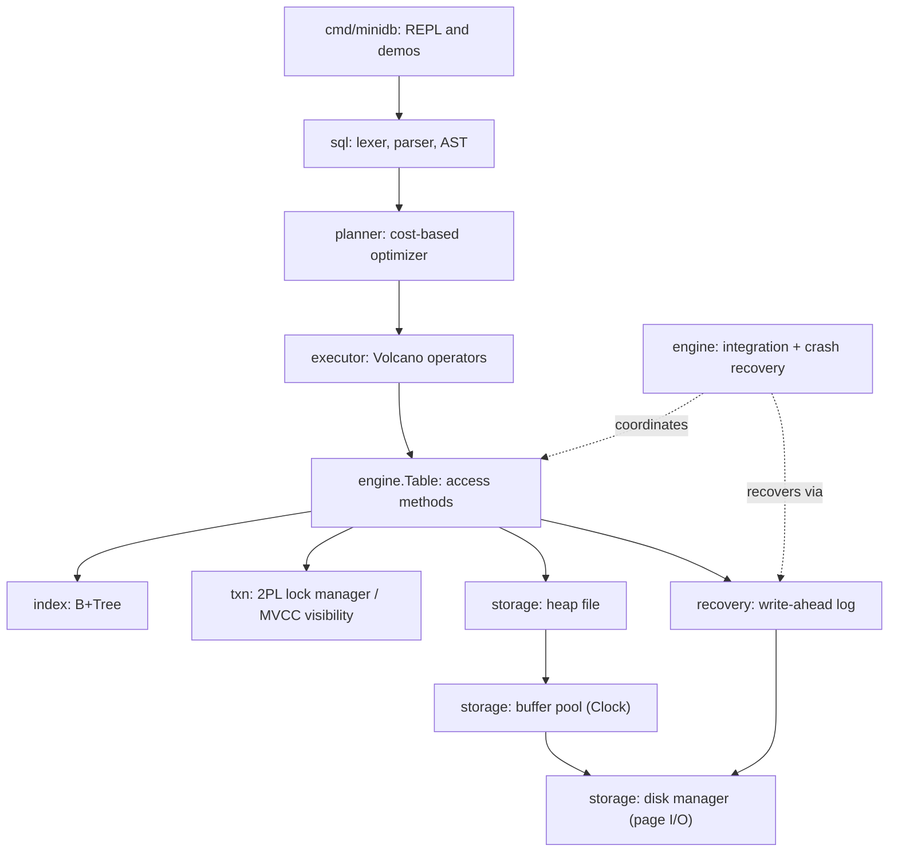

# MiniDB - Team XO

A small but complete relational database engine written from scratch in Go. MiniDB
implements the full storage-to-SQL stack - a paged storage engine, B+Tree
indexing, a cost-based optimizer, a Volcano-style executor, transactions with
strict two-phase locking, and write-ahead-log crash recovery - plus an extension
track implementing Multi-Version Concurrency Control (MVCC).

The goal of this project is not feature count but a coherent, understandable
system: every component is built to be explained and defended.

## Team

| Role | Member | Primary Ownership |
|------|--------|-------------------|
| Person A (systems internals) | _Abhinav Kumar Narayan / 23bcs10014_ | Storage engine, B+Tree index, transactions & 2PL, WAL & recovery, MVCC extension |
| Person B (query path & integration) | _Charanjeet Bhatia / 23bcs10074_ | Catalog, SQL parser, planner/optimizer, executor, CLI/REPL, benchmarks, docs |

The work split is deliberate: Person A owns the lower-level concurrency- and
durability-critical internals (the heavier load); Person B owns the query
pipeline that turns SQL text into results and the tooling around it. The two
halves meet at a small set of interfaces (`executor.Table`, `planner.Provider`,
`recovery.Applier`) defined up front.

---

## 1. Project Overview

**Problem statement.** Build a working relational database that integrates the
components studied across the course - storage, indexing, query processing,
transactions, concurrency control and recovery - into one system that can run
real SQL end to end and survive crashes.

**Goals.**
- Correct, page-based storage with a buffer pool.
- A real B+Tree used as an index during query execution.
- SQL execution for `SELECT` (with `WHERE`, `JOIN`, `COUNT(*)`), `INSERT`,
  `DELETE`.
- A cost-based optimizer that chooses between table scan and index scan and
  orders joins.
- Serializable transactions via strict 2PL with deadlock detection.
- Durability and atomicity via WAL with redo/undo crash recovery.

**Chosen extension track: Track B - Concurrency (MVCC).** MVCC replaces the
read/write locking of 2PL with snapshot isolation, so reads never block writes
and vice versa. It is selectable at startup (`--mode mvcc`) and benchmarked
directly against the 2PL core.

---

## 2. System Architecture



**Major modules** (all under `internal/`):

| Module | Responsibility |
|--------|----------------|
| `types` | Tagged `Value` and `Row` primitives shared by every layer |
| `storage` | Slotted pages, disk manager, heap files, Clock buffer pool |
| `index` | B+Tree (search/insert/delete, range scans) |
| `catalog` | Table schemas and row <-> tuple encoding |
| `sql` | Lexer + recursive-descent parser producing an AST |
| `planner` | Cost-based optimizer and physical plan tree |
| `executor` | Volcano-model operators (scan, join, filter, project, aggregate) |
| `txn` | Transaction manager, 2PL lock manager, MVCC snapshots/visibility |
| `recovery` | WAL records and the redo/undo recovery algorithm |
| `engine` | Wires everything together; runtime `Table`, sessions, recovery |

**Data flow for a query.** SQL text -> tokens -> AST -> logical/physical plan
(optimizer) -> operator tree -> access methods on a `Table` -> heap pages via the
buffer pool, with the transaction layer mediating locks (2PL) or version
visibility (MVCC), and the WAL recording every modification.

---

## 3. Storage Layer

**Page format.** Fixed 4 KiB pages with a slotted layout
([`internal/storage/page.go`](internal/storage/page.go)):

```
+--------------------------------------------------------------+
| header | slot 0 | slot 1 | ... | -> free <- | tuple 1 | tuple 0 |
+--------------------------------------------------------------+
```

The header stores the slot count and the free-space pointer. The slot directory
grows forward from the header; tuple bodies grow backward from the end of the
page. Each slot holds a `(offset, length)` pair; a length of 0 is a tombstone.
Deletes tombstone in place so that RIDs of surviving tuples stay stable (the
index depends on this).

**Heap files.** [`internal/storage/heapfile.go`](internal/storage/heapfile.go)
presents an unordered collection of variable-length tuples addressed by `RID =
(PageID, Slot)`. `Insert` does first-fit placement and only grows the file when
no page can hold the tuple; `Scan` walks pages in physical order.

**Buffer pool.** [`internal/storage/buffer_pool.go`](internal/storage/buffer_pool.go)
caches a fixed number of pages and implements the **Clock (second-chance)**
replacement policy. Pages are pinned while in use and never evicted while pinned;
dirty pages are written back on eviction. This is where page allocation, reads,
writes and eviction are demonstrated.

The buffer policy is **STEAL / NO-FORCE**: dirty pages of uncommitted
transactions may be written to disk, and commit does not force data pages out.
This is what makes the WAL meaningful (see Recovery).

---

## 4. Indexing

[`internal/index/btree.go`](internal/index/btree.go) implements a B+Tree mapping
a column value to a tuple `RID`.

**Node structure.** Internal nodes hold separator entries and child pointers;
leaf nodes hold data entries and are threaded in a singly linked list (`next`)
for ordered range scans. Entries are ordered by key with the RID as a tiebreaker,
so the same tree supports both unique primary-key indexes and non-unique
secondary indexes (and MVCC version chains, where one key maps to several
versions).

**Operations.**
- *Search* descends from the root using binary search within each node, then
  walks the leaf chain to collect all matching RIDs.
- *Insert* recurses to a leaf, inserts in sorted position, and splits nodes
  bottom-up, copying a separator up to the parent.
- *Delete* removes the entry and restores minimum occupancy by **borrowing from a
  sibling (redistribute)** when possible, otherwise **merging** with a sibling and
  collapsing the separator.

A fuzz test ([`internal/index/btree_test.go`](internal/index/btree_test.go))
validates thousands of randomized insert/delete/search operations against a
reference map across several branching factors.

**Search path during queries.** When the optimizer selects an index scan, the
executor calls `Table.IndexLookup`, which uses the B+Tree to fetch only the
matching RIDs instead of scanning every page (see the benchmark: ~9x faster than
a sequential scan for a point query).

---

## 5. Query Execution

**Parser.** A hand-written lexer ([`internal/sql/lexer.go`](internal/sql/lexer.go))
and recursive-descent parser ([`internal/sql/parser.go`](internal/sql/parser.go))
produce a typed AST ([`internal/sql/ast.go`](internal/sql/ast.go)). Supported
grammar: `CREATE TABLE`, `CREATE INDEX`, `INSERT`, `SELECT` (projection, `*`,
`COUNT(*)`, single `JOIN ... ON`, `WHERE` as an AND-chain of comparisons),
`DELETE`, `EXPLAIN`, and `BEGIN`/`COMMIT`/`ROLLBACK`.

**Query plan generation.** The optimizer (Section 6) turns the AST into a
physical plan tree of nodes such as `SeqScan`, `IndexScan`, `HashJoin`,
`NestedLoopJoin`, `Projection` and `CountAgg`.

**Operator execution.** The executor
([`internal/executor/operators.go`](internal/executor/operators.go)) follows the
**Volcano (iterator) model**: every operator exposes `Open`/`Next`/`Close` and
pulls rows from its children one at a time. Base-table scans materialize the
locked/visible tuple set from the storage layer; joins, filters, projection and
aggregation stream over them. `EvalPredicate`
([`internal/executor/eval.go`](internal/executor/eval.go)) evaluates `WHERE`
conditions against rows using a schema that resolves qualified column references.

---

## 6. Optimizer

[`internal/planner/optimizer.go`](internal/planner/optimizer.go) is a cost-based
optimizer driven by table statistics (row count and per-column distinct counts,
cached and recomputed lazily after writes).

**Selectivity estimation.** Equality on a column is estimated as `1 / distinct`;
range comparisons use a fixed 0.33 fraction; `!=` uses 0.9. Conjunctive
predicates multiply their selectivities.

**Scan selection.** For each table the optimizer compares a sequential scan
(cost = number of rows) against an index scan on any equality predicate over an
indexed column (cost proportional to the estimated matching rows), and picks the
cheaper. `EXPLAIN` prints the chosen plan with row/cost estimates, e.g.:

```
-> Index Scan on users using id=2  (est_rows=1 cost=2.0)
```

**Join ordering.** For an equi-join the optimizer estimates output size from
distinct counts and chooses between a **hash join** (build the hash table on the
smaller input) and an **index nested-loop join** (when the inner side is indexed
on the join key, turning the inner scan into a point lookup), selecting the lower
estimated cost and orienting build/probe and outer/inner accordingly.

---

## 7. Transactions & Concurrency

**Locking strategy (core).** [`internal/txn/lock_manager.go`](internal/txn/lock_manager.go)
provides record-level **strict two-phase locking** with shared and exclusive
modes. All locks are held until commit/abort, which yields **serializable**
isolation. A physical, short-lived latch on each table protects the heap and
index structures during a single operation and is kept strictly separate from
these logical locks - logical locks are never acquired while a latch is held.

**Deadlock handling.** Before a transaction blocks, the manager adds edges to a
**wait-for graph** and runs DFS cycle detection; if waiting would close a cycle
the requesting transaction is chosen as the victim and aborts. A bounded
lock-acquisition timeout backstops the detector for cycles that only complete
among already-waiting transactions, guaranteeing liveness. See the demo:
`--demo deadlock`.

**Isolation guarantees.**
- 2PL mode: serializable.
- MVCC mode: snapshot isolation with first-committer-wins on write-write
  conflicts (Section 9).

---

## 8. Recovery

**WAL design.** [`internal/recovery/wal.go`](internal/recovery/wal.go) is an
append-only log. Records are length-prefixed and carry a type, transaction id,
and (for updates) the table, RID, before-image and after-image. The log obeys
the write-ahead rule and **force-log-at-commit**: a commit record is flushed and
`fsync`-ed before the transaction is acknowledged.

**Log records.** `BEGIN`, `UPDATE` (insert/delete/update with before/after
images), `COMMIT`, `ABORT`.

**Crash recovery procedure.** [`internal/recovery/recovery.go`](internal/recovery/recovery.go)
runs the standard three phases:
1. **Analysis** - scan the log to classify transactions as committed or losers.
2. **Redo** - replay every logged update forward (repeat history) so the database
   reaches its pre-crash state.
3. **Undo** - for loser transactions, restore before-images in reverse order.

Because the buffer policy is STEAL/NO-FORCE, both redo (committed work not yet on
disk) and undo (uncommitted work stolen to disk) are required. After recovery the
in-memory indexes are rebuilt from the recovered heap. See the demo:
`--demo crash`.

---

## 9. Extension Track: MVCC (Track B)

**Motivation.** Under 2PL, readers take shared locks that block writers for the
duration of a transaction. For read-heavy, contended workloads this throttles
throughput. MVCC lets each transaction read a consistent **snapshot** without
locking, so readers and writers do not block each other.

**Design.** In MVCC mode each heap tuple carries a 16-byte version header
`(xmin, xmax)` - the creating and deleting transaction ids
([`internal/engine/table.go`](internal/engine/table.go)). A transaction takes a
snapshot at `BEGIN` consisting of the next transaction id and the set of
in-flight transactions
([`internal/txn/transaction.go`](internal/txn/transaction.go)). A version is
visible if its creator committed before the snapshot and its deleter (if any) did
not. Reads apply this visibility test with **no locks**. Deletes stamp `xmax`
in place; an attempt to delete a version another live transaction has already
modified raises a write-write conflict (**first committer wins**). Multiple
versions of one key coexist in the heap and the B+Tree (which permits duplicate
keys), and the correct one is chosen per snapshot.

**Results.** Against an identical read-heavy contended workload (Section 10),
MVCC sustains writes that 2PL effectively starves, and shows no lock-wait
blocking. See the demo: `--demo mvcc`.

---

## 10. Benchmarks

**Experimental setup.** Go 1.25, Windows, Intel i5-11400H. Two experiments, both
reproducible from this repo:

1. **Access-method micro-benchmark** (`go test -bench`): point query on 5,000
   rows via the primary-key index vs. the same selectivity on a non-indexed
   column (forced sequential scan), plus single-row insert throughput.
2. **Concurrency macro-benchmark** (`go run ./benchmarks`): N readers each run a
   transaction that scans the table and holds it briefly; N writers delete and
   re-insert a random row. Measured under both 2PL and MVCC.

**Results.**

Access methods (`-benchtime=3000x`):

| Operation | Latency | Notes |
|-----------|---------|-------|
| Point lookup via B+Tree index | ~0.62 ms/op | optimizer picks Index Scan |
| Point lookup via sequential scan | ~5.82 ms/op | non-indexed column |
| Single-row insert | ~0.60 ms/op | includes WAL fsync at commit |

The index makes a point query about **9x faster** than scanning, and the
optimizer selects it automatically (verified via `EXPLAIN`).

Concurrency (200 rows, 4 readers, 4 writers, 2 s per mode):

| Mode | Reads | Writes | Aborts | Txns/sec |
|------|-------|--------|--------|----------|
| 2PL  | 2685  | 1      | 41     | 1325     |
| MVCC | 1658  | 1383   | 30     | 1517     |

**Analysis.** Under 2PL the long readers hold shared locks on every row they
scanned until commit, so writers are blocked and repeatedly time out and abort -
writes are effectively starved. Under MVCC the readers hold no locks, so writers
proceed against their own versions and commit freely, raising overall throughput
and eliminating lock-wait blocking. This is exactly the read/write concurrency
benefit MVCC is designed to provide. (Insert latency is dominated by the
per-commit `fsync`, the price of durability; batching commits would raise it.)

---

## 11. Limitations

- **Index persistence.** B+Tree nodes live in memory and are rebuilt from a heap
  scan at startup. Index durability therefore rides on the heap's WAL rather than
  on logging the tree itself. Persisting index pages is future work.
- **No vacuum/GC for MVCC.** Dead versions accumulate in the heap; a long-running
  MVCC instance would need garbage collection to reclaim space.
- **No `UPDATE` statement.** Updates are expressed as `DELETE` + `INSERT`.
- **Single equi-join per query**, AND-only `WHERE` clauses, and no `ORDER
  BY`/`GROUP BY` beyond `COUNT(*)`.
- **Statistics are approximate** (computed by scanning, cached between writes) and
  histogram-free, so selectivity for skewed data is coarse.
- **DELETE locks scanned rows** in 2PL (it scans to find matches), which amplifies
  contention - faithful to the implementation but worth noting when reading the
  benchmark.
- **Recovery has no checkpointing**, so the full log is replayed on restart.

These are deliberate scope choices to keep the system explainable; each has a
clear path to extension.

---

## 12. How to Run

**Dependencies.** Go 1.25+ (standard library only; no third-party modules).

**Build.**

```bash
cd MiniDB_Projects/Team_XO
go build ./...
```

**Run the interactive SQL shell.**

```bash
go run ./cmd/minidb --dir ./data --mode 2pl     # or --mode mvcc
```

Example session:

```sql
CREATE TABLE users (id INT PRIMARY KEY, name TEXT, age INT);
INSERT INTO users VALUES (1,'alice',30),(2,'bob',25),(3,'carol',30);
SELECT * FROM users WHERE id = 2;
EXPLAIN SELECT * FROM users WHERE id = 2;     -- Index Scan
EXPLAIN SELECT * FROM users WHERE age = 30;   -- Seq Scan
CREATE TABLE orders (oid INT PRIMARY KEY, uid INT, item TEXT);
INSERT INTO orders VALUES (10,1,'book'),(11,3,'mug');
SELECT users.name, orders.item FROM users JOIN orders ON users.id = orders.uid;
SELECT COUNT(*) FROM users;
```

Meta commands inside the shell: `\tables`, `\help`, `\q`.

**Run the scripted demonstrations.**

```bash
go run ./cmd/minidb --demo crash       # WAL redo/undo across a simulated crash
go run ./cmd/minidb --demo deadlock    # 2PL wait-for graph + victim abort
go run ./cmd/minidb --demo mvcc        # snapshot isolation, no read/write blocking
```

**Run the tests and benchmarks.**

```bash
go test ./...                                              # unit + integration tests
go test -bench=PointLookup -benchtime=3000x ./benchmarks   # index vs scan
go run ./benchmarks -rows 200 -readers 4 -writers 4 -seconds 2   # 2PL vs MVCC
```

---

## Repository Layout

```
Team_XO/
├── README.md
├── go.mod
├── cmd/minidb/          # REPL + scripted demos
├── internal/
│   ├── types/           # Value, Row
│   ├── storage/         # page, disk manager, heap file, buffer pool
│   ├── index/           # B+Tree
│   ├── catalog/         # schemas + row encoding
│   ├── sql/             # lexer, parser, AST
│   ├── planner/         # cost-based optimizer + plan tree
│   ├── executor/        # Volcano operators
│   ├── txn/             # transaction manager, 2PL, MVCC
│   ├── recovery/        # WAL + crash recovery
│   └── engine/          # integration, runtime tables, sessions
├── benchmarks/          # concurrency macro-benchmark + micro-benchmarks
└── docs/                # design notes
```
