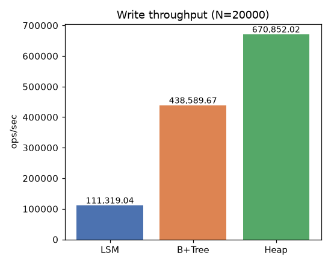
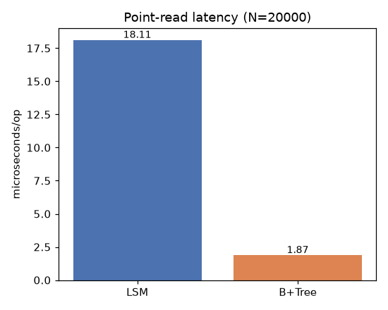
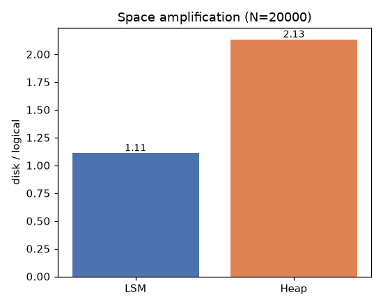

# MiniDB Benchmarks — LSM vs B+Tree vs Heap

Reproducible micro-benchmarks comparing MiniDB's storage engines on the three
dimensions that distinguish them. Run:

```bash
./.venv/bin/python benchmarks/run_all.py [N]     # default N = 20000
```

This regenerates `write_throughput.png`, `read_latency.png`,
`space_amplification.png`, and `results.json`. The run is deterministic
(`seed = 1234`).

## What is measured

| Dimension | Engines | Method |
|-----------|---------|--------|
| Write throughput (ops/sec) | LSM, B+Tree, Heap | insert N keys in shuffled order |
| Point-read latency (µs/op) | LSM, B+Tree | 3000 random point lookups |
| Space amplification (disk/live) | LSM, Heap | insert N, then churn (overwrite/delete half) |

## Representative results (N = 20,000)

| Metric | LSM | B+Tree | Heap |
|--------|-----|--------|------|
| Write throughput (ops/sec) | ~111,000 | ~439,000 | ~671,000 |
| Point-read latency (µs/op)  | ~18.1 | ~1.9 | — |
| Space amplification (×)     | 1.11 | — | 2.13 |





## Analysis

**Reads — B+Tree wins decisively (~1.9 µs vs ~18 µs).** MiniDB's B+Tree is an
in-memory structure, so a point lookup is a handful of pointer hops, O(log n). The
LSM must consult the MemTable and then probe SSTables newest→oldest; each probe is
a Bloom-filter check plus, on a hit, a file seek + read. More SSTables ⇒ more probes,
which is exactly the read-amplification LSMs are known for. The Bloom filters keep
this from being catastrophic by letting most SSTables be skipped.

**Space — LSM wins (1.11× vs 2.13×).** After overwriting/deleting half the keys,
the LSM's compaction merges runs and physically drops superseded versions and
tombstones, so on-disk size tracks the live data closely. The heap uses
tombstone-only deletes (like PostgreSQL before `VACUUM`): dead tuples are never
reclaimed in place, so the file stays ~2× the live data. Compaction is the LSM's
mechanism for bounding the space cost of its append-only writes.

**Writes — the honest result.** Here the append-only Heap is fastest and the
in-memory B+Tree is second; the LSM is slowest. This is *not* the textbook "LSM
wins writes" headline, and the reason is important and worth stating plainly:

- MiniDB's **B+Tree and Heap baselines are not durable on the write path** — the
  B+Tree is pure in-memory, and the heap append goes through the buffer pool with
  no per-write fsync. They have no I/O to amortize.
- The **LSM is the only durable engine measured**: every `put` appends to its
  MemTable WAL, and crossing the MemTable limit triggers a flush, while every few
  flushes triggers a full compaction — i.e. real **write amplification**.

So this benchmark measures *durable sequential writes + compaction* (LSM) against
*non-durable in-memory inserts* (B+Tree/Heap). The classic LSM write advantage
appears when the comparison is against a **disk-resident B-tree performing random
in-place page updates** (each insert seeking + rewriting a leaf page) — a design
MiniDB deliberately does not implement, because its B+Tree is an in-memory index
rebuilt from the durable heap/WAL. The LSM converts those random writes into
sequential appends; against an in-memory tree there are no random writes to avoid.

## Takeaways

- **B+Tree**: best for read-heavy / point-lookup workloads.
- **LSM**: best for write-heavy + durable workloads and for bounding space under
  churn (via compaction); pays with read- and write-amplification.
- **Heap**: fastest raw append, but no key lookup and no space reclamation.

These trade-offs are *why* a real system offers both (e.g. PostgreSQL heap+B-tree
vs RocksDB/Cassandra LSM), and why MiniDB implements the heap+B-tree engine and
the LSM engine side by side.
