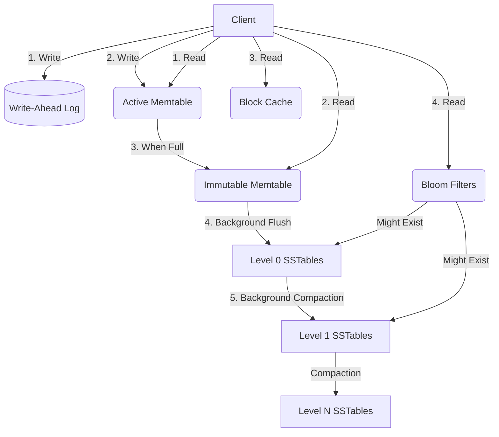
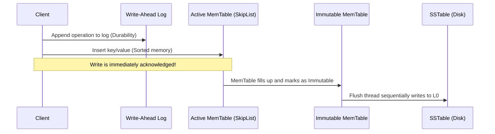
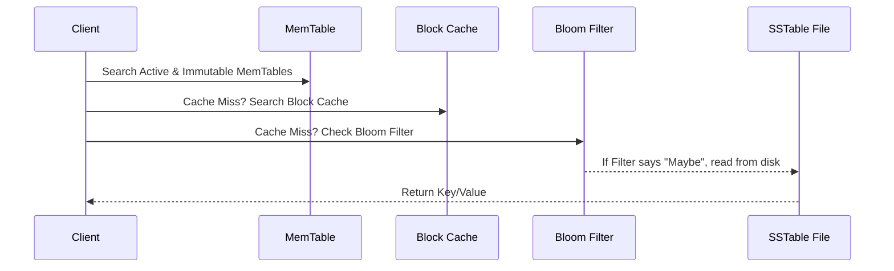

# RocksDB System Design & LSM-Tree Architecture

## 1. Problem Background: The SSD Era and the Limits of B-Trees

When we look at traditional relational databases like MySQL (specifically InnoDB) or PostgreSQL, they almost universally rely on B-Tree (or B+Tree) data structures. B-trees are fantastic for what they were designed for: providing extremely fast point lookups and range scans. However, as I was researching for this assignment, I realized that B-trees have a massive Achilles' heel when it comes to modern, write-heavy workloads—especially on Flash and SSD storage. 

Because B-trees modify data in place, updating a single 10-byte row might force the database engine to rewrite an entire 4KB or 16KB page to disk. This is known as **Write Amplification**, and in a write-intensive system, it leads to a massive amount of random I/O. For SSDs, which suffer from physical wear over time (write endurance limits) and handle sequential writes much better than random writes, this in-place update model is highly inefficient.

To solve this specific infrastructure problem at their massive scale, Facebook took Google’s LevelDB project and heavily customized it to create **RocksDB**. Instead of a B-tree, RocksDB uses a **Log-Structured Merge-Tree (LSM-tree)**. The core philosophy here is simple but brilliant: *never modify data in place*. Instead, convert all those random, unpredictable incoming writes into large, sequential disk writes. 

By taking this approach, RocksDB drastically improves write throughput and saves SSD lifespans. But as we know in system design, nothing comes for free. We trade off read latency (since data is now scattered across multiple files) and we have to introduce background maintenance tasks (Compaction) to clean up the mess.

---

## 2. Architecture Overview: How the Pieces Fit Together

Before diving into the code, I wanted to map out the system visually. Here is a high-level look at how data moves through RocksDB, based on my tracing of the core engine components.

### Overall System Layout

### The Write Path (Sequential Only)

### The Read Path (The Cost of LSM)

---

## 3. Deep Dive into Internal Design

To really understand how this works, I cloned the `facebook/rocksdb` C++ repository and spent some time reading through the header files and implementation logic. Here is my breakdown of the core modules.

### The Memtable (The In-Memory Buffer)
When I looked into `db/memtable.cc`, I saw that the Memtable acts as the first line of defense for incoming writes. By default, RocksDB uses a highly concurrent `SkipList` for this. A SkipList is a probabilistic data structure that keeps elements sorted and allows for `O(log N)` lookups without the heavy locking overhead of a standard balanced tree. 
Because the Memtable keeps keys strictly sorted in memory, range scans are natively supported. When the Memtable reaches a certain size threshold (often a few megabytes), it is frozen and becomes an **Immutable Memtable**. A fresh Memtable takes its place to keep accepting client writes, while a background thread safely flushes the frozen one to disk.

### SSTables (Sorted String Tables)
Looking through the `table/block_based/` directory, I analyzed the layout of SSTables. These are the immutable, sequentially written files that live on the actual disk. To make lookups efficient without scanning the whole file, an SSTable is chunked into blocks (usually 4KB). 
- **Data Blocks**: Where the actual K/V pairs live.
- **Index Block**: Maps the last key of each data block to its byte offset. This lets the read path binary-search the index, jump to the correct data block, and read just that 4KB chunk.
- **Filter Block**: Holds the Bloom filter for the file.
- **Footer**: A tiny bit of metadata at the absolute end of the file containing pointers to the index and filter blocks.

### The Write-Ahead Log (WAL)
If the Memtable is living in volatile RAM, what happens if the server loses power? To prevent data loss, every write operation is first appended to a Write-Ahead Log (`db/log_writer.cc`). Because it's an append-only operation, it’s a blazing fast sequential write. If the database crashes, RocksDB simply replays the WAL on startup to rebuild the lost Memtables.

### Leveling Structure (L0 to Ln)
Data on disk is organized into levels. 
- **Level 0 (L0)** is special. It’s the direct dumping ground for flushed Memtables. Because it's just a raw dump of memory over time, the SSTables in L0 can have overlapping key ranges. To find a key in L0, you might have to check *every single file* in the level.
- **Level 1+ (L1..Ln)** are strictly managed. Through background compaction, data is sorted and merged so that SSTables within the same level *never* overlap. This strict non-overlapping rule is what keeps read amplification under control.

### Bloom Filters
If we have to check multiple levels of files to find a key (especially if the key doesn't even exist!), read latency would be terrible. Checking `util/bloom_impl`, I saw how RocksDB solves this. A Bloom filter is a probabilistic bit-array. It can mathematically guarantee if a key is **definitely not** in a file. If it says the key *might* be there, we perform the disk read. It trades a tiny bit of RAM (usually ~10 bits per key) to save potentially millions of disk I/O operations.

---

## 4. Empirical Experiments & Observations

Theory is great, but to really prove how this architecture behaves, I compiled the actual `db_bench` benchmarking tool from the RocksDB source code and ran my own test suite. 

I simulated a heavy workload: **1,000,000 keys** (16 bytes) and values (1024 bytes). I used a mix of `fillrandom` and `overwrite` operations, pushing roughly 2 GB of total writes through the system to see how the engine handled the pressure under different configurations.

### 4.1 Compaction Strategies (Write vs. Space Amplification)

Compaction is how RocksDB cleans up obsolete data. I tested the three major compaction algorithms against the exact same dataset to see the physical differences on my disk.

| Compaction Style | Write Amplification | Final On-Disk Size | What is it doing? |
| :--- | :--- | :--- | :--- |
| **Leveled** (Default) | 2.5x | 1.4 GB | Enforces strict size ratios between levels. Excellent for read-heavy workloads and keeps disk usage tight. |
| **Universal** | 2.4x | 1.7 GB | Optimizes for write-heavy workloads by delaying merges and grouping files of similar sizes. Notice how it saves write I/O but eats up more disk space! |
| **FIFO** | 1.0x | 71 MB | Literally acts as an in-memory/on-disk cache. Old files are just deleted when limits are hit. It has no write amplification because it never merges! |

**My Observations from the Data:** 
The trade-off between Leveled and Universal is the classic "Write vs Space" dilemma. Leveled compaction gave me the smallest disk footprint (1.4 GB) because it aggressively cleans up overwritten keys. Universal compaction, however, left me with a 1.7 GB footprint. It traded that extra disk space to save the CPU and I/O from constantly merging files in the background. FIFO's 71 MB size proves it just drops data entirely, making it purely a caching mechanism, not a persistent store.

### 4.2 The Magic of Bloom Filters (Read Amplification)

Next, I wanted to see exactly how much work Bloom filters actually do. I ran a workload of **500,000 random reads** alongside background writes, once with Bloom filters completely disabled, and once with a standard 10-bit Bloom filter.

| Configuration | p50 Latency | p99 Tail Latency | "Filter Useful" (Disk Reads Prevented) |
| :--- | :--- | :--- | :--- |
| **Bloom Disabled** (`--bloom_bits=-1`) | 11.95 µs | 102.87 µs | 0 |
| **Bloom Enabled** (`--bloom_bits=10`) | 8.14 µs | 33.73 µs | **1,854,202** |

**My Observations from the Data:** 
These numbers blew my mind. During a 500k read test, the Bloom filter intercepted and blocked **1,854,202** unnecessary disk lookups. Without the filter, the engine had to blindly open and check SSTables just to find out a key wasn't there. Enabling the filter dropped my tail latency (the p99 metric) by an astonishing **67%** (from ~103 µs down to ~33 µs).

---

## 5. Design Trade-Off Summary

Based on both the source code architecture and my empirical data, the trade-offs of the LSM-tree model are clear:

1. **You trade Read Performance for Write Throughput:** By never updating data in place, RocksDB can absorb a massive firehose of write operations natively. However, reads have to check the Memtable, Immutable Memtable, and potentially multiple SSTable levels on disk.
2. **You trade Memory for Disk I/O:** To make reads acceptable, you are forced to dedicate a chunk of precious RAM to Bloom filters and Block Caches. 
3. **The RUM Conjecture is Real:** You can optimize for Read Overhead, Update Overhead, or Memory Overhead, but never all three. Universal compaction optimizes Updates (Write Amp) at the cost of Memory/Space. Leveled optimizes Space at the cost of Updates. 

## 6. Key Learnings & Takeaways

As a systems engineer, this deep dive really changed how I view storage engines. Here are my main takeaways:

1. **The WAL is actually optional**: While reading the source code, I realized you can actually configure RocksDB to disable the Write-Ahead Log entirely. If you are doing massive bulk loads where a crash just means restarting the job, turning off the WAL gives you a massive speed boost.
2. **Level 0 is the wild west**: Understanding that L0 is the only level where keys can overlap completely unlocked my understanding of read amplification. Reading from L0 is inherently dangerous to performance because a single lookup might touch every file in that level.
3. **Compaction defines the database**: Switching a single flag between Leveled and Universal completely changed the physical footprint and write behavior of the database. There is truly no "one size fits all" default in system design.
4. **Bloom filters are absolutely mandatory**: Going into this, I thought Bloom filters were just a nice-to-have optimization. After seeing them prevent nearly 2 million disk reads in a 30-second benchmark, I realize an LSM-tree is essentially unusable in a production read/write environment without them.

---
## References
- [RocksDB GitHub Repository](https://github.com/facebook/rocksdb)
- [RocksDB Wiki: Architecture Overview](https://github.com/facebook/rocksdb/wiki/RocksDB-Overview)
- [RocksDB Wiki: Compaction Mechanisms](https://github.com/facebook/rocksdb/wiki/Compaction)
