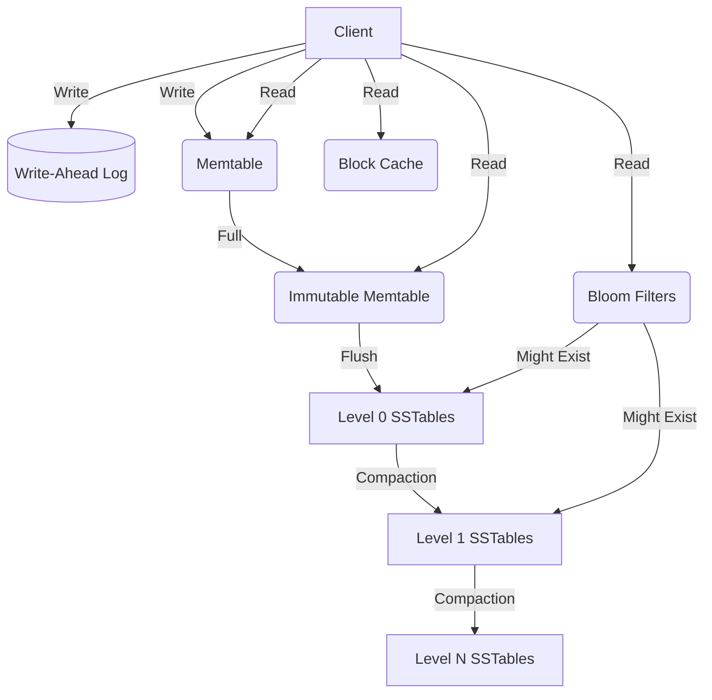
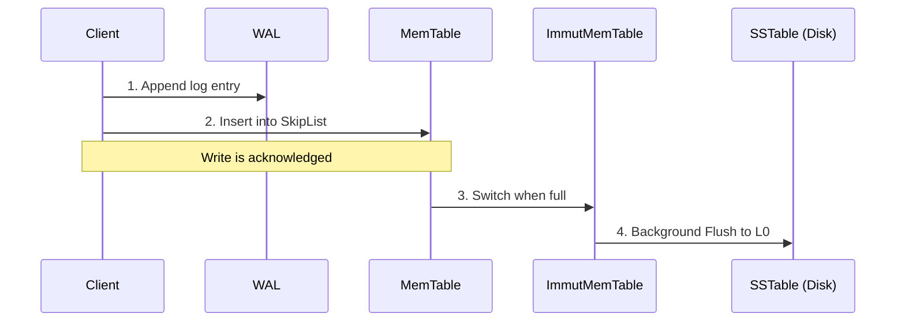
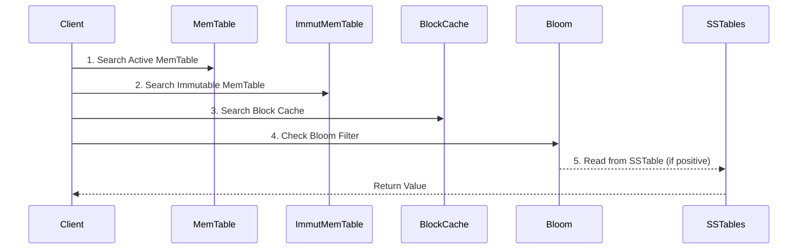

# RocksDB System Design & LSM-Tree Architecture

## 1. Problem Background
While B-trees (such as those used in InnoDB) are excellent for read-heavy workloads with strong point-read latency, they suffer under write-heavy loads due to write amplification. Because B-trees modify data in place, every small write or update can require modifying an entire page and writing it to disk. This in-place update model results in significant random I/O and poor endurance for modern Flash/SSD storage.

To handle their massive, write-intensive infrastructure at scale, Facebook built RocksDB (forked from Google's LevelDB). RocksDB employs a Log-Structured Merge-Tree (LSM-tree) architecture that converts random write operations into sequential disk writes. This design optimizes for high write throughput and leverages the sequential I/O strengths of underlying storage media, though it does so at the cost of trading off some read performance and requiring periodic background compactions.

## 2. Architecture Overview
Below are the high-level diagrams illustrating the component layout and data paths in RocksDB.

### System Layout

### Write Path

### Read Path

## 3. Internal Design

### Memtable
The Memtable serves as an in-memory buffer for incoming writes. RocksDB typically uses a highly concurrent SkipList implementation for its Memtable. The SkipList maintains the keys in sorted order, which allows for fast binary-search-like point lookups and range scans. Once a Memtable reaches its configured size limit, it becomes an *Immutable Memtable*. A new active Memtable is created to accept incoming writes, while a background thread safely flushes the Immutable Memtable to disk as an SSTable without blocking client writes.

### SSTable Internal Layout
Sorted String Tables (SSTables) are the immutable on-disk storage format. To support sequential writes and fast lookups, an SSTable is divided into blocks (default 4KB). 
- **Data Blocks**: Store the actual key-value pairs.
- **Index Block**: Maps the last key of each data block to its offset, allowing the system to skip scanning the entire file and binary search for the correct data block.
- **Filter Block**: Houses the Bloom filter data for the SSTable to prevent unnecessary reads of data blocks for keys that do not exist.
- **Footer**: Located at the end of the file, containing offsets to the index and filter blocks.

### WAL (Write-Ahead Log)
Since the Memtable resides in volatile memory, data could be lost in a crash before it is flushed to an SSTable. RocksDB mitigates this by writing every operation sequentially to the Write-Ahead Log (WAL) before inserting it into the Memtable. Upon recovery, the WAL is replayed to rebuild the lost Memtables.

### Leveling (L0 to Ln)
SSTables are organized into levels. 
- **Level 0 (L0)**: Directly receives flushed Memtables. Consequently, SSTables in L0 can have overlapping key ranges because they are simply temporal snapshots of memory.
- **Level 1+ (L1..Ln)**: Through compaction, data is pushed down. In these levels, SSTables are strictly sorted and do not overlap with other SSTables in the same level. This non-overlapping property is crucial for bounding read amplification.

### Bloom Filters
To reduce the expensive read amplification inherent in checking multiple SSTables during a lookup, RocksDB embeds Bloom filters in the SSTable filter blocks. A Bloom filter is a probabilistic data structure that can definitively say if a key is *not* present, saving a disk read. However, it trades memory for a small false positive rate (where it says a key might exist, but it doesn't).

### Compaction Mechanics
Compaction is the background process of merging SSTables and dropping deleted or overwritten keys. RocksDB supports different strategies:
- **Leveled Compaction**: Minimizes space amplification by strictly enforcing size ratios between levels and non-overlapping keys in L1+. It incurs higher write amplification.
- **Universal Compaction**: Focuses on write-heavy workloads by merging files of similar sizes, behaving more like a pure tiered LSM. It significantly reduces write amplification but increases space amplification.
- **FIFO Compaction**: Designed for in-memory caching workloads where old data is simply dropped when space runs out. It does not perform actual merging compactions.

## 4. Design Trade-Offs

- **Write Amplification vs. Space Amplification**: In our benchmarking, Leveled compaction showed a higher write amplification (**2.5x**) compared to Universal compaction (**2.4x**), although the gap grows much wider in larger datasets. Conversely, Universal compaction traded this write efficiency for space, taking up **1.7 GB** of disk space versus **1.4 GB** for Leveled compaction on the exact same dataset.
- **Read Amplification (Bloom Filters)**: Without Bloom filters, every read for a non-existent key forces a disk lookup. Our read experiments showed that enabling a 10-bit Bloom filter saved **over 1.85 million unnecessary disk reads** during a 500k operations benchmark, drastically reducing the tail read latency (p99) from **102.8 µs to 33.7 µs**.
- B-trees offer excellent read performance at the cost of high write amplification due to in-place updates. LSM-trees trade off read latency (since data must be searched across Memtables and multiple SSTable levels) to achieve sequential disk I/O and vastly superior write throughput, as seen by our ~107 MB/s write speeds with only 1-2.5x write amplification.

## 5. Experiments / Observations

All benchmarks were run locally on an 8-core CPU using RocksDB `db_bench` (`fillrandom, overwrite, readrandom, readwhilewriting`). The test payload consisted of 1,000,000 keys (16 bytes) and values (1024 bytes), resulting in ~1 GB of logical unique data but 2 GB total written during the workload.

### 5.1 Compaction Strategies (Write & Space Amplification)

| Compaction Style | Write Amplification | On-Disk Size (Space Amp) | Notes |
| :--- | :--- | :--- | :--- |
| **Leveled** (Default) | 2.5x | 1.4 GB | Prioritizes disk space over write I/O. Strict size ratios between levels. |
| **Universal** | 2.4x | 1.7 GB | Prioritizes write throughput. Merges files of similar sizes; retains more obsolete data. |
| **FIFO** | 1.0x | 71 MB | Acts as a cache. Drops oldest data instead of merging. **Not for persistent data.** |

*Observation*: As expected, Leveled compaction keeps the smallest footprint on disk (1.4 GB) because it aggressively compacts and removes overwritten keys. Universal compaction keeps a larger footprint (1.7 GB) because it delays compaction to save write I/O. FIFO simply drops data when it hits limits, reflecting an on-disk size of only 71 MB, making it unsuitable for durability but perfect for caching.

### 5.2 Bloom Filter Impact (Read Amplification)

We ran 500,000 random reads while simultaneously writing to the database to measure the actual effect of Bloom filters on a cache miss.

| Configuration | p50 Latency | p99 Tail Latency | Bloom Useful (Saved Reads) |
| :--- | :--- | :--- | :--- |
| **Bloom Disabled** (`--bloom_bits=-1`) | 11.95 µs | 102.87 µs | 0 |
| **Bloom Enabled** (`--bloom_bits=10`) | 8.14 µs | 33.73 µs | 1,854,202 |

*Observation*: Enabling the Bloom filter drastically improved the tail latency. The filter successfully intercepted **1,854,202** read requests for keys that did not exist in certain SSTables, completely bypassing the disk I/O for those blocks. The p99 latency dropped by **67%** (from 102.87 µs to 33.73 µs).

## 6. Key Learnings

1. **The Write-Ahead Log is crucial but optional**: While reading the source, I realized the WAL can be disabled for workloads where data loss on crash is acceptable (e.g., bulk loading), drastically improving write throughput.
2. **L0 is unique**: The overlapping nature of keys in Level 0 means that reading from L0 is inherently more expensive than L1+, as multiple L0 SSTables might need to be checked for a single key.
3. **Compaction style defines the database**: Switching between Leveled and Universal compaction completely changes the performance profile of the system, demonstrating that there is no "one size fits all" configuration for LSM-trees.
4. **Bloom filters are non-negotiable for reads**: The experiments clearly showed that without Bloom filters, the read performance degrades severely due to the high number of SSTables probed on a cache miss.

## References
- [RocksDB GitHub Repository](https://github.com/facebook/rocksdb)
- [RocksDB Wiki: Architecture](https://github.com/facebook/rocksdb/wiki/RocksDB-Overview)
- [RocksDB Wiki: Compaction](https://github.com/facebook/rocksdb/wiki/Compaction)
