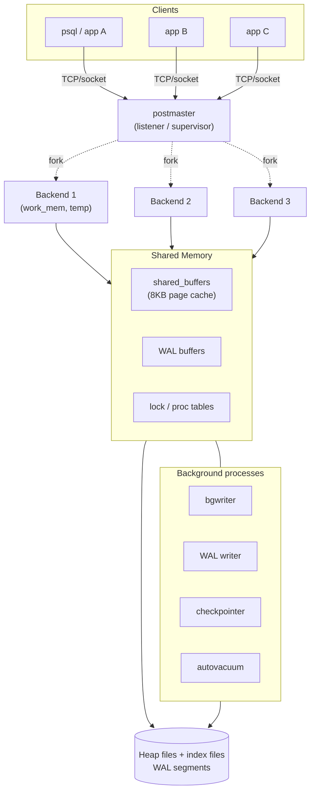
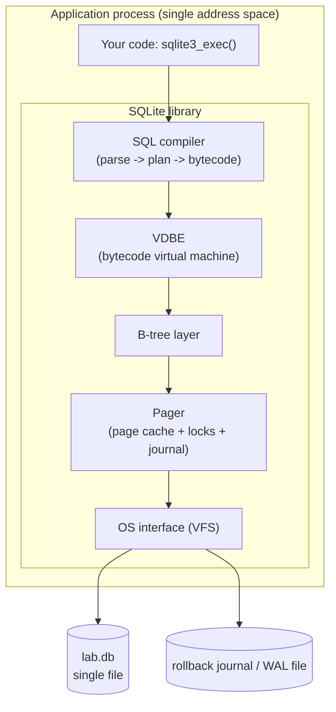

# PostgreSQL vs SQLite — Architecture Comparison

**Name:** Tirth Shah
**Roll Number:** 24BCS10347
**Course:** Advanced DBMS — System Design Discussion

---

## 1. Problem Background

Databases are not one-size-fits-all. PostgreSQL and SQLite are both mature, ACID-compliant, SQL relational engines — yet they were built to solve *opposite* problems, and almost every architectural difference between them follows from that original divergence in goals.

### SQLite — the embedded library (~2000)

SQLite was created by D. Richard Hipp in 2000, originally for a system that needed to keep working even when no database *server* was available. Its founding goal was: **let an application store relational data without administering a separate database process.** The deliberate consequences of that goal are baked into the name itself — it is "Lite":

- **Zero configuration** — no server to install, no `pg_hba.conf`, no users, no ports, no daemon. You link a single C library into your program.
- **Serverless / in-process** — there is no separate database process. SQLite runs *inside* the application's own address space; a "query" is just a function call, not a network round-trip.
- **Single-file storage** — the entire database (tables, indexes, schema, metadata) lives in one ordinary file you can `cp`, email, or check into version control.
- **Self-contained and portable** — minimal dependencies, runs on phones, browsers, microcontrollers, planes, and desktop apps.

SQLite explicitly does **not** try to be a competitor to client-server databases. Its own documentation frames the choice as *"SQLite vs. fopen()"* — it competes with reading/writing custom file formats, not with PostgreSQL. It is arguably the most widely deployed database engine in the world precisely because it is invisible: it ships inside Android, iOS, Chrome, Firefox, and countless desktop and embedded apps.

### PostgreSQL — the multi-user RDBMS (POSTGRES → Postgres95 → PostgreSQL)

PostgreSQL descends from the **POSTGRES** research project led by Michael Stonebraker at UC Berkeley (mid-1980s), the successor to Ingres. The research agenda was about *extensibility* and rich data types in a serious relational system. In 1994–95 it gained a SQL front-end (Postgres95) and was released to the open-source world as **PostgreSQL** in 1996.

PostgreSQL's founding goal is the opposite of SQLite's: **serve many concurrent users reliably and durably over a network, with strong correctness guarantees.** That implies:

- **Client-server** — a long-running server process owns the data; many clients connect concurrently over sockets.
- **Heavy concurrency** — readers and writers must not block each other; many transactions run at once.
- **Durability and crash recovery** — committed data survives crashes via write-ahead logging.
- **Extensibility and standards** — rich type system, custom types/operators/index methods, advanced SQL.

### Contrasting design goals (one-line summary)

| Dimension | SQLite | PostgreSQL |
|---|---|---|
| Primary problem | Local, embedded, zero-admin storage | Multi-user, durable, networked RDBMS |
| Competes with | `fopen()` / custom file formats | Oracle, MySQL, SQL Server |
| Process model | In-process library | Long-running server + many clients |
| Concurrency target | One writer at a time | Many concurrent writers + readers |
| Optimized for | Simplicity, portability, footprint | Throughput, correctness, scalability |

Everything in the sections below — locking, MVCC, storage layout, recovery — is a *downstream consequence* of these two goals.

---

## 2. Architecture Overview

### 2.1 PostgreSQL — client-server, multi-process

PostgreSQL uses a **process-per-connection** model coordinated through a region of shared memory. The supervisor process (historically the `postmaster`) listens for connections and **forks** a dedicated backend process for each client. All backends, plus a set of background helper processes, attach to the same shared memory segment (shared buffers, WAL buffers, lock tables).



**Background processes and why they exist:**

- **bgwriter** — trickles dirty shared-buffer pages out to disk ahead of time so that backends rarely have to do their own write to find a free buffer.
- **WAL writer** — flushes the in-memory WAL buffers to the on-disk write-ahead log, so commits don't each have to do all the WAL I/O synchronously.
- **checkpointer** — periodically forces *all* dirty buffers to disk and records a checkpoint in the WAL, bounding how much WAL must be replayed after a crash.
- **autovacuum** — reclaims space from dead row versions (the tombstones MVCC leaves behind) and refreshes planner statistics.

**Query data flow (PostgreSQL):** client sends SQL → backend **parses** → **rewrites** (rules/views) → **planner/optimizer** produces a cost-based plan (may include parallel workers) → **executor** runs the plan, reading pages from `shared_buffers` (faulting from disk on a miss) → results streamed back to the client. Writes append redo records to the WAL *before* dirty data pages are flushed.

### 2.2 SQLite — embedded, in-process

SQLite has *no server and no background processes*. The library is linked into the application; the database is just a file the library reads and writes through the OS.



**Query data flow (SQLite):** a `sqlite3_exec()` call → the **SQL compiler** parses and plans the statement and emits **VDBE bytecode** → the **VDBE** (a register-based virtual machine) executes that bytecode, calling the **B-tree** layer to navigate pages → the **pager** serves pages from its page cache (or reads them from the file), manages locks, and writes the rollback journal / WAL → the **VFS** abstracts the actual OS file calls. Everything happens on the calling thread, in the calling process. A "query" is a sequence of function calls — there is no IPC, no socket, no second process.

The single biggest architectural contrast is right here: **PostgreSQL is a service you talk to; SQLite is a library you call.**

---

## 3. Internal Design

### 3.1 Storage structures

**PostgreSQL** stores each table as a **heap** — an unordered collection of fixed-size **8 KB pages** (measured here: `block_size = 8192`). Rows ("tuples") are appended wherever there is free space; there is *no* inherent ordering. Each index is a **separate file** with its own B-tree, and index entries point back into the heap by physical location (`ctid` = page number, item offset). Large field values that don't fit in a page are pushed out-of-line via **TOAST** (The Oversized-Attribute Storage Technique) into an associated TOAST table, optionally compressed.

A key implication: **the heap and every index are independent structures.** All PostgreSQL indexes are therefore *secondary* indexes — even a primary-key index just points into the heap.

**SQLite** stores the *entire* database — schema, every table, every index, freelist — in **one file** made of equal-size **pages** (measured here: `page_size = 4096`, `page_count = 8511`). The file begins with the literal header string `SQLite format 3\0` (verified in the lab file). Crucially, **a table *is* a B-tree** keyed by its 64-bit `rowid` — i.e. tables are **clustered**: the row data lives in the leaf pages of the table's own B-tree, physically ordered by rowid. Indexes are *separate* B-trees whose entries carry the indexed columns plus the rowid used to look the row back up.

We confirmed this directly from the `dbstat` virtual table for `orders`: root page 3 is an **internal** B-tree page (`ncell=8`), page 1572 is another internal page (`ncell=408`), and leaf pages such as 1106/1107/1108 hold ~153–162 cells each. That is the unmistakable shape of a multi-level B-tree storing the table itself — *not* an unordered heap.

| Aspect | PostgreSQL | SQLite |
|---|---|---|
| Table physical layout | **Heap** — unordered 8 KB pages | **Clustered rowid B-tree** in 4 KB pages |
| Indexes | Separate files, all *secondary* | Separate B-trees in the same file |
| Database on disk | Many files (heap, indexes, WAL...) | **One file** |
| Big values | TOAST (out-of-line, compressible) | Overflow pages |
| Page size (measured) | 8192 bytes | 4096 bytes |

### 3.2 Memory management

- **PostgreSQL** has a single shared cache, **`shared_buffers`** (128 MB here), holding 8 KB pages for *all* backends — a hit there is shared across connections. On top of that, each backend gets private **`work_mem`** for sorts, hashes, and hash joins; exceeding it spills to temporary disk files. So PG memory is *shared cache + per-operation private workspace*.
- **SQLite** has a per-connection **page cache** (default ~2000 pages) plus optional **memory-mapped I/O (`mmap`)** that lets it read database pages straight from the OS page cache without a separate copy. There is no cross-process shared buffer pool — caching is local to the process that opened the file.

### 3.3 Index organization

Both engines use **B-tree / B+-tree** indexes, but the relationship to the data differs fundamentally:

- In **SQLite**, the table itself is a B-tree keyed by `rowid` (clustered), so a lookup *by rowid* walks straight to the row with no second hop. A lookup on a secondary column walks that index's B-tree to find the rowid, then walks the table B-tree to fetch the row.
- In **PostgreSQL**, the heap is unordered and *every* index is secondary: an index scan finds matching `ctid`s, then visits the heap pages to fetch the actual tuples (the "heap fetch"). PG mitigates the second hop with the **visibility map** and **index-only scans** when all needed columns are in the index.

### 3.4 Transaction processing & concurrency control — the deepest difference

**PostgreSQL — MVCC (Multi-Version Concurrency Control).**
PostgreSQL never overwrites a row in place. Every tuple carries hidden system columns **`xmin`** (the transaction that created this version) and **`xmax`** (the transaction that deleted/superseded it). An `UPDATE` is effectively *insert a new version + mark the old one as expired*. Each transaction sees only the versions valid for its snapshot. The headline consequence: **readers never block writers and writers never block readers** — a `SELECT` reads a consistent older version while an `UPDATE` writes a new one. The cost is **dead tuples** (old versions) that VACUUM must later reclaim.

**SQLite — coarse-grained locking.**
SQLite has no per-row versioning. Its concurrency is governed by file-level locks managed by the pager:

- **Rollback-journal mode (default):** a writer takes an `EXCLUSIVE` lock on the whole database file — so writes serialize and a writer blocks readers (and vice versa). This is database-level, not row-level, locking.
- **WAL mode:** allows **one writer and many concurrent readers** at the same time. Readers see a consistent snapshot via the WAL while a single writer appends changes. There is still only *one* writer at a time.

| Concurrency property | PostgreSQL | SQLite |
|---|---|---|
| Granularity | Row-level via MVCC | Whole-database file lock |
| Concurrent writers | Many | **Exactly one** |
| Readers vs writers | Never block each other | Blocked in journal mode; coexist in WAL mode |
| Cost of the model | Dead tuples → VACUUM | Write throughput ceiling |

### 3.5 Recovery / durability

- **PostgreSQL — Write-Ahead Logging (WAL).** Before any data-page change reaches disk, a *redo* record describing it is forced to the WAL. On commit, the WAL is flushed (`fsync`); the data pages can be written lazily afterward by bgwriter/checkpointer. After a crash, PG **replays** WAL forward from the last checkpoint to restore all committed work. **Checkpoints** bound recovery time and let old WAL be recycled.
- **SQLite — two strategies.**
  - **Rollback journal (default):** *before* modifying a page, SQLite copies the original page into a side `-journal` file. On commit the journal is deleted; on a crash the original pages are copied *back* (undo) to restore the last consistent state.
  - **WAL mode:** changes are appended to a `-wal` file and periodically *checkpointed* back into the main database — closer in spirit to PostgreSQL's redo logging, and the reason WAL mode permits concurrent readers.

The philosophical split: **PostgreSQL's WAL is redo (roll forward); SQLite's default journal is undo (roll back).**

---

## 4. Design Trade-Offs

### Why does SQLite work so well for mobile / embedded apps?

1. **No server to run or administer.** A phone app cannot spawn and babysit a database daemon. SQLite is a library linked into the app — it starts when the app starts and needs zero configuration.
2. **Tiny footprint, one file.** The whole DB is one file that's trivial to ship, back up, copy, or wipe. Perfect for app sandboxes.
3. **No IPC overhead.** Queries are function calls in-process — extremely low latency, which is exactly what UI-thread data access on a device wants.
4. **Single-writer is *fine* here.** A typical mobile app has one process touching its own DB; it almost never needs many concurrent writers, so SQLite's biggest limitation simply doesn't bite.
5. **Clustered rowid B-tree storage** gives compact files and fast primary-key access without a separate heap.

### Why is PostgreSQL preferred for large multi-user systems?

1. **MVCC** lets hundreds of connections read and write concurrently without serializing on a global lock — the single most important property for a busy backend.
2. **Process-per-connection + shared buffer pool** scales across CPU cores and shares a cache across all sessions; the planner can even use **parallel workers** (we observed 2 in EXP1).
3. **Durability and crash recovery** via WAL + checkpoints meet the reliability bar that transactional systems (payments, orders) demand.
4. **Rich feature set** — advanced SQL, many index types, extensibility, replication — supports complex, evolving applications.

### What architectural decisions cause these differences?

The whole table below traces back to two root choices: **server vs. library**, and **MVCC vs. file-level locking.**

| Trade-off axis | SQLite | PostgreSQL |
|---|---|---|
| Deployment | Embedded, zero-config, one file | Server install, config, users, ports |
| Concurrency | One writer (DB-level lock; WAL adds concurrent readers) | Many writers + readers (row-level MVCC) |
| Latency per query | Function call (microseconds, no IPC) | Network/socket round-trip + planning |
| Scalability | Bounded by single writer & single host | Scales across cores; replication scales out reads |
| Parallelism | Single-threaded execution | Parallel query workers |
| Crash recovery | Rollback journal (undo) / WAL | WAL redo + checkpoints |
| Admin burden | None | DBA tasks (VACUUM, tuning, backups) |
| Footprint | ~Hundreds of KB library | Full server + background processes |
| Ideal scale | Single-process / single-device | Many concurrent clients |

### Real-world use cases

- **Reach for SQLite:** mobile apps (iOS/Android), desktop application file formats, browsers, embedded/IoT devices, application caches, edge/CLI tools, test fixtures, and "I just need durable structured local storage."
- **Reach for PostgreSQL:** web/API backends, multi-tenant SaaS, financial/order systems, analytics with concurrent users, anything needing many concurrent writers, replication, or strong operational durability guarantees.

A useful mental model: **SQLite is the database *inside* one program; PostgreSQL is the database *shared by* many programs.**

---

## 5. Experiments / Observations

**Environment.** macOS (Darwin 25.4). **PostgreSQL 16.13** (Homebrew): `block_size=8192`, `shared_buffers=128MB`, `max_connections=100`, isolation = *read committed*. **SQLite 3.51.0**. Both engines loaded with the *same* dataset: `users` (200,000 rows), `orders` (500,000 rows), with indexes on `orders(user_id)`, `orders(status)`, `users(country)`.

### 5.1 On-disk footprint

```
PostgreSQL relation sizes
  orders : heap  34 MB | total (heap+indexes) 57 MB
  users  : heap  11 MB | total                17 MB
  idx_orders_user_id   : 8784 kB
  page / block size    : 8192 bytes

SQLite single file (lab.db)
  size        : 34,861,056 bytes  (~33 MB)
  header      : "SQLite format 3\0"
  page_size   : 4096
  page_count  : 8511
  freelist    : 0
```

**Interpretation.** PostgreSQL's *indexes are stored as separate files and add real bulk* — `orders` is 34 MB of heap but **57 MB total** once its indexes are counted. SQLite packs the *entire* database (all tables, all indexes, schema) into a single ~33 MB file. Note the page-size difference that recurs throughout: **PG reads in 8 KB pages, SQLite in 4 KB pages.**

### 5.2 EXP1 — multi-table join (the headline contrast)

Query (run identically on both engines):

```sql
SELECT u.country, count(*), sum(o.amount)
FROM users u JOIN orders o ON o.user_id = u.id
WHERE o.status = 'paid' AND u.country = 'IN'
GROUP BY u.country;
```

**PostgreSQL plan — `EXPLAIN (ANALYZE, BUFFERS)`:**

```
Finalize GroupAggregate
  -> Gather  (Workers Planned: 2, Launched: 2)
       -> Parallel Hash Join  (Hash Cond: o.user_id = u.id)
            -> Parallel Seq Scan on orders
                 (Filter: status='paid'; Rows Removed by Filter: 111111)
            -> Parallel Hash
                 -> Parallel Bitmap Heap Scan on users
                      (Recheck Cond: country='IN'; Heap Blocks exact=981)
                      -> Bitmap Index Scan on idx_users_country  (rows=40000)
Buffers: shared hit=5905 read=36
Planning Time: 0.538 ms | Execution Time: 20.528 ms
```

**SQLite plan — `EXPLAIN QUERY PLAN`:**

```
SEARCH u USING COVERING INDEX idx_users_country (country=?)
SEARCH o USING INDEX idx_orders_user (user_id=?)
```

**Interpretation.**
- **PostgreSQL parallelized** the work across **2 worker processes** and chose a **hash join**, building a hash table on the smaller `users` side (reached via a bitmap index scan on `idx_users_country`) and probing it from a parallel seq scan of `orders`. The `Buffers: shared hit=5905 read=36` line shows almost everything was served from `shared_buffers` (only 36 pages faulted from disk). This is the multi-process, shared-cache, parallel architecture in action.
- **SQLite** ran a **single-threaded index nested-loop join**: drive from the covering index on `users(country)`, and for each match probe `idx_orders_user`. No workers, no hash table — just B-tree navigation on the calling thread. It is elegant and cache-friendly for selective joins, but it cannot spread the work across cores the way PG did.

### 5.3 EXP2 — selective point lookup

```sql
EXPLAIN (ANALYZE, BUFFERS) SELECT * FROM orders WHERE user_id = 12345;
```

| Engine | Plan | Cost / result |
|---|---|---|
| PostgreSQL | `Index Scan using idx_orders_user_id` (rows=3) | Buffers: shared **hit=8 read=1**; **0.016 ms** |
| SQLite | `SEARCH orders USING INDEX idx_orders_user (user_id=?)` | index-driven lookup |

**Interpretation.** When a predicate is highly selective, *both* engines correctly use the B-tree index. PG touched only 9 pages total (8 cached + 1 read) to return 3 rows — textbook index-scan efficiency.

### 5.4 EXP3 — non-selective predicate (planner chooses to *avoid* the index)

```sql
EXPLAIN (ANALYZE) SELECT count(*) FROM orders WHERE status = 'paid';
```

```
PostgreSQL: Parallel Seq Scan on orders
            (Filter: status='paid'; Rows Removed by Filter: 111111)
            Execution Time: 12.937 ms
SQLite (analogous non-indexed predicate amount>50): SCAN orders  (full table scan)
```

**Interpretation.** This is the cost-based optimizer doing its job. About **1/3 of all rows** match `status='paid'`, so jumping through an index to fetch that many heap rows would be *slower* than just scanning sequentially. PG **deliberately ignores** `idx_orders_status` and does a parallel seq scan. SQLite likewise full-scans when a predicate isn't selective enough to benefit from an index. **Lesson: an index is not "free" — a good planner uses it only when it pays off.**

### 5.5 EXP — MVCC in action (xmin / xmax / ctid migration)

```
Before update:
  id=1  ->  ctid (0,1)   xmin=734  xmax=0   status='pending'

Inside transaction 780:
  UPDATE orders SET status='refunded' WHERE id=1;

After update:
  live version -> ctid (4347,67)  xmin=780      (the NEW version)
  old version  -> ctid (0,1)      xmax=780      (DEAD, awaiting VACUUM)

pgstattuple('orders') after the update:
  tuple_count = 500000 | dead_tuple_count = 1 | dead_tuple_len = 64
```

**Interpretation.** This is the clearest possible demonstration of PostgreSQL's multi-version heap. The `UPDATE` did **not** overwrite row 1 in place — it wrote a **brand-new tuple** at a different physical location `(4347,67)` stamped with `xmin=780`, and merely *marked the old tuple dead* by setting its `xmax=780`. The old version still occupies space at `(0,1)` — that is exactly the **dead tuple** (`dead_tuple_count=1`) that **autovacuum** will later reclaim. This append-style update is *why* PG readers don't block writers: a concurrent reader with an older snapshot can still see the `(0,1)` version. SQLite, with no row versioning, would simply lock and rewrite the page in place.

### 5.6 SQLite storage & journaling observations

```
journal_mode:
  on-disk DB  (default) = "delete"  (rollback journal)
  in-memory DB          = "memory"
  after PRAGMA journal_mode=WAL = "wal"  (one writer + concurrent readers)

dbstat for 'orders':
  page 3    : internal B-tree page, ncell=8
  page 1572 : internal B-tree page, ncell=408
  pages 1106/1107/1108 : leaf pages, ncell ~153-162
```

**Interpretation.** The internal-then-leaf page structure confirms the **table itself is a clustered rowid B-tree**, not an unordered heap — the defining storage difference from PostgreSQL. The `journal_mode` results show SQLite's recovery flexibility: undo-style rollback journal by default, and an opt-in WAL mode that unlocks concurrent readers alongside the single writer.

### 5.7 Side-by-side summary of observations

| Observation | PostgreSQL | SQLite |
|---|---|---|
| Join strategy | Parallel **hash join**, 2 workers | Single-threaded **index nested-loop** |
| Parallelism | Yes (worker processes) | No (single thread) |
| Selective lookup | Index scan (0.016 ms, 9 pages) | Index search |
| Non-selective predicate | Planner switches to seq scan | Full table scan |
| Row updates | New version + dead tuple (MVCC) | In-place page rewrite |
| Page / cache unit | 8 KB via `shared_buffers` | 4 KB via page cache |
| Table storage | Unordered heap + secondary indexes | Clustered rowid B-tree, one file |

---

## 6. Key Learnings

1. **Architecture follows purpose.** Nearly every difference — server vs. library, MVCC vs. file lock, heap vs. clustered B-tree — is a direct consequence of SQLite optimizing for *embedded simplicity* and PostgreSQL for *concurrent durability*. Neither is "better"; they target different problems.

2. **"Server vs. library" is the root distinction.** PostgreSQL is a process you connect to (with backends, shared memory, and background workers); SQLite is code that runs inside your own process. This alone explains zero-config deployment, latency, and the concurrency models.

3. **MVCC is PostgreSQL's superpower — and its tax.** We *watched* an `UPDATE` create a new tuple at `(4347,67)` and leave a dead version at `(0,1)`. Readers never block writers, but the engine accumulates dead tuples that **autovacuum** must reclaim.

4. **Concurrency models are opposite in granularity.** PostgreSQL locks at the row level via versions; SQLite locks the whole database file (WAL mode softens this to one-writer-many-readers). SQLite's single-writer ceiling is irrelevant on a phone but disqualifying for a busy multi-user backend.

5. **Storage layout matters: heap vs. clustered B-tree.** PG tables are unordered heaps with all-secondary indexes; SQLite tables *are* rowid B-trees (clustered), confirmed by the `dbstat` internal/leaf page structure. This shapes how lookups, ordering, and index design behave on each.

6. **A cost-based planner uses indexes selectively.** EXP2/EXP3 showed both engines using an index for a 3-row lookup but **refusing** it for a predicate matching ~1/3 of rows. An index is a tool, not a guarantee — the optimizer weighs it against a sequential scan.

7. **Parallelism is an architectural capability, not just a setting.** PostgreSQL's process model let it fan EXP1 across 2 workers with a hash join; SQLite's in-process design runs single-threaded with nested-loop joins. Multi-core throughput is something the server architecture buys you.

8. **Right tool, right job.** Use SQLite as the database *inside one program* (mobile, embedded, app file formats, edge); use PostgreSQL as the database *shared by many programs* (web backends, SaaS, financial systems). Choosing well means matching the engine's architecture to your concurrency, durability, and deployment needs.

---

## References

- **PostgreSQL Documentation** — Chapter "Overview of PostgreSQL Internals" and "Internals" (process/architecture model). <https://www.postgresql.org/docs/current/overview.html>
- **PostgreSQL Documentation** — "Concurrency Control" / Multiversion Concurrency Control (MVCC), xmin/xmax, snapshots. <https://www.postgresql.org/docs/current/mvcc.html>
- **PostgreSQL Documentation** — "Write-Ahead Logging (WAL)" and "Database Physical Storage" (heap, pages, TOAST). <https://www.postgresql.org/docs/current/wal-intro.html>, <https://www.postgresql.org/docs/current/storage.html>
- **PostgreSQL Documentation** — "Routine Vacuuming" / autovacuum (dead tuples). <https://www.postgresql.org/docs/current/routine-vacuuming.html>
- **SQLite** — "How SQLite Works" / "Architecture of SQLite". <https://www.sqlite.org/arch.html>
- **SQLite** — "Database File Format" (single file, pages, `SQLite format 3\0`, B-tree pages). <https://www.sqlite.org/fileformat2.html>
- **SQLite** — "Write-Ahead Logging" and "Atomic Commit / Rollback Journal". <https://www.sqlite.org/wal.html>, <https://www.sqlite.org/atomiccommit.html>
- **SQLite** — "Appropriate Uses For SQLite" (and "SQLite vs. fopen()"). <https://www.sqlite.org/whentouse.html>
- **SQLite** — "The Virtual Database Engine of SQLite (VDBE)". <https://www.sqlite.org/opcode.html>
