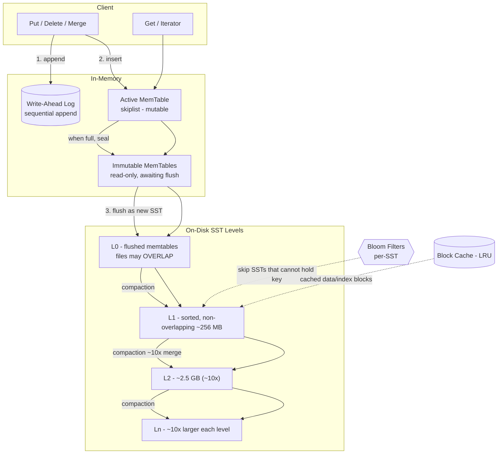
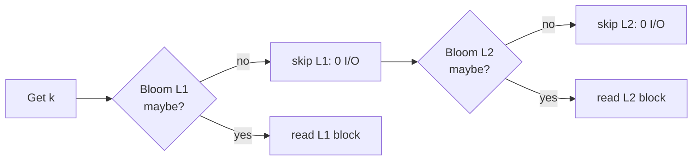

# RocksDB Architecture (LSM-Tree Storage Engine)

**Name:** Tirth Shah
**Roll Number:** 24BCS10347
**Course:** Advanced DBMS — System Design Discussion

---

## 1. Problem Background

### Origin

**RocksDB** is an embedded, persistent **key-value store** created at Facebook (Meta) in 2012 as a fork of Google's **LevelDB**. LevelDB itself was a compact LSM-tree library written by Jeff Dean and Sanjay Ghemawat, distilling ideas from BigTable's storage layer. Facebook forked it to address two practical gaps:

1. LevelDB was tuned for spinning disks and a single-threaded compaction model — it could not saturate modern **flash/SSD** I/O bandwidth or exploit multi-core CPUs.
2. It lacked production knobs: pluggable compaction, multi-threaded background work, column families, statistics, rate limiting, and a configurable block cache.

RocksDB is therefore best understood as **"LevelDB, re-engineered for fast storage and write-heavy server workloads."** It is a **library**, not a server: it links directly into the host process and exposes a `Get/Put/Delete/Merge/Iterator` API. In that sense it is the **"SQLite of key-value stores"** — an embeddable storage engine other systems build on top of.

### Where it is used

RocksDB is the storage substrate inside a surprising number of well-known systems:

| System | Role of RocksDB |
| --- | --- |
| **MyRocks** (MySQL storage engine) | Primary on-disk engine, replacing InnoDB's B-tree for space efficiency |
| **TiKV / TiDB** | Per-node local KV engine under a distributed Raft layer |
| **CockroachDB** (historically) | Local store before its in-house Pebble (a RocksDB-compatible re-implementation in Go) |
| **Apache Kafka Streams / ksqlDB** | Local state store for streaming aggregations |
| **Apache Flink** | RocksDB state backend for large keyed state with incremental checkpoints |
| **Ceph BlueStore** | Metadata store |

### The problem LSM-trees solve (vs B-trees)

A traditional **B+-tree** (InnoDB, classic relational engines) keeps data sorted in fixed-size pages and updates them **in place**. A write to a random key dirties a random page, which must eventually be written back. On a write-heavy workload this produces:

- **Random I/O** — terrible for HDDs, and on SSDs it amplifies the flash erase/program cycles (wear).
- **In-place mutation** — read-modify-write of a page even to change one row; page splits under inserts.
- **Write amplification at the device level** — small logical writes become full-page physical writes.

The **Log-Structured Merge-tree (LSM-tree)** (O'Neil et al., 1996) inverts this. Instead of updating data where it lives, it:

1. **Buffers writes in memory** (a sorted in-memory structure),
2. **Appends sequentially** to a write-ahead log for durability,
3. **Flushes the buffer as a new immutable sorted file** when full, and
4. **Merges files in the background** (compaction) to keep reads bounded and reclaim space.

The key insight: **random writes are converted into large sequential writes**. Sequential writes are exactly what flash and disk firmware handle best, and batching many logical updates into one big file write maximizes throughput. The cost is paid later, lazily, and in bulk by background compaction — a deliberate trade of *deferred, amortized* work for *cheap, immediate* writes.

---

## 2. Architecture Overview

RocksDB organizes data into an in-memory tier (MemTable + WAL) and an on-disk tier of immutable **SST files** arranged in levels **L0 … Ln**, each level roughly **10× larger** than the one above it.

### LSM data flow (write + read + compaction)



### Write path (fast, sequential)

```
Put(k,v)
   │
   ├─►  append (k,v,seq) to WAL  ──── fsync optional (durability knob)
   │
   └─►  insert into ACTIVE MemTable (skiplist)
              │
              │  active memtable reaches write_buffer_size
              ▼
        seal → IMMUTABLE MemTable  (new active memtable created)
              │
              │  background flush thread
              ▼
        write out a new L0 SSTable, then drop the WAL segment + immutable memtable
```

The foreground write touches only memory + a sequential log — it never seeks. That is why LSM ingest is fast.

### Read path (checks newest → oldest)

```
Get(k):
   1. Active MemTable          (newest data)
   2. Immutable MemTables
   3. L0 SSTs (newest first — may overlap, so check ALL of them)
   4. L1, L2 … Ln  (each level: 1 SST can possibly contain k)
        for each candidate SST:
            Bloom filter says "definitely not here"?  → skip (no I/O)
            else  → index block → data block (via Block Cache / disk)
   → return the value with the HIGHEST sequence number (or a tombstone = not found)
```

### Level structure (size ratio ~10×)

```
            ┌───────────────────────────────────────────────┐
   MemTable │  active + immutable (RAM, skiplist)            │
            └───────────────────────────────────────────────┘
   L0   [SST] [SST] [SST] [SST]   ← overlapping key ranges (each sorted internally)
   L1   [────────── non-overlapping SSTs, sorted, ~256 MB ──────────]
   L2   [──────────────── ~2.5 GB  (≈10× L1) ───────────────────────]
   L3   [────────────────────── ~25 GB (≈10× L2) ─────────────────────────]
   ...
   Ln   [── largest level, holds the bulk of the data ──]
```

Only **L0** allows files with overlapping key ranges (they are just sequential flushes of memtables). From **L1 downward**, the SSTs within a level **partition the keyspace with no overlap**, so at most one SST per level can contain a given key — this is what bounds read cost.

---

## 3. Internal Design

### 3.1 MemTable

The MemTable is the in-memory write buffer. The default implementation is a **skiplist**, chosen because it supports:

- **O(log n) ordered inserts** without rebalancing locks (lock-free reads, concurrent writes),
- **Sorted iteration**, needed because a flush must emit a sorted SST.

Key parameters and behavior:

- **`write_buffer_size`** (default 64 MB): when the active memtable reaches this size, it is sealed.
- **Active vs Immutable**: there is exactly one **active (mutable)** memtable receiving writes. When sealed it becomes **immutable (read-only)** and a fresh active memtable is created so writes never block on flush.
- **`max_write_buffer_number`**: how many memtables (active + immutable) may exist at once. If flush can't keep up and this limit is hit, writes stall — a back-pressure signal.
- Other memtable factories exist (hash-skiplist, vector) for specialized workloads, but skiplist is the default.

### 3.2 Write-Ahead Log (WAL)

Because the memtable lives in volatile RAM, durability comes from the **WAL**: every mutation is **appended to an on-disk log before/together with the memtable insert**. After a crash, RocksDB replays the WAL to reconstruct the lost memtables.

- The WAL is a **purely sequential append** — the cheap-write property.
- A WAL segment can be **recycled/deleted once its memtable has been flushed** to an SST (the data is now durable in the SST).
- **Sync vs non-sync writes**: with `WriteOptions::sync = false` (default), the write returns after the OS buffers the log — fast, but a power loss can lose the last few writes. With `sync = true`, RocksDB `fsync`s the WAL before returning — durable but slower. This is the classic durability/latency knob. (`disableWAL = true` gives the fastest, *non-durable* ingest, used for rebuildable data.)

### 3.3 SSTables (SST files)

An SSTable ("Sorted String Table") is an **immutable, sorted-on-key file**. Immutability is central: files are never edited, only created and later deleted by compaction. This makes them trivially cacheable, snapshot-friendly, and safe for concurrent reads.

**Block-based table format** (the default `BlockBasedTable`):

```
┌──────────────────────────────────────┐
│  Data block 1   (sorted KVs, ~4-32KB) │
│  Data block 2                         │
│  ...                                  │
│  Data block N                         │
├──────────────────────────────────────┤
│  Filter block   (Bloom filter bits)   │  ← "does this SST maybe hold key K?"
├──────────────────────────────────────┤
│  Index block    (key → data block)    │  ← binary search to find the block
├──────────────────────────────────────┤
│  Metaindex / properties               │
├──────────────────────────────────────┤
│  Footer (fixed size, points to index) │  ← entry point when opening the file
└──────────────────────────────────────┘
```

A point lookup in one SST: read footer → index block → (consult bloom filter) → one data block. Data blocks are individually compressed (Snappy/LZ4/ZSTD).

**Keys, sequence numbers, and MVCC.** Every internal key is `(user_key, sequence_number, type)`:

- The **sequence number** is a monotonically increasing global counter assigned at write time. Newer writes have larger sequence numbers.
- The **type** marks the entry as a value (`kTypeValue`) or a **tombstone** (`kTypeDeletion`).
- Within sorted order, the same `user_key` can appear multiple times with different sequence numbers — this is RocksDB's **MVCC**. A read returns the version with the largest sequence number ≤ the snapshot. Deletes are **not** in-place removals; they write a tombstone that *shadows* older values until compaction physically drops both.

### 3.4 Levels L0 … Ln

```
L0:  [10..50] [30..90] [5..40]    ← overlapping; a key may live in several files
                                     (just consecutive memtable flushes)

L1:  [0..99] [100..199] [200..299] ← disjoint ranges; binary-searchable
L2:  ~10× the size of L1, also disjoint
...
```

- **L0 overlap** exists because L0 files are raw memtable flushes — their key ranges can intersect. A point read therefore must check *all* L0 files (one reason `level0_file_num_compaction_trigger` keeps L0 small, default 4).
- **L1+ are non-overlapping**: compaction guarantees each level partitions the keyspace, so a binary search picks the single candidate SST per level. This bounds read amplification to roughly *(number of levels + L0 files + memtables)*.
- **Size-tiered vs leveled** describes how compaction picks files to merge (see §3.6).

### 3.5 Bloom Filters

A **Bloom filter** is a compact probabilistic set stored per SST (in the filter block). For a point lookup it answers: *"Is key K possibly in this SST?"*

- **"No" is exact** → the SST is skipped with **zero data-block I/O**.
- **"Yes" may be a false positive** → RocksDB reads the data block and may find nothing.

The false-positive rate (FPR) depends on **bits per key**:

| Bits/key | Approx. FPR |
| --- | --- |
| 6 | ~5–6% |
| **10 (default)** | **~1%** |
| 16 | ~0.05% |

The rule of thumb: **~10 bits/key ≈ 1% FPR**. The benefit is dramatic for keys that **don't exist** or are **sparse**: without bloom filters, a `Get` of a missing key would have to probe one SST per level (read each index + data block) and find nothing — pure wasted I/O. With bloom filters, ~99% of those SSTs are eliminated before any disk read. This is the single biggest lever on **read amplification** for point lookups.



### 3.6 Compaction

**Why compaction is needed:**

1. **Reclaim space** — overwritten values and tombstoned deletes occupy multiple SSTs until merged away.
2. **Bound read amplification** — without merging, the number of files (and L0 overlap) grows without limit, so every read scans more files.
3. **Resolve L0 overlap** — push overlapping L0 files down into disjoint, sorted levels.

Compaction reads several input SSTs, **merge-sorts** them, drops shadowed/deleted versions, and writes new output SSTs in the next level.

```
   Compaction (leveled):  pick 1 L1 file + all overlapping L2 files → merge → new L2 files
   ┌──────┐
   │ L1   │  [100..199]
   └──────┘        +
   ┌──────┐  ┌──────┐
   │ L2   │  │ L2   │  [100..149] [150..199]   (overlap the L1 range)
   └──────┘  └──────┘
        │  merge-sort, keep newest seq, drop tombstones if no older version remains
        ▼
   ┌──────┐  ┌──────┐
   │ L2'  │  │ L2'  │   rewritten, disjoint, compressed
   └──────┘  └──────┘
```

**Compaction styles:**

| Style | How it merges | Write amp | Space amp | Read amp | Best for |
| --- | --- | --- | --- | --- | --- |
| **Leveled** (default) | Merge a few files into the next, larger level; keep each level disjoint | **High** (~10–30×) | **Low** (~1.1×) | Low | General purpose, space-sensitive (MyRocks) |
| **Universal / size-tiered** | Merge similarly-sized runs together; fewer rewrites | **Low** | **High** (can ~2× during merge) | Higher | Write-heavy ingest, plenty of disk |
| **FIFO** | No merging; drop oldest SSTs when total size exceeds a cap | Lowest | n/a (data expires) | High | Time-series / cache where old data can be discarded |

**The amplification triangle (RUM conjecture).** Athanassoulis et al. (2016) formalize that any storage structure faces a three-way tension between **R**ead overhead, **U**pdate (write) overhead, and **M**emory/space overhead — **you can optimize for at most two; the third suffers.** LSM compaction is precisely the dial that chooses *where* on this triangle to sit:

```
                Read amplification
                       /\
                      /  \
                     /    \
        (B-tree:  ◄─/      \─► (Universal: low write-amp,
         low read,/          \   high space-amp)
         high write          \
        amp) ── Write amp ────── Space amp
              (Leveled: low space-amp, high write-amp)
```

### 3.7 Read path details

`Get(k)` walks newest-to-oldest and stops at the first match:

1. **Active memtable** → 2. **immutable memtables** → 3. **L0 SSTs (all, newest first)** → 4. **L1…Ln (one candidate SST each)**.
2. For each on-disk candidate: **bloom filter** (skip if "no") → **index block** (locate data block) → **block cache or disk** read of the data block.
3. Because multiple versions of `k` may exist across levels, the read merges by **sequence number** and returns the newest visible version (or treats a tombstone as "not found").

**Why range scans are costlier than point reads.** An iterator / range scan (`seek` + `next`) must produce keys in globally sorted order, so it **cannot use bloom filters** (they answer point membership, not "does this range overlap"). It must open an iterator on **every** memtable and **every** relevant SST across **all** levels and **merge them with a heap**. So a scan touches O(levels + L0 files) sources regardless, whereas a point read can prune almost all of them via bloom filters. Scans are merge-bound; points are filter-pruned.

### 3.8 Block cache and OS page cache

RocksDB keeps a **block cache** (default an **LRU**, with a **Clock**-based option for lower lock contention) holding **uncompressed data/index/filter blocks**:

- A hot block served from the block cache costs no syscall and no decompression.
- An optional **compressed block cache** can also cache compressed blocks to fit more in RAM.
- Below RocksDB sits the **OS page cache**: SST files read with buffered I/O are also cached by the kernel. To avoid **double caching** (same data in both block cache and page cache), production setups often use `O_DIRECT` (`use_direct_reads`) so RocksDB's block cache is the single source of truth, or conversely rely on the page cache and shrink the block cache. The two layers must be sized together.

---

## 4. Design Trade-Offs

### Why are LSM-trees preferred in write-heavy workloads?

- **Sequential, batched writes.** Foreground writes only append to the WAL and insert into an in-memory skiplist. Disk I/O happens in **large sequential SST writes** at flush/compaction time, never as scattered in-place page updates.
- **No in-place random page mutation.** A B-tree must locate, read, modify, and write back a random page per update (plus page splits). LSM never rewrites a page in place — it appends and merges later.
- **Amortization.** Thousands of logical updates are coalesced into one big sorted file, so per-write overhead is tiny. Flash devices and their FTL strongly prefer this access pattern (less garbage collection, less wear).

### Why can compaction become expensive?

Compaction **rewrites the same data multiple times** as a key migrates L0 → L1 → L2 → … Ln; in leveled compaction each level multiplies the bytes written, giving **write amplification of ~10–30×**. Consequences:

- **CPU + I/O bursts** — merge-sorting and recompressing large file sets competes with foreground traffic.
- **Write stalls / "compaction debt"** — if ingest outruns compaction, L0 files and immutable memtables pile up; once limits (`level0_slowdown/stop_writes_trigger`, `max_write_buffer_number`) are hit, RocksDB **throttles or blocks** foreground writes until compaction catches up.
- Mitigations: rate limiters, more background threads, subcompactions, and choosing a lower-write-amp compaction style at the cost of space/read amp.

### How do Bloom filters improve read performance?

They let a point lookup **skip SSTs that cannot contain the key** with zero data-block I/O. At the default ~10 bits/key (~1% FPR), ~99% of "key absent here" checks are answered from a small in-memory bitmap. This slashes **read amplification** — especially for **non-existent keys** and **sparse keys**, where a naïve LSM would otherwise probe one SST per level and find nothing.

### The three amplifications, and how compaction trades them

| Amplification | Definition | Leveled | Universal | FIFO |
| --- | --- | --- | --- | --- |
| **Write amp** | bytes written to disk ÷ bytes logically written | High (~10–30×) | Low | Lowest |
| **Read amp** | SSTs/blocks read per logical read | Low | Higher | High |
| **Space amp** | bytes on disk ÷ bytes of live data | Low (~1.1×) | High (~2× peak) | depends |

You pick a compaction style to land on two of the three (RUM conjecture). Leveled buys low space + low read amp by paying write amp; universal buys low write amp by paying space + read amp.

### LSM vs B-tree

| Dimension | LSM-tree (RocksDB) | B+-tree (InnoDB) |
| --- | --- | --- |
| Write pattern | Sequential append + background merge | In-place random page updates |
| Write amplification | High (compaction) | Lower (but full-page writes) |
| Read (point) | Memtable + bloom-pruned SSTs | O(log n) tree traversal, very predictable |
| Range scan | Merge across all levels (costlier) | Naturally clustered, leaf-linked, fast |
| Space efficiency | High; better compression of immutable blocks | Fragmentation, ~half-full pages |
| Delete | Tombstone, reclaimed at compaction | Immediate in-place |
| Best fit | Write-heavy, SSD, space-sensitive | Read-heavy, scan-heavy, low write rate |

### Point reads vs range scans

- **Point reads**: bloom-filter pruned, cheap, scale with bits/key.
- **Range scans**: heap-merge over all sources, no bloom help — favor B-trees or tune via prefix bloom filters / fewer levels.

### Key tuning knobs

- **`level0_file_num_compaction_trigger`, `max_bytes_for_level_multiplier`** (level size ratio, default 10) — shape the level pyramid and read/write-amp balance.
- **`compaction_style`** — Leveled vs Universal vs FIFO.
- **Bloom `bits_per_key`** — read amp vs memory.
- **`write_buffer_size`, `max_write_buffer_number`** — ingest burst absorption vs RAM.
- **`block_cache` size**, **compression** (LZ4/ZSTD), **rate limiter**.

---

## 5. Experiments / Observations

> **Representative (illustrative) figures from published `db_bench` benchmarks and RocksDB documentation.** The numbers below are **orders-of-magnitude figures drawn from the RocksDB wiki (Benchmarking / Performance Benchmarks, Compaction, and Tuning Guide) and the LSM literature**, reproduced to illustrate behavior. **They are NOT a live run on this machine** (RocksDB/db_bench is not installed here). Absolute values depend heavily on hardware, value size, and configuration; treat them as relative/illustrative.

### 5.1 Throughput & amplification: Leveled vs Universal

Illustrative `db_bench` style results (single node, NVMe SSD, ~100-byte values), per RocksDB performance-benchmark documentation:

| Workload (`db_bench`) | Leveled (ops/sec, illustrative) | Universal (ops/sec, illustrative) |
| --- | --- | --- |
| `fillrandom` (random write) | ~0.5–1.0 M | ~1.0–1.5 M |
| `overwrite` (random update) | ~0.3–0.6 M | ~0.6–0.9 M |
| `readrandom` (point read, hot cache) | ~1.0–2.0 M | ~0.7–1.2 M |

Resulting amplification (illustrative, from RocksDB Compaction/Tuning docs):

| Metric | Leveled (default) | Universal / size-tiered |
| --- | --- | --- |
| **Write amplification** | ~10–30× | ~4–10× (lower) |
| **Space amplification** | ~1.1× (low) | up to ~2× during merge (high) |
| **Read amplification** | low (1 SST/level + bloom) | higher (more overlapping runs) |

Interpretation: universal trades **more disk used** and **costlier reads** for **cheaper writes** — exactly the RUM trade-off in action.

### 5.2 Walk-through: how one key's value flows and gets rewritten (write amplification)

Suppose we `Put("user42", v1)`:

```
t0  Put → WAL append + active MemTable                         (written 1×)
t1  MemTable full → flush → SSTABLE in L0                       (rewritten → 2× total)
t2  L0 has too many files → compaction merges into L1          (rewritten → 3×)
t3  L1 exceeds size → compaction merges "user42" into L2       (rewritten → 4×)
t4  ... pushed down to L3, L4 ... Ln over time                 (rewritten each level)
```

The *same logical byte* is physically written once at flush and **again at every level it descends through**. With ~5–6 levels and the merge fan-in, total bytes written per logical byte reach the **~10–30×** quoted above — that is write amplification made concrete. (If `user42` is later overwritten or deleted, the old copy lingers across levels until a compaction that sees both versions drops the stale one.)

### 5.3 Effect of bloom filters on `readrandom` for non-existent keys

Illustrative `readrandom` against keys **known to be absent** (the worst case for an LSM), from RocksDB Bloom-filter documentation:

| Configuration | Data-block reads per missing-key lookup (illustrative) | Relative throughput |
| --- | --- | --- |
| **No bloom filter** | ~1 per level (e.g. 5–6 SSTs probed) | 1× (baseline) |
| **Bloom filter, 10 bits/key (~1% FPR)** | ~0.05 (≈99% of SSTs skipped) | several× to ~10× faster |

For a missing key, the bloom filter turns "read one data block per level" into "consult an in-memory bitmap and skip almost everything." This is the largest single read-amplification win an LSM offers and is why bloom filters are on by default.

> All §5 numbers are **representative/illustrative published figures** (RocksDB Wiki: *Performance Benchmarks*, *Compaction*, *RocksDB Bloom Filter*, *RocksDB Tuning Guide*) — **not measured on this host.**

---

## 6. Key Learnings

1. **LSM optimizes writes by sequentializing them.** Buffer in a memtable, log to a WAL, flush as a sorted immutable file — random writes become large sequential writes, ideal for SSDs and high ingest.
2. **The cost is deferred, not eliminated.** Compaction repays the debt later, producing **write amplification (~10–30× under leveled)** and occasional **write stalls / compaction debt** when ingest outruns merging.
3. **You cannot win all three amplifications (RUM conjecture).** Read, write, and space amplification trade off; the **compaction style is the dial** — leveled (low space/read, high write) vs universal (low write, high space/read) vs FIFO (drop old data).
4. **Bloom filters are the key read optimization.** At ~10 bits/key (~1% FPR) they let point lookups skip ~99% of SSTs with no I/O, crushing read amplification for absent and sparse keys.
5. **Point reads and range scans behave differently.** Points are bloom-pruned and cheap; **scans must merge across all levels with no bloom help**, so they are inherently costlier — a place where B-trees can win.
6. **Immutability buys simplicity.** Immutable SSTs make snapshots, caching, MVCC (via sequence numbers + tombstones), and concurrent reads straightforward — deletes are tombstones reclaimed lazily at compaction.
7. **Choose LSM vs B-tree by workload.** LSM for **write-heavy, space-sensitive, SSD** workloads (MyRocks, TiKV, Flink state); B-tree for **read/scan-heavy, low-write** workloads where predictable in-place updates and clustered scans matter.
8. **Memory layout is a system, not a setting.** Memtable size, level multiplier, bloom bits, block-cache size, compression, and OS page-cache interaction must be tuned **together** — they jointly determine where you land on the amplification triangle.

---

## References

1. **RocksDB Wiki — Architecture Guide / RocksDB Overview.** https://github.com/facebook/rocksdb/wiki/RocksDB-Overview
2. **RocksDB Wiki — Compaction (Leveled, Universal, FIFO).** https://github.com/facebook/rocksdb/wiki/Compaction
3. **RocksDB Wiki — RocksDB Bloom Filter.** https://github.com/facebook/rocksdb/wiki/RocksDB-Bloom-Filter
4. **RocksDB Wiki — Benchmarking / Performance Benchmarks (`db_bench`).** https://github.com/facebook/rocksdb/wiki/Benchmarking-tools and https://github.com/facebook/rocksdb/wiki/Performance-Benchmarks
5. **RocksDB Wiki — RocksDB Tuning Guide.** https://github.com/facebook/rocksdb/wiki/RocksDB-Tuning-Guide
6. **RocksDB Wiki — MemTable / Write Ahead Log / SST File Formats.** https://github.com/facebook/rocksdb/wiki
7. **O'Neil, Cheng, Gawlick, O'Neil (1996). "The Log-Structured Merge-Tree (LSM-Tree)."** *Acta Informatica* 33(4).
8. **Athanassoulis, Kester, Maas, Stoica, Idreos, Callaghan (2016). "Designing Access Methods: The RUM Conjecture."** *EDBT 2016* (Read–Update–Memory trade-off).
9. **Ghemawat, Dean — LevelDB** (RocksDB's predecessor). https://github.com/google/leveldb
