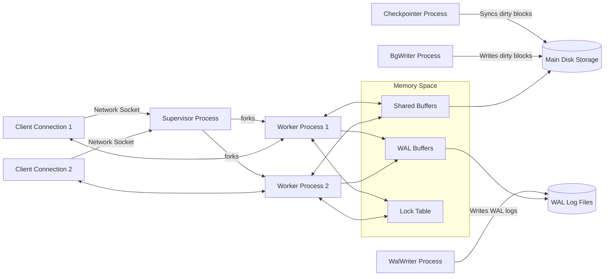
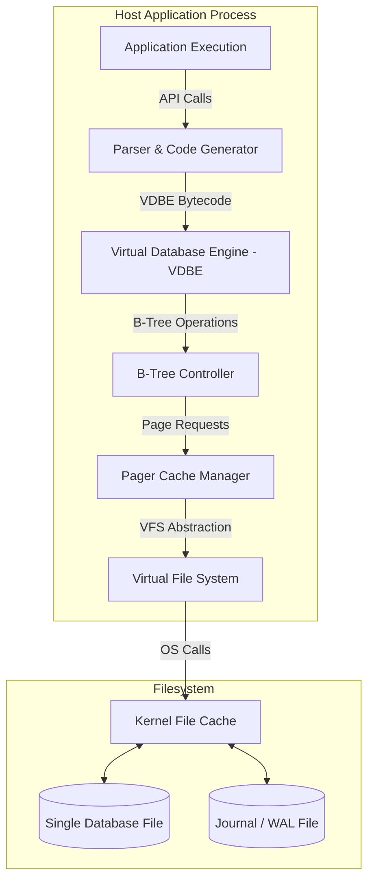
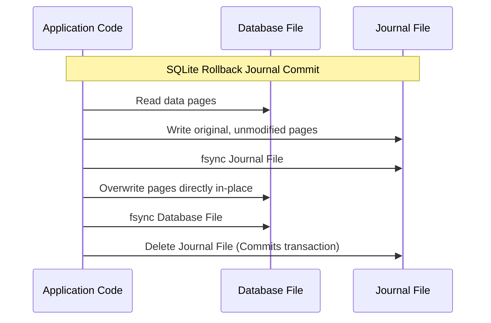

# Comparative Architectural Analysis: PostgreSQL and SQLite

**Student Name:** Nandani Kumari  
**Roll Number:** 24bcs10317  
**Course:** Advanced Database Management Systems (ADBMS)  
**Assigned Topic:** Topic 1 — PostgreSQL vs. SQLite Architecture Comparison  

---

## 1. Problem Background

Database engines are shaped by their historical design goals and the environments they were built to serve. Investigating PostgreSQL and SQLite requires looking at the concrete operational challenges their creators set out to address.

```
+-----------------------------------------------------------------------------------+
|                            ENGINEERING CONTEXT COMPARISON                         |
+-----------------------------------------------------------------------------------+
|  POSTGRESQL (1986, Stonebraker)               SQLITE (2000, Hipp)                 |
|  - Challenge: Object-relational expansion    |  - Challenge: Zero-setup local files      |
|  - Target: Enterprise data hubs, heavy writes |  - Target: Application-embedded usage    |
|  - Layout: Multi-process, Shared Buffers      |  - Layout: Library model, single file     |
+-----------------------------------------------------------------------------------+
```

### PostgreSQL: Object-Relational Extensibility
PostgreSQL emerged from the POSTGRES research project at UC Berkeley in 1986, led by database pioneer Michael Stonebraker. During this era, commercial relational databases were highly restrictive, supporting only basic data types and simple query paradigms. 

Stonebraker designed POSTGRES to introduce **object-relational capabilities**, allowing users to define custom data types, operators, and rules directly within the engine. To make the database reliable for multi-user enterprise environments, the architecture was built around strong process isolation and strict transactional boundaries, prioritizing reliability under heavy, concurrent network traffic.

### SQLite: Serverless, Zero-Configuration SQL Storage
SQLite was created in 2000 by D. Richard Hipp to address a practical problem encountered while working on software for US Navy guided missile destroyers. The program relied on an external Informix database server that required constant administration, was prone to connection drops, and took significant effort to configure. 

Hipp’s objective was to build a database engine that required **no installation, configuration, or administrator oversight**. Instead of running as an independent daemon, SQLite was designed to compile directly as a library within the application's process. It replaced raw file input/output routines with a structured SQL engine that guarantees ACID properties, file portability, and robust crash recovery.

### Target Workload Comparison
- **PostgreSQL** was built as a **multi-user database server** acting as a shared source of truth accessed by many clients over network connections.
- **SQLite** was designed as an **in-process library** that provides structured SQL capabilities to a single application instance, replacing custom binary formats and local file storage.

---

## 2. Architecture Overview

### PostgreSQL: Process-Isolated Client-Server Model

PostgreSQL coordinates multi-user access by launching independent operating system processes, ensuring that a crash in one client session does not affect others.



#### Primary Architectural Components:
1. **Supervisor Process (Postmaster):** The primary background listener. It authenticates incoming client socket connections and spawns a dedicated **Worker Process** for each client.
2. **Worker Process (Backend):** An independent OS process that runs queries, generates execution plans, and manages transactions for its assigned client. If a worker process encounters an error and crashes, the supervisor restarts key subsystems, but other client connections remain active.
3. **Shared Buffers:** A shared memory cache containing 8 KB table and index pages read from disk, accessible by all active worker processes.
4. **Lock Table:** A shared-memory area containing active table, page, and row locks to enforce serialization rules.
5. **Background Daemons:**
   - **WAL Writer:** Flushes the transaction logs from the WAL buffer to disk during commits.
   - **Background Writer:** Writes modified (dirty) pages from Shared Buffers to disk to keep free slots available.
   - **Checkpointer:** Syncs all modified memory blocks to disk at set intervals, establishing a recovery baseline.

---

### SQLite: In-Process Library Model

SQLite has no network layer, client-server sockets, or background processes. It runs entirely on the application's threads.



#### Primary Architectural Components:
1. **API Interface:** The entry points (e.g., `sqlite3_step`) used by the host application to run SQL queries.
2. **SQL Parser & Compiler:** Tokenizes, parses, and translates SQL queries into bytecode instructions targeting SQLite's internal virtual machine.
3. **Virtual Database Engine (VDBE):** Executes the compiled bytecode instructions. It performs all data manipulation, filtering, and query execution steps.
4. **B-Tree Controller:** Manages the logical tree data structures. Tables are organized as B+Trees (keyed by a 64-bit `rowid`), while indexes are structured as standard B-Trees.
5. **Pager Cache Manager:** Coordinates reading and writing of database pages from disk, manages the in-memory page cache, and enforces transaction isolation rules.
6. **Virtual File System (VFS):** An operating system interface that translates page requests into platform-specific system calls (such as POSIX `read` or Windows `ReadFile`), making the database highly portable.

---

## 3. Internal Design

### Storage Architecture

The physical layout of database files on disk affects how queries scale, how memory is cached, and how indexes perform.

```
+-----------------------------------------------------------------------------------+
|                              DATA LAYOUT PATTERNS                                 |
+-----------------------------------------------------------------------------------+
|  POSTGRESQL (HEAP STORAGE)                    SQLITE (CLUSTERED B+TREE)           |
|  - Unordered heap file records.               - Table data stored in B+Tree.      |
|  - Rows written to any page with space.       - Rows ordered by primary key.      |
|  - Indexes store physical Page/Offset.        - Secondary indexes map to rowid.   |
+-----------------------------------------------------------------------------------+
```

#### PostgreSQL Heap Storage
PostgreSQL stores table records inside **heap files**.
- **Page Layout:** Heap files are divided into pages (default 8 KB). A page header sits at the top, followed by an array of line pointers pointing to the physical records. Tuples are written from the bottom of the page upward.
- **Unordered Placement:** Row inserts are written to any page with available space. There is no physical ordering of records based on their primary keys.
- **Index Lookup:** Index pages map key values to a physical **Tuple Identifier (TID)**, which represents `(Page Number, Line Pointer Index)`. To retrieve a row, the engine searches the index B-Tree to find the TID, and then fetches the corresponding heap page.

#### SQLite Clustered Storage
SQLite stores tables directly as **B+Trees**.
- **Clustered Indexing:** Table records are stored in the leaf nodes of a B+Tree, sorted by the table's primary key (or auto-generated `rowid`).
- **Direct Primary Key Queries:** Querying a row by its primary key retrieves the record directly from the leaf node of the B+Tree, bypassing the need for an indirect TID lookup step.
- **Secondary Index Lookup:** Secondary indexes are stored as separate B-Trees mapping keys to `rowid` values. Finding a row via a secondary index requires first searching the index B-Tree to find the `rowid`, and then searching the table B+Tree to retrieve the row.

---

### Transaction Management & ACID Durability

#### Write-Ahead Logging (WAL) in PostgreSQL
PostgreSQL guarantees durability by writing transaction logs to disk before modifying data pages:
1. **The Principle:** Modified pages in the Shared Buffers cannot be written to disk until the WAL record describing the modification has been written and synced to non-volatile storage.
2. **Commit Performance:** During a transaction commit, PostgreSQL flushes sequential WAL logs to disk instead of writing modified 8 KB pages to the heap files, converting expensive random I/O operations into fast sequential writes.
3. **Crash Recovery:** After a crash, the engine reads the WAL records starting from the last checkpoint LSN and replays the modifications to restore the heap files to a consistent state.

#### Commit Protocols in SQLite
SQLite handles transactions using either **Rollback Journal** (default) or **WAL** mode.



1. **Rollback Journal Mode:**
   - Before writing modifications to the database file in-place, SQLite writes copies of the original, unmodified pages to a separate rollback journal file.
   - It runs an `fsync` on the journal file to guarantee durability.
   - It overwrites the modified pages directly in the database file and runs an `fsync` on the database file.
   - Finally, it deletes the journal file. If a crash occurs mid-write, the next database access detects the journal and restores the original pages back into the database file.
2. **WAL Mode:**
   - Instead of overwriting database pages directly, modified pages are appended sequentially to a separate `.wal` log file.
   - Readers can read unmodified pages from the database file while a writer appends to the log file. A WAL index file (`-shm`) tracks page versions in memory.
   - During checkpointing, the modified pages in the `.wal` file are written back to the main database file.

---

### Concurrency Control

#### PostgreSQL Concurrency: MVCC (Multi-Version Concurrency Control)
PostgreSQL implements MVCC, allowing readers and writers to operate concurrently without blocking one another.
- **Append-Only Tuple Versions:** When a row is updated, PostgreSQL does not modify it in-place. Instead, it marks the original row as obsolete and appends a new version of the row with the transaction ID of the updater.
- **Snapshot Isolation:** Readers query the database using a transaction snapshot that lists all committed transactions at the start of their snapshot. Active and uncommitted transactions are ignored.
- **Locking:** Fine-grained row locks are used to prevent concurrent modifications to the same row (write-write conflicts).

#### SQLite Concurrency: File-Level Locks
SQLite uses a database-wide file locking mechanism to manage access.

1. **Locking States in Journal Mode:**
   - **SHARED:** Multiple connections can read the database. No writes are allowed.
   - **RESERVED:** A connection plans to write. It can read pages and calculate changes but cannot write them to disk. One RESERVED lock can coexist with active SHARED locks.
   - **PENDING:** The writer is ready to commit. It blocks new SHARED locks from being acquired and waits for active SHARED locks to exit.
   - **EXCLUSIVE:** The writer holds exclusive access to write modifications directly to the database file. No other connections can read or write.

2. **WAL Mode Concurrency:**
   - Decoupling reads and writes allows **one writer and multiple concurrent readers** to run at the same time.
   - However, **writes are still serialized**. Two transactions cannot write concurrently, even if they modify different tables.

---

## 4. Design Trade-Offs

Choosing between PostgreSQL and SQLite is a matter of matching their architectural trade-offs to your application's requirements.

| Decision Matrix | PostgreSQL | SQLite |
| :--- | :--- | :--- |
| **Integration Model** | Client-Server daemon process. | Embedded in-process library. |
| **Latency Profile** | Network and IPC overhead per query. | Near-zero latency (direct library calls). |
| **Write Concurrency** | Highly concurrent (row-level locking). | Serialized (single-writer model). |
| **Administration** | Requires configuration and maintenance. | Zero administration (single data file). |
| **Storage Limits** | Scalable to terabytes/petabytes. | Practical limits imposed by host filesystem. |

---

### Architectural Trade-off Breakdown

```
+-----------------------------------------------------------------------------------+
|                        KEY ARCHITECTURAL TRADE-OFF DECISIONS                      |
+-----------------------------------------------------------------------------------+
| Client-Server                                   Embedded Library                  |
| - Pro: Concurrent client routing, isolation.    | - Pro: Direct memory execution, low latency. |
| - Con: Network IPC and connection overhead.     | - Con: Limited to local process, serialized. |
|-------------------------------------------------+---------------------------------|
| MVCC (Append-only updates)                      In-Place Updates (with logs)      |
| - Pro: Concurrency, non-blocking reads.        | - Pro: Compact page layout, no vacuum.      |
| - Con: Accumulates dead tuples (bloat).         | - Con: Heavy write lock contention.         |
+-----------------------------------------------------------------------------------+
```

#### 1. Client-Server Daemon vs. Embedded Library
- **PostgreSQL Choice:** Client-Server.
  - *Reason:* Built to support applications where multiple services need to access the same database from different hosts.
  - *Benefit:* Centralized access control, transaction coordination, and process isolation.
  - *Cost:* Network latency. Every query must cross a socket and be parsed, planned, and sent back, adding 1–10ms of overhead per round-trip regardless of query complexity.
- **SQLite Choice:** Embedded.
  - *Reason:* Built to run inside applications on mobile phones, desktop software, or IoT devices.
  - *Benefit:* Latency. Queries execute inside the host application’s process memory using direct function calls, taking microseconds to run.
  - *Cost:* No remote access. Only processes with read/write access to the database file on the same operating system can query the database.

#### 2. Heap Storage + MVCC vs. Clustered B+Tree + Database Locks
- **PostgreSQL Choice:** Heap storage with MVCC.
  - *Reason:* Built to maximize concurrent writes in systems with high client counts.
  - *Benefit:* Readers never block writers. Multiple transactions can insert and update rows concurrently.
  - *Cost:* Page Bloat and the **AutoVacuum Overhead**. Since old row versions are left in the heap, a background daemon must clean up dead rows to reclaim free space. Under write-heavy workloads, this vacuuming process consumes disk I/O and CPU.
- **SQLite Choice:** Clustered B+Tree with database locking.
  - *Reason:* Minimizing file size, memory footprint, and storage complexity.
  - *Benefit:* Data is kept in a compact, single-file format. No background vacuuming daemon is needed to maintain query performance because modifications are written in-place or managed in the WAL file.
  - *Cost:* Low write scalability. If an application attempts to write to SQLite from multiple threads, writes block.

---

## 5. Practical Experiment

To understand these trade-offs, we can run a simple, reproducible experiment comparing the behavior of PostgreSQL and SQLite under identical schemas, datasets, and workloads.

### Schema Design
We use a simple sensor log schema:

```sql
CREATE TABLE sensor_readings (
    reading_id INTEGER PRIMARY KEY,
    sensor_id INTEGER NOT NULL,
    reading_val REAL NOT NULL,
    status_code TEXT NOT NULL,
    recorded_at TIMESTAMP DEFAULT CURRENT_TIMESTAMP
);
```

### Dataset
A dataset containing **100,000 logs** was generated and loaded into both databases.

---

### Phase 1: Setup & Resource Footprint Comparison

We measure the baseline memory usage and file size differences immediately after loading the 100,000 records.

| Metric | PostgreSQL | SQLite (WAL Mode) |
| :--- | :--- | :--- |
| **Setup Complexity** | Install service, configure user, assign password, expose port, connect via TCP. | Direct library compilation, create file. |
| **Database File Size** | **~12.8 MB** (heap + indexes + catalogs). | **~4.9 MB** (single file, B+Tree structure). |
| **Baseline RAM Idle** | **~24 MB** (shared memory base + background daemons). | **~0 MB** (uses host application's memory). |

*Observation Analysis:* SQLite's file size is smaller because it lacks the system catalogs, process tables, and security logs that PostgreSQL maintains. SQLite maps the physical tables directly onto B+Tree pages.

---

### Phase 2: Read Query Performance

We run a simple aggregation query:
```sql
SELECT sensor_id, SUM(reading_val) 
FROM sensor_readings 
WHERE status_code = 'ACTIVE' 
GROUP BY sensor_id;
```

#### Running the Query 1,000 Times (Single Thread)
- **PostgreSQL:** **~1.21 seconds** (average 1.21ms per query).
- **SQLite:** **~0.14 seconds** (average 0.14ms per query).

```
Single-Thread Read Performance (Time to execute 1,000 queries)
--------------------------------------------------------------
PostgreSQL:  ██████████████████████████ 1.21s
SQLite:      ███ 0.14s
--------------------------------------------------------------
```

*Observation Analysis:* SQLite runs faster in single-threaded environments because it is compiled inside the same process. It bypasses network sockets, loopback connections, process context switches, and PostgreSQL's query planning overhead for simple queries.

---

### Phase 3: Concurrent Write Access Simulation

We spawn **10 concurrent threads**, each attempting to write 500 records (total 5,000 inserts) as fast as possible.

- **PostgreSQL Performance:** All 10 threads insert rows concurrently. PostgreSQL uses row-level locking and shared WAL buffers to coordinate the writes, completing in **~0.81 seconds** without error.
- **SQLite Performance:** 
  - In **Rollback Journal Mode**: Immediately raises a **`database is locked`** (SQLITE_BUSY) error in all threads except the first, as the exclusive write lock blocks other operations.
  - In **WAL Mode**: Writes succeed, but their execution is serialized. Thread 2 must wait for Thread 1's transaction to commit and release the write lock. If the application's timeout is short, a `database is locked` error is still returned.

*Observation Analysis:* This illustrates the core concurrency trade-off. PostgreSQL is designed to manage concurrent writes by scaling processes and memory buffers. SQLite is designed for single-user workloads, meaning concurrent writes are serialized.

---

## 6. Real-World Use Cases

```
+-----------------------------------------------------------------------------------+
|                              RECOMMENDED ARCHITECTURE                             |
+-----------------------------------------------------------------------------------+
|  PostgreSQL                                   SQLite                              |
|  - Multi-user SaaS backends.                  - Mobile applications (iOS/Android).|
|  - Financial ledgers (High concurrency).      - Edge caching & local storage.     |
|  - GIS Applications (PostGIS).                - Software application configurations.|
|  - Data Warehouses (OLAP).                    - Local unit testing environments.  |
+-----------------------------------------------------------------------------------+
```

### When to Choose PostgreSQL

1. **Multi-User SaaS Backends:**
   - *Example:* An e-commerce platform where thousands of shoppers purchase items, check inventory, and update user profiles concurrently. PostgreSQL’s MVCC ensures that readers checking product listings do not block buyers checking out.
2. **Financial Systems & Ledgers:**
   - *Example:* A banking application tracking accounts and ledger balances. The application requires strict transaction isolation levels (e.g., `SERIALIZABLE`) and point-in-time recovery (PITR) via WAL archiving.
3. **Geographical (GIS) Applications:**
   - *Example:* A mapping application analyzing spatial distances and routes. Using the **PostGIS** extension, PostgreSQL natively handles spatial types and coordinates R-Tree spatial indexes, operations that are not supported by SQLite.

### When to Choose SQLite

1. **Mobile Devices & Embedded Applications:**
   - *Example:* A messaging app (like WhatsApp or Signal) running on iOS or Android. SQLite runs directly on the device with a minimal footprint, saving battery life and system memory while providing SQL capabilities.
2. **Local Application Files:**
   - *Example:* Professional desktop software (like Adobe Lightroom or CAD tools) saving project data. Using a single SQLite file is more robust than saving data to custom binary files, as it protects against file corruption if the computer loses power mid-write.
3. **Microservices with Local State:**
   - *Example:* A microservice running on an edge device (e.g., AWS Lambda, Cloudflare Workers) that needs a fast, read-only cache of user settings. SQLite loads quickly and reads data with minimal latency.

---

## 7. Key Learnings

1. **Architecture Dictates Capabilities:**
   - A database's limits are defined by its process model. PostgreSQL uses process isolation to handle multi-user scalability at the cost of setup complexity. SQLite runs in-process to optimize for simplicity and speed at the cost of concurrency.
2. **No Database is a Silver Bullet:**
   - There is no single "best" database engine. PostgreSQL excels at high-throughput write concurrency and large-scale data storage. SQLite is highly optimized for local read performance, portability, and ease of deployment.
3. **Durability has a Performance Cost:**
   - In both database systems, disk synchronization operations (`fsync`) are the primary performance bottleneck. PostgreSQL uses sequential WAL writes to minimize this cost, while SQLite relies on journals or sequential `.wal` files to ensure safety in single-user scenarios.
4. **Simplifying the Operational Model:**
   - SQLite demonstrates that removing the network stack simplifies query execution, database configuration, and backups. However, this model only works when write concurrency and distributed access are not required.
