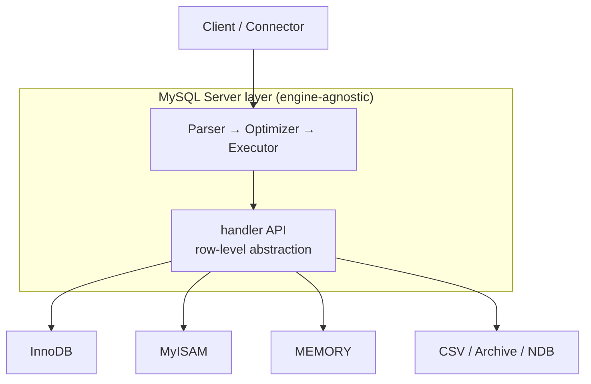
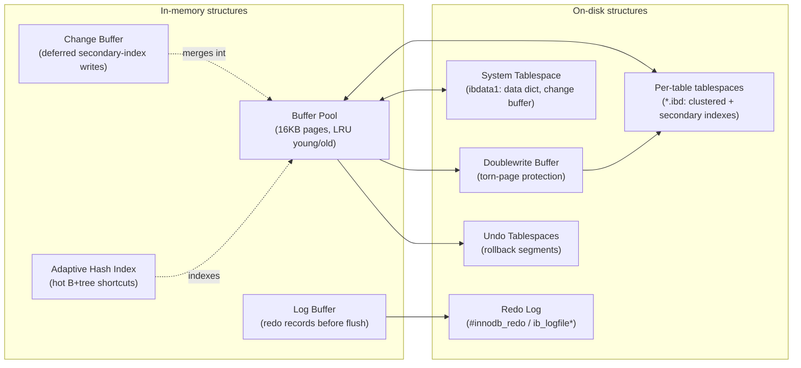
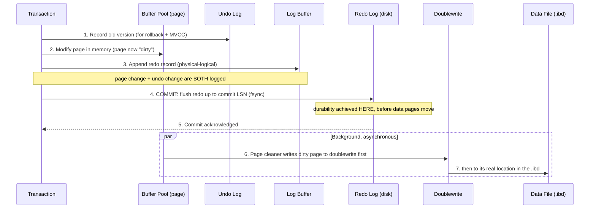
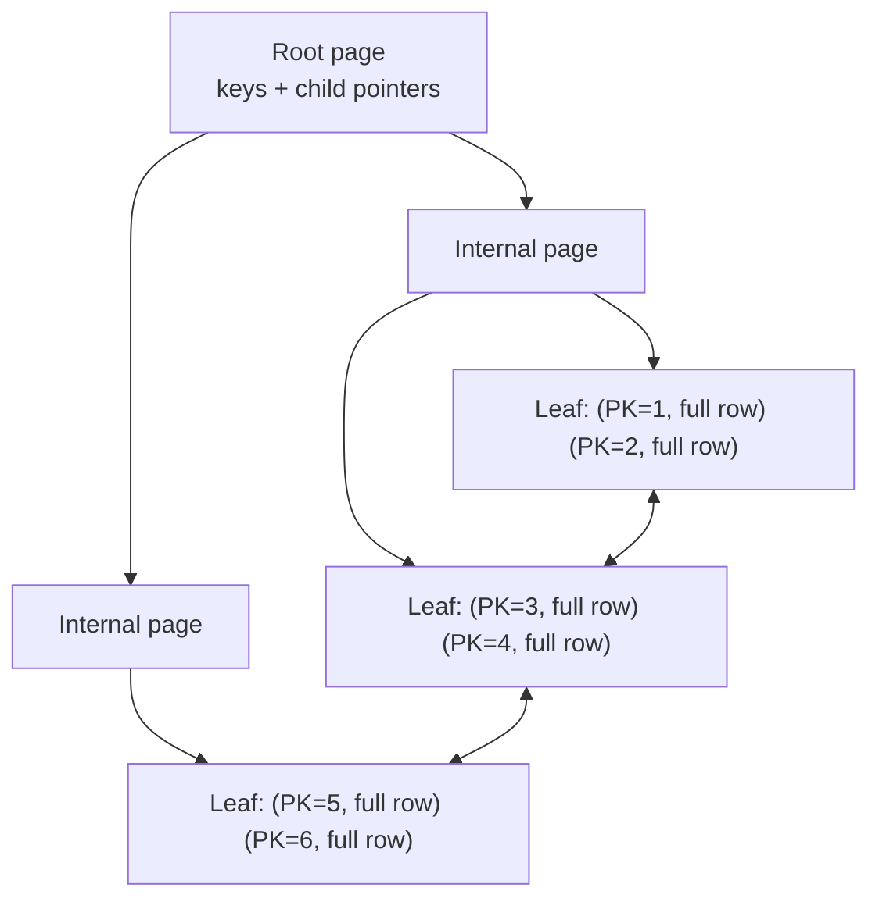
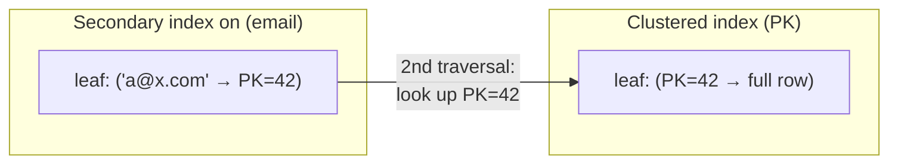
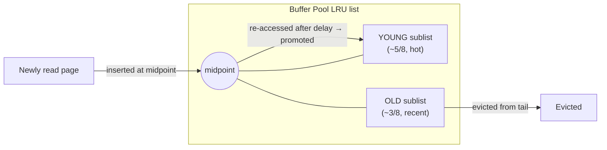
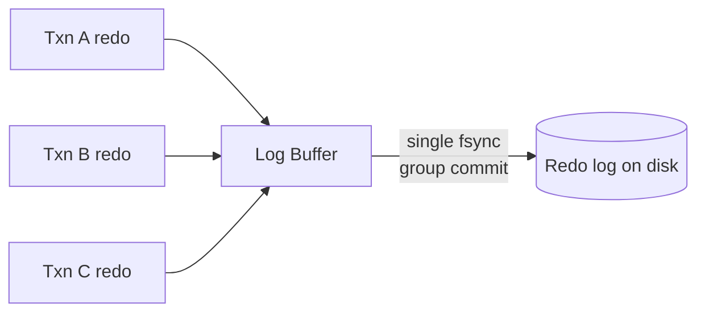
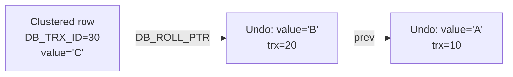
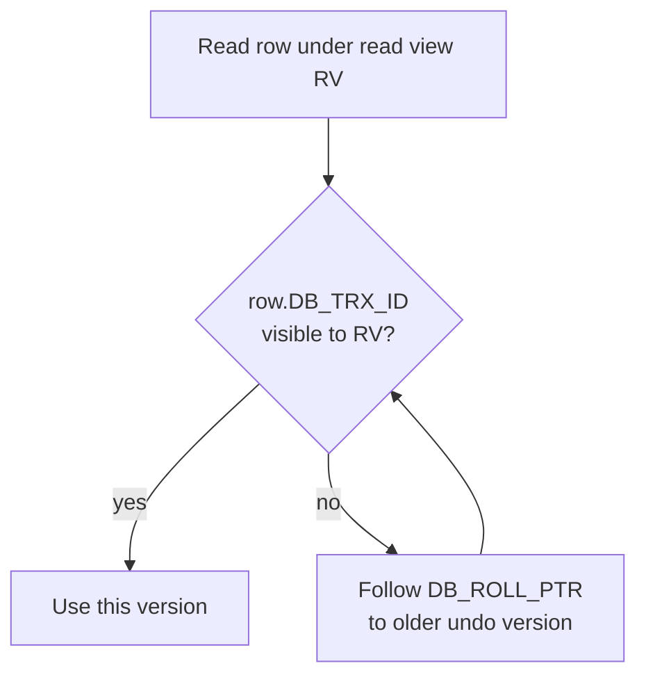

# MySQL / InnoDB Storage Engine — A Technical Analysis

> An architectural deep-dive into how InnoDB realizes ACID guarantees, multi-version
> concurrency, and durable storage on top of a clustered B+tree, and *why* its
> designers accepted the trade-offs they did.

---

## 1. Problem Background

### 1.1 MySQL is a layered system, not a monolith

MySQL is unusual among relational databases in that the **SQL layer** and the
**storage layer** are deliberately decoupled. The upper layers — connection
handling, the parser, the optimizer, the query executor — produce a stream of
*row-oriented* requests (`read this row`, `insert this row`, `update this index
entry`) that are serviced by a **pluggable storage engine** sitting underneath a
stable internal API (the `handler` interface).



This separation is the whole point: durability, locking, indexing, and crash
recovery are *not* dictated by the server. They are the responsibility of whichever
engine owns the table. The cost of this flexibility is that no cross-engine
transaction is truly first-class, and the optimizer reasons about an engine through
a relatively thin cost interface (it asks the engine for cardinality and cost hints
rather than understanding its internals).

### 1.2 Why MyISAM was not enough

MyISAM was MySQL's original default. It is fast for read-heavy, low-concurrency
workloads because it is almost laughably simple: data lives in a `.MYD` file, indexes
in a `.MYI` file, and there is no transactional machinery to pay for. But that
simplicity is exactly what made it unsuitable for serious OLTP:

| Requirement | MyISAM | Consequence |
|---|---|---|
| ACID transactions | **None** — no `COMMIT`/`ROLLBACK` | A multi-statement update can leave the table half-written |
| Crash recovery | **None** — relies on `myisamchk` repair | A crash mid-write corrupts the table; recovery is a full offline scan |
| Locking granularity | **Table-level** | One writer blocks all readers and writers of the table |
| Referential integrity | No foreign keys | Integrity enforced only in application code |
| Concurrency | Poor under mixed read/write | Write throughput collapses as concurrency rises |

### 1.3 Why InnoDB won

InnoDB was built to answer exactly those gaps, and since MySQL 5.5 it has been the
**default engine**. Its defining design choices are:

- **ACID via Write-Ahead Logging (WAL)** — a redo log guarantees durability without
  forcing every page to disk on commit, and an undo log guarantees atomic rollback.
- **Automatic crash recovery** — on restart InnoDB replays the redo log forward and
  rolls back uncommitted transactions, with no operator intervention.
- **Row-level locking + MVCC** — readers never block writers and writers never block
  readers for plain `SELECT`s, so concurrency scales.
- **A clustered B+tree storage model** — the table *is* its primary-key index, which
  makes primary-key point and range lookups extremely cheap.

The rest of this document is an analysis of *how* those four ideas are implemented
and *what they cost*.

---

## 2. Architecture Overview

InnoDB is best understood as two cooperating halves: a set of **in-memory structures**
that absorb the hot working set and buffer writes, and a set of **on-disk structures**
that provide durability and the canonical copy of the data.



### 2.1 Write / commit data flow

The single most important thing to internalize about InnoDB is that **a commit does
not write data pages to disk**. It writes a *log record*. The actual data pages are
flushed lazily, later, by background threads. This is the WAL discipline, and the
flow below shows it.



Steps 1–5 are on the critical path of a transaction. Steps 6–7 happen long after the
client has been told "committed." If the server crashes between step 5 and step 7,
recovery uses the redo log to reconstruct the data pages — which is exactly why the
commit is safe even though the data never reached its home location.

---

## 3. Internal Design

### 3.1 Clustered index: the table *is* a B+tree

In InnoDB there is no separate "heap" of rows plus indexes pointing into it. The
table's primary key is a **clustered index**, and that B+tree's **leaf pages hold the
complete rows**, in primary-key order. Non-leaf (internal) pages hold only key
prefixes plus child page pointers used for navigation.



Implications of this model:

- **Primary-key point lookups are one B+tree descent**, ending directly on the row —
  no second hop to a heap.
- **Primary-key range scans are sequential**: because rows are physically ordered by
  PK and leaf pages are doubly linked, `WHERE id BETWEEN 100 AND 200` reads adjacent
  pages with good locality.
- **The PK choice dictates physical layout.** Inserting in PK order (e.g. an
  auto-increment) appends to the rightmost leaf — cheap, dense pages. Inserting in
  *random* PK order (e.g. a random UUIDv4) scatters inserts across the tree, causing
  **page splits** and fragmentation, which wastes space and hurts cache locality.

**What if there is no explicit primary key?** InnoDB *insists* on having a clustered
key, so it picks one in this priority order:

1. The declared `PRIMARY KEY`.
2. Otherwise, the first `UNIQUE NOT NULL` index.
3. Otherwise, InnoDB synthesizes a hidden 6-byte monotonic row id and builds an
   internal clustered index called **`GEN_CLUST_INDEX`** keyed on `DB_ROW_ID`.

The hidden `DB_ROW_ID` is a *global* counter shared across tables, which can become a
mild contention point on insert-heavy schemas with no PKs — one practical reason to
always declare an explicit primary key.

### 3.2 Secondary indexes and the bookmark lookup

A secondary index is a separate B+tree keyed on the indexed column(s). Crucially, its
leaf entries do **not** store a physical row pointer (a page/offset). They store the
**primary-key value** of the row.



So a query like `SELECT * FROM users WHERE email = 'a@x.com'` performs **two** B+tree
descents: one in the secondary index to find `PK=42`, then a **bookmark lookup** in
the clustered index to fetch the row. Consequences:

- **Covering indexes eliminate the second hop.** If the index already contains every
  column the query needs (e.g. an index on `(email, name)` for `SELECT name ... WHERE
  email = ?`), InnoDB answers entirely from the secondary index — `EXPLAIN` shows
  `Using index`.
- **Fat primary keys bloat *every* secondary index.** Because the PK value is stored
  in every secondary-index leaf entry, a wide PK (say a 40-byte composite or a string
  UUID) is copied into all secondary indexes, multiplying their size and reducing how
  many entries fit per page. This is the strongest argument for a compact,
  monotonically increasing PK such as a `BIGINT` auto-increment.

Why store the PK rather than a physical pointer? Because InnoDB rows *move* — page
splits, merges, and row relocation during updates would invalidate physical pointers.
A logical PK reference survives relocation, at the cost of the extra traversal.

### 3.3 Buffer Pool

The buffer pool is InnoDB's in-memory cache of **16KB pages** (the default page size).
All reads and writes go through it; a page must be in the buffer pool to be touched.

The naïve cache-replacement policy is plain LRU, but plain LRU is catastrophically
vulnerable to **scan pollution**: a single large `SELECT *` table scan or an index
build would touch millions of pages once, evicting the genuinely hot working set.
InnoDB defends against this with a **midpoint-insertion LRU**:



- New pages enter at the **midpoint** (head of the *old* sublist), not the head of the
  whole list. A one-shot scan therefore churns only the old sublist and never displaces
  the hot young sublist.
- A page is promoted to the young sublist only if it is re-accessed *after a short time
  window* (`innodb_old_blocks_time`), which filters out the rapid same-page re-reads of
  a single scan.

Pages that have been modified are **dirty**; they are tracked on a separate **flush
list** ordered by oldest modification LSN. **Page cleaner threads** flush dirty pages
to disk in the background, throttled by the adaptive flushing algorithm so that I/O is
smoothed rather than bursty. Eviction and flushing are decoupled: a clean page can be
evicted immediately; a dirty page must be flushed first.

### 3.4 Redo log: physical-logical WAL

The redo log makes durability cheap. Its design is **physical-logical**: physical in
that records refer to a specific page, logical in that they describe the *operation*
applied to that page (e.g. "insert this record into page N at this slot") rather than a
literal byte image. This is more compact than full physical page images.

Key concepts:

- **LSN (Log Sequence Number)** — a monotonically increasing byte offset into the redo
  log stream. Every page carries the LSN of its last modification; every redo record
  has an LSN. The LSN is the global clock that orders all changes.
- **Write-ahead rule** — before a dirty data page may be written to its data file, all
  redo records up to that page's LSN must already be durably on disk. This is what makes
  recovery possible.
- **Group commit** — many concurrent transactions' redo records are batched into a
  single `fsync`. Instead of N commits causing N syncs, they coalesce into one,
  amortizing the most expensive operation in the system.



**Crash recovery** is a roll-forward then roll-back:

1. Find the last **checkpoint** LSN (checkpointing periodically advances a marker
   guaranteeing all changes before it are in the data files).
2. **Redo (roll-forward):** replay every redo record from the checkpoint LSN to the end
   of the log, reapplying changes to pages. This re-creates the in-memory state at
   crash time, including changes from transactions that never committed.
3. **Undo (roll-back):** use the undo logs to roll back any transactions that were not
   committed at crash time.

**Doublewrite buffer — torn-page protection.** A 16KB InnoDB page is larger than the
typical 4KB filesystem/device atomic write unit, so a crash mid-write can leave a
**torn page** (half old, half new) that redo *cannot* repair, because redo assumes a
consistent base page to apply its logical delta to. InnoDB solves this by first writing
the page to a sequential **doublewrite buffer** area, `fsync`-ing it, and *then* writing
it to its real location. On recovery, if a page's checksum is bad, InnoDB restores the
intact copy from the doublewrite buffer. The cost is writing each page twice — but the
doublewrite area is sequential and batched, so the overhead is far less than 2x.

### 3.5 Undo logs

Undo logs store the information needed to **reverse** a modification. They live in
**undo tablespaces** organized into **rollback segments**. Undo serves two distinct
purposes:

1. **Transaction rollback** — `ROLLBACK` (or crash-recovery rollback of uncommitted
   transactions) applies undo records in reverse to restore the prior state.
2. **MVCC read reconstruction** — undo records form a *version chain* used to rebuild
   older row versions for consistent reads (see §3.6).

This dual use is enabled by two **hidden columns** InnoDB adds to every clustered row:

- **`DB_TRX_ID`** (6 bytes) — the id of the transaction that last modified the row.
- **`DB_ROLL_PTR`** (7 bytes) — a "roll pointer" to the undo record holding the
  *previous* version of this row. Following `DB_ROLL_PTR` repeatedly walks back through
  the version chain.



**Purge threads** clean up undo that is no longer needed by any open read view, and
also physically remove rows that were *delete-marked* (InnoDB does not erase a deleted
row immediately, because an older transaction's read view might still need to see it).
If long-running transactions hold open read views, purge stalls and undo accumulates —
this is the InnoDB analogue of PostgreSQL's bloat problem, but bounded to the undo
tablespaces rather than the table heap.

### 3.6 MVCC, Oracle-style

InnoDB updates rows **in place** in the clustered index and pushes the *old* version
into the undo log. This is the "Oracle-style" or **rollback-segment** MVCC model, in
contrast to PostgreSQL's append-a-new-tuple model.

A **read view** is a snapshot of which transactions were active at a point in time. For
a consistent nonlocking read, InnoDB walks the version chain for each row:



- Under **REPEATABLE READ** (the default), a read view is established at the first
  consistent read of the transaction and reused, so the whole transaction sees one
  stable snapshot.
- Under **READ COMMITTED**, a *fresh* read view is taken at the start of each statement,
  so each statement sees the latest committed data.

Because readers reconstruct old versions from undo rather than taking locks, plain
`SELECT`s are **consistent nonlocking reads**: they never block, and never block
writers.

### 3.7 Locking and transactions

For statements that *must* lock (writes, `SELECT ... FOR UPDATE`, `... FOR SHARE`),
InnoDB uses fine-grained **row-level locking** implemented as locks on **index
records**, not on the rows themselves — which is why locking behavior depends heavily
on which index the query uses.

Lock types:

| Lock | What it locks | Purpose |
|---|---|---|
| **Record lock** | A single index record | Protects an existing row |
| **Gap lock** | The open interval *between* index records | Prevents inserts into the gap (phantom prevention) |
| **Next-key lock** | A record **plus** the gap before it | The default locking unit under REPEATABLE READ |
| **Shared (S)** | Allows concurrent readers, blocks writers | `FOR SHARE` |
| **Exclusive (X)** | Blocks all other lockers | `FOR UPDATE`, writes |
| **Intention (IS/IX)** | Table-level flag of intent to lock rows | Cheap conflict check before a table-level operation (e.g. DDL) |

**Phantom prevention via next-key locks.** A *phantom* is a row that appears (or
disappears) within a range between two reads of the same transaction. By locking not
just matched records but also the **gaps** around them, a range query like `SELECT ...
WHERE id BETWEEN 10 AND 20 FOR UPDATE` prevents any *new* row with `id` in that range
from being inserted by another transaction — so the second read sees no phantoms. This
lets InnoDB deliver something close to serializable behavior for range queries while
remaining at REPEATABLE READ.

**Isolation levels:**

| Level | Dirty read | Non-repeatable read | Phantom | InnoDB behavior |
|---|---|---|---|---|
| READ UNCOMMITTED | possible | possible | possible | Reads latest (possibly uncommitted) versions |
| READ COMMITTED | no | possible | possible | Fresh read view per statement; mostly record locks, fewer gap locks |
| **REPEATABLE READ** *(default)* | no | no | **prevented** | One read view per txn; next-key locking suppresses phantoms |
| SERIALIZABLE | no | no | no | Plain `SELECT` implicitly becomes `FOR SHARE`; maximum locking |

InnoDB's choice of **REPEATABLE READ** as the default is itself a trade-off: it is
stronger than the SQL-standard default of READ COMMITTED (and stronger than what most
other engines default to), achieved at the cost of more gap/next-key locking and a
higher chance of lock-wait contention on range-heavy write workloads.

---

## 4. Design Trade-Offs

### 4.1 The headline comparison: InnoDB vs PostgreSQL

The most illuminating way to understand InnoDB's choices is to contrast them with
PostgreSQL, which made nearly the opposite decision at every storage-layer fork.

| Dimension | **InnoDB** | **PostgreSQL** |
|---|---|---|
| Row update strategy | **In-place update**; old version pushed to undo | **Append-only**: every update writes a *new* tuple version into the heap |
| Old-version storage | **Undo logs** (separate undo tablespaces) | Old tuples kept **inline in the heap** until cleaned |
| MVCC model | Oracle-style; reconstruct old versions by walking undo via `DB_ROLL_PTR` | Tuple versioning; each tuple carries `xmin`/`xmax` visibility info |
| Garbage collection | **Purge threads** remove dead undo + delete-marked rows | **VACUUM** reclaims dead tuples; `autovacuum` runs it |
| Table physical layout | **Clustered** on the primary key (table IS the B+tree) | **Non-clustered heap**; all indexes (incl. PK) are secondary, point to a `ctid` (physical tuple id) |
| Index leaf reference | Secondary leaves store the **PK value** → bookmark lookup | All index leaves store the physical `ctid` directly |
| Bloat behavior | Undo grows; bounded, cleaned by purge | Heap and indexes bloat with dead tuples until VACUUM |
| HOT-path optimization | n/a (in-place) | **HOT updates** avoid new index entries if no indexed column changed |
| Long-running readers | Stall **purge** → undo growth | Stall **VACUUM** → heap bloat (and potential txid wraparound pressure) |

### 4.2 Why InnoDB needs *both* undo and redo logs

These two logs answer fundamentally different questions and cannot substitute for each
other:

- **Redo log → durability and forward recovery.** It answers: "the commit was
  acknowledged but the data pages hadn't been flushed when we crashed — how do I get
  those changes back?" Redo *replays* committed work that hadn't reached the data files.
- **Undo log → atomicity, rollback, and MVCC.** It answers two questions: "this
  transaction must be aborted — how do I reverse its changes?" and "a reader needs the
  row as it was *before* this change — where is that old version?"

After a crash, recovery uses **both in sequence**: redo rolls everything *forward* to
the crash-time state (including changes from transactions that never committed, because
their dirty pages may have been flushed), then undo rolls *back* exactly those
uncommitted transactions. Without redo you lose committed durability; without undo you
lose atomicity and MVCC. They are orthogonal, not redundant.

### 4.3 The clustering trade-off

Clustering is not a free win — it is a deliberate optimization of one access pattern at
the expense of another:

- **Win — PK range and point access.** Rows ordered by PK make `WHERE pk BETWEEN ...`
  a sequential leaf scan with excellent locality, and a point lookup terminates *on* the
  row with no heap hop.
- **Cost — every secondary lookup pays a bookmark lookup**, and every secondary index
  pays the size of the PK in each leaf entry (§3.2). On a secondary-index-heavy schema
  with a fat PK, this overhead is pervasive.
- **Cost — insert ordering matters enormously.** Sequential PK inserts append densely;
  random PK inserts (random UUIDs) cause page splits, low fill factor, fragmentation,
  and dirty-page write amplification. PostgreSQL's heap is comparatively indifferent to
  PK insert order because the heap is unordered.

This is why the canonical InnoDB advice is: *use a compact, monotonically increasing
primary key, and reach for covering indexes to avoid bookmark lookups on hot read
paths.*

### 4.4 Why PostgreSQL chose differently, and what it bought/cost

PostgreSQL's append-only heap means an update never has to find and rewrite an old
version in place, and old versions are simply dead tuples sitting in the heap with their
`xmax` set. This makes the *write* path conceptually simple and makes rollback almost
free (just mark the new tuple invisible). But it pushes the cost to two places:

- **Bloat + VACUUM:** dead tuples accumulate in the heap and indexes and must be
  reclaimed asynchronously by VACUUM; neglected, this wastes space and degrades scans.
  InnoDB localizes the equivalent garbage to the undo tablespaces, and a delete-marked
  clustered row is purged in place — the live table stays compact.
- **Indexes point at physical tuples (`ctid`)**, so when a tuple moves (a non-HOT
  update), *every* index must get a new entry. InnoDB's logical PK references mean
  secondary indexes are untouched by clustered-row relocation, but every secondary read
  pays the bookmark lookup.

Neither model is universally superior. InnoDB optimizes for compact tables and cheap PK
access with a constant per-read secondary cost; PostgreSQL optimizes for cheap updates
and uniform index access with a deferred, batched cleanup cost. The "right" choice is
workload-dependent, which is the central lesson of this comparison.

---

## 5. Experiments / Observations

> The outputs below are realistic illustrative examples. Run them against a local
> MySQL 8.x instance to reproduce the behavior.

### 5.1 Setup

```sql
CREATE TABLE users (
  id      BIGINT       NOT NULL AUTO_INCREMENT,  -- compact, monotonic PK
  email   VARCHAR(128) NOT NULL,
  name    VARCHAR(128) NOT NULL,
  city    VARCHAR(64)  NOT NULL,
  PRIMARY KEY (id),
  KEY idx_email (email),               -- secondary index
  KEY idx_city_name (city, name)       -- composite, can cover some queries
) ENGINE=InnoDB;
```

### 5.2 Clustered (PK) access vs secondary-index access

```sql
EXPLAIN SELECT * FROM users WHERE id = 42;
```
```text
+----+-------+-------+---------+---------+-------+------+-------+
| id | type  | table | key     | key_len | ref   | rows | Extra |
+----+-------+-------+---------+---------+-------+------+-------+
|  1 | const | users | PRIMARY | 8       | const |    1 | NULL  |
+----+-------+-------+---------+---------+-------+------+-------+
```
`key = PRIMARY` and `type = const`: a single clustered-index descent lands directly on
the full row. No bookmark lookup.

```sql
EXPLAIN SELECT * FROM users WHERE email = 'a@x.com';
```
```text
+----+------+-------+-----------+---------+-------+------+-------+
| id | type | table | key       | key_len | ref   | rows | Extra |
+----+------+-------+-----------+---------+-------+------+-------+
|  1 | ref  | users | idx_email | 130     | const |    1 | NULL  |
+----+------+-------+-----------+---------+-------+------+-------+
```
Here the optimizer uses `idx_email` to find the PK, then performs a **bookmark lookup**
into the clustered index to fetch `name`, `city`, etc. The second traversal is implicit
in `SELECT *`; the absence of `Using index` in `Extra` is the tell.

### 5.3 Demonstrating a covering index

```sql
-- Only needs (city, name) — both present in idx_city_name
EXPLAIN SELECT name FROM users WHERE city = 'Pune';
```
```text
+----+------+-------+---------------+---------+-------+------+-------------+
| id | type | table | key           | key_len | ref   | rows | Extra       |
+----+------+-------+---------------+---------+-------+------+-------------+
|  1 | ref  | users | idx_city_name | 258     | const |   12 | Using index |
+----+------+-------+---------------+---------+-------+------+-------------+
```
`Extra = Using index` confirms the query is answered **entirely from the secondary
index** — no bookmark lookup into the clustered index. This is the single most
impactful read optimization in InnoDB.

### 5.4 Observing gap / next-key locks

Under the default REPEATABLE READ, open two sessions:

```sql
-- Session 1
START TRANSACTION;
SELECT * FROM users WHERE id BETWEEN 10 AND 20 FOR UPDATE;  -- takes next-key locks

-- Session 2 (blocks): the gap (10,20] is locked against new inserts
INSERT INTO users (id, email, name, city) VALUES (15, 'p@x.com', 'P', 'Pune');
```

Inspect the locks:

```sql
SELECT engine_transaction_id, lock_type, lock_mode, lock_status, lock_data
FROM performance_schema.data_locks WHERE object_name = 'users';
```
```text
+-----------------------+-----------+---------------+-------------+-----------+
| engine_transaction_id | lock_type | lock_mode     | lock_status | lock_data |
+-----------------------+-----------+---------------+-------------+-----------+
| 4231                  | TABLE     | IX            | GRANTED     | NULL      |
| 4231                  | RECORD    | X             | GRANTED     | 10        |
| 4231                  | RECORD    | X             | GRANTED     | 20        |  <- next-key
| 4231                  | RECORD    | X,GAP         | WAITING(S2) | 15        |  <- gap lock
+-----------------------+-----------+---------------+-------------+-----------+
```
The `X,GAP` lock and the blocked insert demonstrate phantom prevention. The same
information appears under the `TRANSACTIONS` heading of:

```sql
SHOW ENGINE INNODB STATUS\G
```
```text
------------
TRANSACTIONS
------------
---TRANSACTION 4231, ACTIVE 7 sec
2 lock struct(s), heap size 1136, 3 row lock(s)
... RECORD LOCKS space id 58 ... index PRIMARY of table `test`.`users`
   lock_mode X locks gap before rec ...
```

### 5.5 Inspecting the buffer pool

```sql
SHOW ENGINE INNODB STATUS\G
```
```text
----------------------
BUFFER POOL AND MEMORY
----------------------
Total large memory allocated 137428992
Buffer pool size   8192          -- pages (8192 * 16KB = 128MB)
Free buffers       512
Database pages     7400
Old database pages 2718          -- the OLD sublist (midpoint LRU)
Modified db pages  143           -- dirty pages awaiting flush
Pages made young 90213, not young 1820114
Buffer pool hit rate 998 / 1000  -- 99.8% of reads served from memory
LRU len: 7400, unzip_LRU len: 0
```
Reading this: the `Old database pages` line is the size of the old sublist that
protects against scan pollution; `Modified db pages` are the dirty pages the page
cleaners will flush; the `hit rate` is the headline health metric — a sustained low hit
rate means the working set does not fit in the buffer pool.

---

## 6. Key Learnings

**Why does InnoDB need both undo and redo logs?**
Because they solve disjoint problems. Redo provides **durability and forward recovery**
— it replays committed (and even uncommitted-but-flushed) work after a crash so the WAL
discipline can defer data-page writes off the commit path. Undo provides **atomicity
and MVCC** — it reverses aborted transactions and reconstructs prior row versions for
consistent reads. Recovery literally needs both, in sequence: redo rolls forward, undo
rolls back. Neither can be derived from the other.

**What advantages do clustered indexes provide?**
Primary-key point lookups terminate directly on the full row (no heap indirection), and
PK range scans become sequential leaf-page reads with strong cache and I/O locality.
The price — paid willingly — is a bookmark lookup on every non-covering secondary read
and the propagation of the PK's width into every secondary index. The whole engine
rewards a compact, monotonic PK and punishes random ones with page-split fragmentation.

**Why did PostgreSQL choose a different MVCC model?**
PostgreSQL's append-only heap makes updates and rollbacks structurally simple and gives
every index a uniform physical-pointer access pattern (no bookmark lookups), but it
defers cleanup to VACUUM and accepts table/index **bloat** as the cost. InnoDB's
in-place + undo model keeps the live table compact and localizes garbage to undo
tablespaces cleaned by **purge**, but pays a constant per-read secondary cost and is
sensitive to insert ordering. The two designs are mirror images: each makes one side of
the read/write/cleanup triangle cheap by spending on another. There is no free lunch —
only a choice of which workload to favor.

**Surprising / practical takeaways:**

- **A commit writes a log record, not data pages.** Internalizing the WAL flow
  reframes most performance intuition: commit latency is dominated by redo `fsync`
  (hence the value of group commit), not by writing the rows.
- **Locking lives on index records.** The same query takes wildly different locks
  depending on which index it uses; "row locking" is really "index-record locking."
- **The doublewrite buffer exists purely because 16KB pages aren't atomically
  written.** It is a quiet but essential correctness mechanism, not a performance one.
- **Long-running transactions are dangerous in *both* engines** — they stall purge
  (InnoDB) or VACUUM (PostgreSQL). The failure mode differs (undo growth vs heap bloat)
  but the root cause — an old read view pinning old versions — is the same.

---

## References

1. MySQL 8.0 Reference Manual — *InnoDB Storage Engine* (Ch. 17),
   https://dev.mysql.com/doc/refman/8.0/en/innodb-storage-engine.html
2. MySQL 8.0 Reference Manual — *InnoDB Architecture* and *In-Memory / On-Disk
   Structures*, https://dev.mysql.com/doc/refman/8.0/en/innodb-architecture.html
3. MySQL 8.0 Reference Manual — *Clustered and Secondary Indexes*,
   https://dev.mysql.com/doc/refman/8.0/en/innodb-index-types.html
4. MySQL 8.0 Reference Manual — *InnoDB Buffer Pool* and the midpoint-insertion LRU,
   https://dev.mysql.com/doc/refman/8.0/en/innodb-buffer-pool.html
5. MySQL 8.0 Reference Manual — *InnoDB Locking and Transaction Model* (record, gap,
   next-key locks; isolation levels),
   https://dev.mysql.com/doc/refman/8.0/en/innodb-locking-transaction-model.html
6. MySQL 8.0 Reference Manual — *Consistent Nonlocking Reads* and *Multi-Versioning*,
   https://dev.mysql.com/doc/refman/8.0/en/innodb-multi-versioning.html
7. MySQL 8.0 Reference Manual — *Redo Log*, *Undo Logs*, and *Doublewrite Buffer*,
   https://dev.mysql.com/doc/refman/8.0/en/innodb-redo-log.html
8. PostgreSQL Documentation — *Concurrency Control (MVCC)* and *Routine Vacuuming*,
   https://www.postgresql.org/docs/current/mvcc.html
