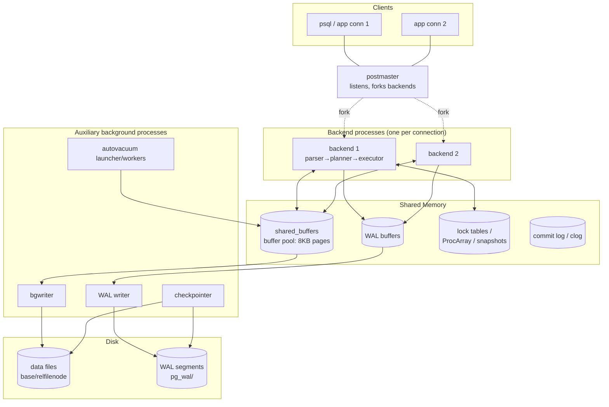
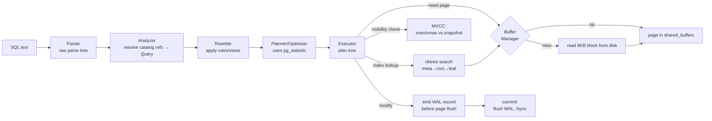
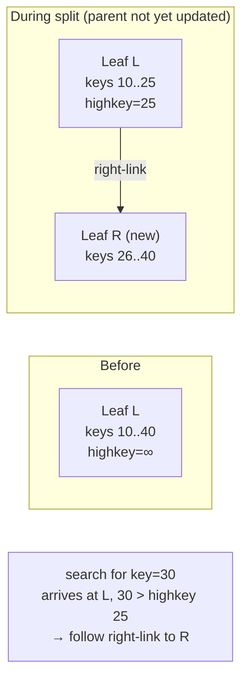
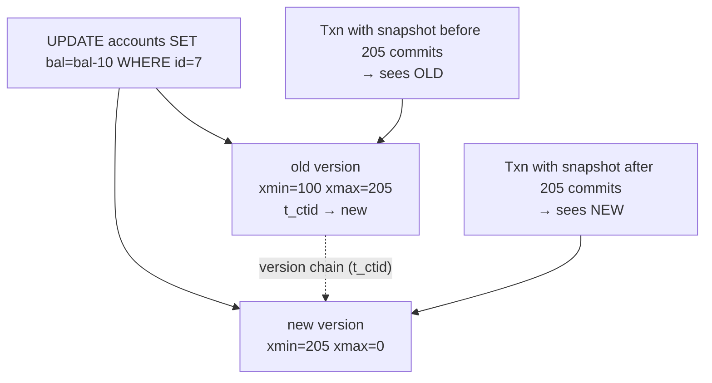

# PostgreSQL Internal Architecture — A Technical Analysis

> Advanced DBMS assignment. The aim of this document is not to re-document PostgreSQL,
> but to reason about *why* its internals are shaped the way they are, what trade-offs
> were consciously accepted, and how the major subsystems (buffer manager, B-tree,
> MVCC, WAL, VACUUM, planner statistics) cooperate to deliver a robust, extensible,
> ACID, multi-user RDBMS. Source-tree paths refer to the PostgreSQL backend tree
> (`src/backend/...`) so each claim can be traced to real code.

---

## 1. Problem Background

A general-purpose relational database has to satisfy a set of requirements that are
individually reasonable but collectively in tension:

- **Durability** — once a transaction commits, its effects must survive a crash, a power
  loss, or an OS panic. The data on disk must always be recoverable to a consistent state.
- **Atomicity & consistency** — a transaction either applies fully or not at all, and
  integrity constraints must hold across the visible state.
- **Multi-user concurrency** — many sessions read and write simultaneously, and readers
  must not block writers (and vice-versa) if we want acceptable throughput.
- **Isolation** — concurrent transactions should behave as if they ran in some serial
  order, at least at the chosen isolation level.
- **Extensibility** — new data types, index types, operators, and procedural languages
  should be addable without forking the engine.
- **Performance on commodity storage** — block devices are slow and random I/O is
  expensive, so the engine must amortize and batch I/O and exploit memory.

The hard part is that the obvious solutions conflict. The simplest way to guarantee
durability is to fsync every page on every write — but that destroys throughput. The
simplest way to guarantee isolation is coarse locking — but that destroys concurrency.
The simplest way to reclaim space is in-place update — but that fights with letting
readers see a stable snapshot.

PostgreSQL resolves these tensions with a few foundational design commitments, and almost
every internal subsystem is a direct consequence of one of them:

| Commitment | Mechanism it forces | Cost it accepts |
|---|---|---|
| Readers never block writers | **MVCC** (multiple row versions) | Dead tuples accumulate → needs VACUUM |
| Durability without per-page fsync | **WAL** (write-ahead log) | Extra sequential write per change; recovery on startup |
| Fast access to hot data | **Shared buffer pool** of 8 KB pages | Must track dirty pages, choose victims, sync with WAL |
| Concurrent ordered access | **Lehman–Yao B-trees** (nbtree) | Right-links, high keys, more careful split logic |
| Good plans without hints | **Cost-based planner + statistics** | Must sample tables (ANALYZE) and estimate selectivity |
| Add types/indexes without patching core | **Catalog-driven, AM-based design** | Indirection through `pg_*` system catalogs |

The recurring theme — and the single most important idea for understanding the codebase —
is **append-and-version instead of overwrite**. PostgreSQL prefers to write *new* state
(new tuple versions, new WAL records) rather than mutate old state in place, because new
state can be made visible atomically and old state can be reclaimed lazily. That single
choice explains MVCC, the existence of VACUUM, the shape of WAL, and the bloat trade-off
that runs through the whole system.

---

## 2. Architecture Overview

PostgreSQL is a **process-per-connection** system (not thread-per-connection). The
`postmaster` is the supervisor; each client connection is served by a dedicated backend
process; a set of auxiliary background processes handle shared duties. All of them
communicate through a region of **shared memory** that is set up at startup.



**Lifecycle of a query through the system** — this is the path a single `SELECT`/`UPDATE`
travels, and it ties together every subsystem discussed in Section 3:



The two diagrams encode the central invariants:

1. **Everything goes through the buffer manager.** The executor never touches a disk
   block directly; it asks the buffer manager for a page and gets a pinned buffer.
2. **Every modification produces a WAL record before the modified data page is allowed to
   reach disk** (the write-ahead rule). This is what makes the buffer manager and WAL
   inseparable.

---

## 3. Internal Design

### 3.1 Buffer Manager — `src/backend/storage/buffer/`

The buffer manager is the gatekeeper between the executor and disk. The on-disk unit is
the **page (block)**, fixed at `BLCKSZ = 8192` bytes by default. `shared_buffers` is a
fixed-size array of these page-sized frames living in shared memory, sized at startup and
shared by all backends.

**Core data structures** (`buf_internals.h`, `bufmgr.c`):

- `BufferDesc` — one descriptor per buffer frame. It holds the `BufferTag` (which
  relation/fork/block this frame currently holds), a packed atomic `state` field carrying
  the **`refcount` (pin count)**, the **`usage_count`**, and flags (`BM_DIRTY`, `BM_VALID`,
  `BM_IO_IN_PROGRESS`, etc.), plus a content lock.
- A **hash table** (`buf_table.c`) maps `BufferTag → buffer id`, so a backend can find out
  in O(1) whether a wanted block is already cached.
- The actual 8 KB page bytes live in a separate contiguous array (`BufferBlocks`).

**Pin / unpin.** Before a backend reads or writes a page it must **pin** it
(`ReadBuffer` / `PinBuffer`), incrementing `refcount`. A pinned buffer cannot be evicted.
When done it **unpins** (`ReleaseBuffer`). Pinning is the lightweight, high-frequency
reference-counting that protects a page from disappearing mid-use; content locks (shared/
exclusive) protect the *bytes* during read/modify.

**ReadBuffer path (how a page moves in):**

```
ReadBuffer(rel, blockNum)
  → BufferAlloc: hash-probe BufferTag
      → HIT  : pin, bump usage_count (capped at BM_MAX_USAGE_COUNT=5), return buffer
      → MISS : pick a victim frame (clock-sweep)
               if victim is dirty → FlushBuffer (but WAL for it must already be on disk!)
               smgrread() the 8KB block from disk into the frame
               install new BufferTag in hash table, pin, return
```

**Replacement is clock-sweep, NOT plain LRU.** True LRU requires reordering a list on every
access, which is a global serialization point under heavy concurrency — every reader would
contend on the same list head. PostgreSQL instead uses a **clock-sweep** (an approximation
of LRU) in `freelist.c`:

- A shared "clock hand" sweeps circularly over buffers.
- On each candidate it inspects `usage_count`. If `usage_count > 0`, it **decrements** it
  and moves on (a "second chance"). If `usage_count == 0` and the buffer is unpinned, that
  frame becomes the victim.
- Each access bumps `usage_count` (up to 5). Hot pages keep getting reprieved; cold pages
  decay to zero and get evicted.

The win is that an *access* only does a cheap atomic increment on the buffer's own state —
no global list to lock. The cost is that it only *approximates* recency, but in practice
that approximation is good enough and the concurrency gain dominates.

**Writing dirty pages.** Backends generally do *not* write their own dirty pages
synchronously. Instead:

- The **bgwriter** continuously trickles out dirty buffers ahead of the clock hand, so
  backends needing a victim usually find a clean one and don't stall on I/O.
- The **checkpointer** periodically (every `checkpoint_timeout` or every `max_wal_size`)
  writes *all* dirty buffers and records a checkpoint, bounding crash-recovery time.

Crucially, **a dirty page can only be flushed after the WAL records describing its changes
are already durable** (`XLogFlush` up to the page's LSN inside `FlushBuffer`). This is the
write-ahead rule enforced at the buffer boundary.

**Double buffering with the OS page cache.** PostgreSQL relies on buffered file I/O, so a
page can live in both `shared_buffers` and the kernel page cache — "double buffering." This
wastes some RAM, but it is a deliberate engineering choice: leaning on the OS cache keeps
PostgreSQL portable and lets the kernel manage readahead and writeback. The practical
consequence is that `shared_buffers` is usually set to a *fraction* of RAM (commonly ~25%),
not most of it, precisely because the OS cache complements it rather than duplicating its
job wastefully.

> **Answering the assignment point — how pages move through the buffer manager:** a page is
> requested via `ReadBuffer`; if cached (hash hit) it is pinned and its `usage_count` bumped;
> if not, the clock-sweep selects a victim, flushes it if dirty (WAL-first), reads the new
> block from disk into the frame, and pins it. The executor reads/writes under a content lock,
> marks the buffer dirty on modification, and unpins. The page is later written back lazily by
> bgwriter/checkpointer — never before its WAL is durable.

### 3.2 B-Tree Implementation (nbtree) — `src/backend/access/nbtree/`

PostgreSQL's default index access method is a B-tree based on the **Lehman & Yao (1981)**
high-concurrency variant. The reason for choosing Lehman–Yao over a textbook B+tree is
entirely about concurrency: it allows searches to proceed correctly even while another
backend is splitting a page, *without* holding locks across multiple levels.

**Page layout.** Every index page is a standard 8 KB page with a **special area** at the
end described by `BTPageOpaque` (`nbtree.h`). It stores:

- `btpo_prev` / `btpo_next` — sibling pointers; `btpo_next` is the **right-link**.
- `btpo_level` — distance from the leaf level.
- flags (`BTP_LEAF`, `BTP_ROOT`, `BTP_DELETED`, …).

Page contents from front to back: the page header, an `ItemId` (line pointer) array, then
the index tuples growing toward the special area. The **first real key on an internal/leaf
page is the "high key"** convention: the high key is an upper bound on the keys reachable
through that page. Page 0 is the **metapage**, which points to the current root (the root
can change as the tree grows, so search always starts at the metapage to find it).

**Search path:** `metapage → root → … → leaf`. Starting from the root located via the
metapage, at each level the search uses the separator keys to descend to the correct child,
repeating until a leaf is reached, then binary-searches the leaf for the key.

**The Lehman–Yao trick — right-links + high keys.** A page split is not atomic across the
whole tree. When a leaf `L` splits into `L` (left half) and `R` (new right half):

1. `R` is created with the upper half of the keys.
2. `L`'s right-link is set to point to `R`, and `L` gets a new high key.
3. *Then*, separately, the parent is updated to point at `R`.

Between steps 2 and 3, a concurrent searcher that descended to `L` looking for a key that
now lives in `R` will find that the key it wants exceeds `L`'s **high key**. Instead of
failing, it **follows the right-link** to `R` and continues. This is the elegant core of
the design: the right-link is a self-healing path that keeps concurrent searches correct
during the window when the split is only half-installed. Searches therefore need to lock
only one page at a time ("crabbing" is minimized), dramatically improving concurrency.



**Insert and splits.** `_bt_doinsert` finds the target leaf, takes a write lock, and inserts
the new index tuple. If the page lacks room, `_bt_split` performs the split above, choosing
a split point and propagating a new separator key up the parent chain (recursively splitting
internal pages if needed; a root split increases tree height and rewrites the metapage).

**Deduplication** (since PG 13). Leaf pages can store many index tuples with identical key
values (common on low-cardinality columns). nbtree collapses runs of duplicate keys into a
single **posting list** tuple holding the key once plus an array of heap TIDs. This shrinks
indexes, reduces page splits, and slows index bloat — a targeted space/IO optimization.

### 3.3 MVCC — heap tuples, snapshots, and visibility

PostgreSQL implements **Multi-Version Concurrency Control** so that readers never block
writers. The mechanism is that an `UPDATE` does **not** overwrite a row in place; it writes
a **new tuple version** and marks the old one as expired. Multiple versions of the same
logical row coexist; each transaction sees the version appropriate to its snapshot.

**Heap tuple header** (`HeapTupleHeaderData`, `htup_details.h`). The bytes that drive
visibility:

| Field | Meaning |
|---|---|
| `t_xmin` | XID of the transaction that **inserted** this version |
| `t_xmax` | XID of the transaction that **deleted/updated** (expired) this version; 0 if live |
| `t_cid` (cmin/cmax) | command id within the inserting/deleting transaction (intra-txn visibility) |
| `t_ctid` | tuple id; for an updated row, points to the **newer version** (forms a version chain) |
| `t_infomask` / `t_infomask2` | hint bits: `HEAP_XMIN_COMMITTED`, `HEAP_XMAX_COMMITTED`, frozen, HOT-updated, etc. |

**Snapshots.** A snapshot (`SnapshotData`) captures the set of transactions whose effects
are visible. Its key parts:

- `xmin` — lowest still-running XID; anything `< xmin` that committed is definitely visible.
- `xmax` — first not-yet-assigned XID; anything `>= xmax` is definitely *not* visible.
- `xip[]` — the list of in-progress XIDs at snapshot time (the "in-between" exceptions).

**Visibility rule (simplified `HeapTupleSatisfiesMVCC`):** a tuple version is visible iff

```
its inserter (t_xmin) committed and is visible to the snapshot
   (xmin < snapshot.xmin, OR xmin committed and not in snapshot.xip[])
AND
its deleter (t_xmax) is NOT visible
   (t_xmax is 0/invalid, OR the deleting txn aborted,
    OR the deleting txn is still in-progress per the snapshot)
```

Commit status is checked against the **commit log (clog/pg_xact)**; once resolved, the
result is cached back into the tuple's hint bits (`HEAP_XMIN_COMMITTED` etc.) so subsequent
visibility checks are cheap and don't re-probe clog.



**Snapshot isolation.** Under `READ COMMITTED`, each statement takes a fresh snapshot;
under `REPEATABLE READ` / `SERIALIZABLE`, one snapshot is taken at transaction start and
reused, giving a stable view. Because visibility is decided per-snapshot against immutable
tuple versions, **a read never has to wait for a writer** — it simply picks the version its
snapshot says it should see.

**HOT updates (briefly).** When an update does not change any indexed column and the new
version fits on the same page, PostgreSQL performs a **Heap-Only Tuple** update: the new
version is chained via `t_ctid` on the same page and **no new index entries are created**.
Index scans land on the old TID and follow the HOT chain to the live version. This avoids
index bloat for the common case of updating non-indexed columns.

> **Answering the assignment point — how PostgreSQL implements MVCC:** every row version
> carries `xmin`/`xmax` (plus cmin/cmax and hint bits); updates append a new version and
> link it via `t_ctid`; each query evaluates a snapshot (`xmin`/`xmax`/`xip[]`) against those
> XIDs (resolving commit status via clog/hint bits) to decide which single version is visible.
> The result is non-blocking reads at the cost of multiple coexisting versions.

### 3.4 Write-Ahead Logging (WAL) — `src/backend/access/transam/`

WAL is how PostgreSQL gets durability **and** good performance at the same time. The core
rule (`xlog.c`, `xloginsert.c`):

> **Write-ahead rule:** the WAL record describing a change must reach durable storage
> *before* the modified data page is allowed to reach disk.

This inverts the naive durability strategy. Instead of fsync-ing scattered 8 KB data pages
on every commit (random I/O), PostgreSQL appends a compact change record to a **sequential**
WAL stream and fsyncs *that*. Sequential writes are vastly cheaper than random writes, and
the data pages themselves can be flushed lazily later by the checkpointer.

**WAL records and LSN.** Each change generates a WAL record (XLOG record) that includes
enough information to **redo** the change. Every record occupies a position in the log
called the **LSN (Log Sequence Number)** — a monotonically increasing byte offset. Each
data page header stores the LSN of the last WAL record that modified it (`pd_lsn`). The
buffer manager uses this: before flushing a page, it forces WAL durable up to that page's
LSN. That single comparison is the mechanical enforcement of the write-ahead rule.

**Commit & durability.** At `COMMIT`, the backend calls `XLogFlush` to force the WAL up to
the commit record durable (via `fsync`, governed by `wal_sync_method`). When `fsync` returns,
the transaction is durable even if the server crashes the next instant — because replaying
WAL from the last checkpoint will reconstruct everything. (`synchronous_commit = off` relaxes
this: commits return before the flush, trading a small window of potential loss for latency.)

**Crash recovery (redo).** On startup after a crash, the startup process:

1. Finds the **last checkpoint** record (the known-good starting point).
2. Replays (REDOes) every WAL record from that checkpoint's redo LSN forward, re-applying
   changes to data pages.
3. Brings the cluster to the consistent state as of the last durable WAL.

Because WAL is replayed forward and committed transactions' records are guaranteed present,
the recovered state contains exactly the committed work and none of the in-flight work.

**Checkpointing.** A checkpoint flushes all dirty buffers and writes a checkpoint record so
recovery never has to replay WAL older than that point. Frequent checkpoints shorten
recovery but cause more I/O; infrequent ones do the opposite — a tunable trade-off
(`checkpoint_timeout`, `max_wal_size`, `checkpoint_completion_target`).

**`full_page_writes` and torn pages.** An 8 KB page write is not atomic at the hardware/OS
level — a crash mid-write can leave a **torn page** (half old, half new). To defend against
this, after each checkpoint the **first** modification of a page logs the *entire page image*
into WAL (a full-page write / FPI). During recovery this whole image overwrites whatever
torn state is on disk, giving a clean base to replay subsequent records onto. The cost is
larger WAL volume right after checkpoints; the benefit is correctness on real hardware.

> **Answering the assignment point — how WAL guarantees durability:** every change is recorded
> as a redo-able WAL record at a monotonically increasing LSN; the write-ahead rule (enforced
> via each page's `pd_lsn`) ensures the log is durable before the data page; `COMMIT` fsyncs WAL
> up to the commit record; on crash, recovery replays WAL forward from the last checkpoint,
> reconstructing all committed work, with full-page writes protecting against torn pages.

### 3.5 VACUUM — `src/backend/access/heap/`, autovacuum

MVCC's append-new-version strategy means **dead tuples accumulate**: every `UPDATE` and
`DELETE` leaves behind an expired version that is no longer visible to any snapshot but
still occupies space and still has live index entries. If nothing reclaimed them, tables
and indexes would grow without bound — this is **bloat**. VACUUM is the lazy garbage
collector that makes the MVCC trade-off sustainable.

**What VACUUM does:**

- Scans heap pages and identifies tuples that are **dead to all transactions** (their
  `xmax` committed and is older than every snapshot's `xmin`).
- Removes the dead tuples' line pointers and reclaims the space **within the page** for
  reuse (plain `VACUUM` does not usually return space to the OS; `VACUUM FULL` rewrites the
  table to shrink it, but takes an exclusive lock).
- Removes the corresponding **index entries** pointing at those dead tuples.
- Updates the **free space map (FSM)** and **visibility map (VM)**.

**Visibility map (VM).** A bitmap with bits per heap page indicating "all tuples on this
page are visible to all transactions" (and "all frozen"). Two big payoffs:

1. VACUUM can **skip** all-visible pages entirely — it only needs to revisit pages with
   possible dead tuples, making vacuum cost proportional to *changed* data, not table size.
2. **Index-only scans** become possible: if the VM says a page is all-visible, an index
   scan can return values straight from the index without visiting the heap to check
   visibility.

**Freezing & XID wraparound.** Transaction IDs are 32-bit and wrap around (~4 billion). Old
tuples must not suddenly appear to be "in the future" once the counter wraps. VACUUM
**freezes** sufficiently old tuples — marking them with a frozen state (hint bits) so they
are treated as unconditionally visible regardless of XID comparison. If freezing falls too
far behind, PostgreSQL forces aggressive **anti-wraparound** vacuums and, in the extreme,
refuses new writes to prevent corruption. This is *the* operational reason VACUUM cannot be
skipped indefinitely, even on append-only tables.

**Autovacuum.** A set of background workers launched by the autovacuum launcher monitors
table change statistics (dead-tuple counts from `pg_stat`) and triggers VACUUM and ANALYZE
automatically when thresholds are crossed, so operators don't have to schedule it manually.

> **Answering the assignment point — why VACUUM is necessary:** because MVCC never overwrites,
> dead tuple versions and their index entries accumulate (bloat); VACUUM reclaims that space,
> maintains the visibility/free-space maps (enabling skip-scans and index-only scans), and
> freezes old tuples to prevent catastrophic transaction-ID wraparound. It is the price of
> non-blocking reads, paid lazily in the background.

### 3.6 Query Planning and Statistics — `src/backend/optimizer/`, `pg_statistic`

PostgreSQL uses a **cost-based optimizer**: it enumerates candidate plans (different join
orders, join methods, scan methods) and picks the one with the lowest estimated cost. Those
estimates are only as good as the **statistics** the planner has about the data.

**Where statistics come from.** `ANALYZE` (run manually or by autovacuum) samples rows from
each table and stores summaries in the system catalog **`pg_statistic`** (human-readable via
the `pg_stats` view). Per column it records:

| Statistic | Catalog field (pg_stats) | Used for |
|---|---|---|
| Fraction NULL | `null_frac` | adjusting row estimates |
| Distinct values | `n_distinct` | estimating cardinality / group counts |
| Most-common values + freqs | `most_common_vals`, `most_common_freqs` (MCV) | equality selectivity on skewed columns |
| Histogram bounds | `histogram_bounds` | range selectivity (`<`, `>`, `BETWEEN`) |
| Physical/logical correlation | `correlation` | index scan cost (sequential vs random) |

**How the planner uses them (selectivity → rows → cost).** For a predicate like
`WHERE status = 'active'`, the planner consults the MCV list: if `'active'` is a common
value, it uses its recorded frequency directly; otherwise it assumes uniform distribution
over the non-MCV portion using `n_distinct`. For `WHERE amount > 1000`, it interpolates
within the histogram buckets. These selectivities multiply the table's row count to estimate
**rows out**, which propagates up the plan tree. Costs are then computed in arbitrary
**cost units** anchored on `seq_page_cost` (=1.0 by default), `random_page_cost`,
`cpu_tuple_cost`, etc. — so cost is essentially "estimated I/O + CPU work."

The estimated **row counts** matter more than absolute cost, because they decide the *shape*
of the plan: a join method that's optimal for 10 rows (nested loop with index lookups) is
disastrous for 10 million (where a hash or merge join wins). Bad statistics → bad row
estimates → wrong join algorithm — which is exactly what Section 5 demonstrates.

> **Answering the assignment point — how query planning relies on statistics:** ANALYZE samples
> each table into `pg_statistic` (n_distinct, MCV lists, histograms, null_frac, correlation);
> the planner converts predicates into selectivity estimates from those stats, multiplies to
> get estimated row counts, costs each candidate plan in normalized page/CPU units, and chooses
> the cheapest. Accurate stats → accurate cardinalities → correct choice of scan and join methods.

---

## 4. Design Trade-Offs

| Decision | Advantage | Cost / Limitation accepted |
|---|---|---|
| **MVCC (versioning)** | Readers never block writers; consistent snapshots; non-blocking long reads | Dead-tuple **bloat**; mandatory VACUUM; index entries per version |
| **Append new version on UPDATE** | Update is atomic & crash-safe; old readers stay valid | Updates can be as expensive as inserts; write amplification; bloat |
| **HOT updates** | Cuts index churn for non-indexed updates | Only works if no indexed column changes *and* the new tuple fits on the page |
| **WAL before data** | Durability via cheap sequential I/O; fast commit; replication source | Every change written twice (WAL + eventual page); recovery time on startup; FPIs inflate WAL |
| **Clock-sweep eviction** | Near-LRU quality with only cheap per-buffer atomics; scales under concurrency | Approximate, not exact LRU; a "clock hand" can occasionally pass over a soon-hot page |
| **OS page cache reliance (double buffering)** | Portable, simple, leverages kernel readahead/writeback | RAM double-counted; less direct control than O_DIRECT engines; `shared_buffers` sized conservatively |
| **Lehman–Yao B-tree** | High concurrency: single-page locks, self-healing via right-links | More complex split logic and recovery; more bookkeeping (high keys, links) |
| **Process-per-connection** | Strong isolation, simple memory model, crash of one backend contained | High per-connection memory; many connections need a pooler (PgBouncer) |
| **Cost-based planner (no hints)** | Adapts plans to data shape automatically | Wholly dependent on fresh statistics; stale stats → bad plans; planning cost on complex joins |
| **32-bit XIDs** | Compact tuple headers, cheap comparisons | Wraparound danger → freezing/anti-wraparound vacuum is non-optional |

**The single dominant trade-off** is **bloat vs. concurrency**. PostgreSQL chose to let
readers run lock-free against stable snapshots, and the unavoidable consequence is that
obsolete versions pile up and must be garbage-collected later. Systems that update in place
(or use an undo log / rollback segment, like Oracle and MySQL/InnoDB) avoid heap bloat but
pay elsewhere — InnoDB pays with undo-log maintenance and "snapshot too old" pressure on
long readers; PostgreSQL pays with VACUUM and write amplification. There is no free lunch;
PostgreSQL's bet is that lazy background reclamation is easier to reason about and tune than
in-line undo, and that the non-blocking-read property is worth it.

---

## 5. Experiments / Observations

> The figures below are **illustrative but technically faithful**: they show the *kind* of
> output `EXPLAIN ANALYZE` produces and how to read it, the planner's reasoning, and how the
> numbers tie back to `pg_statistic`. Exact costs vary by version/hardware/config.

### 5.1 Setup

```sql
CREATE TABLE customers (
    id        serial PRIMARY KEY,
    region    text NOT NULL,
    signup    date NOT NULL
);

CREATE TABLE orders (
    id          serial PRIMARY KEY,
    customer_id integer NOT NULL REFERENCES customers(id),
    status      text NOT NULL,        -- skewed: mostly 'shipped'
    amount      numeric(10,2) NOT NULL,
    created_at  timestamptz NOT NULL DEFAULT now()
);

-- 50k customers
INSERT INTO customers (region, signup)
SELECT (ARRAY['EU','US','APAC'])[1 + (random()*2)::int],
       date '2023-01-01' + (random()*900)::int
FROM generate_series(1, 50000);

-- 2M orders, status heavily skewed toward 'shipped'
INSERT INTO orders (customer_id, status, amount)
SELECT 1 + (random()*49999)::int,
       (ARRAY['shipped','shipped','shipped','shipped','pending','cancelled'])
           [1 + (random()*5)::int],
       (random()*500)::numeric(10,2)
FROM generate_series(1, 2000000);

CREATE INDEX idx_orders_customer ON orders(customer_id);
CREATE INDEX idx_orders_status   ON orders(status);

ANALYZE customers;
ANALYZE orders;   -- without this, every estimate below is a guess
```

### 5.2 Inspecting the statistics the planner will use

```sql
-- What ANALYZE recorded for the skewed column:
SELECT attname, n_distinct, most_common_vals, most_common_freqs
FROM   pg_stats
WHERE  tablename = 'orders' AND attname = 'status';
```

Representative result — note the MCV list captures the skew:

```
 attname | n_distinct |        most_common_vals         |     most_common_freqs
---------+------------+---------------------------------+----------------------------
 status  |          3 | {shipped,pending,cancelled}     | {0.667,0.167,0.166}
```

From this the planner derives selectivity directly: `status = 'shipped'` ≈ **0.667**
(≈ 1.33M rows of 2M), whereas `status = 'cancelled'` ≈ **0.166** (≈ 332k rows). Same column,
very different estimates — and that difference flips the chosen plan.

### 5.3 A multi-table JOIN and its plan

```sql
EXPLAIN (ANALYZE, BUFFERS)
SELECT c.region, count(*), sum(o.amount)
FROM   orders o
JOIN   customers c ON c.id = o.customer_id
WHERE  o.status = 'cancelled'          -- selective: ~332k rows
  AND  c.region = 'EU'
GROUP  BY c.region;
```

Representative plan for the **selective** predicate (`cancelled`):

```
HashAggregate  (cost=61240.10..61240.13 rows=3 width=44)
               (actual time=812.4..812.4 rows=1 loops=1)
  Group Key: c.region
  Buffers: shared hit=2210 read=24890
  ->  Hash Join  (cost=2100.00..60110.40 rows=110800 width=14)
                 (actual time=42.1..735.9 rows=110540 loops=1)
        Hash Cond: (o.customer_id = c.id)
        ->  Bitmap Heap Scan on orders o
                 (cost=3500.0..40250.0 rows=332000 width=10)
                 (actual time=18.0..410.2 rows=331890 loops=1)
              Recheck Cond: (status = 'cancelled'::text)
              Heap Blocks: exact=22600
              ->  Bitmap Index Scan on idx_orders_status
                       (cost=0..3417.0 rows=332000 width=0)
                       (actual time=14.9..14.9 rows=331890 loops=1)
                    Index Cond: (status = 'cancelled'::text)
        ->  Hash  (cost=1600.0..1600.0 rows=16650 width=8)
                  (actual time=23.4..23.4 rows=16702 loops=1)
              ->  Seq Scan on customers c
                       (cost=0..1600.0 rows=16650 width=8)
                       (actual time=0.0..18.1 rows=16702 loops=1)
                    Filter: (region = 'EU'::text)
Planning Time: 0.42 ms
Execution Time: 813.0 ms
```

**How to read this — line by line reasoning:**

- `cost=A..B` are **startup..total** cost in normalized units (anchored on
  `seq_page_cost = 1`). `rows=` is the **estimate**; `actual ... rows=` is what really
  happened. They should be close — here `332000` est vs `331890` actual is excellent, because
  the MCV frequency for `cancelled` (0.166) was accurate.
- The planner chose a **Bitmap Index Scan** on `idx_orders_status`, not a plain index scan
  and not a seq scan. ~332k of 2M rows (~16%) is too many for repeated random index fetches
  (each would risk a random page) but too few to justify reading the whole 2M-row heap. A
  bitmap scan collects all matching TIDs first, sorts them, then reads the heap **in physical
  order** — turning random I/O into mostly sequential. The `correlation` statistic feeds this
  choice.
- The smaller `customers` side (16,650 estimated EU rows) is built into a **hash table**,
  and the large order side is streamed through it — a **Hash Join**. The optimizer puts the
  *smaller* estimated relation on the build side; this decision depends entirely on the row
  estimates being right.
- `Buffers: shared hit=2210 read=24890` — 2,210 pages were served from `shared_buffers` and
  24,890 had to be read from disk/OS cache. This is the buffer manager from §3.1 in action;
  on a warm cache a re-run would show far more `hit` and near-zero `read`.

### 5.4 Same query, non-selective predicate → different plan

Swap `o.status = 'cancelled'` for `o.status = 'shipped'` (≈ 1.33M rows, ~67% of the table):

```
HashAggregate ...
  ->  Hash Join ...
        ->  Seq Scan on orders o
                 (cost=0..52250.0 rows=1334000 width=10)
                 (actual time=0.0..520.0 rows=1334120 loops=1)
              Filter: (status = 'shipped'::text)
        ->  Hash -> Seq Scan on customers c ...
```

Now the planner picks a **Seq Scan** on `orders`. With 67% of rows matching, an index adds
pure overhead — reading the index *and* most of the heap is strictly worse than one
sequential heap scan. **This is the headline observation:** the *same query text* with a
different constant produces a structurally different plan, purely because `pg_statistic`'s
MCV frequencies tell the planner the predicate's selectivity. The planner is reasoning about
the *data*, not the *syntax*.

### 5.5 Demonstrating the dependence on statistics

```sql
-- Sabotage the stats, then look at the estimate:
ALTER TABLE orders ALTER COLUMN status SET STATISTICS 1;  -- tiny sample
DELETE FROM pg_statistic WHERE ...;  -- (illustrative) or skip ANALYZE after bulk load
EXPLAIN SELECT * FROM orders WHERE status = 'cancelled';
-- Estimate may now read 'rows=400000' or wildly off → planner may pick a
-- nested-loop join that is fine for 400k but catastrophic if reality is 5M.
```

**Observation:** estimate error compounds multiplicatively up a join tree. A 10x cardinality
misestimate at a scan can turn a should-be hash join into a nested loop that executes the
inner side millions of extra times. This is why autovacuum runs ANALYZE, and why a freshly
bulk-loaded, un-analyzed table is a classic cause of "the query suddenly got slow."

```sql
-- Force a re-collect and confirm the fix:
ANALYZE orders;
EXPLAIN ANALYZE SELECT * FROM orders WHERE status = 'cancelled';  -- estimate ≈ actual again
```

---

## 6. Key Learnings

1. **One idea explains most of the engine: append-and-version, reclaim later.** MVCC, the
   shape of WAL, the need for VACUUM, and the bloat trade-off are all downstream of the
   decision to write new state instead of overwriting old state. Internalizing that makes
   the rest of the architecture feel inevitable rather than arbitrary.

2. **Durability and performance were reconciled by changing *what* gets fsynced, not
   *whether*.** WAL replaces "fsync many random data pages per commit" with "append + fsync
   one sequential log." The `pd_lsn`-vs-flushed-LSN check is a beautifully small mechanism
   enforcing a system-wide invariant.

3. **Concurrency was bought by avoiding global serialization points.** Clock-sweep avoids a
   global LRU list lock; Lehman–Yao right-links avoid holding multi-level locks during
   splits; MVCC avoids read locks entirely. The pattern repeats: replace a contended global
   structure with cheap local operations plus a self-healing fix-up path.

4. **Every "free" feature is paid for by a background process.** Non-blocking reads are paid
   for by autovacuum; fast commits are paid for by the checkpointer's later page flushes;
   cheap eviction is paid for by bgwriter pre-cleaning. The foreground path is fast precisely
   because work was deferred to background workers — a deliberate, pervasive design stance.

5. **The planner reasons about data, not SQL.** The most striking experimental result is that
   the *same query* yields different plans for different constants. The optimizer is only as
   smart as `pg_statistic` is fresh — which reframes ANALYZE/autovacuum from "maintenance
   chore" to "the thing that makes the optimizer correct."

6. **Surprising practical takeaway: `shared_buffers` is not "all your RAM."** Because of
   double buffering with the OS cache, throwing all memory at `shared_buffers` is
   counterproductive. The portability decision to use buffered I/O reaches all the way out to
   a tuning rule of thumb operators must respect.

7. **Trade-offs are explicit and tunable, not hidden.** Checkpoint frequency, synchronous
   commit, full-page writes, statistics targets, autovacuum thresholds — PostgreSQL exposes
   the dials behind each trade-off rather than hard-coding one answer. Understanding the
   internals is what lets you turn the right dial.

---

## References

- PostgreSQL Documentation — *Internals* (Overview of PostgreSQL Internals; Database Physical
  Storage; WAL; Routine Vacuuming; How the Planner Uses Statistics; B-Tree Indexes).
  <https://www.postgresql.org/docs/current/internals.html>
- PostgreSQL Documentation — *Concurrency Control / MVCC*.
  <https://www.postgresql.org/docs/current/mvcc.html>
- PostgreSQL Documentation — *Reliability and the Write-Ahead Log*.
  <https://www.postgresql.org/docs/current/wal.html>
- PostgreSQL Documentation — *Statistics Used by the Planner*; *EXPLAIN* / *Using EXPLAIN*.
  <https://www.postgresql.org/docs/current/planner-stats.html>
- P. Lehman and S. B. Yao, *"Efficient Locking for Concurrent Operations on B-Trees,"*
  ACM TODS, 1981 — the basis of nbtree's high-key/right-link design.
- PostgreSQL source tree (paths cited inline):
  - Buffer manager — `src/backend/storage/buffer/` (`bufmgr.c`, `freelist.c`,
    `buf_table.c`, `buf_internals.h`)
  - B-tree access method — `src/backend/access/nbtree/` (`nbtinsert.c`, `nbtsearch.c`,
    `nbtpage.c`, `nbtree.h`)
  - Heap / MVCC tuple headers — `src/backend/access/heap/`,
    `src/include/access/htup_details.h`
  - WAL / transaction management — `src/backend/access/transam/` (`xlog.c`,
    `xloginsert.c`, `clog.c`)
  - Planner / optimizer — `src/backend/optimizer/`; statistics catalog `pg_statistic`
    and the `pg_stats` view.

*Document prepared as an original analytical write-up for an Advanced DBMS course; all prose,
diagrams, and example workloads are the author's own synthesis from the sources above.*
