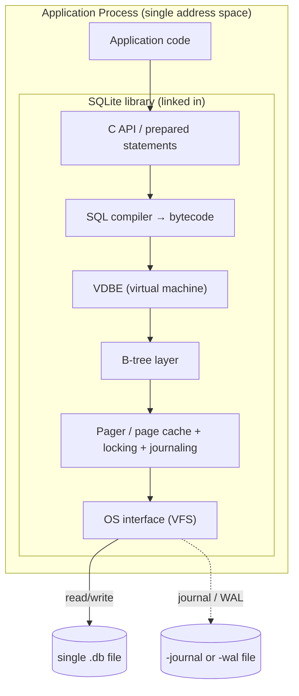
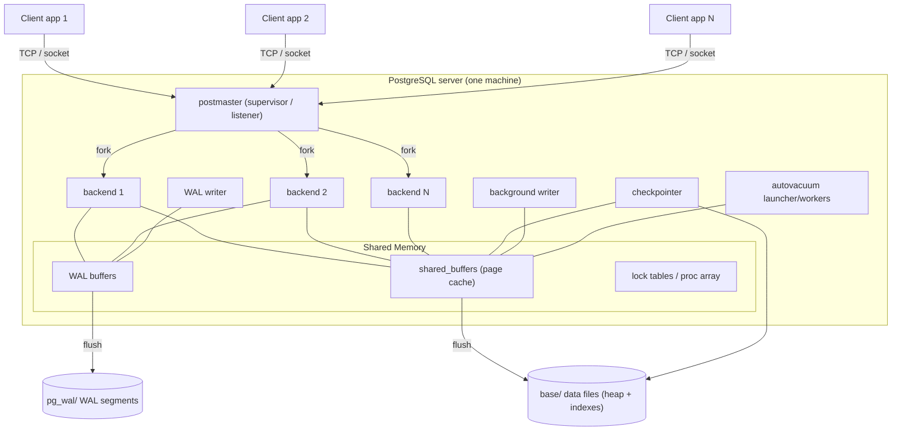
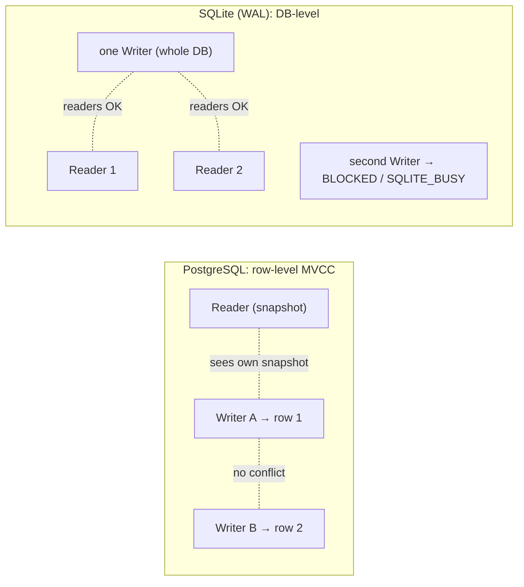

# PostgreSQL vs SQLite: A Comparative Architecture Analysis

> Two relational databases that both speak SQL, yet sit at opposite ends of the design spectrum. One is a **library you embed**; the other is a **server you connect to**. Almost every difference between them follows from that single decision.

This document compares the two systems not feature-by-feature, but from the inside out — tracing how a small set of foundational architectural commitments propagate into storage layout, concurrency, durability, and the kinds of workloads each is good at.

---

## 1. Problem Background

### 1.1 Why SQLite exists

SQLite was created by D. Richard Hipp in 2000, originally to let an application manage structured data **without administering a separate database server**. The problem it set out to solve is deceptively mundane: programs constantly need to persist structured, queryable state, and the default tools for that were either ad-hoc flat files (`fopen()` + custom parsing) or a heavyweight client-server RDBMS that requires installation, a running daemon, network configuration, and a DBA.

SQLite's thesis is that **most applications do not need a database server — they need a database**. Its tagline, *"SQLite does not compete with client/server databases. SQLite competes with `fopen()`,"* captures the design intent precisely. It is a replacement for the application's own file-handling code, not a replacement for Oracle or PostgreSQL.

To make that work it had to be:
- **Serverless** — no separate process; the engine runs *inside* the application as a linked library.
- **Zero-configuration** — no setup, no users, no `pg_hba.conf`.
- **Self-contained** — a single C source amalgamation, no external dependencies.
- **Single-file** — the entire database (schema, tables, indexes) lives in one ordinary file you can copy, email, or `scp`.

Those constraints are why SQLite is the most widely deployed database engine in the world: it ships inside every Android and iOS device, every major browser, countless desktop apps, and embedded firmware.

### 1.2 Why PostgreSQL exists

PostgreSQL descends from the **POSTGRES** project led by Michael Stonebraker at UC Berkeley starting in 1986. POSTGRES was a research successor to Ingres, and its explicit goal was to push beyond the relational model of the day: extensible data types, user-defined functions and operators, rules, and rich integrity support — features a traditional RDBMS of the era lacked. The SQL interface was added in 1994/1995 (Postgres95), and the project became **PostgreSQL** in 1996 as an open-source, community-driven RDBMS.

The problem PostgreSQL solves is the *opposite* of SQLite's: it serves **many concurrent users and applications** accessing **shared, mission-critical data** that must remain consistent and durable under heavy, mixed read/write load. That implies:
- A **server process** that mediates all access and enforces a single source of truth.
- **Strong concurrency** so hundreds of connections can read and write simultaneously without corrupting each other's work.
- **Extensibility** as a first-class concern (custom types, index methods, procedural languages, foreign data wrappers) — its Berkeley DNA.
- **Operational machinery** — authentication, roles, replication, point-in-time recovery — expected of infrastructure that an organization depends on.

### 1.3 The crux

| | SQLite | PostgreSQL |
|---|---|---|
| Born to replace | `fopen()` / ad-hoc file I/O | Ingres / commercial multi-user RDBMS |
| Deployment unit | A library linked into your app | A standalone server you connect to |
| Primary axis optimized | Simplicity, footprint, zero-admin | Concurrency, correctness, extensibility |
| Typical scale | One process, one machine, one file | Many clients, large datasets, HA clusters |

Everything below is downstream of this table.

---

## 2. Architecture Overview

### 2.1 SQLite — in-process embedded library

There is no server. The application calls into SQLite via a function call (`sqlite3_exec`, prepared statements), the engine reads and writes the database file directly using ordinary OS file I/O, and control returns to the application. The "database connection" is just a data structure in the application's own address space.



Key components:
- **SQL compiler** parses SQL and emits bytecode for the **VDBE** (Virtual Database Engine), a small register-based virtual machine. Query execution *is* interpreting that bytecode.
- **B-tree layer** maps the logical tables/indexes onto B-tree structures.
- **Pager** is the heart of durability and concurrency: it manages the page cache, acquires OS file locks, and writes the rollback journal or WAL.
- **VFS (OS interface)** abstracts file operations so SQLite can be ported to any platform — including ones with no real filesystem.

### 2.2 PostgreSQL — client-server, multi-process

PostgreSQL runs as a collection of cooperating OS processes that share memory. A supervisor process (the **postmaster**) listens for connections and forks a dedicated **backend** process per client. Backends never touch the disk randomly on their own consistency island — they coordinate through **shared memory** (notably shared buffers) and a set of **background processes** handle durability and maintenance.



Key processes:
- **postmaster** — listens, authenticates, forks backends, supervises the cluster.
- **backend** — one per connection; parses, plans, and executes SQL for that client.
- **WAL writer** — flushes the write-ahead log so commits are durable.
- **checkpointer** — periodically flushes dirty shared buffers to data files and records a checkpoint, bounding crash-recovery time.
- **background writer** — trickles dirty pages out so backends rarely have to write synchronously.
- **autovacuum** — reclaims space from dead row versions (a direct consequence of MVCC; see §3.5).

### 2.3 Data-flow contrast in one line

- **SQLite:** `your function call → bytecode → page cache → file`. Same thread, same process.
- **PostgreSQL:** `network message → backend process → shared buffers → WAL → background flush`. Cross-process coordination through shared memory.

---

## 3. Internal Design

### 3.1 On-disk organization

| Aspect | SQLite | PostgreSQL |
|---|---|---|
| Files per database | **1** file (plus transient `-journal`/`-wal`) | A **directory** under `base/<dboid>/`, with separate files per table/index |
| Default page size | **4 KB** (historically 1 KB) | **8 KB** (`BLCKSZ`, compile-time) |
| File growth | One file grows/shrinks | Each relation is a file, split into **1 GB segments** |
| Layout principle | Everything is a B-tree in one file | Heap tables + separate index files + WAL + catalogs |

**SQLite single file.** The first 100 bytes are the database header (magic string `SQLite format 3\000`, page size, encoding, etc.). The file is an array of fixed-size pages; page 1 also holds the `sqlite_schema` table that describes every other table and index. Free pages are tracked in a freelist. Because the whole database is one file, an atomic "copy the database" is just a file copy (when no writer is active).

**PostgreSQL relation files.** Each table (a *relation*) maps to a file identified by its `relfilenode` in `base/<database_oid>/`. Large relations are chopped into 1 GB segments (`relfilenode`, `relfilenode.1`, …). Alongside each table's main fork are auxiliary forks: the **Free Space Map** (`_fsm`) tracking free space per page, and the **Visibility Map** (`_vm`) tracking pages where all rows are visible to everyone (enabling index-only scans and vacuum skips).

### 3.2 Page layout

Both store rows in **slotted pages**, but the heap differs sharply from SQLite's B-tree pages.

**PostgreSQL heap page (8 KB):**

```
+-------------------+
| Page header (24B) |
+-------------------+
| Item pointers ... |  (line pointer array, grows down)
|        ↓          |
|   (free space)    |
|        ↑          |
| ...Tuples (rows)  |  (heap tuples, grow up)
+-------------------+
| Special space     |  (used by index pages, not heap)
+-------------------+
```

A row's address is a **TID** = (page number, item-pointer index). Crucially, a PostgreSQL table is a *heap* — rows are unordered — and **all** indexes are secondary, pointing into the heap by TID.

**SQLite page** is a B-tree node (interior or leaf). Table data lives in the leaves of a B-tree keyed by `rowid`. There is no separate heap; the table *is* the B-tree. Cells (rows) are stored in the page with a cell-pointer array, and oversized rows spill to overflow page chains.

### 3.3 Table storage models

This is one of the most consequential internal differences:

- **SQLite — clustered / index-organized by default.** An ordinary table is a B+-tree keyed on a 64-bit integer `rowid`. The row payload lives *in the B-tree leaf itself*. Declaring `INTEGER PRIMARY KEY` aliases the column to `rowid`, so primary-key lookups are direct B-tree descents with no secondary indirection. A `WITHOUT ROWID` table instead clusters on the declared primary key — useful when you have a natural key and want to avoid the rowid layer.

- **PostgreSQL — heap + secondary indexes.** Rows live in an unordered heap. Even the primary key is a *separate* B-tree index whose entries point at heap TIDs. PostgreSQL has no true clustered index; the one-shot `CLUSTER` command physically reorders a heap by an index but does not maintain that order afterward.

The trade-off: SQLite's index-organized layout gives fast PK access and compact storage for a single dominant access path; PostgreSQL's heap decouples row storage from any single ordering, which suits many indexes and heavy update workloads where MVCC versions come and go.

### 3.4 Index implementation

| | SQLite | PostgreSQL |
|---|---|---|
| Core structure | **B-tree only** for everything | **B-tree (nbtree)** plus many others |
| Available types | B-tree; expression & partial indexes; FTS via extensions | B-tree, **Hash, GiST, SP-GiST, GIN, BRIN**, plus extensions |
| Extensibility | Fixed set | Pluggable index access methods |

PostgreSQL's index variety is its Berkeley extensibility showing through. **GiST/SP-GiST** support geometric and nearest-neighbor search, **GIN** powers full-text and `jsonb`/array containment, and **BRIN** gives tiny indexes over naturally ordered huge tables. SQLite deliberately keeps a single, well-understood B-tree implementation — simplicity over breadth.

### 3.5 Transactions and concurrency control

This is where the two architectures diverge most.

**PostgreSQL — MVCC with physical row versions.**
PostgreSQL implements Multi-Version Concurrency Control by storing **multiple physical versions** of a row in the heap. Every tuple carries hidden system columns `xmin` (transaction that created it) and `xmax` (transaction that deleted/superseded it). A transaction sees the version consistent with its **snapshot**. Therefore:
- An `UPDATE` does **not** overwrite a row in place — it writes a *new* tuple version and marks the old one's `xmax`. Readers see the old version; the writer sees the new one.
- **Readers never block writers, and writers never block readers.** Only two writers competing for the *same row* conflict, via row-level locks.
- The cost: obsolete ("dead") tuples accumulate and must be reclaimed — hence **VACUUM/autovacuum**. Transaction IDs are 32-bit and require freezing to avoid wraparound. This bookkeeping is the price of high concurrency.

**SQLite — coarse-grained locking, single writer.**
SQLite has full ACID transactions but enforces them with **database-level locking**, not per-row versions. There are two durability/locking modes:

- **Rollback journal (default, legacy):** Before modifying pages, SQLite copies the original pages into a separate `-journal` file. On commit it flushes changes and deletes the journal; on crash, recovery replays the journal to roll *back*. A writer takes an **EXCLUSIVE** lock over the whole database, so during a write **no other connection may read or write**. Lock states escalate: `UNLOCKED → SHARED → RESERVED → PENDING → EXCLUSIVE`.

- **WAL mode (`PRAGMA journal_mode=WAL`):** New pages are appended to a `-wal` file; readers continue reading the original database pages while one writer appends. This allows **readers concurrent with one writer**, a major improvement. But there is still **at most one writer at a time** for the whole database.



### 3.6 Durability mechanisms

| | SQLite | PostgreSQL |
|---|---|---|
| Mechanism | Rollback journal **or** WAL | Write-Ahead Log (WAL) always |
| Recovery direction | Journal rolls **back** uncommitted; WAL rolls **forward** | WAL **replays forward** from last checkpoint |
| Group commit / replication | No replication; WAL enables some concurrency | WAL underpins replication, PITR, standbys |

PostgreSQL's WAL is foundational, not optional: every change is logged *before* the data pages are flushed (write-ahead rule), so after a crash it replays committed WAL since the last checkpoint and discards uncommitted work. The same WAL stream is shipped to replicas for streaming replication and used for point-in-time recovery. SQLite's WAL mode borrows the same idea but at a much smaller scale, serving local concurrency rather than distributed durability.

---

## 4. Design Trade-Offs

### 4.1 Concurrency

- **PostgreSQL** pays continuous overhead — extra columns per tuple, dead-tuple accumulation, vacuum, snapshot management — to buy **non-blocking multi-writer concurrency**. This is the correct trade when many independent transactions hit the database at once.
- **SQLite** spends almost nothing on concurrency machinery and gets a much simpler engine, but caps writes at **one at a time per database**. Under write contention, additional writers get `SQLITE_BUSY` and must retry. This is the correct trade when one process owns the file or writes are infrequent.

> **Why SQLite suits mobile/embedded:** a phone app, browser, or device firmware is essentially a *single application owning its own data*. There is no need for multi-user concurrency, network access, or a background daemon (which would drain battery and complicate the install). SQLite's zero-config, zero-process, single-file model fits a sandboxed app perfectly: the database is just part of the app's storage, copied and backed up like any file, with a tiny (~hundreds of KB) footprint and no administration.

> **Why PostgreSQL suits large multi-user systems:** a web service or enterprise system has *many* concurrent clients mutating *shared* data. MVCC lets thousands of transactions proceed without blocking each other; the server process enforces authentication, roles, and a single consistent view; and WAL-based replication provides high availability and disaster recovery. The per-connection backend model and shared-memory buffer pool are explicitly built for this fan-in.

### 4.2 Scalability

- **SQLite** scales *down* superbly (tiny devices) and reads *up* well (many concurrent readers, especially in WAL mode), but does not scale write throughput beyond one writer, and is bounded to a single machine and process. It has no built-in networking or replication.
- **PostgreSQL** scales *up*: vertical scaling via more cores/connections, read scaling via streaming replicas, and very large datasets via partitioning, parallel query, and TOAST for large values. It does not scale *down* to "no server," and each connection is a relatively heavyweight process (commonly fronted by a pooler like PgBouncer).

### 4.3 Footprint, operability, and types

| Dimension | SQLite | PostgreSQL |
|---|---|---|
| Install/admin | None — link a library | Server install, config, tuning, backups |
| Resource footprint | Hundreds of KB, minimal RAM | Tens+ MB baseline, tuned RAM (shared_buffers) |
| Type system | **Dynamic typing** (type affinity); a column accepts most values | **Strict, rich static types** + user-defined types, domains, enums |
| Network access | None (in-process) | TCP/Unix socket, TLS, auth |
| SQL completeness | Large subset; some omissions (limited `ALTER TABLE`, no full `RIGHT/FULL JOIN` historically — now supported) | Very complete, standards-tracking, extensible |

SQLite's dynamic typing (type *affinity*) is itself a trade-off: it simplifies the engine and is forgiving for app-local data, but pushes type discipline onto the application. PostgreSQL's strict typing catches errors at the database boundary — valuable when many independent clients share the schema.

### 4.4 When the alternative would be better

- Choosing **SQLite** for a high-write, multi-client web backend would serialize writers and bottleneck immediately — wrong tool.
- Choosing **PostgreSQL** to store config for a desktop app means shipping and supervising a server process for one user — needless complexity.
- A common, sound pattern is to use **both**: SQLite at the edge/device, PostgreSQL as the central shared system of record.

---

## 5. Experiments / Observations

> These are **illustrative observations** — representative commands and the kind of output/behavior you would see. They are meant to make the architecture concrete, not to serve as benchmarks.

### 5.1 Observing SQLite's single-file, single-engine nature

```bash
# Create a tiny database
sqlite3 demo.db "CREATE TABLE t(id INTEGER PRIMARY KEY, name TEXT);
                 INSERT INTO t(name) VALUES ('a'),('b'),('c');"

# Inspect internal layout
sqlite3 demo.db ".dbinfo"
```

Illustrative `.dbinfo` output shows the engine's own metadata read straight from the file header:

```
database page size:  4096
write format:        1
number of pages:     2
schema cookie:       1
text encoding:       1 (utf8)
```

The whole database is `demo.db`. There is **no server process** — `ps aux | grep sqlite` shows nothing persistent; the engine only "exists" while your process holds it open. Copying the database is literally `cp demo.db backup.db`.

Switching durability mode and watching the sidecar files appear:

```bash
sqlite3 demo.db "PRAGMA journal_mode=WAL;"   # → returns: wal
ls demo.db*                                  # → demo.db  demo.db-wal  demo.db-shm
```

### 5.2 Observing SQLite single-writer contention

```bash
# Terminal 1: open a write transaction and hold it
sqlite3 demo.db "BEGIN IMMEDIATE; INSERT INTO t(name) VALUES('x'); /* wait */"

# Terminal 2: attempt a concurrent write
sqlite3 demo.db "INSERT INTO t(name) VALUES('y');"
# → Error: database is locked   (SQLITE_BUSY)
```

The second writer cannot proceed — the database holds **one writer at a time**. In WAL mode, a *reader* in terminal 2 would succeed concurrently, but a second *writer* still blocks. This directly demonstrates §3.5.

### 5.3 Observing PostgreSQL's process and file model

```sql
SHOW data_directory;            -- e.g. /var/lib/postgresql/16/main
SELECT pg_relation_filepath('t');  -- e.g. base/16384/24576
```

```bash
# The per-connection process model is visible at the OS level:
ps -ef | grep postgres
# postgres ... postgres: checkpointer
# postgres ... postgres: background writer
# postgres ... postgres: walwriter
# postgres ... postgres: autovacuum launcher
# postgres ... postgres: appuser appdb 10.0.0.5(53124) idle   <- one per client
```

Each client connection is its own `backend` process; the background processes (checkpointer, walwriter, autovacuum) from §2.2 are plainly listed.

### 5.4 Observing PostgreSQL concurrent writers and MVCC

```sql
-- Session A
BEGIN;
UPDATE accounts SET bal = bal - 100 WHERE id = 1;   -- locks ROW 1 only

-- Session B (different row) — proceeds with NO blocking
BEGIN;
UPDATE accounts SET bal = bal + 50 WHERE id = 2;     -- succeeds immediately

-- Session C — a reader sees a consistent snapshot, never blocked
SELECT bal FROM accounts WHERE id = 1;               -- sees pre-UPDATE value
```

Two writers on different rows run in parallel; a reader is never blocked and sees its snapshot. Observing version churn:

```sql
SELECT n_live_tup, n_dead_tup FROM pg_stat_user_tables WHERE relname = 'accounts';
-- after many UPDATEs, n_dead_tup grows until autovacuum reclaims it
```

The growing `n_dead_tup` is the visible footprint of MVCC's "new version per update" — exactly what VACUUM exists to clean up.

### 5.5 What the observations confirm

| Observation | Architectural fact it reveals |
|---|---|
| `.dbinfo` reads page size from a single file | SQLite = one self-describing file |
| "database is locked" on 2nd writer | DB-level single-writer locking |
| Many `postgres:` backend processes | One process per connection |
| Independent-row UPDATEs don't block | Row-level MVCC |
| `n_dead_tup` rising | Physical multi-versioning → need for VACUUM |

---

## 6. Key Learnings

1. **One decision cascades into everything.** "Embedded library" vs "client-server" is not one feature among many — it *generates* the differences in storage, concurrency, durability, and operations. If you remember only one thing, remember that.

2. **Concurrency is a deliberate trade, not a quality ranking.** PostgreSQL's MVCC is "better" only for multi-writer workloads; it carries real costs (dead tuples, vacuum, wraparound management, heavier connections). SQLite's single-writer simplicity is "better" for single-owner workloads. Neither is universally superior — they optimize different points.

3. **The table storage model is underappreciated.** SQLite tables are *index-organized B-trees* (data in the leaf, `rowid`-keyed), while PostgreSQL tables are *unordered heaps* with all indexes secondary. This explains why PK lookups feel "free" in SQLite and why PostgreSQL invests so heavily in diverse index types and the visibility map.

4. **Durability designs mirror their goals.** SQLite's journal/WAL exist to make a *local file* crash-safe. PostgreSQL's WAL does that *and* doubles as the substrate for replication and point-in-time recovery — the same primitive serving a much larger ambition.

5. **A surprising inversion:** the database that ships on *billions* of devices (SQLite) is the architecturally *simpler* one, while the database often associated with "big systems" achieves that scale through machinery (per-connection processes, MVCC, autovacuum) that SQLite deliberately refuses to carry. Ubiquity and complexity are not correlated.

6. **Right tool, right tier.** The mature pattern is not "pick the winner" but "place each where its trade-offs pay off": SQLite at the edge (apps, devices, caches, file formats, tests), PostgreSQL as the shared, concurrent, durable system of record.

### Real-world use cases

**SQLite shines in:**
- Mobile apps (Android/iOS) and web browsers (history, storage)
- Desktop application local storage and settings
- Embedded/IoT firmware and appliances
- An **application file format** (e.g., storing structured documents)
- On-device caches, test fixtures, and analytics-at-rest on a single node

**PostgreSQL shines in:**
- Web and SaaS backends with many concurrent users
- OLTP systems of record (finance, e-commerce, inventory)
- Geospatial workloads (PostGIS) and full-text / `jsonb` search
- Data warehousing / analytics with partitioning and parallel query
- Systems needing replication, high availability, and PITR

---

## References

- **SQLite Documentation** — *Architecture of SQLite*, *Database File Format*, *Write-Ahead Logging*, *File Locking And Concurrency*, *Distinctive Features* (sqlite.org/docs.html).
- **PostgreSQL Documentation** — *Overview of PostgreSQL Internals*, *Database Page Layout*, *Concurrency Control / MVCC*, *Write-Ahead Logging (WAL)*, *Routine Vacuuming*, *Index Types* (postgresql.org/docs).
- M. Stonebraker and L. Rowe, *The Design of POSTGRES* (1986) — historical context for PostgreSQL's extensible, multi-user lineage.
- D. R. Hipp et al., SQLite project history and design rationale ("SQLite competes with `fopen()`").

*All architectural claims above are paraphrased from the official documentation and primary sources and reflect the author's own synthesis and analysis.*
