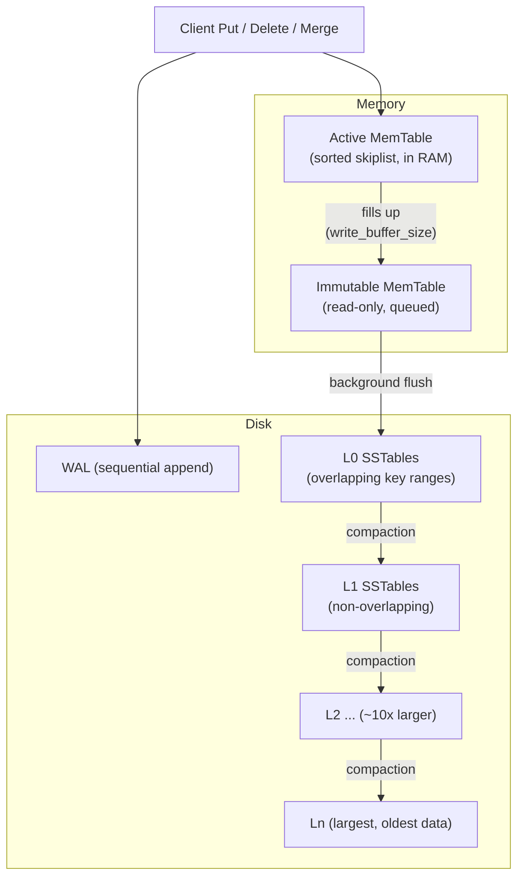
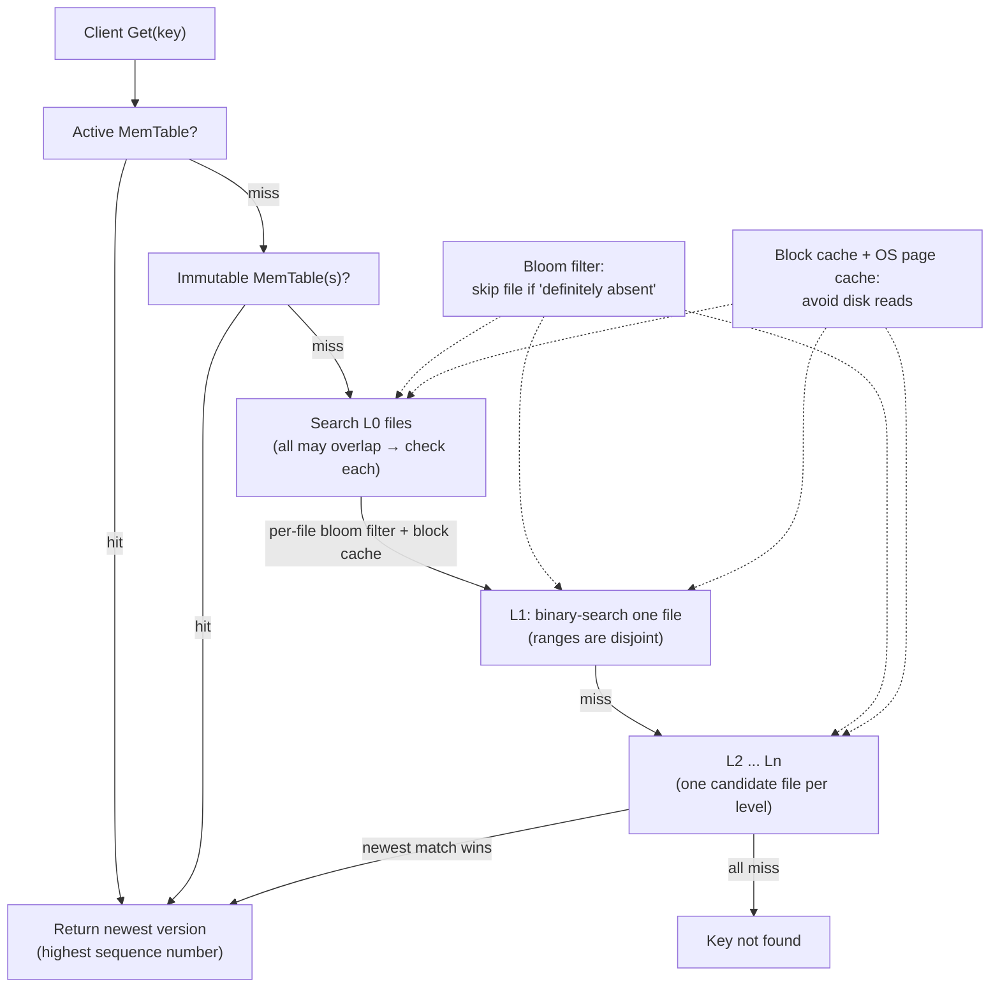
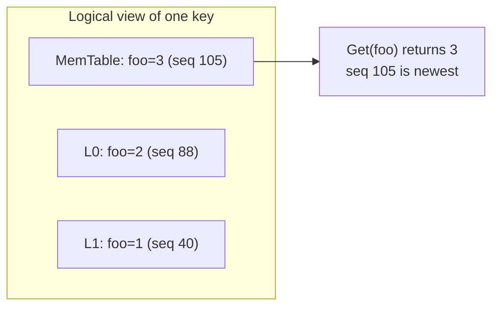
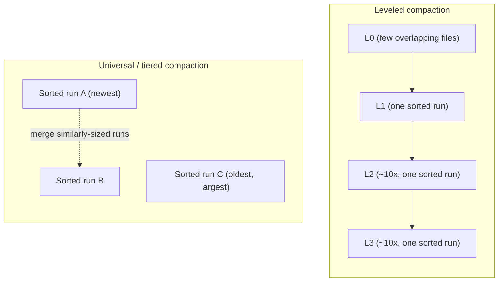

# RocksDB Architecture — An Analysis of LSM-Tree Based Storage

> A technical study of how RocksDB trades write-friendly sequential I/O against
> read and space cost, and *why* those trade-offs are deliberate rather than accidental.

---

## 1. Problem Background

### 1.1 Where RocksDB comes from

RocksDB began life in 2012 at Facebook as a **fork of Google's LevelDB**. LevelDB
was a clean, minimal embeddable key-value library, but it was tuned for a world of
spinning disks and modest concurrency. Facebook's workloads were different: server
machines with many cores, fast **flash/SSD** storage capable of high parallel IOPS,
and applications that wrote enormously (logs, metrics, message queues, the storage
engine behind MyRocks/MySQL). RocksDB kept LevelDB's core idea — the
**Log-Structured Merge tree (LSM-tree)** — but rebuilt it for that hardware:
multi-threaded compaction, pluggable compaction strategies, prefix bloom filters,
column families, rate limiting, and dozens of tunables.

The crucial framing is that RocksDB is **not a database server**. It is an
*embeddable, persistent, ordered key-value store* — a C++ library you link into
your process. There is no SQL layer, no network protocol, no query planner. It
does exactly one thing: store sorted `(key → value)` pairs durably and serve point
lookups and range scans fast. That narrow scope is what lets it be the *storage
substrate* underneath higher-level systems (MyRocks, TiKV, CockroachDB's Pebble is
a re-implementation of the same design, Kafka Streams state stores, Ceph BlueStore,
etc.).

### 1.2 The B-tree problem: random writes are expensive

To understand *why* the LSM design exists, you have to understand what it is
reacting against: the **B-tree** (and its B+-tree variant used by InnoDB, classic
relational engines, and most file systems).

A B-tree keeps data sorted **in place**. When you insert or update a key, the engine
must find the leaf page that owns that key range and modify it *where it physically
lives on disk*. The consequences:

- Writes are **random**. Two consecutive inserts (`user:91`, `account:4`) likely
  land in completely different pages scattered across the device.
- Every write is potentially a **read-modify-write** of a whole page (e.g. 8 KB or
  16 KB) even if you changed 50 bytes — **write amplification at the page level**.
- On SSDs, random in-place overwrites trigger the flash translation layer's
  garbage collection and erase-before-write cycles, which adds *device-level* write
  amplification on top.

For read-heavy or balanced workloads this is fine — a B-tree gives excellent point
lookups (one root-to-leaf traversal) and great range scans. But for **write-heavy**
workloads the random-write tax dominates, and you leave most of the SSD's sequential
bandwidth on the table.

### 1.3 The fundamental LSM insight

The LSM-tree's central idea is almost embarrassingly simple:

> **Never modify data in place. Turn random writes into sequential writes by
> buffering mutations in memory, then flushing them to disk in large sorted batches,
> and reconcile the resulting files later through background merging.**

Concretely:

1. A write goes into an **in-memory sorted structure** (the MemTable) — essentially
   free, no disk seek.
2. To survive a crash, the same write is first appended to a **Write-Ahead Log
   (WAL)** — a pure *sequential* append, the fastest possible disk operation.
3. When the MemTable fills, it is written out **once, sequentially**, as an
   immutable sorted file (an SSTable). No in-place updates, no random seeks.
4. Over time many such files accumulate, so a background process called
   **compaction** merges them, discarding superseded and deleted entries, keeping
   the on-disk data sorted and bounded.

The trade is explicit and is the through-line of this whole document: **we accept
extra work later (reading from multiple files, rewriting data during compaction) in
exchange for making the write path cheap and sequential now.** Everything else in
RocksDB's architecture is machinery to make that trade pay off — bloom filters and
block caches to claw back read performance, compaction strategies to bound space,
and a careful concurrency model to keep all of it running while the database stays
online.

---

## 2. Architecture Overview

RocksDB organizes data as a sequence of *runs* that get progressively larger and
more consolidated: an in-memory MemTable at the top, then on-disk levels `L0`
through `Ln`, each roughly **10× larger** than the one above it. Data flows
*downward* through flush and compaction; reads search *downward* until they find the
newest version of a key.

### 2.1 Write path



The write is acknowledged once it is in the WAL and the active MemTable; everything
below the dashed memory/disk boundary happens **asynchronously in the background**,
off the client's critical path.

### 2.2 Read path



The key property: because newer data is always *higher* in the hierarchy, a read
walks **top-down and stops at the first match** — that match is guaranteed to be the
most recent version. Bloom filters and caches exist to make the "miss, keep going
down" steps as cheap as possible.

### 2.3 The merge-of-runs mental model



A single user key can physically exist in several places at once, each tagged with a
**sequence number**. Reads resolve the conflict by sequence number; compaction
eventually deletes the stale copies. This is the unifying idea behind reads, writes,
snapshots, and deletes.

---

## 3. Internal Design

This is the heart of the system. Each component below exists to support the
"sequential-now, reconcile-later" bargain.

### 3.1 MemTable and the active/immutable switch

The **MemTable** is the in-memory write buffer. By default it is a **skiplist**,
chosen because it is:

- **sorted** — so it can be flushed directly into a sorted SSTable and can serve
  ordered range scans;
- **concurrent** — a lock-free skiplist supports many writers/readers without a
  global lock, important on many-core servers;
- **append-friendly under MVCC** — an "update" is just an insert of a new
  `(key, seq)` entry; nothing is mutated in place.

(RocksDB also offers vector and hash-based MemTables for specialized workloads, but
skiplist is the general-purpose default.)

The **active/immutable switch** is the linchpin of online operation:

1. All writes go to the single **active MemTable**.
2. When it reaches `write_buffer_size`, RocksDB **seals** it: it becomes an
   **immutable MemTable** (read-only) and a fresh active MemTable is created.
3. Writes immediately continue into the new active MemTable, while a **background
   flush thread** serializes the immutable MemTable to an L0 SSTable.

This switch is *why writes don't block on flushing*. The cost is memory: if flushes
fall behind, immutable MemTables pile up (bounded by `max_write_buffer_number`), and
once that bound is hit RocksDB applies **back-pressure / write stalls** to avoid
running out of RAM — an early warning sign that the storage can't keep up with the
write rate.

### 3.2 Write-Ahead Log (WAL): durability before persistence

The MemTable lives in volatile RAM, so a crash before flush would lose data. The
**WAL** closes that gap. Every mutation is **appended to the WAL before (or together
with) the MemTable insert**. Properties:

- The WAL is a **sequential append-only log** — the cheapest disk write pattern,
  which is exactly why durability here is affordable.
- On **recovery**, RocksDB replays the WAL: it re-inserts each logged record into a
  fresh MemTable, reconstructing the in-memory state that existed at crash time.
- Once the MemTable that a WAL segment covers has been **flushed to an SSTable**,
  that WAL segment is **obsolete and deleted** — the SSTable is now the durable copy.

The **fsync trade-off** is a first-class tuning knob:

| `sync` setting | Behavior | Guarantee | Cost |
|---|---|---|---|
| `sync = false` (default) | WAL write goes to OS page cache, not forced to platter/flash | Survives **process** crash, **not** OS/power loss | Fast |
| `sync = true` | `fsync`/`fdatasync` after each write (or batch) | Survives power loss | Slower; bounded by device fsync latency |
| `WAL disabled` | No WAL at all | No crash durability for un-flushed data | Fastest; only safe for rebuildable/ephemeral data |

Group commit amortizes fsync cost by batching many concurrent writers into one log
flush — a classic durability-vs-latency lever.

### 3.3 SSTables: immutable sorted files

An **SSTable (Sorted String Table)** is the on-disk unit. The defining property is
**immutability** — once written, an SSTable is never modified, only read or deleted.
Immutability is what makes the system safe to read without locks and trivial to
cache and replicate.

Internal layout (block-based table format):

```
+------------------------------------------+
|  Data Block 0   (sorted KV pairs)        |
|  Data Block 1                            |
|  ...                                     |
|  Data Block N                            |   <- ~4-64 KB each, compressed
+------------------------------------------+
|  Filter Block   (bloom filter bits)      |   <- "is key X possibly here?"
+------------------------------------------+
|  Index Block    (first key -> block ptr) |   <- binary-search to find data block
+------------------------------------------+
|  Metaindex / properties                  |
+------------------------------------------+
|  Footer (fixed size, points to index)    |   <- read this first
+------------------------------------------+
```

A lookup within an SSTable: read the **footer** → find the **index block** →
binary-search it to locate the one **data block** that could contain the key →
(consult the **filter block** to maybe skip the file entirely) → read and search
that single data block. So at most a couple of small I/Os per file, and the filter
often saves even those.

#### The internal key: user key + sequence number + type

This is one of the most important and least obvious details. RocksDB does **not**
store your raw key. It stores an **internal key**:

```
internal_key = user_key + sequence_number (56-bit) + value_type (8-bit)
```

- **`sequence_number`** is a monotonically increasing counter assigned to every
  write. Internal keys sort by `user_key` ascending, then by `sequence_number`
  **descending**, so the newest version of a key sorts first.
- **`value_type`** distinguishes a real value (`kTypeValue`), a deletion
  (`kTypeDeletion` — a *tombstone*), a merge operand, a range deletion, etc.

This single design choice gives RocksDB:

- **MVCC-like versioning** — multiple versions of a key coexist across runs.
- **Snapshots** — taking a snapshot just records a sequence number; a read "as of"
  that snapshot ignores any entry with a higher sequence number. No copying, no
  locking.
- **Lock-free concurrent reads/writes** — a writer adds a *new* internal key; an
  in-flight reader still sees the old one consistently.

### 3.4 Levels L0..Ln: two different invariants

The on-disk files are organized into levels with a crucial asymmetry:

- **L0 — overlapping.** L0 files are flushed straight from MemTables, in flush
  order. Because each is an independent snapshot of memory, **their key ranges can
  overlap arbitrarily.** Consequence: a read may have to check *every* L0 file,
  because the key could be in any of them. This is why `level0_file_num_*` triggers
  exist — too many L0 files = slow reads + stalls.

- **L1..Ln — non-overlapping, partitioned.** From L1 down, compaction guarantees
  that within a single level, **SSTables have disjoint key ranges**. The whole level
  behaves like one giant sorted run, just sharded into manageable files. Consequence:
  for any key, there is **at most one candidate file per level**, found by binary
  search over file boundaries.

- **~10× size ratio.** Each level targets roughly 10× the size of the one above
  (`max_bytes_for_level_multiplier`). With ~7 levels you can hold an enormous dataset
  while a point read touches only ~one file per level. The geometric growth is what
  keeps the *number of levels* (and thus read amplification) logarithmic in data size.

### 3.5 Bloom filters: skipping files that can't have the key

A **bloom filter** is a compact probabilistic bitset answering "is this key in this
SSTable?" with two possible answers:

- **"definitely not present"** — 100% reliable; the read **skips the file entirely**,
  avoiding the index/data-block I/O.
- **"possibly present"** — might be a true hit or a **false positive** (the only
  error mode; there are **no false negatives**).

RocksDB attaches a bloom filter per SSTable (stored in the filter block), typically
~10 bits/key for a ~1% false-positive rate. The payoff is dramatic on point lookups
in a deep LSM: without filters a `Get` for a non-existent key might probe one file
per level (7+ disk touches); with filters it usually skips almost all of them and
touches only the level(s) that genuinely (or falsely) claim the key. This is the
single most important read-amplification mitigation in the design. (RocksDB also
supports **prefix bloom filters** to accelerate prefix range scans.)

Bloom filters help **point lookups** much more than **range scans** — a range scan
must still open the relevant block of every level, because "is *some* key in `[a,b)`
here" isn't what a per-key filter answers.

### 3.6 Block cache and OS page cache

Two layers of caching reduce physical I/O:

- **Block cache** (RocksDB-managed, e.g. LRU or the clock-based variant): caches
  **uncompressed** data blocks (and optionally index/filter blocks) keyed by
  `(file, block offset)`. Because SSTables are immutable, cached blocks **never go
  stale** — a huge simplification versus caching mutable B-tree pages.
- **OS page cache**: caches the raw, often-compressed SSTable file pages. With
  buffered I/O, hot files stay in OS memory for free.

A common production pattern is to keep index and filter blocks **pinned** in the
block cache (`cache_index_and_filter_blocks` + pinning) so that the filter is always
in RAM and a lookup never pays disk I/O just to discover the key is absent.

### 3.7 Compaction: keeping the LSM healthy

Flushing produces an endless stream of small, overlapping files. **Compaction** is
the background process that reads several input SSTables, **merge-sorts** them, and
writes new output SSTables, in the process:

- **resolving versions** — for each user key it keeps the newest entry and drops
  older superseded versions (unless a live snapshot still needs them);
- **dropping tombstones** — a delete is recorded as a tombstone entry; compaction
  physically removes both the tombstone and the data it shadows **once it reaches the
  bottom level**, where nothing older can exist;
- **restoring the invariant** — output files at L1+ remain non-overlapping and
  sorted.

#### Leveled vs Universal (tiered) compaction



- **Leveled** (RocksDB default): each level below L0 is a single sorted run. To push
  data from `Ln` into `Ln+1`, RocksDB rewrites the overlapping portion of `Ln+1`.
  Because the next level is ~10× larger, each byte may be **rewritten ~10× per
  level** → **high write amplification**, but at most a small constant overhead of
  redundant data → **low space amplification**, and at most one file per level →
  **good read amplification**.

- **Universal / tiered**: data accumulates as several **sorted runs** of similar
  size, and compaction merges runs of similar size together (think "size-tiered").
  Each byte is rewritten far fewer times → **low write amplification**, but multiple
  full-ish runs coexist → **high space amplification** (can transiently need ~2× the
  data size) and **more runs to search** → **higher read amplification**.

This choice *is* the central tuning decision and is revisited quantitatively in §4.

### 3.8 Tombstones and delete handling

Deletes are subtle in an append-only world. A `Delete(k)` does not erase anything —
it **inserts a tombstone** internal key `(k, seq, kTypeDeletion)`. Reads that
encounter the tombstone first (highest sequence) correctly return "not found". The
underlying data is only reclaimed when compaction pushes the tombstone to a level
where no older copy of `k` can remain. Two practical consequences:

- **Disk space is not freed at delete time** — only at compaction time. A workload
  that deletes a lot but compacts rarely can hold far more disk than its live data.
- **Range deletes** (`DeleteRange`) use a special range-tombstone so that deleting a
  million contiguous keys costs one record instead of a million.

### 3.9 End-to-end write path

1. Assign the next **sequence number**.
2. Append the record to the **WAL** (optionally `fsync`).
3. Insert `(user_key, seq, type) → value` into the **active MemTable**.
4. **Acknowledge** the write to the client. *(Done — everything below is async.)*
5. MemTable full → seal as **immutable**, open a new active MemTable.
6. Background **flush** writes the immutable MemTable to an **L0 SSTable**; obsolete
   WAL is removed.
7. Background **compaction** later merges L0→L1→…→Ln, dropping stale/deleted entries.

### 3.10 End-to-end read path

For `Get(k)` (conceptually a *merging iterator* across all runs, short-circuited):

1. Search the **active MemTable**; if found, the highest-seq entry there is the
   answer (it's the newest possible).
2. Else search **immutable MemTable(s)**.
3. Else descend the levels: **L0** (check each file, newest first, filtered by bloom
   + cache), then **L1…Ln** (one candidate file per level via binary search, each
   gated by its bloom filter).
4. The **first match found while descending is the newest version** and is returned;
   a tombstone match returns "not found". If every run misses, the key doesn't exist.

The whole correctness argument rests on one fact: **newer data is always reachable
before older data**, both in memory (higher seq) and on disk (higher levels hold
newer data than the runs below for any given key).

---

## 4. Design Trade-Offs

Every storage engine pays a tax in **three currencies**, and you cannot minimize all
three at once. This is the LSM expression of the **RUM conjecture** (Read,
Update/write, Memory/space — optimize any two, the third suffers).

### 4.1 The three amplifications

- **Write amplification (WA)** = bytes physically written to storage ÷ bytes
  logically written by the application. In an LSM, a single logical write is written
  to the WAL, then flushed, then rewritten by compaction once per level it passes
  through. Leveled compaction's ~10× ratio means a byte can be rewritten roughly
  *(levels × ratio-related factor)* times — WA of 10–30× is common.

- **Read amplification (RA)** = data read from storage ÷ data requested. A point read
  may have to consult the MemTable, every L0 file, and one file per L1..Ln level —
  potentially many I/Os for one tiny value. Bloom filters and block cache exist
  precisely to drive RA back down toward ~1.

- **Space amplification (SA)** = bytes on disk ÷ bytes of live (logical) data. Stale
  versions and not-yet-collected tombstones inflate disk usage until compaction
  reclaims them.

### 4.2 Why LSM is write-optimized

Writes are cheap because they are **sequential and deferred**: append to WAL +
in-memory insert, then large sequential flushes, then background merges. The
expensive reconciliation (compaction) is moved **off the write critical path** and
batched. The cost the writer *does* pay shows up later as compaction WA — but
crucially that WA is **sequential** large-block I/O, which SSDs (and especially
spinning disks) handle far better than the random small writes a B-tree generates.
That is the whole point: LSM doesn't avoid work, it **reshapes random work into
sequential work and time-shifts it**.

### 4.3 Why reads can be expensive (and how it's mitigated)

A read may have to check many runs because a key could live in any of them. Naively
this is `O(levels)` I/O per lookup. Mitigations:

- **Bloom filters** eliminate almost all "wrong-level" probes for point lookups.
- **Block + page cache** keep hot data and (pinned) index/filter blocks in RAM.
- **Compaction itself** reduces the number of runs that must be searched (especially
  collapsing L0).

Range scans are the harder case: bloom filters don't help much, so scan-heavy
workloads care more about keeping the number of sorted runs (and L0 files) low.

### 4.4 Why compaction is necessary but expensive

Without compaction, runs accumulate forever → unbounded read and space
amplification. With compaction, you pay continuous **CPU** (merge-sort,
(de)compression, checksums) and **I/O** (re-reading and rewriting large amounts of
data). Because compaction competes with foreground traffic for I/O bandwidth, a
burst of writes can outrun it, triggering **write stalls / latency spikes** when L0
file count or pending-compaction-bytes cross their thresholds. RocksDB's rate
limiter and stall thresholds are knobs for smoothing this. The lesson: **compaction
is the price of bounded read/space amplification, and tuning RocksDB is largely the
art of pacing compaction.**

### 4.5 Leveled vs Universal, quantified

| Dimension | Leveled (default) | Universal / Tiered |
|---|---|---|
| Write amplification | **High** (rewrite per level, ~10–30×) | **Low** (merge similar-size runs) |
| Space amplification | **Low** (~1.1×) | **High** (can spike toward ~2×) |
| Read amplification | **Lower** (≤1 file/level) | **Higher** (several runs to check) |
| Best for | Read-heavy / space-constrained | Write-heavy / ingest-heavy, space to spare |

There is no free lunch: choosing universal to cut write amplification *buys back*
that saving in disk space and read cost.

### 4.6 LSM (RocksDB) vs B-tree (InnoDB)

| Property | LSM-tree (RocksDB) | B+-tree (InnoDB) |
|---|---|---|
| Write pattern | Sequential (append WAL, batched flush/compact) | Random in-place page updates |
| Write amplification | High but **sequential** I/O | Lower count, but **random** + full-page writes |
| Point read | Multiple runs; **bloom + cache** make it fast | One root-to-leaf traversal (predictable) |
| Range scan | Merge across runs (more work) | Excellent (leaves linked, naturally clustered) |
| Space | Compact after compaction; transient bloat from stale versions | Fragmentation / half-full pages; in-place |
| Space reclaim on delete | Deferred to compaction (tombstones) | Immediate-ish (page space freed) |
| Concurrency | Append-only + MVCC by sequence number → easy snapshots | Latch/lock coupling on pages |
| Sweet spot | **Write-heavy**, SSD, large datasets, ingest | **Read/update-balanced**, transactional, range-heavy |

The honest summary: **B-trees optimize for predictable read/update latency in place;
LSM-trees optimize for write throughput and sequential I/O, then spend engineering
effort (bloom filters, caching, compaction tuning) to make reads competitive.**

---

## 5. Experiments / Observations

RocksDB ships with **`db_bench`**, a micro-benchmark harness ideal for *observing*
the trade-offs above. The numbers below are **illustrative** (they depend heavily on
hardware, value size, dataset size, and config) — the goal is to show *what to
measure and how to read it*, not to publish device-specific figures.

### 5.1 Example commands

```bash
# 1) Write-only: random-key inserts (stresses the write path + compaction)
./db_bench \
  --benchmarks=fillrandom,stats \
  --num=50000000 \
  --value_size=100 \
  --compression_type=lz4 \
  --statistics \
  --db=/data/rocks_leveled

# 2) Read-only point lookups after the DB is built (stresses the read path)
./db_bench \
  --benchmarks=readrandom,stats \
  --use_existing_db=1 \
  --num=50000000 \
  --bloom_bits=10 \
  --cache_size=2147483648 \
  --db=/data/rocks_leveled

# 3) Update-in-place churn: overwrite existing keys (stresses compaction WA)
./db_bench \
  --benchmarks=overwrite,stats \
  --num=50000000 \
  --db=/data/rocks_leveled

# 4) Same fillrandom under UNIVERSAL compaction, to compare amplifications
./db_bench \
  --benchmarks=fillrandom,stats \
  --num=50000000 \
  --compaction_style=1 \
  --db=/data/rocks_universal

# 5) Isolate the bloom-filter effect: rerun readrandom with filters OFF
./db_bench \
  --benchmarks=readrandom \
  --use_existing_db=1 \
  --num=50000000 \
  --bloom_bits=0 \
  --db=/data/rocks_leveled
```

### 5.2 What to observe and where

- **Throughput / latency**: `db_bench` prints `ops/sec` and `micros/op` per
  benchmark — the headline numbers.
- **Amplification & compaction**: enable `--statistics` and read the compaction
  table that `stats` (or `db.GetProperty("rocksdb.stats")`) dumps, plus the per-run
  `LOG` file. Key fields:
  - the per-level table showing **`W-Amp`** (write amplification) and bytes
    read/written by compaction,
  - `Cumulative compaction` totals → derive overall WA = (flush + compaction bytes
    written) / (bytes ingested),
  - **space amp**: compare on-disk size (`du -sh`) to live logical bytes.
- **Bloom-filter effectiveness**: the statistics counters
  `rocksdb.bloom.filter.useful` (lookups a filter let us skip) vs
  `rocksdb.bloom.filter.full.positive` / false-positive counters. Compare
  `readrandom` micros/op with `--bloom_bits=10` versus `--bloom_bits=0`.
- **Stalls**: `rocksdb.stall.micros` and "Stalls" lines in the LOG indicate
  compaction couldn't keep up with the write rate.

### 5.3 Illustrative results

> Hypothetical run: 50M keys, 100-byte values, ~5 GB logical data, LZ4, on an NVMe
> SSD. **Numbers are illustrative, for reasoning — not benchmarks.**

| Scenario | Throughput (ops/s) | p99 latency | Write Amp | Space Amp | Notes |
|---|---|---|---|---|---|
| `fillrandom`, **leveled** | ~310 K | moderate | **~18×** | **~1.1×** | compaction rewrites dominate WA |
| `fillrandom`, **universal** | ~520 K | spiky | **~7×** | **~1.8×** | fewer rewrites, but disk nearly 2× |
| `overwrite`, leveled | ~260 K | spiky | **~22×** | ~1.1× | churn = more compaction = stalls |
| `readrandom`, bloom **on** (10 bits) | ~480 K | low | n/a | n/a | most non-matching files skipped |
| `readrandom`, bloom **off** | ~120 K | high | n/a | n/a | every level probed on disk |

### 5.4 Interpretation

- **Leveled vs universal confirms the RUM trade-off.** Universal nearly doubled write
  throughput and cut WA ~2.5×, but disk usage jumped from ~1.1× to ~1.8× the logical
  size — exactly the write-amp-for-space-amp swap predicted in §4.5. If your bottleneck
  is ingest and you have spare disk, universal wins; if disk is precious, leveled wins.
- **Bloom filters are decisive for point reads.** Turning filters off cut
  `readrandom` throughput ~4× and pushed latency up, because every lookup that misses
  the upper levels now does real disk I/O at each level instead of being skipped. The
  `bloom.filter.useful` counter should be large relative to total reads.
- **Overwrite is the cruelest write workload.** Re-writing existing keys produces the
  most stale versions for compaction to reconcile, so WA is the highest and stalls are
  most likely — visible as a rising `rocksdb.stall.micros`.
- **Latency vs throughput.** Universal/overwrite show *higher* throughput but
  *spikier* tail latency, because big merges periodically contend for I/O. Average
  ops/sec hides the p99 story — always look at both.

---

## 6. Key Learnings

**Why are LSM-trees preferred in write-heavy workloads?**
Because they replace expensive **random in-place** writes with cheap **sequential
appends** and defer reconciliation to the background. The write critical path is just
"append to WAL + insert into an in-memory skiplist," so it sustains high throughput
and exploits the full sequential bandwidth of SSDs and disks. The accumulated work
(merging files) is real, but it's batched, sequential, and off the hot path — a much
better fit for write-dominated systems (logging, metrics, queues, KV-backed OLTP)
than a B-tree that pays the random-write tax on every single update.

**Why can compaction become expensive?**
Compaction is the deferred bill for cheap writes. It must continuously **re-read and
re-write large volumes of data** to keep runs sorted and bounded, consuming CPU
(merge-sort, compression, checksums) and I/O bandwidth that competes with live
traffic. Under leveled compaction the ~10× level ratio means each byte is rewritten
many times over its lifetime (high write amplification). When the incoming write rate
outpaces compaction, L0 files and pending-compaction bytes accumulate and RocksDB
throttles writers (**write stalls**), producing latency spikes. Tuning RocksDB is, to
a first approximation, **tuning how aggressively compaction runs**.

**How do bloom filters improve read performance?**
A point read in a deep LSM might otherwise have to probe one SSTable per level. A
per-SSTable bloom filter answers "is this key possibly here?" with **no false
negatives** — a "no" lets the read **skip the file's index and data blocks
entirely**, avoiding disk I/O. Since most files genuinely don't contain a given key,
filters eliminate the vast majority of useless probes, collapsing read amplification
from `O(levels)` toward `O(1)` for point lookups. They are the single most important
reason LSM read latency is competitive with B-trees.

### Architectural lessons and takeaways

- **The whole design is one trade made coherently.** "Sequential now, reconcile
  later" forces immutability, which enables MVCC-by-sequence-number, which enables
  lock-free reads and free snapshots, which makes caching trivial (immutable blocks
  never go stale). The pieces aren't independent features — they fall out of the
  central decision.
- **You cannot optimize reads, writes, and space simultaneously** (RUM). RocksDB's
  knobs — compaction style, level ratios, bloom bits, cache size, sync mode — are
  almost all sliders along these three axes. Good configuration starts by naming
  which axis you're willing to sacrifice.
- **Tombstones make deletes a write, not an erase.** Space is reclaimed lazily at
  compaction, which surprises people who expect `Delete` to free disk immediately.
- **Measure the tail, not the mean.** LSM throughput looks great on average but its
  pain (compaction, stalls) shows up at p99 — exactly where production SLAs live.
- **A narrow, embeddable core is a feature.** By doing only ordered KV storage well,
  RocksDB became the reusable substrate beneath an entire ecosystem of higher-level
  databases.

---

## References

1. RocksDB Wiki — *RocksDB Overview*, *MemTable*, *Write Ahead Log*,
   *Block-based Table Format*, *Leveled Compaction*, *Universal Compaction*,
   *RocksDB Bloom Filter*, *Block Cache* — https://github.com/facebook/rocksdb/wiki
2. RocksDB official site and documentation — https://rocksdb.org
3. P. O'Neil, E. Cheng, D. Gawlick, E. O'Neil, *The Log-Structured Merge-Tree
   (LSM-Tree)*, Acta Informatica, 1996.
4. M. Athanassoulis et al., *Designing Access Methods: The RUM Conjecture*, EDBT 2016.
5. S. Dong et al. (Facebook), *Optimizing Space Amplification in RocksDB*, CIDR 2017.
6. Google LevelDB documentation and source — https://github.com/google/leveldb
7. RocksDB `db_bench` tool and `tools/benchmark.sh` — RocksDB source tree,
   `tools/db_bench_tool.cc`.

---

*Authored as an original analytical study for an Advanced DBMS course. Diagrams and
illustrative figures are constructed for pedagogical reasoning; reproduce real
numbers with `db_bench` on target hardware before drawing operational conclusions.*
