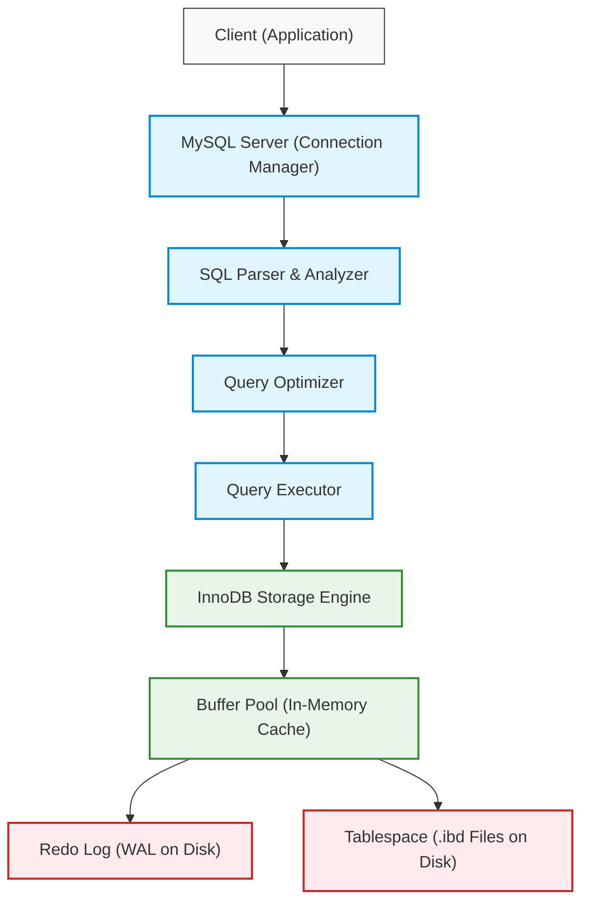
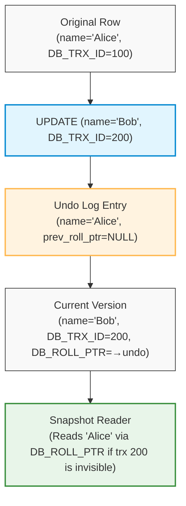
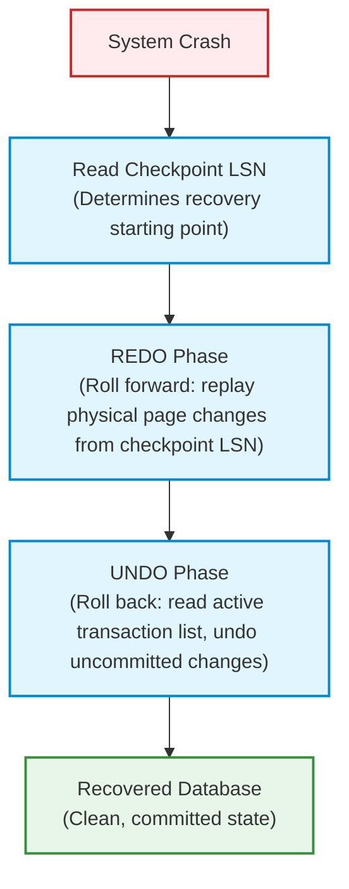
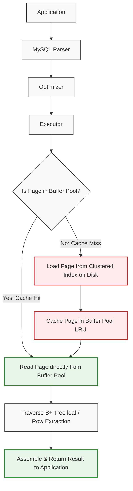
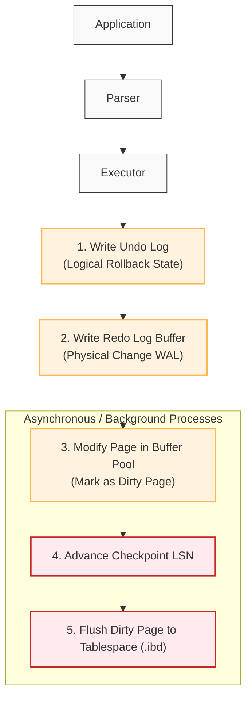

# MySQL / InnoDB Storage Engine

## 1. Problem Background

MySQL was created in 1995 by MySQL AB (founders Axmark and Widenius) to be a fast, simple, and embeddable relational database for web applications. The original MyISAM storage engine prioritized read performance and simplicity, but lacked transactions and foreign keys.

InnoDB was developed independently by Heikki Tuuri at Innobase Oy (acquired by Oracle in 2005) to address exactly what MyISAM lacked: full ACID compliance, crash recovery, row-level locking, and foreign key enforcement. InnoDB became the default MySQL storage engine in MySQL 5.5 (2010).

The core architectural question InnoDB answered: **how do you provide ACID transactions with high write throughput and row-level concurrency in a storage engine that plugs into MySQL's query layer?**

The answer involves three interlocking mechanisms:
- **Clustered indexes**: organize data physically for optimal primary-key access
- **Undo logs**: enable MVCC and transaction rollback without keeping multiple heap versions
- **Redo logs**: guarantee durability through WAL, enabling crash recovery

Understanding why InnoDB made different choices than PostgreSQL reveals the depth of the trade-off space in database engine design.

---

## 2. Architecture Overview

```
┌──────────────────────────────────────────────────────────────────┐
│                    MySQL / InnoDB Architecture                   │
│                                                                  │
│  Client  ──►  MySQL Server Layer                                 │
│                ├─ Connection Manager                             │
│                ├─ SQL Parser & Analyzer                          │
│                ├─ Query Optimizer                                │
│                └─ Query Executor                                 │
│                        │                                        │
│                ┌───────▼─────────────────────────────────────┐  │
│                │          InnoDB Storage Engine              │  │
│                │                                             │  │
│                │  ┌─────────────────────────────────────┐   │  │
│                │  │         Buffer Pool                 │   │  │
│                │  │  (data pages, index pages,          │   │  │
│                │  │   undo pages, insert buffer)        │   │  │
│                │  └──────────────┬──────────────────────┘   │  │
│                │                 │                           │  │
│                │  ┌──────────────▼──────────────────────┐   │  │
│                │  │  Transaction System                 │   │  │
│                │  │   Lock Manager  │  MVCC (undo log)  │   │  │
│                │  └──────────────┬──────────────────────┘   │  │
│                │                 │                           │  │
│                │  ┌──────────────▼──────────────────────┐   │  │
│                │  │  Tablespace Files (.ibd)            │   │  │
│                │  │   undo tablespace | redo log         │   │  │
│                │  └─────────────────────────────────────┘   │  │
│                └─────────────────────────────────────────────┘  │
└──────────────────────────────────────────────────────────────────┘
```

### Overall Architecture Flow



**Workflow Explanation:**
*   **What is happening?** A client application sends a SQL query to the MySQL Server layer where it is authenticated, parsed, optimized, and scheduled for execution. The executor calls the InnoDB storage engine handler APIs. InnoDB interacts with the Buffer Pool in memory to read/write data pages, writes transaction records to the Redo Log (WAL) for durability, and asynchronously flushes dirty pages to the underlying physical Tablespace (.ibd files).
*   **Why does it happen?** The separation of MySQL Server and Storage Engine allows query optimization and connection handling to remain independent of the physical storage format. Accessing data via the in-memory Buffer Pool minimizes high-latency disk I/O, while writing sequentially to the Redo Log guarantees durability before transaction commit completes.
*   **Why was this design chosen?** This pluggable, layered architecture allows different storage engines to be swapped in depending on workload needs. By separating page modification (in-memory) from page persistence (Write-Ahead Logging + background checkpoints), InnoDB resolves the classic database performance bottleneck of random disk writes, ensuring both sub-millisecond transaction response times and robust crash recovery.

---

## Query Execution Lifecycle

This section describes the internal step-by-step execution path for primary database operations within MySQL and the InnoDB storage engine, detailing the engineering rationale behind each component's design.

### 1. SELECT Query Lifecycle

The execution path of a `SELECT` query proceeds through the following phases:

1.  **SQL Parsing**:
    *   **What is happening**: The client connection manager hands the raw SQL string to the SQL Parser. The parser performs lexical analysis (tokenizing the string) and syntactic analysis (verifying against SQL grammar rules) to build an Abstract Syntax Tree (AST).
    *   **Why does it happen**: Databases require structured representations of text queries to reason about tables, columns, constraints, and operations.
    *   **Why was this design chosen**: Early validation prevents syntactically malformed queries from consuming execution resources or holding locks.
2.  **Optimization**:
    *   **What is happening**: The Query Optimizer processes the AST, analyzes available table statistics (e.g., cardinality, index distribution), evaluates alternative query plans, and produces an optimal, low-cost execution plan.
    *   **Why does it happen**: Decoupling declarative SQL query construction from procedural execution plans allows the database to dynamically adjust how data is accessed depending on data volume and index availability.
    *   **Why was this design chosen**: Finding a mathematically low-cost access path (e.g., choosing a covering index over a full table scan) yields orders-of-magnitude faster performance.
3.  **Index Traversal**:
    *   **What is happening**: The Query Executor initiates the plan, calling the InnoDB handler. InnoDB navigates the B+ tree structure (starting from the root page down to the appropriate leaf page) using search keys.
    *   **Why does it happen**: B+ trees offer $O(\log N)$ search complexity, avoiding costly $O(N)$ full table scans by utilizing ordered index nodes to navigate directly to matching records.
    *   **Why was this design chosen**: Index traversal localizes the search path, reducing the number of data pages that need to be loaded into memory.
4.  **Buffer Pool Lookup**:
    *   **What is happening**: For every node/leaf page traversed, InnoDB checks if the page is currently cached in the Buffer Pool. If it is (a cache hit), InnoDB reads it directly from memory.
    *   **Why does it happen**: Memory access latency (nanoseconds) is orders of magnitude faster than disk access latency (milliseconds).
    *   **Why was this design chosen**: Maximizing in-memory operations is critical for high-throughput transactional database engines.
5.  **Disk Access (if page miss)**:
    *   **What is happening**: If the requested page is not in the Buffer Pool (a cache miss), InnoDB issues a physical read operation to the Tablespace (.ibd file) on disk, loads the page into the Buffer Pool, and evicts an old page if necessary using a modified LRU policy.
    *   **Why does it happen**: Physical data exceeds memory capacity, necessitating a persistent storage backing layer.
    *   **Why was this design chosen**: On-demand page swapping (demand paging) optimizes memory utilization by only loading active working sets into RAM.
6.  **Result Construction**:
    *   **What is happening**: Once the records are located in the leaf page, the InnoDB engine extracts the required columns, projects/transforms them (and performs joins/aggregations if required by the server layer), and formats them into the MySQL protocol format.
    *   **Why does it happen**: Storage engines return raw rows; the server layer must package these rows according to client expectations.
    *   **Why was this design chosen**: Isolating result formatting from storage-level retrieval enforces clean software abstraction boundaries.
7.  **Return to Client**:
    *   **What is happening**: The server layer transmits the structured packets back to the client over the network connection.
    *   **Why does it happen**: To deliver requested data to the calling application.
    *   **Why was this design chosen**: Stream-based client response patterns minimize server memory overhead by sending rows as they are constructed instead of buffering the entire result set.

---

### 2. INSERT Query Lifecycle

The execution path of an `INSERT` query proceeds through the following phases:

1.  **Parser & Optimizer**:
    *   **What is happening**: The query is parsed and validated. The optimizer identifies the target clustered index and any affected secondary indexes.
    *   **Why does it happen**: Syntactic and semantic verification ensure the target table, columns, and value types are valid and respect schema rules.
    *   **Why was this design chosen**: Layering validation ensures the engine receives structured, well-formed write instructions.
2.  **Clustered Index Insert**:
    *   **What is happening**: InnoDB navigates the primary key B+ tree to find the appropriate leaf page where the new record should physically reside based on its key value.
    *   **Why does it happen**: Data is clustered by the primary key, meaning the physical organization on disk/memory is determined entirely by the primary key.
    *   **Why was this design chosen**: Maintaining physical order by primary key optimizes range scans and key lookups, clustering related rows together.
3.  **Undo Log Entry Creation**:
    *   **What is happening**: Before modifying any data pages, InnoDB writes an insert undo log record containing the primary key of the new row.
    *   **Why does it happen**: If the transaction rolls back or the system crashes before commit, the database must know what row was added so it can physically delete it.
    *   **Why was this design chosen**: Rollback information must be recorded prior to mutation to guarantee atomicity and support MVCC isolation.
4.  **Redo Log Entry Creation**:
    *   **What is happening**: InnoDB records a physical-to-logical representation of the change (e.g., "modified byte offset X on page Y with value Z") in the Redo Log buffer.
    *   **Why does it happen**: To guarantee durability under Write-Ahead Logging (WAL) rules.
    *   **Why was this design chosen**: Redo log records are small and written sequentially, allowing immediate durability verification without waiting for expensive, random tablespace writes.
5.  **Buffer Pool Modification**:
    *   **What is happening**: The new record is inserted into the target B+ tree page in the Buffer Pool, marking the page as "dirty."
    *   **Why does it happen**: Performing mutations in memory first avoids blocking transactions on slow disk I/O.
    *   **Why was this design chosen**: In-memory updates maintain high throughput, decoupling transaction processing speed from physical disk write speeds.
6.  **Checkpoint**:
    *   **What is happening**: Periodically, the checkpoint thread advances the Log Sequence Number (LSN) and coordinates page flushing.
    *   **Why does it happen**: To limit the amount of redo log records that need to be replayed during crash recovery.
    *   **Why was this design chosen**: Active checkpointing limits crash recovery times, keeping restart times predictable.
7.  **Disk Flush**:
    *   **What is happening**: Background page cleaner threads write the dirty pages from the Buffer Pool to the physical Tablespace (.ibd file) on disk.
    *   **Why does it happen**: To persist memory changes permanently to the table files on disk.
    *   **Why was this design chosen**: Asynchronous, batched, and sequential background writes prevent query threads from being blocked by slow disk operations.

#### Why Logging Occurs Before Page Flushing (Write-Ahead Logging / WAL)
InnoDB strictly enforces the **Write-Ahead Logging (WAL)** protocol. **Redo logs must be flushed to disk before the modified data pages are written to the tablespace.**
*   **The Risk**: If the database flushed a dirty data page to disk first and then crashed before the redo log was written, there would be no record of the transaction. If that transaction was uncommitted, the database state would be corrupted, violating atomicity and durability.
*   **The Design**: By writing the sequential, compact redo logs first (forcing them on commit), InnoDB ensures that no matter when a crash happens, the database can reconstruct the exact state of memory at the time of the crash (using Redo) and roll back any uncommitted transactions (using Undo).

---

### 3. UPDATE Query Lifecycle

The execution path of an `UPDATE` query proceeds through the following phases:

1.  **Row Lookup**:
    *   **What is happening**: The executor performs a search (usually via primary key or secondary index) to find the existing record.
    *   **Why does it happen**: InnoDB performs updates in-place, meaning it must locate the existing record's page in memory (or load it from disk) before modifying it.
    *   **Why was this design chosen**: In-place updates minimize space overhead and keep the indexing structures aligned with physical records.
2.  **Undo Record Creation**:
    *   **What is happening**: InnoDB writes the old column values of the record to the Undo Log.
    *   **Why does it happen**: This allows concurrent transactions to read the old state of the row (MVCC snapshot isolation) and provides the rollback path if the current transaction aborts.
    *   **Why was this design chosen**: Retaining old versions in a separate undo structure avoids cluttering the clustered B+ tree pages with dead rows.
3.  **Redo Record Creation**:
    *   **What is happening**: InnoDB records the physical change details to both the data page and the undo log page in the Redo Log buffer.
    *   **Why does it happen**: To guarantee that both the data update and the rollback info (undo page) can be reconstructed in the event of a crash.
    *   **Why was this design chosen**: Bundling data and undo modifications in the redo log ensures consistent crash recovery for both forward progress (redo) and rollbacks (undo).
4.  **Page Modification**:
    *   **What is happening**: The data page in the Buffer Pool is modified in-place, updating the row's values, updating `DB_TRX_ID` to the current transaction ID, and pointing `DB_ROLL_PTR` to the newly written undo log record.
    *   **Why does it happen**: Applying the change directly to the cached page ensures subsequent reads in the same transaction see the updated data.
    *   **Why was this design chosen**: Using transaction metadata (`DB_TRX_ID`, `DB_ROLL_PTR`) directly on the row enables decentralized, lock-free snapshot reads.
5.  **Commit**:
    *   **What is happening**: The redo log buffer is flushed to disk (fsync). The transaction state is marked as committed.
    *   **Why does it happen**: To make the transaction's changes permanent and visible to other transactions.
    *   **Why was this design chosen**: Restricting disk syncs strictly to sequential redo logs at commit time optimizes write performance while guaranteeing ACID durability.
6.  **Background Flushing**:
    *   **What is happening**: Background threads periodically write the dirty data pages from the Buffer Pool to the Tablespace.
    *   **Why does it happen**: To eventually synchronize physical storage with the in-memory state.
    *   **Why was this design chosen**: Offloading writes to background threads maintains sub-millisecond transaction response times.

#### Why Both Undo and Redo Logs are Necessary
A database engine operating under the **STEAL/NO-FORCE** buffer pool management policy requires both logs to maintain ACID compliance:
*   **STEAL Policy (Requires Undo)**: The engine is allowed to flush uncommitted, modified pages to disk (to free up buffer pool memory). If the system crashes, these uncommitted changes are physically on disk. The database needs **Undo Logs** to revert (roll back) these uncommitted changes during recovery.
*   **NO-FORCE Policy (Requires Redo)**: The engine does not force dirty pages to disk at commit time. It only forces the sequential redo logs. If a crash occurs right after commit, the modified pages are still in memory and lost. The database needs **Redo Logs** to replay (roll forward) the committed changes.

---

### 4. DELETE Query Lifecycle

The execution path of a `DELETE` query proceeds through the following phases:

1.  **Logical Deletion (Delete-Marking)**:
    *   **What is happening**: Instead of physically removing the record from the B+ tree page, InnoDB sets a special `delete-mark` flag in the record header.
    *   **Why does it happen**: Concurrent transactions might still be reading this record via an MVCC snapshot. Physically removing the record would break their reads and cause serialization anomalies.
    *   **Why was this design chosen**: Deferring physical deletion protects read consistency for snapshot readers without requiring readers to acquire locks.
2.  **Undo Log Generation**:
    *   **What is happening**: An undo log entry of type `delete` is written, recording the primary key and index columns of the deleted row.
    *   **Why does it happen**: To allow rolling back the delete operation and to help concurrent transactions reconstruct the row if their snapshot dictates it should be visible.
    *   **Why was this design chosen**: Reconstructive undo logging supports transactional isolation levels (MVCC) without locking records.
3.  **Redo Logging**:
    *   **What is happening**: The delete-mark change and the undo log page changes are written to the Redo Log.
    *   **Why does it happen**: Ensures that both the logical delete-mark status and the rollback path survive a system crash.
    *   **Why was this design chosen**: Follows the WAL protocol to guarantee ACID durability.
4.  **Purge (Physical Removal)**:
    *   **What is happening**: A background thread (the Purge Thread) periodically scans undo logs. When no active transactions require the old version of the deleted row (i.e., all active transaction snapshots have read views newer than the deletion transaction), the purge thread physically removes the record from the B+ tree page and any secondary indexes.
    *   **Why does it happen**: To reclaim storage space and prevent index bloat once old versions are no longer visible.
    *   **Why was this design chosen**: Offloading physical deletion to background threads prevents query latency spikes and minimizes index reorganization overhead during transactional execution.
5.  **Space Reuse**:
    *   **What is happening**: The slot previously occupied by the deleted record within the B+ tree page is marked as free space and made available for future inserts within the same key range.
    *   **Why does it happen**: To avoid continuous file growth and optimize leaf page storage density.
    *   **Why was this design chosen**: In-place space recycling within B+ tree leaf pages keeps indexes compact and avoids costly full-table defragmentation operations.

---

## 3. Internal Design

### 3.1 Clustered Indexes

This is InnoDB's most distinctive architectural feature. **Every InnoDB table is physically organized as a B+ tree keyed by the primary key.** There is no separate "heap file" — the table data IS the primary key index.

```
Clustered Index (Primary Key B+ Tree):

               ┌─────────────────┐
               │  ROOT (level 2) │
               │   [50 | 100]    │
               └────┬───────┬────┘
                    │       │
         ┌──────────┘       └──────────┐
         ▼                             ▼
  ┌─────────────┐              ┌─────────────┐
  │  INTERNAL   │              │  INTERNAL   │
  │  [20 | 35]  │              │  [65 | 80]  │
  └──┬───────┬──┘              └──┬──────┬───┘
     │       │                    │      │
┌────┘   ┌───┘               ┌────┘  ┌───┘
▼        ▼                   ▼       ▼
┌──────────────┐  ←──────►  ┌──────────────┐
│ LEAF (pk=1)  │            │ LEAF (pk=51) │
│ pk=1, ALL    │            │ pk=51, ALL   │
│ column data  │            │ column data  │
│ pk=2, ALL    │            │ pk=52, ALL   │
│ column data  │            │ column data  │
│ ...          │            │ ...          │
└──────────────┘            └──────────────┘
    Leaf pages linked in PK order
```

**Why clustered indexes improve performance:**

```
Query: SELECT * FROM orders WHERE id = 42;

Without clustering (heap):
  1. B-tree index lookup: find TID for id=42
  2. Heap page fetch: random I/O to heap page
  Total: 2 I/Os (index + heap)

With clustering (InnoDB):
  1. B-tree leaf lookup: find page containing id=42
     → leaf page IS the data
  Total: 1 I/O (just the index leaf)

Range query: SELECT * FROM orders WHERE id BETWEEN 40 AND 60;

Without clustering:
  20 index lookups → 20 random heap page fetches (scatter-gather)

With clustering:
  Leaf pages are physically contiguous → sequential I/O
  All 20 rows likely on 1-2 leaf pages
```

#### Secondary Indexes in InnoDB

Secondary indexes do NOT store pointers to physical row locations. Instead, leaf nodes of a secondary index store the **primary key value**:

```
Secondary Index on (customer_id):
  Leaf entry: (customer_id=5, pk=42)
                                ↓
  To fetch row: look up pk=42 in clustered index
                (double B-tree traversal)

Why not store physical page pointers?
  If a row is updated and moves (page split), all secondary
  indexes pointing to physical location would need updating.
  By pointing to the PK, only the clustered index update
  is needed — secondary indexes remain valid.
```

**Trade-off**: Lookups via secondary index always require a clustered index lookup (unless the query can be satisfied from the secondary index alone — a "covering index"). This is why choosing a compact primary key matters — it's repeated in every secondary index leaf.

### 3.2 Buffer Pool

The InnoDB buffer pool serves the same purpose as PostgreSQL's shared buffers, but with additional responsibilities:

```
InnoDB Buffer Pool Contents:
┌──────────────────────────────────────────────────────────┐
│  Data Pages (clustered index leaf pages)                 │
│  Index Pages (internal nodes + secondary index pages)    │
│  Undo Log Pages (for MVCC — unlike PostgreSQL)           │
│  System Page (tablespace metadata)                       │
│  Change Buffer (deferred secondary index writes)         │
└──────────────────────────────────────────────────────────┘

LRU List Structure (InnoDB's modified LRU):
┌────────────────────────────────────────────────────────┐
│  Young (Hot) Sublist     │  Old (Cold) Sublist         │
│  (recently used pages)   │  (newly read pages go here) │
│  [page] [page] [page]    │  [page] [page] [page]       │
└──────────────────────────┴─────────────────────────────┘
  Default: 5/8 young, 3/8 old

  New page insertion point: head of Old sublist
  After innodb_old_blocks_time (1s default): promoted to Young
  This prevents full-table scans from evicting hot data!
```

### 3.3 Undo Logs

This is the crucial architectural difference from PostgreSQL. **InnoDB performs in-place updates to the clustered index** and uses a separate **undo log** to reconstruct old versions for MVCC and rollback.

```
PostgreSQL approach (append-only heap):
  Original row: [xmin=100, xmax=0, data="Alice"]
  After UPDATE:
    Old tuple: [xmin=100, xmax=200, data="Alice"]  ← stays in heap
    New tuple: [xmin=200, xmax=0,   data="Bob"]    ← appended to heap
  Heap grows with old versions. VACUUM cleans up.

InnoDB approach (in-place update + undo log):
  Clustered index page:
    Before: pk=1, name="Alice", DB_TRX_ID=100, DB_ROLL_PTR=NULL
    After:  pk=1, name="Bob",   DB_TRX_ID=200, DB_ROLL_PTR=→undo

  Undo log:
    Entry: {trx=200, prev_data="Alice", prev_roll_ptr=NULL}

  To reconstruct old version:
    Follow DB_ROLL_PTR → undo log entry → reconstruct "Alice"
    Follow chain further for older versions
```

#### Undo Log Chain

```
Multiple versions of a row (InnoDB MVCC chain):
                          Clustered Index
                         ┌──────────────────┐
                         │ pk=1, name="Eve" │
                         │ trx_id=400       │
                         │ roll_ptr ────────┼──────────┐
                         └──────────────────┘          │
                                                        ▼
                                              Undo Log Entry
                                             ┌──────────────────┐
                                             │ trx=400          │
                                             │ old: name="Carol"│
                                             │ prev_roll_ptr ───┼──┐
                                             └──────────────────┘  │
                                                                    ▼
                                                          Undo Log Entry
                                                         ┌──────────────┐
                                                         │ trx=300      │
                                                         │ old: "Alice" │
                                                         │ prev=NULL    │
                                                         └──────────────┘

A reader with snapshot at trx=350:
  Sees trx_id=400 > 350, not visible
  Follows roll_ptr → finds trx=400 → old="Carol" at trx<350 → VISIBLE
```

#### MVCC Version Reconstruction Flow



**Workflow Explanation:**
*   **What is happening?** An update to a row writes the prior state (name="Alice") to the Undo Log, points the new row's `DB_ROLL_PTR` to that undo record, and overwrites the row in-place (name="Bob", `DB_TRX_ID`=200). A concurrent reader with a read view older than transaction 200 encounters the current row, determines it is invisible, and follows the `DB_ROLL_PTR` to reconstruct the original "Alice" version.
*   **Why does it happen?** To provide Multi-Version Concurrency Control (MVCC). By maintaining pointers to previous row states in the undo log, InnoDB allows readers to retrieve a consistent view of the database as of their snapshot time, completely avoiding read-write locks.
*   **Why was this design chosen?** Storing old row versions in the undo logs rather than the main table space prevents clustered index fragmentation, minimizes index page sizes, and avoids PostgreSQL-style table bloat. This dramatically improves query performance for the most common scenario (reading the latest committed version), while isolating the overhead of older version reconstruction solely to those queries running under long-running transactions.

**Key difference**: PostgreSQL stores all versions in the heap. InnoDB stores only the current version in the clustered index; old versions are reconstructed by replaying undo log entries backwards. This makes InnoDB reads slightly more expensive for very old snapshots but keeps the primary index compact.

### 3.4 Redo Logs

InnoDB's redo log is its WAL — it records physical changes to pages, enabling crash recovery.

```
Why Both Undo AND Redo?

REDO LOG: Ensures committed transactions survive crashes
  → If buffer pool pages haven't been flushed when crash occurs,
    redo log lets us replay the physical changes at recovery.

UNDO LOG: Ensures uncommitted transactions are rolled back
  → If a transaction was running when crash occurred,
    undo log lets us undo its partial changes.

PostgreSQL comparison:
  PostgreSQL only needs REDO (WAL) because:
    - MVCC keeps old versions in heap (no rollback needed for crash recovery)
    - Uncommitted versions are simply invisible due to xmin/xmax
    - VACUUM handles cleanup asynchronously

InnoDB needs BOTH because:
  - Clustered index has been modified in-place
  - Uncommitted transactions' changes are physically in the page
  - Must physically undo them on crash + incomplete transaction
```

```
InnoDB Recovery Sequence (crash → restart):
  1. Read redo log, find last checkpoint
  2. REDO phase: replay all redo log records from checkpoint
     → Brings pages to state just before crash (including uncommitted)
  3. UNDO phase: read active transaction list from undo log
     → Roll back all transactions that weren't committed
  4. Database is now in clean committed state
```

#### Crash Recovery Flow Diagram



**Workflow Explanation:**
*   **What is happening?** Upon startup after an unexpected crash, InnoDB reads the last recorded checkpoint LSN to locate where recovery should begin. It first performs a REDO phase, replaying all physical page modifications up to the crash point. Next, it performs an UNDO phase, identifying transactions that were active (uncommitted) at the time of the crash and rolling back their modifications.
*   **Why does it happen?** The system must guarantee the Atomicity and Durability of transactions (ACID). Replaying the redo log restores committed data that hadn't yet been flushed to disk, while replaying the undo logs cleans up partial, uncommitted changes that were written to the tablespaces prior to the crash.
*   **Why was this design chosen?** Under InnoDB's STEAL/NO-FORCE policy, data files on disk can contain uncommitted changes (STEAL) and lack committed changes (NO-FORCE). The "REDO first, then UNDO" design (often called the ARIES recovery algorithm) ensures that the database is restored to a mathematically consistent state before processing new transactions, maximizing reliability while keeping the recovery window bounded by the frequency of checkpoints.

---

### 3.5 Locking Mechanisms

InnoDB provides **row-level locking**, which enables much higher concurrency than table-level locking.

```
Lock Types:
  Shared (S): Multiple readers can hold simultaneously
  Exclusive (X): Only one writer; blocks all other locks

Record Lock: locks a specific index record
  Prevents other transactions from modifying that row.

Gap Lock: locks the gap BETWEEN index records
  Example: Gap lock on (10, 20) prevents INSERT of any value
  between 10 and 20. Prevents phantom reads.

Next-Key Lock = Record Lock + Gap Lock on preceding gap
  This is InnoDB's default at REPEATABLE READ isolation.
  SELECT ... FOR UPDATE takes next-key locks.

┌──────────────────────────────────────────────┐
│  Index values: 1, 5, 10, 20, ∞              │
│                                              │
│  Record Lock on 10: ■ (just row with key=10) │
│  Gap Lock (5,10):   ( ) (values between 5-10)│
│  Next-Key Lock on 10: (5,10] (gap + record)  │
└──────────────────────────────────────────────┘
```

**Gap locks prevent phantom reads** — a key advantage of REPEATABLE READ in InnoDB:

```sql
-- Transaction A: 
SELECT * FROM orders WHERE amount BETWEEN 100 AND 200 FOR UPDATE;
-- Acquires next-key locks on all index records in (100,200]

-- Transaction B (concurrent):
INSERT INTO orders (amount) VALUES (150);
-- BLOCKS! The gap (100,200] is locked by Transaction A

-- This prevents the "phantom row" from appearing if A re-reads the range.
-- PostgreSQL at REPEATABLE READ uses MVCC snapshots instead — no gap locks.
```
---

## End-to-End Data Flow

This section details the end-to-end traversal of data through the logical and physical storage components of the database during read and write queries.

### Read Operation Flow



**Workflow Explanation:**
*   **What is happening?** When a client issues a `SELECT` query, the application request passes through the SQL parser, optimizer, and executor. The executor checks if the required data page is present in the in-memory Buffer Pool. If it is (a cache hit), the query reads it immediately. If not (a cache miss), the page is synchronously read from the Clustered Index file on disk, cached in the Buffer Pool, and then returned.
*   **Why does it happen?** The system must minimize page load latency. By keeping a copy of frequently accessed pages in RAM and structuring tables as sorted primary key B+ trees, lookups and ranges can be resolved with minimal disk accesses.
*   **Why was this design chosen?** Physical memory is limited and expensive compared to persistent disk storage. Storing data in a B+ tree format allows the database to perform efficient, indexed page retrievals while utilizing a modified LRU replacement policy in the Buffer Pool to ensure the most valuable "hot" data remains cached, maximizing overall read performance.

#### Detailed Read Components

1.  **Cache Hit vs. Cache Miss**:
    *   *Cache Hit*: Occurs when the requested B+ tree page is already loaded in the Buffer Pool. The read takes nanoseconds, completely bypassing physical disk access.
    *   *Cache Miss*: Occurs when the page must be loaded from disk. This triggers a physical I/O read call, pausing the executing thread until the page is retrieved and placed into the Buffer Pool.
2.  **Buffer Pool Usage**:
    *   The Buffer Pool holds data pages, index pages, undo logs, and system data. When a cache miss occurs, the page is inserted into the "old" sublist of the LRU chain. If the page is accessed again within a configured timeframe, it is promoted to the "young" (hot) sublist, protecting active caches from being flushed out by one-off full table scans.
3.  **Index Traversal**:
    *   InnoDB reads search keys from the query to traverse from the B+ tree root page down to the leaf page. Because the leaf page of a clustered index contains the actual row columns, locating the leaf node completes the search. Secondary indexes require a double-traversal: first traversing the secondary B+ tree to find the primary key, and then traversing the clustered index B+ tree to get the data.
4.  **Sequential vs. Random Access**:
    *   *Random Access*: Single primary key lookups or secondary index traversals require jumping across non-contiguous pages, which represents random I/O if the pages are not cached.
    *   *Sequential Access*: Range scans (e.g., `BETWEEN`) exploit the double-linked list connecting leaf pages in primary key order. Since InnoDB leaf pages are physically clustered together, reading contiguous keys allows sequential disk reads, which are significantly faster than random access.

---

### Write Operation Flow



**Workflow Explanation:**
*   **What is happening?** When a write (INSERT/UPDATE/DELETE) is executed, InnoDB first records the rollback information in the Undo Log and registers the physical changes in the Redo Log buffer. It then modifies the page directly in the Buffer Pool, marking it as dirty. The transaction commits when the redo log is flushed to disk. Later, background threads advance the checkpoint LSN and flush the dirty data pages to the physical Tablespace (.ibd files).
*   **Why does it happen?** The system must guarantee transactional durability and rollback capability without writing whole data pages to disk synchronously on every transaction commit, which would cause severe performance bottlenecks.
*   **Why was this design chosen?** Writing sequentially to the Redo Log (Write-Ahead Logging) is extremely fast. Offloading data page flushing to background asynchronous tasks (STEAL/NO-FORCE policy) allows InnoDB to process writes in memory at memory speeds, keeping transaction latency minimal while ensuring recovery capability.

#### Detailed Write Components

1.  **Why Undo is Written First**:
    *   Before any modification is applied to a data page in memory, the previous state must be recorded in the Undo Log. This ensures that if the system crashes or the transaction is aborted mid-way, InnoDB can reconstruct the database state and safely revert the partial updates, guaranteeing transactional *Atomicity*.
2.  **Why Redo is Written Before Disk Pages (Write-Ahead Logging)**:
    *   Writing a 16KB data page to a tablespace involves random disk writes and can fail midway, leaving the page corrupted. The Redo Log is a sequential append-only file. Writing to it is cheap and fast. By requiring the Redo Log to be flushed to disk before any dirty pages are written to the tablespace (and on transaction commit), InnoDB guarantees *Durability*—meaning any committed changes can be replayed to repair or update pages on startup.
3.  **Why Dirty Pages Remain in Memory**:
    *   Dirty pages are data pages in the Buffer Pool that have been modified in memory but not yet written to disk. Keeping them in memory allows subsequent reads and writes to access/modify the same page at memory speeds without reading/writing to disk, reducing write amplification and maximizing throughput.
4.  **How Checkpoints Reduce Recovery Time**:
    *   If a database crashed and had to replay the redo log from the beginning of time, recovery would take hours. A *Checkpoint* represents a point up to which all dirty pages have been successfully flushed to the physical tablespace. During recovery, InnoDB only replays the redo log from the last checkpoint LSN to the end of the log, drastically reducing startup and recovery times.
5.  **How This Guarantees ACID Durability**:
    *   By enforcing the WAL protocol, InnoDB guarantees that once a transaction commits, its redo log is synced to disk (`innodb_flush_log_at_trx_commit = 1`). Even if power is lost immediately after, the Redo Log contains the record of physical changes. On restart, the recovery thread replays the redo logs to reconstruct the in-memory state and applies undo logs to revert uncommitted transactions. Thus, Atomicity, Consistency, Isolation, and Durability are strictly preserved.

---

## 4. Design Trade-Offs

### InnoDB vs PostgreSQL MVCC

```
┌─────────────────────────────┬──────────────────────────────────┐
│         InnoDB               │         PostgreSQL              │
├─────────────────────────────┼──────────────────────────────────┤
│ In-place updates             │ Append-only updates             │
│ Undo log for old versions    │ Old versions stay in heap        │
│ Clustered primary index      │ Heap file (unordered)           │
│ No VACUUM (purge thread)     │ VACUUM required                 │
│ Undo log purge = InnoDB's    │ VACUUM = PostgreSQL's cleanup   │
│   cleanup mechanism          │   mechanism                     │
│ PK lookups: 1 I/O            │ PK lookups: 2 I/Os (idx+heap)  │
│ Secondary idx: 2 I/Os        │ Secondary idx: 2 I/Os (same)   │
│ OLD versions: undo traversal │ OLD versions: heap tuple        │
│ Write amplification: lower   │ Write amplification: higher     │
│   (one B-tree update)        │   (new tuple + index updates)   │
└─────────────────────────────┴──────────────────────────────────┘
```

### Clustered Index Trade-offs

| Advantage | Limitation |
|---|---|
| PK lookups avoid heap fetch | Secondary indexes always double-traverse |
| Range scans are sequential I/O | Large PK wastes space in every secondary index |
| INSERT with sequential PK is fast | Random PK (UUID) causes random page splits |
| Data physically sorted by PK | Cannot choose physical sort order ad-hoc |

### Why PostgreSQL Chose Differently

PostgreSQL's heap design was a deliberate choice to support:
- Multiple index types on the same table (each is a separate file)
- Tables with no meaningful "clustering key"
- VACUUM as an offline process that doesn't interfere with queries
- Flexibility in choosing physical data layout

InnoDB's design was optimized for:
- Web application workloads (lots of PK lookups by integer ID)
- Write-heavy workloads (in-place updates reduce WAL volume)
- MySQL's pluggable storage engine architecture (undo/redo internally managed)

---

## 5. Experiments / Observations

### Experiment 1: Clustered Index vs Secondary Index Lookup

```sql
-- Create test table
CREATE TABLE products (
    id INT PRIMARY KEY AUTO_INCREMENT,
    sku VARCHAR(50),
    name VARCHAR(200),
    price DECIMAL(10,2),
    INDEX idx_sku (sku)
) ENGINE=InnoDB;

INSERT INTO products (sku, name, price)
    SELECT CONCAT('SKU-', i), CONCAT('Product ', i), RAND()*1000
    FROM (SELECT @row := @row + 1 AS i FROM information_schema.columns, (SELECT @row:=0) r LIMIT 1000000) x;

-- Primary key lookup (clustered index)
EXPLAIN SELECT * FROM products WHERE id = 500000;
-- type: const (single B-tree leaf lookup, no heap fetch)
-- key: PRIMARY, rows: 1

-- Secondary index lookup (requires double traversal)
EXPLAIN SELECT * FROM products WHERE sku = 'SKU-500000';
-- type: ref
-- key: idx_sku
-- Extra: uses index + clustered index lookup (two B-tree traversals)

-- Covering index (no clustered index needed)
EXPLAIN SELECT id, sku FROM products WHERE sku = 'SKU-500000';
-- Extra: "Using index" — answered from secondary index alone!
```

**Observation**: InnoDB's `EXPLAIN` output shows the double-traversal explicitly. Creating a covering index (including all needed columns in the secondary index) eliminates the second traversal.

### Experiment 2: Gap Lock Demonstration

```sql
-- Session A:
BEGIN;
SELECT * FROM products WHERE id BETWEEN 100 AND 110 FOR UPDATE;
-- Acquires next-key locks on records 100-110 and gap before 111

-- Session B (concurrent):
INSERT INTO products (id, sku, name, price) VALUES (105, 'NEW', 'New Product', 99);
-- BLOCKS — gap (100,110] is locked

-- Session A commits:
COMMIT;
-- Session B INSERT immediately succeeds
```

### Experiment 3: Observing Undo Log Usage

```sql
-- Check undo log size during long-running transaction
BEGIN;
UPDATE products SET price = price * 1.1;  -- updates 1M rows

-- In another session while transaction is running:
SELECT name, count, sum_other_wait_time
FROM information_schema.INNODB_METRICS
WHERE name LIKE 'trx_rseg%';
-- Shows undo log segment growth during transaction

-- history_list_length shows number of uncommitted undo log versions:
SHOW ENGINE INNODB STATUS\G
-- "History list length: 1847234"
-- High value = long-running transactions holding old undo log versions
-- Purge thread can't clean up until transaction commits
```

**Observation**: Unlike PostgreSQL where dead tuples stay in heap pages and can be seen via `pg_stat_user_tables`, InnoDB's "dead" data is in the undo log segments. `History list length` is InnoDB's equivalent of PostgreSQL's dead tuple count.

### Experiment 4: Impact of UUID vs SERIAL Primary Key

```sql
-- Sequential PK (INT AUTO_INCREMENT) — fast inserts
CREATE TABLE t_seq (id INT PRIMARY KEY AUTO_INCREMENT, v VARCHAR(100));
INSERT INTO t_seq (v) SELECT repeat('x', 50) FROM ... LIMIT 1000000;
-- Page splits: ~0 (always appending to rightmost leaf page)
-- Buffer pool: mostly sequential access

-- UUID PK — slower inserts  
CREATE TABLE t_uuid (id CHAR(36) PRIMARY KEY, v VARCHAR(100));
INSERT INTO t_uuid SELECT UUID(), repeat('x', 50) FROM ... LIMIT 1000000;
-- Page splits: ~500K (random inserts split 50/50 continuously)
-- Observation: 40-60% slower insert throughput than INT PK
-- Secondary indexes: each leaf entry is 36 bytes (vs 4 for INT)
```

---

## 6. Key Learnings

1. **Clustered indexes are a fundamental architectural choice**: The decision to make the table itself a B-tree keyed by primary key is not just an optimization — it changes how all secondary indexes work, how MVCC works, and why choosing the right primary key matters so much in InnoDB.

2. **Undo logs vs heap versioning is the core MVCC trade-off**: InnoDB's in-place updates + undo log approach keeps the primary index compact but adds complexity for MVCC reads (undo chain traversal). PostgreSQL's append-only approach is simpler for reads but requires VACUUM. Neither is strictly better — they're optimized for different workload patterns.

3. **Why InnoDB needs both undo AND redo logs**: Redo ensures committed data survives crashes (WAL). Undo ensures uncommitted in-place modifications are reversed on crash (since the page was physically modified). PostgreSQL avoids needing crash-time undo because uncommitted versions are simply never visible (no xmin commit in the commit log).

4. **Gap locks are InnoDB's answer to phantom reads**: PostgreSQL prevents phantoms through snapshot isolation (MVCC snapshot at transaction start). InnoDB at REPEATABLE READ uses gap locks instead, which can cause unexpected blocking. At SERIALIZABLE, both systems add full serialization overhead.

5. **The purge thread is InnoDB's VACUUM**: Both systems need a background cleanup process, just targeting different storage locations. InnoDB's purge thread reclaims undo log space; PostgreSQL's VACUUM reclaims heap tuple space.

---

## References

- [MySQL InnoDB Architecture Documentation](https://dev.mysql.com/doc/refman/8.0/en/innodb-architecture.html)
- [InnoDB Multi-Versioning](https://dev.mysql.com/doc/refman/8.0/en/innodb-multi-versioning.html)
- [High Performance MySQL, 4th Edition](https://www.oreilly.com/library/view/high-performance-mysql/9781492080503/)
- [InnoDB Locking and Transaction Model](https://dev.mysql.com/doc/refman/8.0/en/innodb-locking-transaction-model.html)
- Heikki Tuuri. "InnoDB — A Relational Database Engine for Linux." (2000)