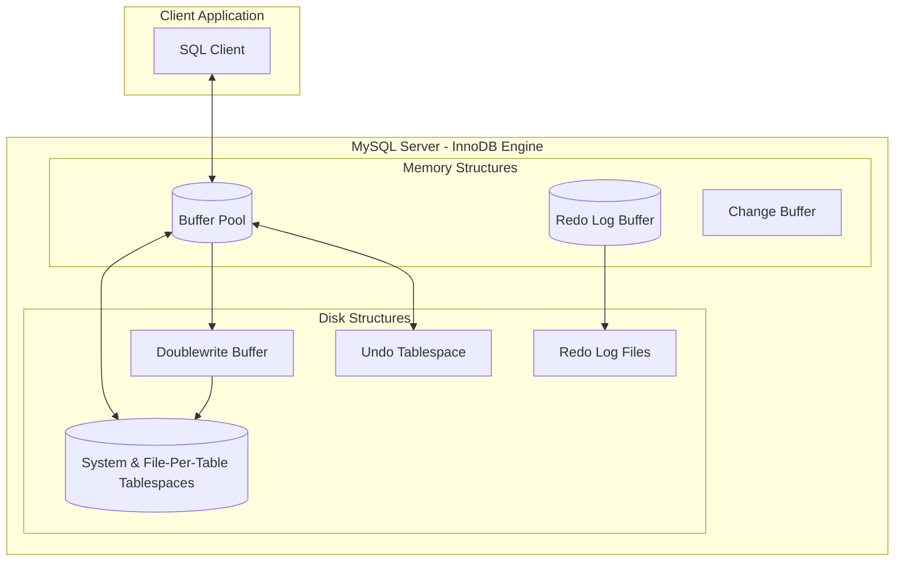

# MySQL / InnoDB Storage Engine

## 1. Problem Background

MySQL is a widely deployed relational database system. In its early iterations, MySQL relied on the MyISAM storage engine, which lacked transaction support (ACID compliance) and used table-level locking, severely limiting concurrency. InnoDB was developed as a transactional storage engine to address these shortcomings, providing ACID compliance, crash recovery, and row-level locking. InnoDB has been the default storage engine for MySQL since version 5.5.

---

## 2. Architecture Overview

### InnoDB Engine Architecture

### Main System Components
- **Buffer Pool:** A dedicated memory area where InnoDB caches table and index data. It uses a modified Least Recently Used (LRU) algorithm to keep hot pages in memory.
- **Redo Log & Log Buffer:** A memory-to-disk structure that records modifications to data pages. Redo logs ensure durability by logging transactions sequentially before updating the tablespace.
- **Undo Log:** Stores historical versions of modified pages, allowing InnoDB to roll back active transactions and implement MVCC.
- **Doublewrite Buffer:** A disk buffer where pages are written before being written to their final locations in the tablespace, preventing page corruption during partial writes.

---

## 3. Internal Design

### 3.1 Clustered Index (Primary Key Storage)
In InnoDB, tables are organized as **clustered indexes**.
- **Data Placement:** The leaf nodes of the clustered index contain the actual row data.
- **Primary Key Importance:** Since rows are stored in the leaf nodes of the primary key, accessing a row via its primary key is extremely fast and avoids an extra lookup. If no primary key is defined, InnoDB will automatically generate a hidden 6-byte row ID to construct the clustered index.

### 3.2 Secondary Indexes
Any index other than the clustered index is a **secondary index**.
- **Leaf Node Contents:** In InnoDB, leaf nodes of secondary indexes do not store physical offsets (TIDs) like PostgreSQL does. Instead, they store the **primary key value** of the row.
- **Lookup Path:** A search using a secondary index requires a two-step traversal:
  1. Traverse the secondary index to find the primary key.
  2. Traverse the clustered index using that primary key to retrieve the actual row data.

### 3.3 Undo and Redo Logs
- **Redo Logs (WAL for Durability):** Redo logs are append-only ring buffers on disk. When a transaction commits, the changes are written to the Redo Log Buffer in memory and then flushed to the Redo Log Files on disk. This guarantees durability because the system can replay the redo log during startup if a crash occurs.
- **Undo Logs (Rollback & MVCC):** Undo logs store the reverse of every change (e.g., if you INSERT, the undo log records a DELETE). They serve two purposes:
  1. **Rollback:** If a transaction fails or executes a `ROLLBACK`, InnoDB uses the undo log to revert changes.
  2. **MVCC (Multi-Version Concurrency Control):** Instead of storing multiple physical copies of a row in the main tablespace (like PostgreSQL), InnoDB stores only the latest version in the clustered index and reconstructs older versions on-the-fly using the undo logs.

### 3.4 Concurrency Control: Row-Level Locking & Gap Locks
InnoDB implements fine-grained locking to support high concurrency.
- **Record Locks:** Locks on a specific index record.
- **Gap Locks:** Locks on the "gap" (empty space) between index records, or the gap before or after a record.
- **Next-Key Locks:** A combination of a record lock on the index record and a gap lock on the gap preceding it.
- **Purpose of Gap Locking:** Gap locks are used to prevent **phantom reads** (where a transaction queries a range of rows twice and sees new rows inserted by another concurrent transaction). This is crucial for supporting the `REPEATABLE READ` isolation level (MySQL's default).

---

## 4. Key Comparison: InnoDB vs. PostgreSQL

| Architectural Feature | MySQL (InnoDB) | PostgreSQL |
| :--- | :--- | :--- |
| **MVCC Model** | **Undo Log-based:** Stores only the latest tuple version in the page. Reconstructs historical versions using undo logs. | **Heap-based:** Stores multiple physical versions of tuples directly in the table heap pages. |
| **Storage Structure** | **Index-Organized:** Tables are stored within the clustered index structure. | **Heap-Organized:** Tables are stored as unordered heaps, indexes store pointers (TIDs) to the heap. |
| **Secondary Index Lookup** | **Two-step lookup:** Returns primary key, which must be queried against the clustered index. | **One-step lookup:** Returns direct pointer (TID) to the heap page. |
| **Storage Cleanup** | Asynchronous **purge threads** discard undo logs once transactions complete. | **Vacuuming** daemon cleans up old dead tuples from the heap. |

---

## 5. Design Trade-Offs

### Clustered Index vs Heap Organization
* **Advantage (InnoDB):** Lookups using primary keys are extremely fast because the data is stored directly in the index leaf node. Furthermore, range scans on the primary key benefit from physical data locality.
* **Disadvantage (InnoDB):** Secondary index lookups are slower due to the two-step traversal. Additionally, updating a primary key is expensive because the row must be physically moved within the clustered index structure.

### Undo Logs (InnoDB) vs Heap Versioning (PostgreSQL)
* **Advantage (InnoDB):** Since only the latest version of a row is stored in the main table page, there is less page bloat. The database does not require aggressive vacuuming, and writing changes is faster since old versions are offloaded to separate undo logs.
* **Disadvantage (InnoDB):** Reconstructing older snapshots for long-running readers can be slow, as the database must traverse the undo log chain back in time.

---

## 6. Key Learnings

1. **Dual Log Strategy:** InnoDB requires both undo and redo logs because they serve opposing roles: **redo logs** track changes forward to guarantee durability, while **undo logs** track changes backward to support rollback and transactional isolation.
2. **Gap Locking Prevents Phantoms:** Gap locking is a powerful mechanism that allows MySQL to enforce strict transactional consistency (`REPEATABLE READ`) without relying on expensive table-wide locks.
3. **Primary Key Design Matters:** Because InnoDB is an index-organized table engine, choosing a bad primary key (e.g. a random UUID instead of an auto-incrementing integer) leads to page splits and fragmented leaf nodes, highlighting the direct link between schema design and physical storage performance.
