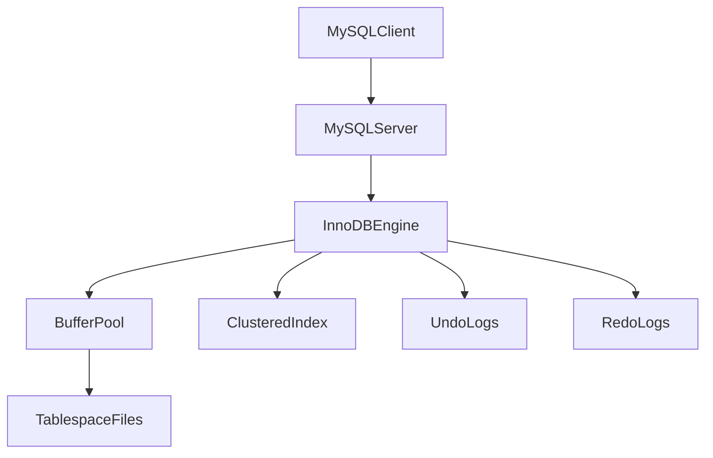

# MySQL InnoDB Storage Engine

## 1. Problem Background

MySQL can use different storage engines. **InnoDB** is the default today. It was built for apps that need transactions, crash recovery, and many users writing at the same time.

Older engines like MyISAM were faster for simple reads but had no real transactions. As web apps grew, that was not enough. InnoDB adds row-level locking, ACID transactions, and reliable recovery.

I picked this topic to compare InnoDB with PostgreSQL. Both are production databases, but they store rows and handle MVCC differently. That comparison made the design trade-offs clearer for me.

---

## 2. Architecture Overview

```
App  -->  MySQL Server  -->  InnoDB Engine  -->  Buffer Pool  -->  tablespace files
                              |--> Clustered Index (rows)
                              |--> Undo Logs (old values)
                              |--> Redo Logs (durability)
                              |--> Lock Manager
```



### Main components

| Part | Job |
|------|-----|
| Buffer pool | Keep hot pages in RAM |
| Clustered index | Store rows sorted by primary key |
| Secondary indexes | Point to primary key, not full row |
| Undo logs | Rollback + consistent reads (MVCC) |
| Redo logs | Durability + crash recovery |
| Locks | Protect rows and gaps between rows |

---

## 3. Internal Design

### Clustered index

In InnoDB the **primary key is the table**. Rows are stored in PK order on disk.

Example PK: `id = 1, 2, 3` → rows are laid out in that order in the clustered index leaf pages.

**Why it helps:** lookup by PK is one B-tree walk to the leaf that already holds the full row.

**Trade-off:** wide or random PKs (like UUIDs) can scatter inserts and bloat indexes.

### Secondary indexes

Secondary indexes are separate B-trees. Leaf entries store:

```
secondary_key  -->  primary_key
```

Not a direct disk pointer to the row. To get the row you often do:
1. Search secondary index
2. Get PK
3. Search clustered index

This is called a **double lookup**.

### Buffer pool

Like PostgreSQL shared buffers. InnoDB caches data and index pages in memory. Most queries hit RAM, not disk. Buffer pool size is usually the biggest tuning knob for InnoDB.

### Undo logs

When a row is updated in place, the **old value** is saved in an undo log.

Uses:
- **ROLLBACK** — put the old value back
- **MVCC** — other transactions read older versions from undo

This is different from PostgreSQL, which keeps new tuple versions in the heap.

### Redo logs

Before a change is durable on the data page, InnoDB writes a **redo** record.

Uses:
- Crash recovery — replay committed changes after a restart

Redo = forward, durability. Undo = backward, rollback and snapshots.

### Row locks and gap locks

**Row lock:** only the touched row is locked (e.g. `UPDATE ... WHERE id = 10`).

**Gap lock:** locks the gap between index values to block inserts that would cause phantom reads. Common at `REPEATABLE READ` in MySQL.

**Trade-off:** gap locks improve isolation but can block more than row locks alone.

---

## 4. Design Trade-Offs

### InnoDB vs PostgreSQL

| Feature | InnoDB | PostgreSQL |
|---------|--------|------------|
| Row storage | Clustered PK | Heap + separate indexes |
| Updates | In-place + undo | New tuple version |
| MVCC cleanup | Purge thread | VACUUM |
| Crash recovery | Redo log | WAL |
| PK lookup | One clustered lookup | Index scan → heap fetch |

### Why InnoDB needs both undo and redo

They solve different problems:
- **Undo** — “go back” for rollback and consistent reads
- **Redo** — “replay forward” after a crash

Without undo, MVCC and ROLLBACK break. Without redo, committed work could be lost on crash.

### Why PostgreSQL chose a different MVCC model

PostgreSQL appends new row versions and leaves old ones until VACUUM. Visibility checks are simpler; readers never wait for undo chain walks.

InnoDB updates in place and chains undo. Less table file bloat, but version reconstruction can be more complex.

---

## 5. Experiments / Observations

I ran these on MySQL 8 in Docker (`mysql-innodb` container).

### Experiment 1 — InnoDB is the default engine

```sql
SHOW ENGINES;
SHOW VARIABLES LIKE 'default_storage_engine';
```

**Output (trimmed):**
```
InnoDB  DEFAULT  Supports transactions, row-level locking...
default_storage_engine = InnoDB
```

**What I learned:** new tables use InnoDB unless you override it. Transactions and row locks come from this engine.

---

### Experiment 2 — PK lookup vs secondary index

```sql
CREATE TABLE employees (id INT PRIMARY KEY, email VARCHAR(100), salary INT);
CREATE INDEX idx_email ON employees(email);
EXPLAIN SELECT * FROM employees WHERE id = 1;
EXPLAIN SELECT * FROM employees WHERE email = 'a@test.com';
```

**Output:**
```
WHERE id = 1      → type=const, key=PRIMARY, rows=1
WHERE email = ... → type=ref,   key=idx_email, rows=1
```

**What I learned:**
- PK query uses `PRIMARY` directly — clustered index
- Email query uses `idx_email` first, then must fetch the row via PK (double lookup)
- Both estimate 1 row here, but the email path has an extra step

---

### Experiment 3 — InnoDB status (buffer pool and logs)

```sql
SHOW ENGINE INNODB STATUS\G
```

**Output (trimmed):**
```
Buffer pool size   8192
Database pages     1164
Free buffers       7028

Log sequence number          29661559
Log flushed up to            29661559
Last checkpoint at           29661407
```

**What I learned:**
- InnoDB keeps thousands of pages in the buffer pool
- Redo log tracks how far changes are written and flushed
- Checkpoints mark how much redo recovery needs to replay

---

## 6. Key Learnings

1. The clustered index is the table in InnoDB — PK design matters a lot.
2. Secondary indexes store PK values, so lookups can cost two tree walks.
3. Undo logs power rollback and MVCC; redo logs power crash recovery.
4. Row locks help concurrency; gap locks trade throughput for stricter isolation.
5. InnoDB and PostgreSQL both use MVCC but store versions very differently.
6. Buffer pool sizing is central to InnoDB performance — same idea as PostgreSQL shared buffers.
7. Engine choice is a trade-off set, not a single “fastest” option.

---

## References

- [InnoDB Storage Engine](https://dev.mysql.com/doc/refman/en/innodb-storage-engine.html)
- [InnoDB Indexes](https://dev.mysql.com/doc/refman/en/innodb-index-types.html)
- [InnoDB Undo Logs](https://dev.mysql.com/doc/refman/en/innodb-undo-logs.html)
- Course lab: `lab_sessions/lab_6.txt` (MVCC comparison)
