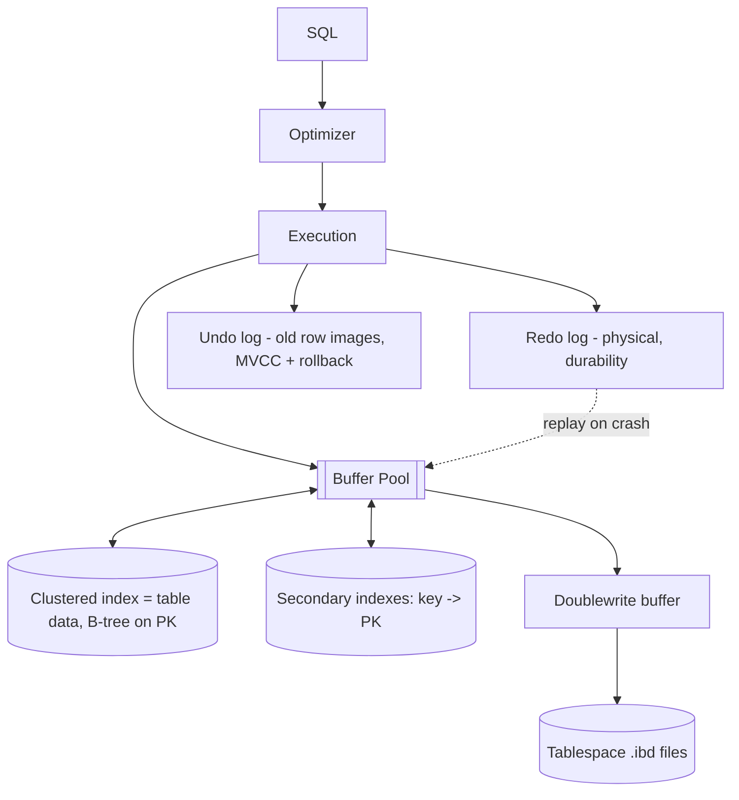

# MySQL / InnoDB Storage Engine

> System Design Discussion · Advanced DBMS · roll `24BCS10130`
> Measured on MySQL 9.6 (InnoDB), contrasted with PostgreSQL 17.9.
> Commands and raw output: [`../experiments`](../experiments).

## 1. Problem Background

InnoDB is MySQL's default transactional storage engine. It targets OLTP: short
transactions, many concurrent users, point lookups and small range scans. Two
design bets define it and set it apart from PostgreSQL:

1. **Clustered storage** — rows physically live inside the primary-key B-tree,
   so PK lookups are maximally fast.
2. **In-place updates with undo logs** — a row is updated where it sits, and the
   *previous* image is kept in an undo log so MVCC readers can reconstruct it.
   (PostgreSQL instead keeps versions in the heap and vacuums them.)

These choices ripple into how indexes, locking, and recovery work.

## 2. Architecture Overview



**Components & flow:** SQL is optimized and executed against the **buffer pool**
(InnoDB's page cache). Data is the **clustered index** (the table *is* a B-tree
keyed by PK); **secondary indexes** store `key → PK`. Each change appends to the
**redo log** (for crash recovery) and writes the old row image to the **undo
log** (for rollback and MVCC reads). The **doublewrite buffer** guards against
torn page writes before pages land in the per-table `.ibd` tablespace.

## 3. Internal Design

### 3.1 Clustered index (the defining feature)
In InnoDB the **table data is stored in the leaf nodes of the primary-key
B-tree**. There is no separate heap. A PK lookup therefore reaches the full row
at the B-tree leaf — no second fetch. Measured
([`mysql.txt`](../experiments/output/mysql.txt)): a PK lookup plans to a single
row fetch with `cost=0..0 rows=1`.

### 3.2 Secondary indexes do a double lookup
A secondary index stores `(indexed column → primary key)`, **not** a direct row
pointer. So `WHERE customer_id = 4242` first seeks the secondary index to get
PKs, then does a second walk of the clustered index per PK to fetch the row:
```
-> Index lookup on orders using idx_customer (customer_id = 4242)  (cost=7 rows=20)
```
A consequence visible on disk: secondary indexes are *large* because every entry
embeds the PK. For `orders`, `index_length = 10.5 MB` exceeds the clustered
`data_length = 8.9 MB`.

### 3.3 MVCC via undo logs
InnoDB also gives readers a consistent snapshot, but differently from PostgreSQL.
On update it modifies the row **in place** and pushes the old version into the
**undo log**. A reader at an older snapshot follows undo records backwards to
reconstruct the version it should see. Net effect: the main table stays compact
(no in-table bloat), but undo logs must be retained until no snapshot needs them,
and a long-running transaction can bloat undo instead.

### 3.4 Redo + undo logs (why both)
- **Redo log** (physical, `innodb_redo_log_capacity = 100 MB` measured): records
  page-level changes so committed work is replayed after a crash → **durability**.
- **Undo log** (logical, old row images): supports **rollback** and **MVCC reads**.
- **Doublewrite** (`ON`) + `innodb_flush_log_at_trx_commit = 1`: full ACID — every
  commit fsyncs the redo log, and pages are written twice to survive torn writes.

PostgreSQL needs only one log (WAL) because it never overwrites a row, so it has
nothing to "undo" physically; InnoDB overwrites, so it needs undo *and* redo.

### 3.5 Locking — record + gap (next-key) locks
InnoDB locks at **row** granularity, and to make REPEATABLE READ safe against
phantoms it also locks the **gaps between** index records (*next-key locking*).

### 3.6 Isolation
InnoDB defaults to **REPEATABLE READ** (measured `@@transaction_isolation =
REPEATABLE-READ`), stronger than PostgreSQL's default READ COMMITTED. Next-key
locks are what let REPEATABLE READ avoid phantom rows.

## 4. Design Trade-Offs

| InnoDB choice | Advantage | Cost / contrast with PostgreSQL |
|---|---|---|
| Clustered PK | PK lookups & PK-ordered range scans are very fast (row at the leaf) | Secondary lookups pay a second B-tree walk; secondary indexes are bigger |
| In-place update + undo | Table stays compact; no VACUUM needed | Long transactions bloat undo; reads may rebuild versions from undo |
| Undo **and** redo logs | Rollback + MVCC + durability all covered | Two log subsystems vs PostgreSQL's single WAL |
| Next-key locking | Phantom-free REPEATABLE READ | More locking → more deadlock potential than pure MVCC reads |
| Doublewrite + flush-at-commit | Torn-write safe, durable | Extra write per page; commit latency from fsync |

The summary contrast: **InnoDB optimizes the primary-key access path and keeps
the table compact**, paying with heavier secondary-index lookups and a
lock-based approach to phantom protection; **PostgreSQL keeps all indexes equal
and avoids in-place updates**, paying with bloat and VACUUM.

## 5. Experiments / Observations

**Clustered vs secondary, on disk.** Secondary indexes embed the PK, so they out-
weigh the clustered data itself ([`mysql.txt`](../experiments/output/mysql.txt)):
```
 TABLE_NAME | DATA_LENGTH | INDEX_LENGTH
------------+-------------+--------------
 orders     |     8929280 |     10518528   -- indexes (10.5MB) > clustered data (8.9MB)
```

**Secondary index → double lookup.** `EXPLAIN` for `customer_id=4242` shows the
index lookup that then resolves PKs into the clustered index (§3.2).

**Next-key locking made visible.** A `SELECT ... WHERE id BETWEEN 100 AND 105 FOR
UPDATE` inside a transaction, inspected via `performance_schema.data_locks`
([`mysql_locks.txt`](../experiments/output/mysql_locks.txt)):
```
 LOCK_TYPE | LOCK_MODE     | LOCK_DATA
-----------+---------------+-----------
 RECORD    | X,REC_NOT_GAP | 100        <- plain record lock on the boundary row
 RECORD    | X             | 101..105   <- next-key locks = record + preceding gap
 TABLE     | IX            | NULL       <- intention lock on the table
```
The `X` (next-key) vs `X,REC_NOT_GAP` (record-only) distinction *is* the gap-lock
mechanism: the gaps are locked so no other transaction can insert a phantom into
the range — which is how REPEATABLE READ stays phantom-free.

**Durability infra** (`redo_log_capacity=100MB`, `doublewrite=ON`,
`flush_log_at_trx_commit=1`) confirms full ACID at commit.

## 6. Key Learnings

- "Clustered index" is not jargon — it literally means *the table is the PK
  B-tree*. That one fact explains both why InnoDB PK reads are fast and why its
  secondary indexes are large (they must store the PK to find the row).
- Two logs exist for two different jobs: **redo = durability** (replay forward),
  **undo = rollback + MVCC** (reconstruct backward). Seeing it next to
  PostgreSQL's single WAL clarified *why* — InnoDB overwrites rows, so it must be
  able to undo; PostgreSQL never overwrites, so it doesn't.
- Gap locks are real and observable. Watching `FOR UPDATE` take next-key locks on
  the gaps showed concretely how a lock-based engine prevents phantoms, versus
  PostgreSQL's snapshot-based approach.
- Two engines can both be "MVCC + ACID" yet make opposite storage bets
  (in-place+undo vs versioned heap+vacuum). There is no single correct design —
  only different trade-offs for the same guarantees.
