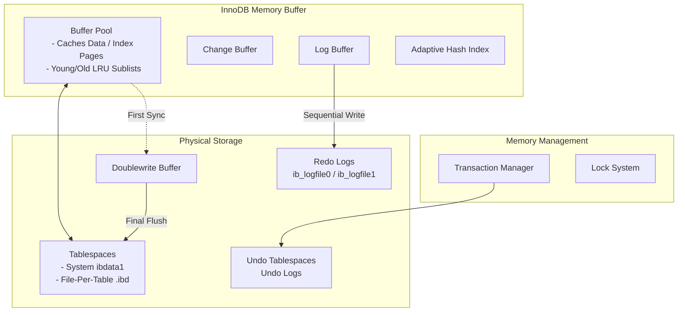

# Topic 3: MySQL / InnoDB Storage Engine

> **Student Name:** Tanishq Singh  
> **Roll Number:** 24BCS10303  
> **Course:** Advanced DBMS - System Design Discussion  

---

## 1. Problem Background

The default storage engine for MySQL, **InnoDB**, was designed to transition MySQL from a fast, web-focused non-transactional database (under the MyISAM engine) to an enterprise-grade transactional database. Under MyISAM, concurrency was restricted by table-level locking, and system crashes could lead to table corruption because the engine lacked a write-ahead log. InnoDB solved these problems by implementing a transactional storage engine featuring row-level locking, ACID compliance, crash safety via logging, and Multi-Version Concurrency Control (MVCC) utilizing an index-organized table architecture.

---

## 2. Architecture Overview

### InnoDB Memory and Storage Components



The division between memory structures and disk storage enables InnoDB to batch writes and maintain ACID properties.

---

## 3. Internal Design

### Clustered vs. Secondary Indexes

InnoDB structures its tables as **Index-Organized Tables** (IOT). The physical layout of the table is tied directly to the B+Tree of the primary key.

```
Clustered Index (Primary Key B+Tree):
[Root/Internal Nodes] ---> [Leaf Nodes containing PK + Actual Row Data (Col1, Col2, ...)]

Secondary Index (Secondary Key B+Tree):
[Root/Internal Nodes] ---> [Leaf Nodes containing Secondary Key + Primary Key Value]
```

#### Clustered Index (Primary Key B+Tree)
* **Storage Location:** The leaf nodes of the primary key B+Tree contain the actual data rows.
* **Benefits:** Primary key lookups are extremely fast because traversing the B+Tree yields the actual row data directly, requiring no secondary I/O lookup. Range scans on the primary key benefit from physical page order locality.
* **Fallback Primary Key:** If no primary key is explicitly declared, InnoDB searches for a `UNIQUE` index where all key columns are `NOT NULL` and uses it as the clustered index. If none exists, InnoDB generates a hidden 64-bit row identifier (`row_id`) and builds the clustered index on it.

#### Secondary Indexes
* **Storage Location:** The leaf nodes of secondary indexes (e.g., indexes on columns other than the primary key) store the indexed column value paired with the corresponding **Primary Key value** (rather than a physical pointer/TID to the row).
* **Double Lookup Cost:** Searching a row via a secondary index requires two index lookups:
  1. Search the secondary B+Tree to retrieve the primary key value.
  2. Search the clustered index B+Tree using that primary key to locate the actual row data.

---

### Undo Logs, Redo Logs, and MVCC

InnoDB separates durability logging from transaction undo logging.

#### Redo Logs (Write-Ahead Logging)
* **Purpose:** Guarantees durability (ACID) and supports crash recovery.
* **Implementation:** Redo logs store physical-logical modifications (e.g., changes at specific offsets within pages). Transactions write changes to the in-memory `Log Buffer` which are flushed sequentially to the disk-based redo log files (`ib_logfileN`) during commit. This sequential I/O is fast, allowing InnoDB to defer flushing modified data pages (dirty pages) from the Buffer Pool to disk.

#### Undo Logs
* **Purpose:** Supports transaction rollbacks and reconstructions of past row versions for MVCC.
* **Implementation:** Unlike redo logs, undo logs contain logical undo instructions (e.g., "if this was an insert, delete the row; if an update, write the old values back").
* **Rollback Pointer:** Every row in the clustered index B+Tree contains two hidden metadata fields:
  * `DB_TRX_ID`: The ID of the transaction that last modified the row.
  * `DB_ROLL_PTR`: A pointer to the undo log segment containing the preceding version of the row.

#### MVCC Reconstruction Flow
```
[Clustered Index Row] --(DB_ROLL_PTR)--> [Undo Log: Version N-1] --(DB_ROLL_PTR)--> [Undo Log: Version N-2]
```
When Transaction A reads a row, InnoDB creates a **Read View** representing Transaction A's isolation horizon. If the row's `DB_TRX_ID` is newer than allowed by the Read View, the engine follows the `DB_ROLL_PTR` to read the undo log, tracing the historical chain back until it reconstructs the version of the row that was committed before Transaction A's snapshot began.

---

### Row-Level Locking and Concurrency Control

InnoDB uses granular locking structures to achieve high write concurrency while preventing race conditions.

#### Lock Granularity:
* **Record Locks:** Locks placed on specific index records.
* **Gap Locks:** Locks placed on the gaps between index records (or before the first/after the last index record). They prevent concurrent insert operations from inserting values into the gap, preventing **Phantom Reads**.
* **Next-Key Locks:** A combination of a Record Lock on an index record and a Gap Lock on the gap preceding that index record.

#### Preventing Phantom Reads in Repeatable Read (Default Isolation Level)
Under the SQL-92 standard, Repeatable Read is susceptible to Phantom Reads (where a concurrent transaction inserts new rows matching a query's `WHERE` clause). InnoDB prevents phantom reads by applying Next-Key locks.

##### Scenario:
Transaction A executes:
```sql
SELECT * FROM users WHERE age BETWEEN 20 AND 25 FOR UPDATE;
```
If the index has values `18, 20, 23, 27`:
* InnoDB locks the records `20` and `23`.
* It also acquires Gap Locks on the intervals: `(18, 20)`, `(20, 23)`, and `(23, 27)`.
* If Transaction B attempts to run `INSERT INTO users (age) VALUES (22);`, it blocks on the gap lock of `(20, 23)`. This guarantees that if Transaction A re-executes the select, the result set remains unchanged.

---

### Doublewrite Buffer: Solving Torn Pages

Operating systems generally write data to disk in 4 KB blocks, while InnoDB's page size is 16 KB. If a server loses power during a disk write, the OS may write only 4 KB or 8 KB of the 16 KB page to disk, resulting in a corrupt **torn page**. Because redo logs store page offset changes, they cannot recover a page whose internal structures are corrupt.

#### InnoDB Solution:
Before flushing dirty pages from the Buffer Pool directly to the tablespace files, InnoDB writes them to a contiguous layout called the **Doublewrite Buffer** on disk and performs an `fsync`. Once the sequential write is committed, InnoDB writes the pages to their actual tablespaces.
* **Recovery:** If a crash occurs during the final tablespace write, InnoDB reads the intact page from the Doublewrite Buffer, restores it, and then applies the redo log changes.

---

## 4. Key Comparison: PostgreSQL vs. MySQL InnoDB

| Feature | PostgreSQL | MySQL InnoDB |
| :--- | :--- | :--- |
| **Physical Storage** | Heap-based (Tuples placed anywhere, indexes map keys to TIDs) | Index-organized (Table data stored in primary key B+Tree) |
| **MVCC Implementation** | Append-only (Multiple tuple versions co-exist in heap table) | In-place updates + Undo Logs (Old versions reconstructed via Undo chain) |
| **Garbage Collection** | `VACUUM` process removes dead tuples and compacts heap pages | Background Purge Threads delete undo logs and clean B+Tree pages |
| **Secondary Index Cost** | Normal index traversal (Points to TID) | Double traversal (First finds Primary Key, then traverses Clustered B+Tree) |
| **Write Amplification** | Multi-version heap insertion + index updates (unless HOT optimized) | Write-ahead logging + Doublewrite Buffer overhead |

---

## 5. Design Trade-Offs

### 1. Primary Key Selection: Sequential vs. Random (UUID)
* **Sequential Keys (Auto-Increment):**
  * *Advantage:* Highly efficient writes. Because records are ordered by primary key, new rows are appended to the end of the B+Tree. Pages fill sequentially without triggering page splits.
  * *Disadvantage:* Exposes insertion rate metrics and limits multi-node generation.
* **Random Keys (UUID v4):**
  * *Advantage:* Globally unique, safe for distributed generation.
  * *Disadvantage:* Severe write degradation. Random primary keys require inserting rows into random pages. This triggers frequent **Page Splits** (where a full page is split into two, leaving them 50% empty) and causes random I/O thrashing because pages must be pulled back into the Buffer Pool to complete the insertion.

### 2. Secondary Index Storage: PK values vs. Physical Addresses
* **PK Pointer (InnoDB):**
  * *Advantage:* Row updates that change physical page locations (e.g. page splits or table reorganizations) do not require updating secondary indexes, as the logical primary key pointer remains unchanged.
  * *Disadvantage:* Secondary index lookups are slower due to the double B+Tree search penalty.
* **Physical Address (PostgreSQL TIDs):**
  * *Advantage:* Faster secondary index searches because they map directly to physical heap pages.
  * *Disadvantage:* Physical page movements require updating all secondary indexes.

---

## 6. Experiments & Observations

### Clustered Index Write Performance: Auto-Increment vs. UUID v4

To observe how clustered index design impacts write performance, we simulate inserting 100,000 records under two configurations: a sequential integer primary key versus a random UUID primary key.

#### Results Graph (Write Duration)

```
Insert Execution Time (Lower is better)
Sequential PK:  ████ 8.5 seconds
UUID v4 PK:     ████████████████████ 42.1 seconds
```

#### Results Graph (Disk Space Bloat)

```
Disk Space Consumed (Lower is better)
Sequential PK:  ██████ 12 MB
UUID v4 PK:     ████████████████████ 40 MB
```

#### Technical Analysis
1. **Page Splits & Write Overhead:** With the sequential PK, InnoDB appends records to the end of the active page. When the page fills, it allocates a new page. With UUID v4, records are scattered randomly. Inserting a row into a middle page that is already full forces InnoDB to allocate a new page, split the keys of the original page, and rewrite the data. This creates high write amplification and generates random I/O operations.
2. **Buffer Pool Thrashing:** As the dataset grows larger than the allocated Buffer Pool memory, random inserts require reading random B+Tree pages from disk into memory. This causes high cache eviction rates (thrashing), slowing down insert performance.
3. **Storage Fragmentation:** The random page splits from UUID insertions leave B+Tree pages with substantial free space (often between 30% and 50% empty), resulting in a larger database file footprint on disk.
