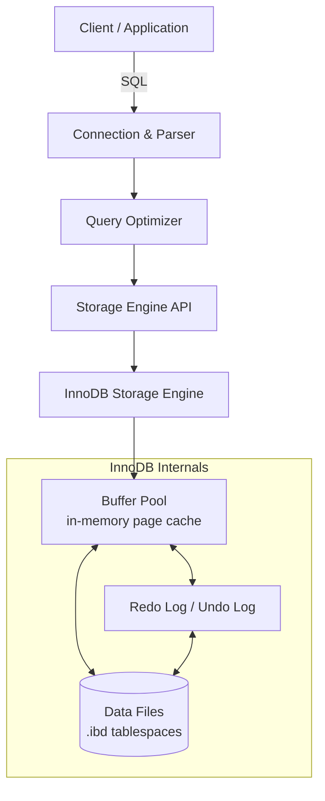
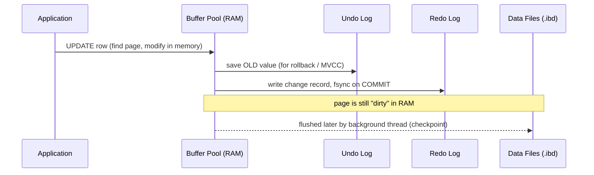
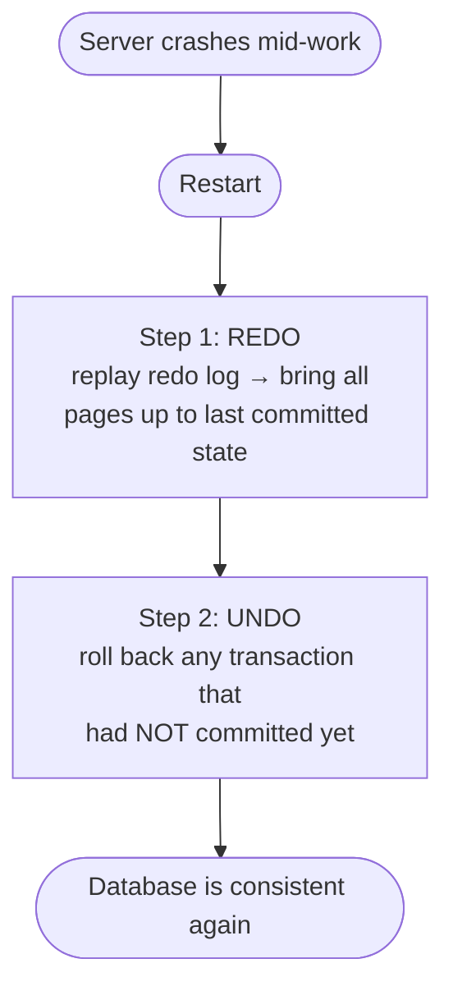

# MySQL / InnoDB Storage Engine

**Author:** Ashutosh
**Roll Number:** 24BCS10111
**Topic:** MySQL / InnoDB Storage Engine (Topic 3)

---

## Table of Contents

1. [Problem Background](#1-problem-background)
2. [Architecture Overview](#2-architecture-overview)
3. [Internal Design](#3-internal-design)
4. [Design Trade-Offs](#4-design-trade-offs)
5. [Experiments / Observations](#5-experiments--observations)
6. [Key Learnings](#6-key-learnings)
7. [References](#references)

---

## 1. Problem Background

### Why InnoDB exists

In the early days, MySQL's default storage engine was **MyISAM**. MyISAM was fast for
reads but had two big problems:

1. **No transactions** — if a query failed half way, you could be left with half-written
   data. There was no way to say "do all of this or none of it".
2. **Table-level locking** — when one user wrote to a table, the *whole table* was locked.
   So in a busy multi-user app, writers would block everyone else.

This was fine for a read-heavy website with a single writer, but it broke down for
real applications like banking, e-commerce orders, or anything where many users write
at the same time and correctness matters.

**InnoDB** was created to solve exactly this. It is a storage engine that gives MySQL:

- **ACID transactions** (so changes are all-or-nothing and survive crashes)
- **Row-level locking** (so two users editing different rows don't block each other)
- **Crash recovery** (so a power failure doesn't corrupt your data)
- **MVCC** (so readers don't block writers and writers don't block readers)

InnoDB became the **default storage engine in MySQL 5.5 (2010)** and is what almost
everyone uses today.

### What problem it solves

> "Let many users read and write the same database at the same time, keep the data
> correct, and never lose committed data even if the server crashes."

That one sentence is basically the whole reason InnoDB is designed the way it is.

### A bit of history

- InnoDB was built by a company called **Innobase Oy** (Finland).
- Oracle acquired Innobase in 2005, and later acquired MySQL itself (via Sun) in 2010.
- So today both MySQL and InnoDB are owned by Oracle.
- This history is *why* InnoDB's MVCC design looks a lot like Oracle's — it uses
  **undo logs**, not multiple row versions on the page (more on this later).

---

## 2. Architecture Overview

MySQL is split into two layers:

1. The **MySQL Server layer** — parses SQL, plans queries, handles connections.
   It does **not** know how data is physically stored.
2. The **Storage Engine layer** — actually stores and retrieves rows. InnoDB lives here.

The server talks to InnoDB through a fixed API, which is why you can swap engines
(MyISAM, InnoDB, MEMORY) without changing your SQL.

### High-level diagram



### Main components of InnoDB

| Component | What it does (in plain words) |
|-----------|-------------------------------|
| **Buffer Pool** | A big chunk of RAM that caches table and index pages so we don't hit disk every time. |
| **Clustered Index** | The actual table data, stored sorted by primary key inside a B+Tree. |
| **Secondary Indexes** | Extra B+Trees on other columns, which point back to the primary key. |
| **Redo Log** | Records "what changed" so we can recover after a crash. |
| **Undo Log** | Records "what the old value was" so we can roll back and serve old versions (MVCC). |
| **Locks** | Row-level and gap locks that control who can read/write what at the same time. |

### Data flow (a simple write)



The key idea: **on COMMIT, only the redo log is forced to disk, not the data pages.**
Writing a small sequential log entry is fast; writing the actual scattered data pages
is slow, so InnoDB delays that and does it in the background.

---

## 3. Internal Design

### 3.1 Storage structures — everything is a B+Tree

In InnoDB, the **table itself is a B+Tree** sorted on the primary key. This is called
a **clustered index**. The leaf nodes of this tree contain the *full row data*, not
just pointers.

```
Clustered Index (the table, sorted by PRIMARY KEY)

                 [ 50 | 100 ]              <- internal node (keys only)
                /     |      \
          [10|30]  [60|80]   [120|150]     <- internal nodes
          /  |  \    ...         ...
       leaf leaf leaf  ...                 <- leaf nodes hold FULL ROWS
       (id=10, name, age, ...)
```

Because rows are stored **sorted by primary key**, looking up a row by primary key is
just one tree traversal that lands directly on the data. There is no extra hop.

> This is the big difference from PostgreSQL, where the table is a plain unordered
> "heap" and *every* index (even the primary key) points into that heap.

#### Secondary indexes

A secondary index (e.g. an index on `email`) is a **separate** B+Tree. But its leaf
nodes do **not** store the row — they store the **primary key value** of the row.

So a lookup by a secondary index is actually **two** lookups:


This is called a **bookmark lookup** or "index back to clustered index". It's the
reason a good (small) primary key matters — every secondary index stores a copy of it.

### 3.2 Memory management — the Buffer Pool

The buffer pool is InnoDB's in-memory cache of pages (default page size **16 KB**).
Almost all reads and writes go through it.

It uses a **modified LRU (Least Recently Used)** list to decide which pages to keep:

```
        +------------------- LRU LIST -------------------+
        |   NEW (young) sublist   |   OLD sublist        |
        |  hot, frequently used   |  recently read once  |
        +-------------------------+----------------------+
              ^ kept in RAM             ^ evicted first
```

**Why a "modified" LRU and not plain LRU?**
If you run one big scan (like `SELECT * FROM huge_table`), plain LRU would push out
all your hot pages and fill RAM with junk you'll never read again. InnoDB protects
against this by inserting newly-read pages into the **middle (old sublist)**, not the
top. A page only gets promoted to the "young" end if it's accessed *again* after a
short delay. So a one-time scan stays in the old region and gets evicted quickly,
keeping the real hot data safe.

Pages that have been modified but not yet written to disk are called **dirty pages**.
A background thread flushes them gradually (checkpointing).

### 3.3 Transaction processing — Redo and Undo logs

InnoDB uses **two** logs, and they do **opposite** jobs. This confuses a lot of people,
so here is the simple version:

| Log | Question it answers | Used for |
|-----|---------------------|----------|
| **Redo log** | "What change did I make?" (the NEW value) | Re-applying committed changes after a crash → **durability** |
| **Undo log** | "What was it before?" (the OLD value) | Rolling back, and showing old versions to other transactions → **atomicity + MVCC** |

#### Why both are needed

- **Redo (durability):** On COMMIT, InnoDB writes the change to the redo log and
  `fsync`s it. The actual data page is still only in RAM. If the server crashes
  *before* that page reaches disk, on restart InnoDB **replays the redo log** and
  re-does the change. So committed data is never lost.

- **Undo (rollback + MVCC):** Before changing a row, InnoDB copies the old value into
  the undo log. If you `ROLLBACK`, it puts the old value back. Even if you don't roll
  back, that old value is kept so that *other* running transactions can still see the
  data as it was when they started (this is MVCC, below).



This two-step "redo then undo" is the heart of crash recovery (an idea from the
classic **ARIES** recovery algorithm).

### 3.4 Concurrency control — MVCC (Oracle-style)

MVCC = **Multi-Version Concurrency Control**. The goal: *readers never block writers,
and writers never block readers.*

InnoDB does this using **hidden columns** on every row plus the undo log:

- `DB_TRX_ID` — the transaction id that last modified this row.
- `DB_ROLL_PTR` — a pointer to the undo log entry that holds the *previous* version.

So each row is like the head of a chain. Following the `DB_ROLL_PTR` walks back in time:

```
   Current row in clustered index           Undo log (older versions)
   +-------------------------+               +------------------+    +------------------+
   | id=42  balance=900      |  roll_ptr --> | balance=1000     | -> | balance=1200     |
   | trx_id=55               |               | trx_id=40        |    | trx_id=22        |
   +-------------------------+               +------------------+    +------------------+
          (newest)                                                       (oldest)
```

When a transaction reads, it takes a **read view (snapshot)**. For each row it checks
the `trx_id`:
- If that version was committed *before* my snapshot → I can see it.
- If it's too new (committed after I started, or still uncommitted) → follow the
  `roll_ptr` to an older version I'm allowed to see.

This is why a long-running `SELECT` always sees a consistent picture, even while
others are updating rows.

> **Comparison with PostgreSQL:** Postgres keeps *all* row versions directly in the
> table and uses `VACUUM` to clean up dead ones. InnoDB keeps only the *latest*
> version in the table and pushes old versions into the **undo log**, which gets
> cleaned up by a background **purge** thread once no transaction needs them anymore.

### 3.5 Locking — row locks and gap locks

InnoDB locks at the **row level**, not the table level. This is what allows high
concurrency. The main lock types:

- **Record lock** — locks a single index record.
- **Gap lock** — locks the *empty space between* two index records (no row there yet).
- **Next-key lock** — a record lock **+** the gap before it. This is the default under
  the `REPEATABLE READ` isolation level.

**Why gap locks?** They prevent **phantom reads**. Imagine you run:

```sql
SELECT * FROM orders WHERE amount BETWEEN 100 AND 200 FOR UPDATE;
```

A gap lock stops another transaction from *inserting* a new row with `amount = 150`
into that range while you're working — so if you run the same query again, no new
"phantom" row appears.

```
Index values:   10        100              200        500
                 |---------|----------------|----------|
                            ^^^^^^^^^^^^^^^^^^
                            next-key lock covers this range,
                            blocking new INSERTs into the gap
```

### 3.6 Isolation levels

SQL defines four isolation levels. InnoDB supports all four; the default is
**REPEATABLE READ**.

| Level | Dirty read? | Non-repeatable read? | Phantom read? | Notes |
|-------|:----------:|:--------------------:|:-------------:|-------|
| READ UNCOMMITTED | ❌ possible | ❌ possible | ❌ possible | Rarely used |
| READ COMMITTED | ✅ prevented | ❌ possible | ❌ possible | Takes a fresh snapshot per statement |
| **REPEATABLE READ** (default) | ✅ prevented | ✅ prevented | ✅ prevented* | One snapshot for the whole transaction; gap locks stop phantoms |
| SERIALIZABLE | ✅ prevented | ✅ prevented | ✅ prevented | Reads become locking reads; safest, slowest |

\* InnoDB's REPEATABLE READ is unusually strong — gap/next-key locks mean it prevents
most phantoms too, which the SQL standard does *not* require at this level.

---

## 4. Design Trade-Offs

### Advantages

- **Fast primary-key lookups** — data lives in the clustered index leaf, so a PK
  lookup needs no extra hop.
- **Range scans on PK are fast** — rows are physically sorted, so reading a range is
  mostly sequential disk access.
- **High write concurrency** — row-level locking + MVCC let many users work at once.
- **Strong durability** — redo log + fsync on commit means committed data survives
  crashes.
- **Clean table, no bloat from versions** — old versions go to undo, not the table.

### Limitations

- **Secondary index lookups cost extra** — every non-PK lookup needs a second trip
  into the clustered index (the bookmark lookup).
- **Big primary keys are expensive** — the PK is copied into *every* secondary index,
  so a large PK (e.g. a UUID string) bloats all indexes. A small auto-increment
  integer PK is usually best.
- **Random PK inserts cause page splits** — inserting in random PK order (again, UUIDs)
  forces InnoDB to split B+Tree pages and fragment the table. Sequential
  (auto-increment) inserts just append neatly.
- **Long transactions hurt** — if one transaction stays open forever, old undo
  versions can't be purged, the undo log grows, and reads get slower.

### Performance implications

- Choosing the right primary key is one of the most impactful schema decisions in
  InnoDB — it affects table layout, insert speed, and the size of every index.
- The buffer pool size is the single most important tuning knob. If your working set
  fits in the buffer pool, InnoDB is very fast; if not, you start paying disk I/O.

### Engineering decisions (the "why")

| Decision | Reason |
|----------|--------|
| Cluster data on PK | Make the most common access pattern (PK lookup) as cheap as possible |
| Undo-log MVCC instead of in-table versions | Keep the table small and avoid VACUUM-style bloat |
| Write redo log on commit, flush data later | Turn slow random writes into fast sequential log writes |
| Default REPEATABLE READ + gap locks | Give correctness (no phantoms) out of the box |

---

## 5. Experiments / Observations

> The examples below are illustrative — they show the *shape* of the output you'd see
> on a typical MySQL 8.0 instance, to demonstrate the concepts above.

### 5.1 Confirming the clustered-index cost difference

Set up a simple table:

```sql
CREATE TABLE users (
    id    INT PRIMARY KEY AUTO_INCREMENT,
    email VARCHAR(100),
    name  VARCHAR(100),
    INDEX idx_email (email)
) ENGINE=InnoDB;
```

**Lookup by primary key** (one B+Tree traversal, lands on the row):

```sql
EXPLAIN SELECT * FROM users WHERE id = 42;
```

```
+----+-------+-------+--------+---------------+---------+------+-------+
| id | type  | table | type   | possible_keys | key     | rows | Extra |
+----+-------+-------+--------+---------------+---------+------+-------+
|  1 | SIMPLE| users | const  | PRIMARY       | PRIMARY |    1 | NULL  |
+----+-------+-------+--------+---------------+---------+------+-------+
```
`type = const` → the fastest possible access; InnoDB goes straight to the row.

**Lookup by the secondary index** (find PK, then go back into clustered index):

```sql
EXPLAIN SELECT * FROM users WHERE email = 'a@b.com';
```

```
+----+-------+-------+------+---------------+-----------+------+-------+
| id | type  | table | type | possible_keys | key       | rows | Extra |
+----+-------+-------+------+---------------+-----------+------+-------+
|  1 | SIMPLE| users | ref  | idx_email     | idx_email |    1 | NULL  |
+----+-------+-------+------+---------------+-----------+------+-------+
```
This uses `idx_email`, but to fetch `name` it must do the extra bookmark lookup into
the clustered index. If we only select the indexed column itself:

```sql
EXPLAIN SELECT email FROM users WHERE email = 'a@b.com';
-- Extra: Using index   <-- "covering index", no bookmark lookup needed
```
`Using index` means the query was answered entirely from the secondary index — no
trip back to the clustered index. This is a **covering index** and is a real
optimization win.

### 5.2 Seeing MVCC with two sessions

Run two terminals side by side:

| Session A | Session B |
|-----------|-----------|
| `START TRANSACTION;` | |
| `SELECT balance FROM acct WHERE id=1;` → **900** | |
| | `UPDATE acct SET balance=500 WHERE id=1;` |
| | `COMMIT;` |
| `SELECT balance FROM acct WHERE id=1;` → **still 900** | |
| `COMMIT;` | |
| `SELECT balance FROM acct WHERE id=1;` → **now 500** | |

Even though Session B committed `500`, Session A keeps seeing `900` for its whole
transaction. That old value is being served **from the undo log** via the snapshot.
This is MVCC in action.

### 5.3 Watching the engine internals

```sql
SHOW ENGINE INNODB STATUS\G
```

Useful things this prints:
- **TRANSACTIONS** section — active transactions, how long they've been running,
  and what row locks they hold (great for finding the cause of a lock wait).
- **BUFFER POOL AND MEMORY** — buffer pool hit rate. A line like
  `Buffer pool hit rate 1000 / 1000` means almost everything is being served from RAM.
- **LOG** — the redo log sequence number (LSN) and how far behind the last checkpoint is.

To check a deadlock after it happens:
```sql
SHOW ENGINE INNODB STATUS\G   -- look at the LATEST DETECTED DEADLOCK section
```
InnoDB detects deadlocks automatically and kills the cheaper transaction with:
`ERROR 1213 (40001): Deadlock found when trying to get lock`.

### 5.4 Observed behavior summary

- PK lookups are consistently the cheapest access path (`type = const`).
- Adding a covering index removes the bookmark-lookup cost (`Using index`).
- A reader in REPEATABLE READ sees a frozen snapshot regardless of concurrent commits.
- A `SELECT ... FOR UPDATE` over a range blocks inserts into that range (gap locking).

---

## 6. Key Learnings

1. **The primary key *is* the table.** In InnoDB, choosing the PK isn't just about
   uniqueness — it decides physical row order, insert performance, and the size of
   every secondary index. Small, sequential integer PKs are almost always the right call.

2. **Two logs, two opposite jobs.** Redo = "the new value, for re-doing after a crash"
   (durability). Undo = "the old value, for rolling back and for MVCC" (atomicity +
   isolation). Recovery is literally *redo everything, then undo the uncommitted*.

3. **Commit is cheap because of the log trick.** On commit InnoDB only forces a small
   sequential redo-log write, not the scattered data pages. The expensive page writes
   happen lazily in the background. This is why InnoDB can commit fast *and* be durable.

4. **MVCC means old data lives somewhere.** Postgres keeps old versions in the table
   and cleans up with VACUUM; InnoDB keeps them in the undo log and cleans up with a
   purge thread. Same goal (readers don't block writers), different bookkeeping.

5. **Gap locks were a surprise.** I didn't expect locking *empty space* to be a thing,
   but it's a neat solution to phantom reads, and it's why InnoDB's REPEATABLE READ is
   stronger than the SQL standard requires.

6. **Everything is a trade-off.** Clustering on PK makes PK reads great but secondary
   reads need an extra hop; the redo/undo design makes commits fast but needs
   background flushing and purging. There's no free lunch — just choices that fit
   common workloads well.

---

## References

- MySQL 8.0 Reference Manual — *The InnoDB Storage Engine*
  https://dev.mysql.com/doc/refman/8.0/en/innodb-storage-engine.html
- MySQL 8.0 Reference Manual — *InnoDB Locking and Transaction Model*
  https://dev.mysql.com/doc/refman/8.0/en/innodb-locking-transaction-model.html
- MySQL 8.0 Reference Manual — *InnoDB Buffer Pool*
  https://dev.mysql.com/doc/refman/8.0/en/innodb-buffer-pool.html
- MySQL 8.0 Reference Manual — *InnoDB Multi-Versioning (MVCC)*
  https://dev.mysql.com/doc/refman/8.0/en/innodb-multi-versioning.html
- C. Mohan et al., *ARIES: A Transaction Recovery Method* (the redo/undo recovery idea)
