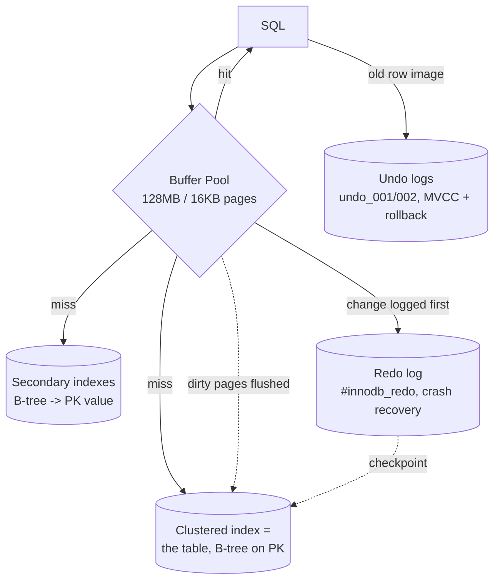

# MySQL / InnoDB Storage Engine

> InnoDB is MySQL's default storage engine and a study in the *opposite* choices PostgreSQL made. Where Postgres stores unordered heaps and versions rows by appending, InnoDB stores every table **as a B-tree clustered on its primary key** and versions rows by keeping the *old* values in **undo logs** while updating **in place**. This document tests both claims on a live **MySQL 9.6 / InnoDB** instance. All EXPLAINs, lock dumps, and sizes below are captured output (`results.txt`, `locks.txt`) from the dataset in this folder (20k students, 200k enrollments).

---

## 1. Problem Background

InnoDB (Innobase, 2001; Oracle since 2005) was built to give MySQL what its original MyISAM engine lacked: **transactions, crash recovery, and row-level locking**. Its design closely follows the Oracle/System-R lineage — clustered storage, undo-based MVCC, and ARIES-style redo logging. The guiding idea: make the **primary key the physical organization of the data**, so that primary-key lookups and range scans are as fast as possibly can be, and pay for everything else (secondary indexes, concurrent reads) on top of that.

---

## 2. Architecture Overview



Two logs, two jobs — this is the question the assignment asks ("why both?"):
- **Redo log** = "what the new value *will* be." Replayed forward after a crash to re-apply committed changes that hadn't reached disk. → **durability**.
- **Undo log** = "what the old value *was*." Used to roll back aborted transactions **and** to reconstruct old row versions for MVCC reads. → **atomicity + isolation**.

---

## 3. Internal Design

### 3.1 Clustered index = the table itself

In InnoDB the table is **not** a separate heap with indexes pointing into it (that's Postgres). The table **is** a B-tree, ordered by primary key, and the **leaf nodes contain the full rows**. So a primary-key lookup walks one B-tree straight to the data:

```
EXPLAIN SELECT * FROM enrollments WHERE id = 12345;
-> Rows fetched before execution (cost=0..0 rows=1)   -- direct clustered hit, no extra step
```

### 3.2 Secondary indexes store the PK, not a row pointer

A secondary index leaf does **not** point at a physical row location — it stores the **primary-key value**. So a lookup by a secondary key is *two* B-tree descents: secondary index → PK, then PK → clustered index → row. This is the famous **"back-reference"** (a.k.a. bookmark lookup):

```
-- needs full row -> secondary index THEN clustered lookup
EXPLAIN SELECT * FROM enrollments WHERE student_id = 12345;
-> Index lookup using idx_student (student_id=12345)  (cost=3.5 rows=10)

-- only needs columns already in the index -> no back-reference
EXPLAIN SELECT id, student_id FROM enrollments WHERE student_id = 12345;
-> Covering index lookup using idx_student            (cost=1.25 rows=10)
```

The cost drops **3.5 → 1.25** purely because the **covering** query never has to jump back to the clustered index. The flip side, visible on disk: because the secondary index must store the PK in every entry, it's nearly as large as the clustered table —

```
table        index        pages   size
enrollments  PRIMARY        481   7.5 MB   <- clustered (full rows)
enrollments  idx_student    353   5.5 MB   <- secondary (student_id + PK id)
```

### 3.3 Selectivity still decides index vs scan

Same lesson as Postgres — InnoDB falls back to a **full clustered scan** when a predicate isn't selective:
```
EXPLAIN SELECT * FROM enrollments WHERE grade = 7;
-> Table scan on enrollments (cost=20104 rows=199836), Filter: grade=7
```
`grade` has 11 values, so `grade=7` ≈ 18k rows — the optimizer (correctly) won't use an index for 9% of the table.

### 3.4 Buffer pool

The **buffer pool** is InnoDB's equivalent of Postgres shared buffers: an in-memory cache of **16 KB pages** (note: 16 KB, vs Postgres 8 KB, vs SQLite 4 KB) managed by a **midpoint-insertion LRU** that resists scan pollution (new pages enter at the LRU *midpoint*, not the head, so a big scan can't flush the hot working set).
```
innodb_buffer_pool_size = 128 MB | page_size = 16384 | flush_log_at_trx_commit = 1
POOL pages = 8191 | data pages = 2126 | free = 6065
```

### 3.5 MVCC via undo logs (not extra row versions)

InnoDB updates rows **in place** in the clustered index. To still give readers a consistent snapshot, every row carries hidden `DB_TRX_ID` and `DB_ROLL_PTR` columns; `DB_ROLL_PTR` points into the **undo log**, which holds the *previous* version. A read under MVCC that finds a too-new row walks the undo chain backwards to the version visible to its snapshot. Old undo is freed by a background **purge** thread once no snapshot needs it — the moral equivalent of Postgres's VACUUM, but applied to undo records instead of dead heap tuples:
```
History list length 10      -- undo versions still retained for active/old snapshots
```

### 3.6 Locking — row locks and gap locks

InnoDB locks **index records**, not rows in the abstract. Under **REPEATABLE READ** (its default), it uses **next-key locks** = a lock on the index record **plus the gap before it**, which is how it prevents **phantom** inserts. I opened a transaction holding `SELECT ... WHERE id BETWEEN 100 AND 110 FOR UPDATE` and dumped `performance_schema.data_locks` from another session:

```
OBJECT     INDEX    LOCK_TYPE  LOCK_MODE        LOCK_DATA
students   NULL     TABLE      IX               (intention exclusive on table)
students   PRIMARY  RECORD     X,REC_NOT_GAP    100      <- the row itself
students   PRIMARY  RECORD     X                101      <- next-key: record 101 + gap (100,101)
students   PRIMARY  RECORD     X                102
   ... through ...                              110
trx_rows_locked = 11
```

Read this carefully: it didn't just lock the 11 rows. The plain `X` (next-key) locks cover each record **and the gap before it**, so another session **cannot insert** an `id` in the range — that's phantom prevention. The boundary row 100 gets `REC_NOT_GAP` (just the record). A table-level **IX** (intention) lock advertises "I hold row X-locks in here" so a full-table lock request can detect the conflict in O(1) without scanning every row lock.

### 3.7 Redo log & crash recovery

```
Log sequence number 40386926 | Log flushed up to 40386926 | Last checkpoint 40386926
redo files: 32 × ~3 MB in #innodb_redo/   |  undo: undo_001, undo_002 (16 MB each)
```
With `flush_log_at_trx_commit = 1`, every commit flushes the **redo log** to disk (ARIES write-ahead logging) before returning. The dirty 16 KB data pages are flushed lazily; on restart, InnoDB replays redo from the **last checkpoint LSN** forward, then rolls back any transactions that were open at crash time using the **undo** log. New-value forward (redo) + old-value backward (undo) = exactly-once recovery.

---

## 4. Design Trade-Offs

**Clustered index — what it buys, what it costs.**
- *Advantage:* PK lookups and PK range scans are maximally fast — the data is *in* the index leaf, in PK order, so a range scan is sequential and a point lookup is one B-tree descent (`cost ≈ 0`).
- *Cost:* every **secondary index lookup pays a back-reference** to the clustered index (3.5 vs 1.25 above), secondary indexes are **bloated** by storing the PK (5.5 MB vs 7.5 MB), and a **large or random PK** (e.g. a UUID) hurts insert locality and balloons every secondary index. This is why InnoDB shops prefer small, monotonic primary keys.

**Why both undo and redo logs?** They solve different halves of ACID and point in opposite directions in time. **Redo** = *durability*: re-apply committed changes lost in the buffer pool at crash. **Undo** = *atomicity + isolation*: undo aborted transactions, and serve old row versions to MVCC readers. You cannot collapse them into one log — one records the future, the other the past.

**In-place update + undo (InnoDB) vs append new version + VACUUM (Postgres).**

| | InnoDB | PostgreSQL |
|---|---|---|
| Update | in place, old value → undo | append new tuple, mark old dead |
| MVCC source | undo chain | multiple heap tuples (xmin/xmax) |
| Cleanup | **purge** old undo | **VACUUM** dead tuples |
| Secondary index on update | unchanged if non-key cols (PK stable) | non-HOT update touches every index |
| Cost of long readers | undo segment grows (history list) | dead tuples accumulate / bloat |

InnoDB keeps the *main* table compact (in-place) at the price of undo-chain walks for old snapshots; Postgres keeps writes simple (just append) at the price of table bloat. Neither is free — it's the same MVCC problem paid for from a different pocket.

**Isolation levels.** InnoDB defaults to **REPEATABLE READ** and uses next-key locking to make it phantom-free (stronger than the SQL standard requires). Postgres defaults to **Read Committed**. InnoDB's gap locks are the cost: they reduce concurrency on ranges (and can cause deadlocks) in exchange for that phantom protection.

---

## 5. Experiments / Observations

1. **Clustered vs secondary, measured.** Full-row fetch by `student_id` cost **3.5** (secondary index + clustered back-reference); the *covering* version that only needed indexed columns cost **1.25** — direct proof that the secondary index stores the PK and must hop back to the cluster for non-covered columns.
2. **Secondary index size confirms the design.** `idx_student` is **5.5 MB** vs the clustered **7.5 MB** — a secondary index over a single `INT` column is huge precisely because every entry also carries the 4-byte PK.
3. **The join used nested-loop with covering index lookups:**
   ```
   EXPLAIN ANALYZE ... JOIN ... WHERE s.dept='CS'
   Nested loop inner join (actual time=0.04..6.55 rows=40000)
     Covering index lookup on s using idx_dept (dept='CS') rows=4000
     Covering index lookup on e using idx_student (student_id=s.id) loops=4000
   ```
   InnoDB drove the join from the selective `dept='CS'` side (4,000 rows) and probed `idx_student` 4,000 times — classic index nested-loop.
4. **Gap locks are real and observable.** `BETWEEN 100 AND 110 FOR UPDATE` produced **11 next-key locks** plus an **IX** table lock; the gaps between keys were locked, which is exactly what stops a concurrent `INSERT id=105`.
5. **Two logs, two files on disk.** `#innodb_redo/` (32 files) for redo; `undo_001/undo_002` (16 MB each) for undo. The redo LSN, flushed-LSN, and checkpoint-LSN were all equal at idle (everything durably flushed).

---

## 6. Key Learnings

1. **"The table is a B-tree on the PK" explains almost everything else** — fast PK access, the secondary-index back-reference, why secondary indexes are big, and why PK choice matters so much.
2. **Covering indexes are the single biggest InnoDB query win** (3.5 → 1.25): if the index already has every column you select, InnoDB never touches the clustered index.
3. **Undo and redo are not redundant.** Redo re-does committed work after a crash (durability); undo un-does aborted work and feeds MVCC (atomicity + isolation). Different directions in time, both required.
4. **Gap/next-key locking is REPEATABLE READ's phantom defense** — I watched it lock the gaps, not just the rows. It's stronger isolation than Postgres's default, paid for in range-concurrency.
5. **InnoDB and PostgreSQL solve the same MVCC problem in mirror-image ways.** In-place + undo + purge vs append + dead-tuples + VACUUM. Comparing them side by side is the clearest way to see that "MVCC" is a goal, not a single implementation.
