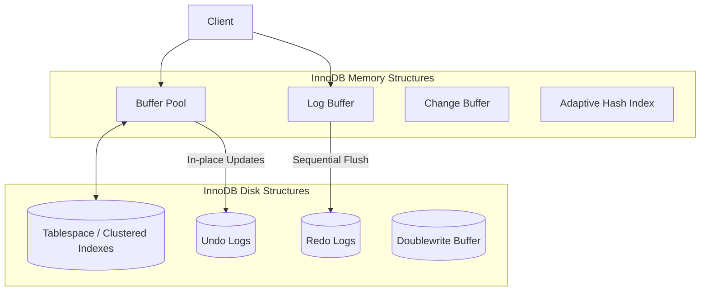

# MySQL / InnoDB Storage Engine Architecture

**Name:** Ojas Maheshwari  
**Roll:** 24BCS10227

## 1. Problem Background
MySQL is fundamentally a robust relational database management system, and its power is heavily driven by **InnoDB**—its default, fully ACID-compliant storage engine. Unlike PostgreSQL, which tightly couples its storage and execution mechanisms, MySQL employs a highly flexible pluggable storage engine architecture. The core problem InnoDB was designed to solve is the delivery of highly reliable, high-performance transactional storage with granular row-level locking. This design ensures that highly concurrent multi-user read and write workloads can operate safely and efficiently without falling victim to table-level blocking.

## 2. Architecture Overview
InnoDB’s architecture elegantly splits across in-memory structures and persistent on-disk files. The major components are meticulously designed to ensure data consistency, rapid crash recovery, and lightning-fast primary key lookups.

## 3. Internal Design & Mechanics

### 3.1. Storage Structures: Clustered vs Secondary Indexes
*   **Clustered Indexes:** In InnoDB, every table is strictly an **Index-Organized Table**. The Primary Key B+Tree essentially *is* the table. The leaf nodes of the primary key index do not contain pointers to the data; rather, they house the actual row data itself.
*   **Secondary Indexes:** Any other index created on the table acts as a secondary index. The leaf nodes of a secondary index do not contain physical pointers. Instead, they store the indexed column value alongside the **Primary Key** value. Consequently, retrieving data via a secondary index often demands a double lookup: first traversing the secondary index to locate the PK, then traversing the Clustered Index to fetch the row.

### 3.2. Memory Management (Buffer Pool)
The Buffer Pool caches both data and index pages within main memory. It utilizes a sophisticated variation of the LRU (Least Recently Used) algorithm to retain frequently accessed pages in RAM. Modifications to data occur in the Buffer Pool first, flagging the page as "dirty" to be flushed to disk later.

### 3.3. Transaction Processing & Concurrency (MVCC)
InnoDB approaches MVCC (Multi-Version Concurrency Control) fundamentally differently than PostgreSQL.
*   **In-Place Updates:** Discarding PostgreSQL's append-only model, InnoDB modifies rows *in place* directly on the disk page.
*   **Undo Logs:** To facilitate MVCC and transactional Rollbacks, the *previous* state of a modified row is recorded into an **Undo Log**. When a concurrent transaction requires a read snapshot of the database, it rebuilds the older version of the row by applying undo log records backwards.

### 3.4. Recovery Mechanisms (Redo Logs)
*   **Redo Logs:** While Undo Logs enable rollback (Atomicity), **Redo Logs** secure Durability (Forward-roll). Before any transaction commits, the physical changes made to pages are logged to the Redo Log buffer and sequentially flushed to disk. Should the database crash before dirty pages from the Buffer Pool hit the persistent tablespace, the Redo Logs are replayed during startup to recreate the committed changes.

### 3.5. Locking Mechanisms
InnoDB guarantees fine-grained concurrency control through **Row-Level Locking**:
*   **Record Locks:** Locks applied directly to an index record.
*   **Gap Locks:** Locks applied to the gap between index records, or before the first/after the last record. This mechanism strictly prevents "Phantom Reads" in the Repeatable Read isolation level by ensuring no concurrent transaction can insert a row into a gap actively being scanned.
*   **Next-Key Locks:** A hybrid mechanism combining a record lock and a gap lock before the record.

## 4. Design Trade-Offs

### Key Comparison: InnoDB vs PostgreSQL

| Architectural Feature | PostgreSQL | MySQL / InnoDB |
| :--- | :--- | :--- |
| **Storage Model** | Append-Only Heap. Indexes point to physical TIDs. | Clustered Index. Secondary indexes point to the Primary Key. |
| **Row Updates** | Creates a new tuple. The old tuple is left behind. | Updates the row in-place. The old version is archived in the Undo Log. |
| **Cleanup Mechanism** | Requires a `VACUUM` daemon to reclaim dead space. | Undo logs are purged automatically by an asynchronous purge thread. |
| **Index Updates** | Extremely fast (HOT updates) provided the indexed column isn't altered. | Secondary indexes are smaller but typically mandate a double B-Tree traversal. |

### Trade-Off Analysis
*   **Clustered Indexes Advantage:** Primary key lookups are incredibly fast because the data resides natively in the index leaf node. Range scans on the PK are inherently highly efficient.
*   **Clustered Indexes Limitation:** Secondary index lookups are relatively slower. Updating the Primary Key itself is enormously expensive (as it requires moving the entire row and comprehensively updating all secondary indexes).
*   **In-Place Updates Advantage:** Mitigates table bloat. A heavily updated table doesn't require a cumbersome `VACUUM` process constantly scanning the entire file.
*   **Undo/Redo Log Limitation:** Maintaining parallel logs (Undo for state management, Redo for durability) introduces structural complexity and yields slightly higher write amplification compared to purely append-only architectures.

## 5. Suggested Questions & Analysis

**Q: Why does InnoDB maintain both undo and redo logs?**
A: **Redo logs** guarantee *Durability* (ensuring committed data is never lost during a crash by tracking physical page manipulations). **Undo logs** guarantee *Atomicity* and *Isolation* (empowering a transaction to roll back entirely, and enabling concurrent readers to reconstruct historical snapshots via MVCC).

**Q: Why did PostgreSQL architect a radically different MVCC model?**
A: PostgreSQL's append-only MVCC was conceptualized for structural simplicity and steadfast reliability. By preserving row versions within the main heap, it sidesteps the need to engineer complex standalone Undo Log structures. This also enables incredibly fast transaction rollbacks (simply updating a status bit, with no tangible undo operations required). The overarching trade-off is the absolute necessity of the `VACUUM` mechanism.

## 6. Key Learnings & Takeaways

1.  **Index-Organized Tables Matter:** It is universally recommended to define a compact, sequential Primary Key in InnoDB (e.g., an Auto-Increment INT). Utilizing a massive, randomized UUID as a primary key will severely fragment the clustered index and artificially bloat all associated secondary indexes.
2.  **Gap Locks Prevent Phantoms:** Mastering Gap Locks is imperative for debugging complex deadlock issues in MySQL, as queries utilizing range conditions will implicitly lock vast empty spaces within the index.
3.  **Architectural Divergence:** InnoDB and PostgreSQL ingeniously solve the exact same problem (ACID transactions powered by MVCC) utilizing completely diametric storage philosophies (In-place + Undo vs Append-Only).
4.  **Tuning the Buffer Pool is Critical:** The `innodb_buffer_pool_size` parameter is arguably the most critical configuration in MySQL. It dictates how much data and how many indexes can reside in RAM, profoundly influencing overall database performance.
