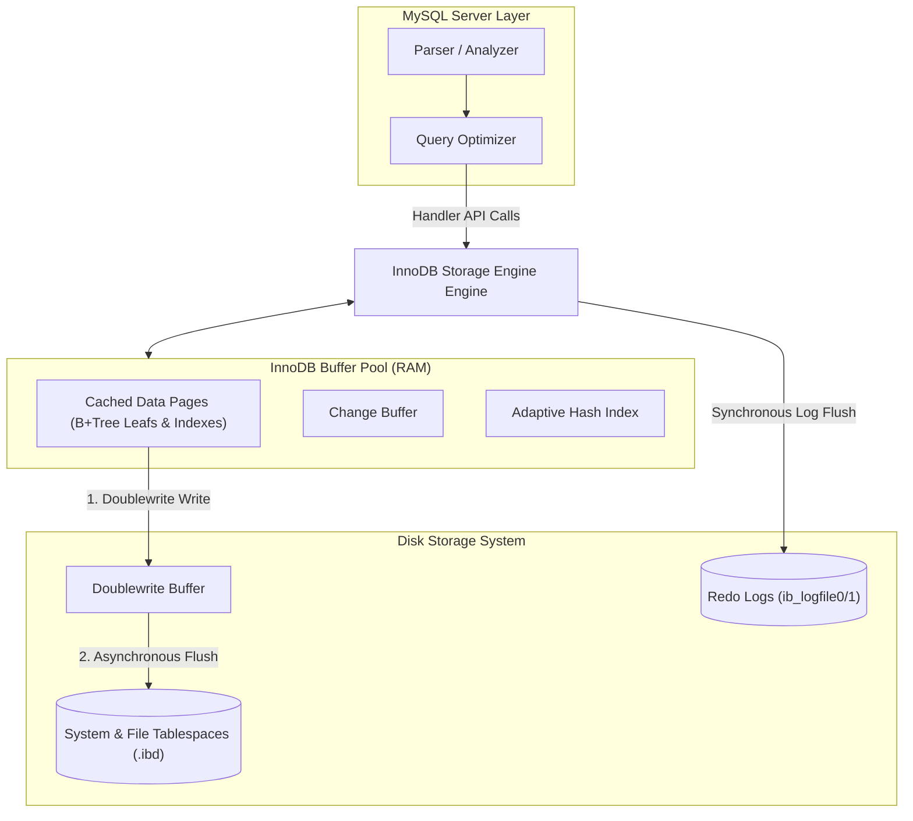

# Topic 3: MySQL / InnoDB Storage Engine

This document explores the architecture of the MySQL InnoDB storage engine, focusing on memory management, storage indexing, locking mechanisms, transaction logs, and key architectural differences compared to PostgreSQL.

---

## 1. Problem Background

MySQL's architecture is unique because it separates the SQL parsing and optimization layer from the storage engine. 
* Early MySQL engines like **MyISAM** lacked support for transactions, foreign keys, and row-level locking, using table-level locks instead.
* **InnoDB** was developed by Innobase Oy (later acquired by Oracle) to address these limitations. It was designed to provide transaction support (ACID compliance), high-concurrency row-level locking, and a clustered-index storage layout that optimizes read performance for primary key lookups.

---

## 2. Architecture Overview



This diagram shows the relationship between the MySQL Server Layer, the InnoDB Storage Engine, memory structures (Buffer Pool), and physical storage.

---

## 3. Internal Design

### A. Clustered Indexes and Secondary Indexes

In InnoDB, tables are organized as **Index-Organized Tables (IOT)**, meaning the physical storage layout is directly tied to the primary key.

```
InnoDB Clustered Index (Primary Key B+Tree):
            [ Root Node ]
               /      \
       [ Internal ]   [ Internal ]
          /                 \
  [ Leaf Node ]         [ Leaf Node ]
  +---------------------------------+
  | Key: 100                        |
  | Row Data: "Alice", "Sales", ... | <--- (Actual row data is stored here)
  +---------------------------------+

InnoDB Secondary Index B+Tree (e.g., indexed on Email):
            [ Root Node ]
               /      \
  [ Leaf Node ]         [ Leaf Node ]
  +---------------------------------+
  | Key: "alice@company.com"        |
  | Value: 100                      | <--- (Points to Clustered Index Primary Key)
  +---------------------------------+
```

#### Clustered Index Structure
* The primary key B+Tree is the clustered index.
* The leaf nodes of this B+Tree contain the actual data rows.
* Primary key queries are highly efficient: once the leaf node is located, the row data is retrieved immediately without a separate disk read.

#### Secondary Indexes (Double Seek Penalty)
* Secondary indexes are separate B+Trees.
* The leaf nodes of a secondary index do not point to physical offsets on disk. Instead, they store the **Primary Key value** of the row.
* **Double Seek Penalty**: Finding a row using a secondary index requires two index lookups:
  1. Traverse the secondary index B+Tree to find the primary key value.
  2. Traverse the clustered index B+Tree using that primary key to retrieve the actual row data.

---

### B. Buffer Pool Management

The **Buffer Pool** is the primary memory space where InnoDB caches table and index pages. It uses a segmented architecture to maintain high read efficiency.

```
InnoDB Buffer Pool LRU Layout:
+----------------------------------------+-----------------------------------+
|            Young Sublist (5/8ths)      |         Old Sublist (3/8ths)      |
+----------------------------------------+-----------------------------------+
| [MRU Page] <--> [Page] <--> [Page] ... | ... <--> [Page] <--> [LRU Page]   |
+----------------------------------------+-----------------------------------+
                                         ^
                                   Insertion Point
                              (Old Sublist Head)
```

#### LRU Midpoint Insertion
To prevent sequential table scans from evicting frequently accessed pages, InnoDB splits the LRU list into two sublists:
* **Young List** (default: 5/8ths of the pool) containing hot pages.
* **Old List** (default: 3/8ths of the pool) containing cold pages.

When a new page is read from disk, it is inserted at the **Midpoint** (the head of the Old sublist).
* If the page is accessed again within a set window (`innodb_old_blocks_time`), it is promoted to the head of the Young sublist.
* If it was read during a table scan and is not accessed again, it moves down the Old sublist and is evicted, keeping the Young sublist unaffected.

#### Change Buffer
For secondary indexes, updates require random disk writes. The **Change Buffer** caches updates to secondary index pages that are not currently in the Buffer Pool. These changes are merged later when the index page is read into memory, reducing random I/O.

#### Doublewrite Buffer
Operating systems typically write data in 4KB blocks, while InnoDB uses 16KB pages. A crash during a page write can cause a **Torn Page**.
* InnoDB resolves this by writing pages to a contiguous disk space called the **Doublewrite Buffer** first, before writing them to the main tablespace.
* If a crash occurs during the main write, InnoDB recovers the original page from the Doublewrite Buffer.

---

### C. Redo and Undo Logs

InnoDB manages durability and transactional rollback using two distinct log structures.

```
Transaction Log Lifecycle:
1. Transaction Starts
2. Modifications made in memory (Buffer Pool)
3. Undo Log written ──(MVCC / Rollback basis)
4. Redo Log written ──(Crash recovery / Durability basis)
5. Transaction Commits ──(Redo flushed to disk)
```

#### Redo Logs (Write-Ahead Log)
* Redo logs are physical-logical logs that record changes to pages.
* They are written sequentially to circular files on disk (`ib_logfile0`, `ib_logfile1`).
* During a commit, only the redo logs are flushed to disk (`fsync`), ensuring durability without requiring immediate data page writes.

#### Undo Logs
* Undo logs record logical changes (e.g., "delete row 100", "update column value from A to B").
* They are used for:
  1. **Transaction Rollback**: Reverting changes if a transaction aborts.
  2. **MVCC Reconstruction**: Reconstructing older versions of rows for active transactions.

---

### D. Concurrency & Locking

InnoDB supports row-level locking, using three lock types to support different isolation levels:

#### 1. Record Locks
Locks a specific index record (e.g., `SELECT * FROM t WHERE id = 10 FOR UPDATE;`).

#### 2. Gap Locks
Locks the gap *between* index records, or the gap before/after the first/last record (e.g., `SELECT * FROM t WHERE id BETWEEN 10 AND 20 FOR UPDATE;` locks the gap between `10` and `20` to prevent other transactions from inserting new keys in that range).

#### 3. Next-Key Locks
A combination of a Record Lock and a Gap Lock. It locks the index record and the gap preceding it.
* **Phantom Reads**: InnoDB uses Next-Key locks in the default **Repeatable Read** isolation level to prevent phantom reads. By locking the index record and the surrounding gaps, concurrent transactions cannot insert new rows that would match the query criteria.

---

## 4. Key Comparison: InnoDB vs. PostgreSQL

The architectural differences between InnoDB and PostgreSQL center on how they organize data and manage versioning.

```
                  POSTGRESQL                                  INNODB
        +─────────────────────────────+           +─────────────────────────────+
        |        Heap Storage         |           |       Clustered Index       |
        | [Row 1] [Row 2] [Row 3]     |           |        (Data in Leaf)       |
        +─────────────────────────────+           +─────────────────────────────+
                      │                                          │
                      ▼                                          ▼
        +─────────────────────────────+           +─────────────────────────────+
        |     Append-Only MVCC        |           |      In-Place MVCC          |
        | [New Row Version in Heap]   |           |  [Overwrite + Undo Log Link]|
        +─────────────────────────────+           +─────────────────────────────+
                      │                                          │
                      ▼                                          ▼
        +─────────────────────────────+           +─────────────────────────────+
        |      Garbage Cleanup        |           |       Garbage Cleanup       |
        |    [Asynchronous VACUUM]    |           |      [Undo Log Purge]       |
        +─────────────────────────────+           +─────────────────────────────+
```

### Detailed Comparison Table

| Design Aspect | PostgreSQL Engine | MySQL / InnoDB Engine |
| :--- | :--- | :--- |
| **Physical Storage** | **Heap Files**: Rows are unordered. Indexes point to physical TIDs `(Page, Slot)`. | **Clustered Index**: Data is stored inside B+Tree leaves. Secondary indexes point to Primary Key values. |
| **MVCC Model** | **Append-Only**: Updates write new row versions to the heap. | **In-Place Updates**: Updates overwrite rows in-place and write original values to Undo Logs. |
| **Tuple Reconstruction** | Fast: Reads target version directly from the heap. | Requires processing: Reconstructs older versions by applying Undo Log changes to the current row. |
| **Write Amplification** | High: Updating one column writes a new version of the entire row to the heap. | Lower: Updates modify data in-place; only changed fields are written to the Undo logs. |
| **Cleanup Mechanism** | **VACUUM**: Background scans to mark dead tuples as free space. | **Purge Threads**: Asynchronously delete undo log segments when they are no longer needed. |
| **Index Page Size** | Default: 8KB. | Default: 16KB. |

---

## 5. Design Trade-Offs

### 1. Clustered Index (InnoDB) vs. Heap Storage (Postgres)
* **InnoDB Advantage**: Primary key queries are fast because the data resides in the index.
* **InnoDB Disadvantage**: Secondary index lookups require a double traversal. If the primary key is large, it increases the size of all secondary indexes because they store the primary key value.
* **Postgres Advantage**: Indexes are smaller because they store physical pointers (`TIDs`). Secondary index queries do not suffer a double-seek penalty.

### 2. In-Place Updates (InnoDB) vs. Append-Only (Postgres)
* **InnoDB Advantage**: In-place updates minimize heap fragmentation. Redo and Undo logs are handled sequentially, reducing random disk write overhead.
* **Postgres Advantage**: Reading old row versions is fast because they are stored directly in the heap. Transaction rollbacks are instantaneous because the engine simply updates a status flag in the CLOG.

---

## 6. Key Learnings

1. **Storage Layout Determines Access Efficiency**: InnoDB's clustered design optimizes query paths for primary key access, making primary key design a critical performance factor.
2. **Undo Logs Virtualize Versioning**: Instead of storing physical copies of old rows on disk, InnoDB reconstructs older versions in memory using Undo logs, which reduces storage consumption at the cost of CPU usage during reads.
3. **Locking Strategies Prevent Anomalies**: InnoDB's use of Next-Key locking allows it to prevent phantom reads under Repeatable Read isolation, achieving a high degree of consistency without the performance cost of Serializable isolation.
