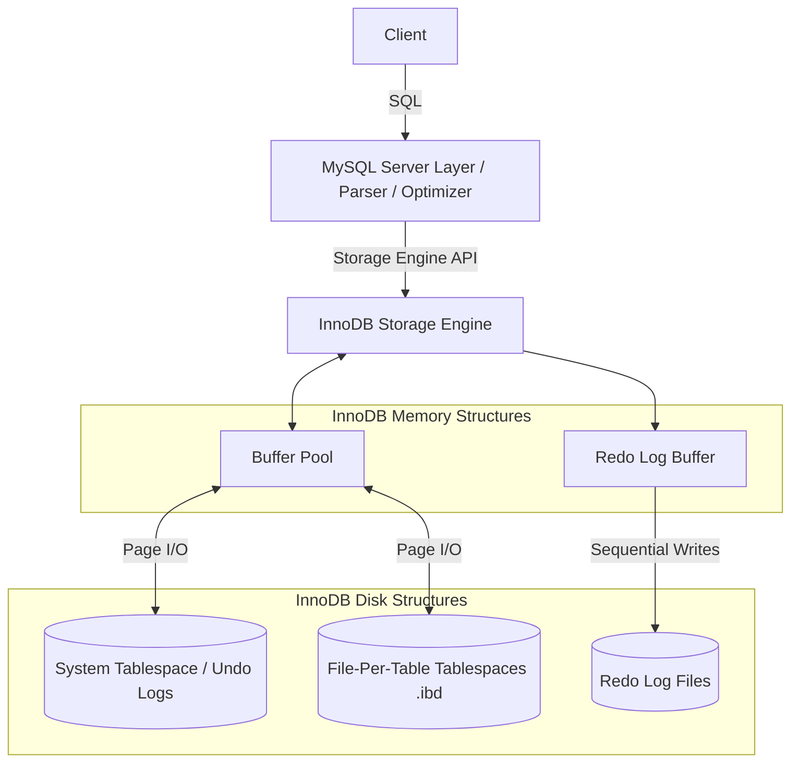

# MySQL InnoDB Storage Engine Architecture

An academic study of the internal architecture of MySQL's default storage engine, InnoDB, focusing on its design decisions and a comparative analysis against PostgreSQL.

## Table of Contents

1. [Problem Background](#1-problem-background)
2. [Architecture Overview](#2-architecture-overview)
3. [Internal Design](#3-internal-design)
    - [Clustered Indexes](#clustered-indexes)
    - [Secondary Indexes](#secondary-indexes)
    - [Buffer Pool](#buffer-pool)
    - [MVCC and Transactions](#mvcc-and-transactions)
    - [Logging System](#logging-system)
    - [Locking](#locking)
4. [Design Trade-Offs](#4-design-trade-offs)
5. [PostgreSQL vs InnoDB Comparison](#5-postgresql-vs-innodb-comparison)
6. [Experiments / Observations](#6-experiments--observations)
7. [Key Learnings](#7-key-learnings)

---

## 1. Problem Background

**What is InnoDB?**
InnoDB is the default, highly reliable, and high-performance, general-purpose storage engine for MySQL. It provides strict ACID (Atomicity, Consistency, Isolation, Durability) compliant transaction capabilities.

**Why it was developed:**
Historically, MySQL's default engine was MyISAM, which prioritized fast reads but relied on table-level locking and lacked transaction support and crash recovery. InnoDB was created by Innobase Oy (later acquired by Oracle) to introduce row-level locking, foreign key constraints, and robust transactional integrity to the MySQL ecosystem.

**Relationship between MySQL and InnoDB:**
MySQL utilizes a "Pluggable Storage Engine" architecture. The MySQL Server layer handles client connections, SQL parsing, and query optimization. It then delegates the actual data storage, retrieval, and transaction management to the underlying storage engine, which is typically InnoDB.

**Importance of Studying Storage Engines:**
Understanding a storage engine's internal representation of data—such as how it structures indexes, caches pages, and handles concurrency—is essential for database optimization. It explains why certain queries are fast while others are slow, and why specific locking behaviors occur under load.

---

## 2. Architecture Overview

InnoDB's architecture is broadly divided into an in-memory structure and a disk storage structure.

*   **MySQL Server Layer:** Parses SQL and generates execution plans.
*   **Buffer Pool:** The massive in-memory caching area for data and index pages, avoiding excessive disk I/O.
*   **Log Subsystem:** Consists of Redo Logs for crash recovery and Undo Logs for MVCC and transaction rollback.
*   **Disk Storage (Tablespaces):** Physical `.ibd` files storing the B+Tree indexes and system data.

**Query Execution Flow:**
1. SQL arrives at the Server layer and is optimized.
2. The Server calls InnoDB's API to fetch rows.
3. InnoDB checks the **Buffer Pool** for the requested pages.
4. If a cache miss occurs, InnoDB reads the page from the **Tablespace** on disk.
5. Modifications are logged to the **Undo Log** and **Redo Log Buffer** before altering the page in the Buffer Pool.

---

## 3. Internal Design

### Clustered Indexes
In InnoDB, **every table is a Clustered Index** organized as a B+Tree.
*   **Organization:** The table is physically structured around the Primary Key. If no Primary Key is defined, InnoDB uses the first non-null UNIQUE key, or implicitly generates a hidden 6-byte row ID.
*   **Data Storage:** The **leaf nodes** of this primary B+Tree do not just contain pointers; they contain the **actual row data** (the clustered record).
*   **Benefits:** Primary key lookups are incredibly fast because once the B+Tree traversal reaches the leaf node, the entire row is immediately available without a secondary disk seek.

### Secondary Indexes
*   **Structure:** Secondary indexes are also B+Trees. However, their leaf nodes do *not* contain the row data.
*   **Primary Key Lookups:** Instead, the leaf node of a secondary index contains the indexed column value and the **Primary Key value** of the corresponding row.
*   **Double-Read Behavior:** Searching via a secondary index requires traversing the secondary B+Tree to find the Primary Key, and then traversing the Clustered Index B+Tree using that Primary Key to fetch the row data (unless the query is fully satisfied by a "Covering Index").

### Buffer Pool
*   **Page Caching:** Caches table data and index data as 16KB pages.
*   **Dirty Pages:** When a transaction modifies a row, the page in the Buffer Pool is updated and marked "dirty".
*   **Flushing Mechanisms:** Dirty pages are asynchronously flushed to disk by background threads based on an LRU (Least Recently Used) algorithm to make room for new pages.

### MVCC and Transactions
*   **In-Place Updates:** Unlike PostgreSQL, InnoDB updates the main row *in place* within the Clustered Index.
*   **Undo Logs:** Before updating the row, InnoDB writes the *old* version of the row to the Undo Log. The clustered index record contains a `roll_ptr` pointing to this Undo Log record.
*   **Read Views (Consistent Reads):** When a transaction starts, it creates a "Read View". If a row it encounters was modified by a newer transaction, InnoDB follows the `roll_ptr` to reconstruct the older, visible version of the row from the Undo Log.
*   **Transaction Lifecycle:** On `COMMIT`, the Redo Log is flushed, and the Undo Log space is eventually reclaimed by a background **Purge** process. On `ROLLBACK`, the Undo Log is used to restore the original row state.

### Logging System
*   **Redo Logs (Write-Ahead Log):** Records physical changes to database pages. Ensures durability. If the system crashes, InnoDB replays the Redo Logs to restore dirty pages that were in the Buffer Pool but not yet flushed to tablespaces.
*   **Undo Logs:** Logical logs used to revert changes (ROLLBACK) and build older row versions for MVCC.

### Locking
*   **Row Locks:** InnoDB implements locks on index records, not actual rows. If there is no index, it locks the hidden clustered index record.
*   **Gap Locks:** Locks the "gap" between index records. Used strictly in the `REPEATABLE READ` isolation level to prevent Phantom Reads (other transactions inserting rows into a range being scanned).
*   **Next-Key Locks:** A combination of a Row Lock and a Gap Lock before the row.
*   **Isolation Levels:** Defaults to `REPEATABLE READ`, relying on MVCC for consistent snapshots and Next-Key locking to prevent phantoms.

---

## 4. Design Trade-Offs

*   **Clustered Index Advantages:** Unmatched speed for primary key lookups and range scans on the PK.
*   **Clustered Index Disadvantages:** Secondary indexes are larger (they duplicate the PK) and slower (require double lookups). Inserting rows with non-sequential primary keys (like UUIDs) causes massive B+Tree page splitting and fragmentation.
*   **Undo/Redo Logging Trade-Offs:** Requires managing two distinct log systems. However, it prevents the main table from bloating with dead rows (unlike PostgreSQL), as old versions are segregated to the Undo Log and actively purged.
*   **Performance Implications:** In-place updates maintain a compact clustered index but require complex Undo Log reconstruction for long-running read queries.
*   **Storage Overhead:** The 16KB page size can lead to internal fragmentation, and the secondary indexes consume significant disk space if the primary key is large.

---

## 5. PostgreSQL vs InnoDB Comparison

| Topic | PostgreSQL (Heap + Tuple Versioning) | MySQL InnoDB (Clustered + Undo Logs) |
| :--- | :--- | :--- |
| **Storage Layout** | Heap files (unordered). Indexes point to physical TIDs (Block+Offset). | Clustered Index (B+Tree). Secondary indexes point to Primary Keys. |
| **Updates** | Append-only (inserts new tuple version, marks old as dead). | In-place (updates the row, moves old version to Undo Log). |
| **MVCC Model** | Multiple versions exist within the main table heap (`xmin`/`xmax`). | Uses Undo Logs to reconstruct past versions dynamically via `roll_ptr`. |
| **Cleanup Mechanism** | `VACUUM` daemon scans tables to remove dead tuples and update Free Space Maps. | Background `Purge` thread cleans up discarded Undo Logs. |
| **Concurrency** | Non-blocking MVCC. Row locks managed via tuple headers. | Non-blocking MVCC. Index-record locks, Gap locks, Next-Key locks. |
| **Recovery** | Write-Ahead Log (WAL) replays changes against data pages. | Redo Logs for crash recovery; Undo Logs for rollback/consistency. |

**Architectural Explanations:**
*   **Why clustered indexes improve lookup performance:** The data resides in the index itself. A B+Tree traversal yields the data instantly, whereas PostgreSQL's B-Tree yields a pointer, requiring a subsequent random I/O read to the heap file.
*   **Why InnoDB needs both undo and redo logs:** **Redo** is a physical log ensuring durability against crashes (replaying lost Buffer Pool changes). **Undo** is a logical log required because InnoDB updates rows *in place*; it needs the undo log to rollback a failed transaction and to build MVCC read views for other concurrent transactions.
*   **Why PostgreSQL uses tuple versioning:** PostgreSQL aimed for maximum write concurrency without managing complex separate undo segments. Storing versions in the heap simplifies rollback (just mark the new tuple as aborted) but necessitates `VACUUM`.

---

## 6. Experiments / Observations

### Experiment 1: PK Lookup vs Secondary Index Lookup
*   **Objective:** Observe the "double read" penalty of secondary indexes.
*   **Setup:** Create a large table with a sequential PK (`id`) and a secondary index (`email`).
*   **Observation:** `EXPLAIN SELECT * FROM users WHERE id = 5;` shows type `const` (fastest). `EXPLAIN SELECT * FROM users WHERE email = 'test@test.com';` uses the secondary index but takes slightly longer on massive tables. `EXPLAIN SELECT email FROM users WHERE email = ...` is extremely fast as it uses a "Covering Index" (data is satisfied purely from the secondary index leaf).
*   **Analysis:** InnoDB must traverse the `email` B+Tree to find the `id`, then traverse the `id` Clustered B+Tree to find the `*` data.

### Experiment 2: Gap Locking and Phantom Reads
*   **Objective:** Demonstrate how InnoDB prevents Phantom Reads in `REPEATABLE READ`.
*   **Setup:** Session A starts a transaction and runs `SELECT * FROM users WHERE id BETWEEN 10 AND 20 FOR UPDATE;`.
*   **Observation:** Session B attempts to `INSERT INTO users (id) VALUES (15);` and blocks (hangs).
*   **Analysis:** Session A acquired a Gap Lock on the index range [10, 20]. Session B cannot insert into this gap, guaranteeing Session A will see the exact same rows if it runs the query again, preventing phantoms.

### Experiment 3: In-Place Updates vs Tuple Versioning
*   **Objective:** Observe table bloat differences.
*   **Setup:** Perform 100,000 updates to a single row in both MySQL and PostgreSQL. Check physical table size.
*   **Observation:** MySQL's `.ibd` file size remains relatively stable. PostgreSQL's heap file size grows significantly until `VACUUM` runs.
*   **Analysis:** InnoDB updates the row in-place and manages history in the Undo Log, which is actively purged. PostgreSQL appends 100,000 new versions of the row into the heap.

---

## 7. Key Learnings

*   **Clustered Architecture:** InnoDB fundamentally organizes all data around the Primary Key. Designing tables with small, sequential primary keys (like Auto-Increment Integers) is critical to prevent B+Tree fragmentation and minimize secondary index size.
*   **Log Duality:** InnoDB splits its logging responsibilities. Redo Logs guarantee physical durability against crashes, while Undo Logs provide logical MVCC isolation and rollback capabilities.
*   **MVCC Differences:** Unlike PostgreSQL's append-only MVCC, InnoDB's in-place update model prevents main-table bloat, avoiding the need for heavy `VACUUM` operations, but requires navigating Undo Log chains for long-running reads.
*   **Locking Behavior:** InnoDB locks index records, not rows. Understanding Gap Locks and Next-Key Locks is crucial for resolving deadlocks in highly concurrent environments using `REPEATABLE READ`.

---
## References
*   [MySQL 8.0 Reference Manual: The InnoDB Storage Engine](https://dev.mysql.com/doc/refman/8.0/en/innodb-storage-engine.html)
*   [PostgreSQL Official Documentation](https://www.postgresql.org/docs/)
