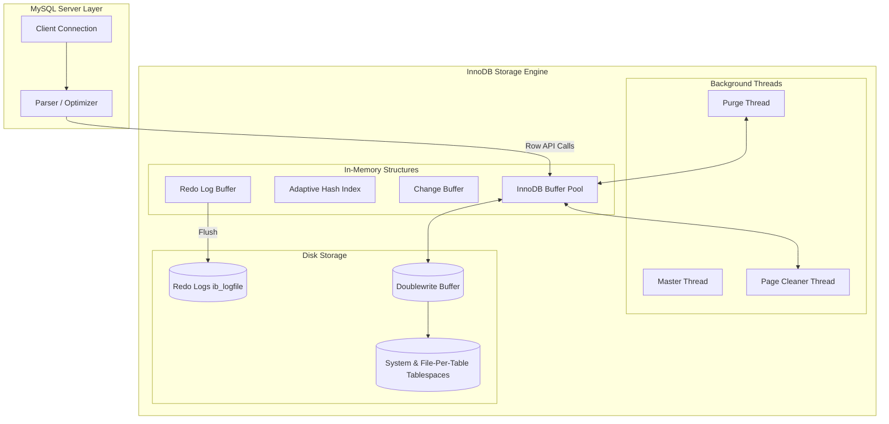

# Topic 3: MySQL / InnoDB Storage Engine

## 1. Problem Background

Historically, MySQL relied on the **MyISAM** storage engine. While MyISAM was fast for simple read-heavy workloads, it had major architectural limitations:
*   **Table-level Locking**: Any write operation locked the entire table, causing severe concurrency bottlenecks.
*   **Lack of ACID Compliance**: MyISAM did not support transactions (rollback) or foreign keys.
*   **Crash Vulnerability**: A system crash frequently resulted in table corruption, requiring manual repairs.

To resolve these issues, MySQL integrated **InnoDB** (developed by Innobase Oy). InnoDB was designed as a production-grade transaction engine, bringing:
*   **ACID Compliance**: Ensuring complete transaction safety.
*   **Row-Level Locking**: Maximizing concurrent write throughput.
*   **Clustered Index Storage**: Organizing tables around their primary keys to optimize lookup speeds.
*   **Multi-Version Concurrency Control (MVCC)**: Allowing high concurrency with readers not blocking writers.

---

## 2. Architecture Overview

InnoDB operates as an pluggable storage engine underneath the MySQL Server layer.



*   **InnoDB Buffer Pool**: The main memory cache where InnoDB buffers data and index pages.
*   **Redo Log Buffer**: Caches page modifications before flushing them to the physical redo logs on disk.
*   **Change Buffer**: A buffer that caches changes to secondary indexes when the page is not in the Buffer Pool, reducing random disk writes.
*   **Purge Thread**: A background thread that reclaims space by deleting undo log pages that are no longer needed by any active transactions.
*   **Doublewrite Buffer**: A safety storage area on disk where InnoDB writes pages before flushing them to the tablespace files, preventing data loss from partial page writes (torn pages).

---

## 3. Internal Design

### 3.1. Clustered Indexes & Primary Key Storage
InnoDB uses **Index-Organized Tables (IOT)**. A table is stored on disk as a B+Tree index representing the Primary Key.

```
                  [ Primary Key B+Tree (Clustered Index) ]
                       /                          \
             [ Internal Nodes ]            [ Internal Nodes ]
                   /                                  \
     [ Leaf Node: Key=10, Data=(Alice, CS, 3.9) ]   [ Leaf Node: Key=20, Data=(Bob, EE, 3.2) ]
     
     -----------------------------------------------------------------------------------------
     
                  [ Secondary Index B+Tree (e.g. Email Index) ]
                       /                          \
             [ Internal Nodes ]            [ Internal Nodes ]
                   /                                  \
     [ Leaf Node: Email=alice@cs, PK=10 ]            [ Leaf Node: Email=bob@ee, PK=20 ]
```

*   **Clustered Index**: The leaf pages of the primary key index store the **entire row data** (columns, transaction metadata, and primary key value).
*   **Secondary Indexes**: The leaf pages of secondary indexes do not store row pointers. Instead, they store the **primary key value** of the matching row.
*   **Double Lookup Penalty**: When searching via a secondary index (e.g., email):
    1.  InnoDB traverses the secondary index to find the primary key value (e.g., email -> PK=10).
    2.  It then traverses the clustered index (Primary Key B+Tree) to retrieve the actual row data (PK=10 -> row data).

### 3.2. Undo Logs & Redo Logs
Unlike PostgreSQL, which puts row histories directly in the table, InnoDB uses separate logs.

*   **Redo Logs**: A circular write-ahead log on disk (`ib_logfile0`, `ib_logfile1`). Redo logs record **physical page changes** (at the byte level). They guarantee **Durability**: if the system crashes, InnoDB replays the redo logs to restore modified pages.
*   **Undo Logs**: Rollback segments stored in undo tablespaces. When a row is modified, InnoDB performs an **in-place update** in the data page and writes the previous state of the columns to the undo log. Undo logs serve two purposes:
    1.  *Transaction Rollback*: If a transaction aborts, InnoDB reads the undo log to revert changes.
    2.  *MVCC Read Consistency*: If a transaction needs to read a previous version of a row to satisfy snapshot isolation, InnoDB retrieves the current row and applies the undo log records backwards to reconstruct the historical row version in memory.

### 3.3. Locking Mechanisms & Concurrency
InnoDB implements granular locking using a lock table in memory.
*   **Lock Modes**:
    *   *Shared (S) Lock*: Required to read a row.
    *   *Exclusive (X) Lock*: Required to modify a row.
    *   *Intent Locks (IS/IX)*: Table-level locks indicating that a transaction intends to lock individual rows. This prevents other transactions from locking the entire table.
*   **Lock Types (Phantom Read Prevention)**:
    Under MySQL's default isolation level, **Repeatable Read**, InnoDB prevents phantom reads (where a concurrent transaction inserts new rows matching a query filter) using:
    *   *Record Locks*: Locks the physical index record.
    *   *Gap Locks*: Locks the gap (interval) between index records, preventing concurrent inserts in that range.
    *   *Next-Key Locks*: A combination of a Record Lock on the index record and a Gap Lock on the gap before it.

---

## 4. Key Comparison with PostgreSQL

The table below contrasts the core architectural differences between MySQL/InnoDB and PostgreSQL.

| Feature | PostgreSQL | MySQL (InnoDB) |
| :--- | :--- | :--- |
| **Storage Layout** | Heap Storage (Unordered rows + separate indexes pointing to TIDs) | Index-Organized Storage (Clustered Index stores entire row data) |
| **MVCC Implementation** | Append-Only (New row versions appended to Heap; xmin/xmax headers) | In-place Updates + Undo Logs (Old column values written to Undo segments) |
| **Space Reclamation** | `VACUUM` (Scans heap pages to reclaim dead tuple slots) | Purge Thread (Deletes old undo log pages; space in pages reused instantly) |
| **Secondary Index Lookup** | Single Seek (Secondary index -> TID -> Row in Heap) | Double Seek (Secondary index -> Primary Key -> Row in Clustered Index) |
| **Primary Key Lookup** | Double Seek (Index seek -> TID -> Heap block) | Single Seek (Direct traversal to B+Tree leaf containing row data) |
| **Write Amplification** | High on updates (Modifying one column updates all secondary index pointers unless HOT) | High on writes (Due to page splits, doublewrite buffer, and redo/undo logging) |

---

## 5. Experiments / Observations

We can analyze the trade-offs of clustered index lookups vs. secondary index lookups through query execution behavior.

### 5.1. Clustered Index Scan (Index Seek)
In InnoDB:
```sql
SELECT * FROM students WHERE student_id = 100;
```
*   **Execution**: InnoDB performs a binary search on the `student_id` B+Tree. Once it reaches the leaf page, the complete row data (`first_name`, `last_name`, `age`, `email`, etc.) is located directly inside the page. 
*   **I/O Cost**: 3 page reads (height of tree).

In PostgreSQL:
```sql
SELECT * FROM students WHERE student_id = 100;
```
*   **Execution**: Postgres traverses the B-Tree index on `student_id` to retrieve the TID (e.g. page 4, slot 12). It then accesses the Heap relation file at page 4 to retrieve the row.
*   **I/O Cost**: 3 index page reads + 1 heap page read = 4 page reads.

**Observation**: Clustered index storage makes primary key lookups faster by removing the indirection step.

### 5.2. Secondary Index Scan (Range Scan)
In InnoDB:
```sql
SELECT first_name, last_name FROM students WHERE email LIKE 'alice%';
```
*   **Execution**: InnoDB searches the secondary B+Tree index on `email`. The index leaf nodes store `email` and the primary key `student_id`. 
*   Because the query asks for `first_name` and `last_name`, which are NOT stored in the secondary index, InnoDB must perform a **Bookmark Lookup**: for each matched email, it takes the `student_id` and traverses the primary key B+Tree to retrieve the row.
*   **I/O Cost**: (Email Index traversal) + N * (PK Clustered Index traversal).

**Observation**: Secondary index range scans can become highly expensive in InnoDB if they require retrieving non-indexed columns, because they generate random reads to the clustered index. In contrast, Postgres secondary index lookups access the heap directly via TID, bypassing index traversals.

---

## 6. Key Learnings

1.  **Clustered Storage Trade-Offs**: Clustered indexing optimizes primary key queries and range scans on the primary key, but makes secondary index lookups slower and more resource-intensive due to the double-lookup penalty.
2.  **Redo vs. Undo Division**: Dividing logging into physical redo (for durability/recovery) and logical undo (for MVCC and transaction rollback) allows InnoDB to perform updates in-place, keeping the table layout compact and avoiding the table bloat common in PostgreSQL.
3.  **Gap Locking Complexity**: InnoDB's Gap locking and Next-Key locking are powerful mechanisms to guarantee Repeatable Read consistency. However, they introduce significant lock contention and increase the risk of deadlocks under high-write workloads compared to Postgres snapshot isolation.
