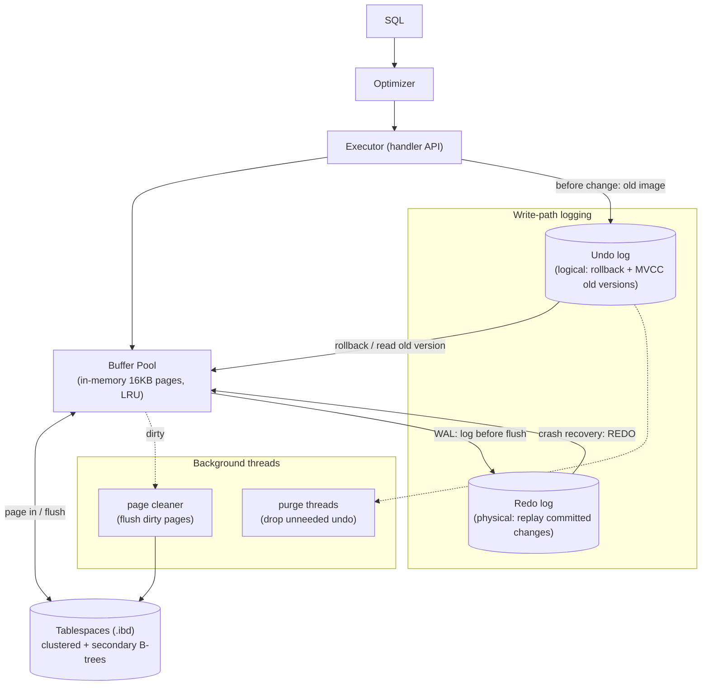
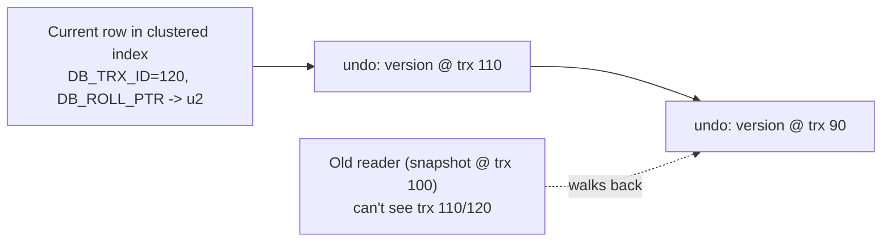

# MySQL / InnoDB Storage Engine

> How InnoDB — MySQL's default storage engine — actually stores and protects data: the
> **clustered index**, **secondary indexes**, the **buffer pool**, **undo** and **redo** logs,
> **row-level locking** with **gap locks**, and **Oracle-style MVCC**. Throughout, the design
> is contrasted with PostgreSQL's append-only-heap + VACUUM model, and every behavioural claim
> is backed by output from a live **MySQL 8.0.46 / InnoDB** instance.

---

## Table of Contents

1. [Problem Background](#1-problem-background)
2. [Architecture Overview](#2-architecture-overview)
3. [Internal Design](#3-internal-design)
   - [3.1 Clustered Index & Primary-Key Storage](#31-clustered-index--primary-key-storage)
   - [3.2 Secondary Indexes](#32-secondary-indexes)
   - [3.3 Buffer Pool](#33-buffer-pool)
   - [3.4 Redo Log](#34-redo-log)
   - [3.5 Undo Log & MVCC](#35-undo-log--mvcc)
   - [3.6 Locking: Row, Gap & Next-Key](#36-locking-row-gap--next-key)
   - [3.7 Isolation Levels](#37-isolation-levels)
4. [InnoDB vs PostgreSQL — the MVCC fork in the road](#4-innodb-vs-postgresql--the-mvcc-fork-in-the-road)
5. [Design Trade-Offs](#5-design-trade-offs)
6. [Experiments / Observations](#6-experiments--observations)
7. [Key Learnings](#7-key-learnings)
8. [References](#references)

---

## 1. Problem Background

InnoDB exists to give MySQL a **transactional, crash-safe, highly-concurrent** storage engine
(MySQL's original MyISAM had table-level locks and no crash recovery). It is an ARIES-style
engine: in-place updates with **undo** (to roll back / reconstruct old versions) and **redo**
(to replay committed changes after a crash). Two decisions define everything else:

1. **The table *is* its primary-key B-tree** (a *clustered index*) — rows are stored *inside*
   the PK index leaves, sorted by PK. This makes PK range scans and lookups very efficient.
2. **MVCC via undo logs** — old row versions are reconstructed on demand from the undo log,
   not stored inline in the table. This keeps the table compact (no per-row version bloat) at
   the cost of undo-chain traversal for old readers.

These are precisely the two places InnoDB diverges from PostgreSQL, so this document keeps the
comparison front-and-centre.

---

## 2. Architecture Overview



The executor works against the **buffer pool** (never raw disk). Before a row is modified its
prior image goes to the **undo log**; the change itself is logged to the **redo log** before
the dirty page is flushed. Background **page-cleaner** threads flush dirty pages lazily, and
**purge** threads discard undo records once no transaction can still need them.

---

## 3. Internal Design

### 3.1 Clustered Index & Primary-Key Storage

In InnoDB the **primary key is a B+-tree whose leaf pages contain the full rows**, ordered by
PK. There is no separate heap. Consequences:

- A **PK lookup** descends one B-tree and finds the row right there — no indirection.
- **PK range scans** are sequential within the tree (rows physically adjacent by PK).
- The PK choice matters enormously: a random PK (e.g. UUID) scatters inserts across the tree
  causing page splits and fragmentation; a monotonic PK (e.g. `AUTO_INCREMENT`) appends to the
  rightmost leaf. (If you declare no PK, InnoDB invents a hidden 6-byte `DB_ROW_ID`.)

If PostgreSQL's heap is "rows live anywhere, the PK index points at them," InnoDB's clustered
index is "the PK index *is* where the rows live."

### 3.2 Secondary Indexes

A secondary index is a separate B-tree whose leaves store **(indexed columns → primary key)** —
*not* a physical row pointer. So a lookup via a secondary index is **two B-trees deep**:

```
secondary index  ->  primary key value  ->  clustered index  ->  row
```

This second hop (a "bookmark lookup") is avoided when the index is **covering** — i.e. it
already contains every column the query needs, so InnoDB answers from the secondary index
alone. **Experiment A** shows this directly: a plain secondary lookup costs **1.4**, while the
covering version costs **0.651** — the difference *is* the skipped clustered-index probe.

Storing the PK (not a physical pointer) in secondary indexes is deliberate: when a row moves
within the clustered index (page split/reorg), secondary indexes need **no** update, because
they reference the *logical* PK, not a physical location.

### 3.3 Buffer Pool

InnoDB caches **16 KB pages** in the **buffer pool** (default 128 MB, confirmed live). Its
eviction policy is a **midpoint-insertion LRU**: the list is split into a *young* (hot)
sublist and an *old* (recently-read) sublist, and newly read pages are inserted at the
*midpoint* rather than the head. This protects the hot working set from being flushed by a
one-off large scan (a full table scan fills the *old* sublist and ages out quickly without
evicting genuinely hot pages). It also does **change buffering** (deferring secondary-index
maintenance for pages not in memory) and adaptive hash indexing.

### 3.4 Redo Log

The **redo log** is InnoDB's WAL: a fixed-size, circular, **physical** log
(`innodb_redo_log_capacity`, **100 MB** live) of page-level changes. The protocol:

- A change is written to the redo log (and the in-memory page dirtied) before that page is
  flushed to the tablespace. `innodb_flush_log_at_trx_commit = 1` (confirmed live) means redo
  is `fsync`-ed at every commit → full durability.
- **Crash recovery** replays redo forward to redo committed changes that hadn't been flushed.
- It enables the central performance trick: turn slow *random* data-page writes into fast
  *sequential* redo writes, and flush the data pages lazily in the background.

### 3.5 Undo Log & MVCC

The **undo log** stores the **previous version** of every row a transaction modifies (in
dedicated undo tablespaces — `innodb_undo_001`, `innodb_undo_002`, confirmed live). It serves
two purposes:

1. **Rollback** — to abort a transaction, apply its undo records in reverse.
2. **MVCC** — a consistent read reconstructs the version it is allowed to see by walking the
   undo chain *backwards* from the current row, using each row's hidden `DB_TRX_ID` (last
   modifying transaction) and `DB_ROLL_PTR` (pointer into the undo log).



> **This is the key contrast with PostgreSQL.** PostgreSQL keeps every version *inline in the
> table* and cleans up with VACUUM. InnoDB keeps only the *current* version in the table and
> reconstructs old versions from the undo log on demand. So InnoDB tables don't bloat with dead
> versions — but long-running read transactions force long undo chains (and the
> "history list" grows until **purge** threads can trim it).

**Experiment G** demonstrates MVCC live: a reader saw `bal=100`, another transaction set it to
`999` and committed, and the reader's *second* read in the same transaction **still returned
100** — reconstructed from undo, honouring its snapshot.

### 3.6 Locking: Row, Gap & Next-Key

InnoDB locks at **row granularity** (locks are stored as bits on the index records, not in a
giant lock table), so transactions touching different rows don't contend. **Experiment E**
confirms it: transaction B updated a *different* row with no wait, but waited ~2.85 s for a row
held by A, proceeding only after A committed (it **waits**, it doesn't error).

To prevent **phantom rows** under REPEATABLE READ, InnoDB also locks the *gaps between* index
records:

- **Record lock** — locks a single index row.
- **Gap lock** — locks the open interval *between* two index values, so no one can insert there.
- **Next-key lock** — record lock + the gap before it; this is the default for range scans.

**Experiment F** shows a range `SELECT ... FOR UPDATE` over `(10,20)` blocking an `INSERT id=15`
(inside the gap → lock-wait timeout) while an `INSERT id=99` (outside) succeeded immediately.
Gap locking is *why* InnoDB's REPEATABLE READ avoids phantoms — something the SQL standard
allows REPEATABLE READ to suffer from.

### 3.7 Isolation Levels

InnoDB's **default is `REPEATABLE READ`** (confirmed live) — notably *stronger* than
PostgreSQL's default `READ COMMITTED`. Under InnoDB RR, a consistent snapshot is established at
the first read and reused for the whole transaction (Experiment G), and gap/next-key locks
suppress phantoms for locking reads. All four standard levels are supported
(`READ UNCOMMITTED`, `READ COMMITTED`, `REPEATABLE READ`, `SERIALIZABLE`).

---

## 4. InnoDB vs PostgreSQL — the MVCC fork in the road

| Dimension | PostgreSQL | InnoDB |
|---|---|---|
| Table physical form | **Heap** (unordered) + separate PK index | **Clustered index** (rows in PK B-tree leaves) |
| Update strategy | **Append new tuple version** in-table | **In-place update**, old image to undo log |
| Old versions live | Inline in the table | In the **undo log** (reconstructed on read) |
| Garbage collection | **VACUUM** (reclaims dead tuples) | **Purge** threads (trim undo history) |
| Secondary index leaf | points at heap `ctid` | points at **primary key** |
| Logs | WAL (redo only; undo is the table itself) | **redo + undo** (two separate logs) |
| Default isolation | READ COMMITTED | **REPEATABLE READ** |
| Phantom protection | predicate locks only at SERIALIZABLE | **gap / next-key locks** at REPEATABLE READ |

**Why two logs in InnoDB but effectively one in Postgres?** Because their MVCC models differ.
InnoDB updates *in place*, so to (a) roll back and (b) serve old readers it must stash the old
image somewhere — the **undo** log. It still needs **redo** for crash recovery of the in-place
changes. PostgreSQL keeps old versions *in the table itself*, so its rollback is "ignore the
new tuple" and its old-version reads are "find the right tuple version" — no separate undo log
is required; WAL (redo) suffices. **Same goal (atomicity + durability + MVCC), opposite
placement of the old data.**

---

## 5. Design Trade-Offs

**InnoDB advantages**
- **Clustered index**: fast PK lookups (no indirection) and PK range scans; compact tables (no
  version bloat).
- **In-place + undo MVCC**: tables stay small; readers still don't block writers.
- **Fine-grained, index-stored row locks** + gap locks: high write concurrency *and*
  phantom-free REPEATABLE READ.

**InnoDB costs / limitations**
- **Secondary indexes pay a double lookup** (index → PK → row) unless covering; and every
  secondary index stores a copy of the PK, so a **wide PK bloats every secondary index**.
- **Long-running readers** lengthen undo chains and grow the history list → purge lag, slower
  old-version reconstruction.
- **PK choice is critical**: random PKs cause page splits and fragmentation.
- **Gap locks can surprise** developers (blocking inserts that "shouldn't" conflict) and can
  contribute to deadlocks.

**PostgreSQL's mirror-image trade-off**: no double-lookup or PK-in-every-index overhead, and no
undo chains for readers — but it pays with **table/index bloat** and the operational need to
keep **VACUUM** healthy.

---

## 6. Experiments / Observations

> **Setup.** MySQL **8.0.46** / InnoDB (Docker `mysql:8.0`). Dataset: `customers` (50,000),
> `orders` (200,000), `order_items` (600,000), InnoDB tables with PK + secondary indexes on the
> FKs. All output is from real runs.

### Experiment A — Clustered vs secondary vs covering index

```
-- PK lookup (clustered index, no indirection):
EXPLAIN: -> Rows fetched before execution  (cost=0..0 rows=1)

-- Secondary-index lookup (then back to clustered index for the row):
EXPLAIN: -> Index lookup on orders using idx_customer (customer_id=12345)  (cost=1.4 rows=4)

-- Covering secondary index (answer entirely from the index, NO clustered probe):
EXPLAIN: -> Covering index lookup on orders using idx_customer (customer_id=12345)  (cost=0.651 rows=4)
```

**Observation.** The optimizer's own cost numbers expose the clustered-index design: the
covering lookup (**0.651**) is cheaper than the plain secondary lookup (**1.4**) by exactly the
amount of the avoided "secondary → PK → clustered" second step.

### Experiment B — Buffer pool

```
 buffer_pool_MB | page_bytes
----------------+-----------
       128      |   16384

 pages_total | FREE_BUFFERS | data_pages | hit_rate_pct
-------------+--------------+------------+-------------
        8192 |         2269 |       5505 |        100.0
```

**Observation.** 128 MB / 16 KB = 8,192 page slots; after the workload, 5,505 hold data and the
buffer-pool **hit rate is 100%** — the working set is fully cached, so reads are served from
memory.

### Experiment C — Redo & undo configuration

```
 redo_capacity_MB | flush_at_commit
------------------+----------------
       100        |       1            <- fsync redo on every commit (durable)

 undo tablespaces:  innodb_undo_001 (16 MB),  innodb_undo_002 (32 MB)
```

**Observation.** Both logs are real, separate on-disk structures. `flush_log_at_trx_commit=1`
is the durable default; the dedicated undo tablespaces are where old row versions and rollback
data live (§3.5).

### Experiment D — 3-table join plan

```
-> Group aggregate  (cost=42017 rows=4)
  -> Nested loop inner join  (cost=36123 rows=58944)
    -> Nested loop inner join  (cost=15492 rows=19740)
      -> Covering index lookup on c using idx_country (country='IN')  (cost=1004 rows=10000)
      -> Index lookup on o using idx_customer (customer_id=c.id)      (cost=1.03 rows=4.14)
    -> Index lookup on oi using idx_order (order_id=o.id)             (cost=0.747 rows=2.99)
```

**Observation.** InnoDB/MySQL drove the join as **index-nested-loops**: start from the small
filtered set (`country='IN'` via a covering index), then probe `orders` and `order_items`
through their secondary indexes. (Notably different from PostgreSQL, which chose a **parallel
hash join** for the same query — MySQL favours index-NLJ and doesn't parallelize a single query
here.)

### Experiment E — Row-level locking

```
[A holds an open UPDATE on row id=1]
[t=1s] B updates row id=2  -> "B updated row 2 WITHOUT waiting"
[t=1s] B updates row id=1  -> WAITS ~2.85s -> "B updated row 1 AFTER A committed"
final: id1=95, id2=80   (both applied correctly)
```

**Observation.** Locks are per-row: different rows → full concurrency; same row → the second
writer **waits** (no error) until the first commits. Identical qualitative behaviour to
PostgreSQL's row locks.

### Experiment F — Gap lock (phantom prevention)

```
[A holds: SELECT id FROM acct WHERE id BETWEEN 10 AND 20 FOR UPDATE]   (gap 10..20 locked)
[t=1s] B INSERT id=15 (inside gap)  -> ERROR 1205: Lock wait timeout exceeded   (BLOCKED)
[t=1s] B INSERT id=99 (outside gap) -> "inserted id=99 (no wait)"               (ALLOWED)
```

**Observation.** A range lock under REPEATABLE READ locks the **gap**, not just existing rows —
so a phantom row *cannot* be inserted into the locked range, while inserts outside proceed
freely. This is InnoDB's mechanism for phantom-free REPEATABLE READ.

### Experiment G — MVCC consistent read (undo log in action)

```
[A] first read  bal of id=30  -> 100
[t=1s] B: UPDATE id=30 SET bal=999; COMMIT   ("B set bal=999")
[A] second read bal of id=30  -> 100         <- SAME snapshot, reconstructed from undo
```

**Observation.** Inside A's REPEATABLE READ transaction, both reads returned **100** even though
B committed `999` in between. InnoDB rebuilt the old version from the **undo log** to honour A's
snapshot — Oracle-style MVCC, made visible.

---

## 7. Key Learnings

1. **"The table is the PK index" explains most of InnoDB.** Clustered storage gives fast PK
   access and compact tables, but forces secondary indexes to store the PK and pay a
   double-lookup — visible as the 0.651-vs-1.4 cost gap (Experiment A).

2. **Undo + redo are not redundant — they answer different questions.** Redo = "replay
   committed changes after a crash" (durability). Undo = "reconstruct the old version / roll
   back" (atomicity + MVCC). In-place updates *require both*.

3. **InnoDB and PostgreSQL solve MVCC by putting old versions in opposite places.** Undo log
   (InnoDB) vs inline table versions (PG). That single choice cascades into undo-chains +
   purge vs bloat + VACUUM, and into one-log vs two-log designs (§4).

4. **Gap locks are the hidden half of REPEATABLE READ.** Seeing an in-range INSERT time out
   while an out-of-range INSERT sailed through (Experiment F) made "phantom prevention"
   concrete — and explained a classic source of surprising InnoDB deadlocks.

5. **Defaults differ in ways that matter.** InnoDB defaults to REPEATABLE READ (stronger),
   PostgreSQL to READ COMMITTED. The same application can behave differently across the two
   purely because of the default isolation level.

6. **The optimizer's personality shows in the plan.** For the identical join, InnoDB chose
   index-nested-loops while PostgreSQL chose a parallel hash join (Experiment D) — a reminder
   that "the query" and "the plan" are very different things, shaped by each engine's costing
   and capabilities.

---

## References

- MySQL 8.0 Reference Manual — *InnoDB Storage Engine*: Clustered/Secondary Indexes, Buffer
  Pool, Redo Log, Undo Logs, InnoDB Locking and Transaction Model, Consistent Nonlocking Reads:
  https://dev.mysql.com/doc/refman/8.0/en/innodb-storage-engine.html
- *MySQL Internals* / InnoDB source (`storage/innobase/`):
  https://github.com/mysql/mysql-server
- Jeremy Cole, *InnoDB index/page internals* series: https://blog.jcole.us/innodb/
- Mohan et al., *ARIES: A Transaction Recovery Method...* (1992) — the redo/undo design lineage.

> *All Section 6 output was produced on MySQL 8.0.46 / InnoDB (Docker). Cost numbers are the
> optimizer's own estimates and absolute timings vary by hardware; the structural behaviours
> are the point.*
