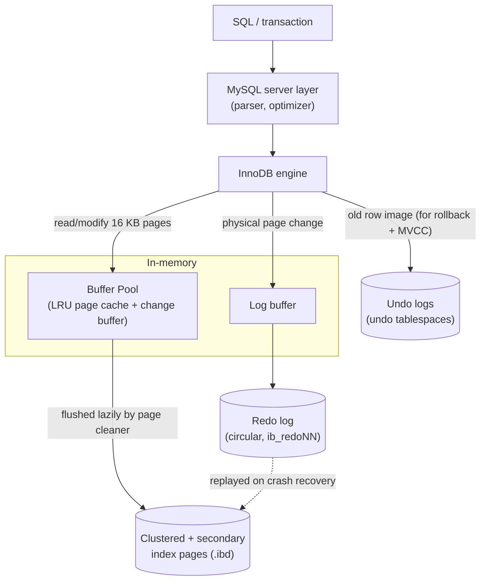

# MySQL / InnoDB Storage Engine

> Advanced DBMS · System Design Discussion · **Saswata Das (24BCS10248)**

InnoDB is MySQL's default transactional storage engine. Where PostgreSQL stores
rows in an unordered heap and keeps every version inline (cleaned by `VACUUM`),
InnoDB makes the opposite set of choices: rows live **inside a clustered index**,
updates happen **in place**, and old versions are kept in **undo logs**
(Oracle-style MVCC). This document explains those choices, contrasts them with
PostgreSQL throughout, and backs every claim with live output from **MySQL
8.4.10 / InnoDB** in Docker (5 000 customers, 50 000 orders).

---

## 1. Problem Background

MySQL began with non-transactional engines (MyISAM). InnoDB was created to give
MySQL **ACID transactions, crash recovery, row-level locking, and MVCC** for
high-concurrency OLTP. Its design borrows heavily from Oracle/System-R ideas:
keep data physically organised by primary key, update rows in place for cache and
storage efficiency, and maintain _both_ an **undo log** (to roll transactions
back and to reconstruct old versions for readers) and a **redo log** (to roll
committed changes forward after a crash).

---

## 2. Architecture Overview



A committed transaction is durable once its **redo** records are flushed
(`innodb_flush_log_at_trx_commit=1`, confirmed below); the modified data pages are
written back lazily by the page-cleaner thread. The **undo** log simultaneously
holds the pre-image so the change can be rolled back and so other transactions can
still read the old version.

---

## 3. Internal Design

### 3.1 Clustered index — the table _is_ its primary key

In InnoDB the primary key **is** the table: rows are stored in the leaf pages of
the PK B-tree, in key order. There is no separate heap. A PK lookup therefore
fetches the entire row straight from the index leaf — the optimizer treats it as a
constant-cost access:

```text
EXPLAIN FORMAT=TREE SELECT * FROM orders WHERE id = 12345;
 -> Rows fetched before execution  (cost=0..0 rows=1)   # row lives in the clustered-index leaf
```

### 3.2 Secondary indexes store the primary key (not a row pointer)

A secondary index leaf holds _(indexed columns, primary key)_. To fetch columns
not in the index, InnoDB reads the secondary index to get the PK, then performs a
second lookup in the clustered index — a "double lookup":

```text
EXPLAIN FORMAT=TREE SELECT * FROM orders WHERE cust_id = 42;
 -> Index lookup on orders using idx_cust (cust_id=42)  (cost=3.5 rows=10)
                                              (then back to the clustered index per row)

information_schema.STATISTICS for orders:
 INDEX_NAME | SEQ_IN_INDEX | COLUMN_NAME
 idx_cust   |      1       | cust_id        # secondary index
 PRIMARY    |      1       | id             # clustered index = the table
```

> **Consequence:** the primary key is glued into _every_ secondary index, so a
> large PK bloats all indexes. This is why InnoDB best practice is a **small,
> monotonic PK** (e.g. an auto-increment BIGINT) — random/large PKs cause page
> splits and fat secondary indexes. (PostgreSQL's heap avoids this: its indexes
> point to a fixed-size `ctid`, but it pays with no clustering.)

### 3.3 Buffer pool

InnoDB caches 16 KB pages in the **buffer pool** using an LRU list with
**midpoint insertion** — newly read pages enter the _middle_, not the head, so a
one-off full scan cannot evict the hot working set. Observed:

```text
@@innodb_buffer_pool_size = 128 MB
Buffer pool size   8192      (16 KB pages)
Free buffers       6772
Database pages     1420      # pages currently cached
Modified db pages    52      # dirty pages awaiting flush
```

A **change buffer** defers and merges modifications to non-unique secondary index
pages that aren't in memory, turning random secondary-index writes into cheaper
sequential ones.

### 3.4 Undo logs — rollback **and** MVCC

Every modifying statement writes the row's **old image** to the undo log. Undo
serves two purposes:

1. **Atomicity:** if the transaction aborts, InnoDB applies undo to restore the
   previous values.
2. **MVCC:** a reader whose snapshot predates the change follows the row's
   `DB_ROLL_PTR` back through undo to reconstruct the version it should see.

InnoDB keeps **one current row version in place** in the clustered index plus a
chain of older images in undo. A background **purge** thread discards undo once no
snapshot needs it. (Contrast: PostgreSQL stores _all_ versions inline in the heap
and reclaims them with `VACUUM` — see §4.)

### 3.5 Redo log — durability and crash recovery

The redo log is a **circular**, physiological log of page changes, addressed by a
monotonic **LSN**. On commit the relevant redo is flushed; on crash, InnoDB
replays redo from the last checkpoint forward. Observed from
`SHOW ENGINE INNODB STATUS`:

```text
LOG
---
Log capacity            104857600     # 100 MB redo (@@innodb_redo_log_capacity)
Log sequence number       34608342    # current write position (LSN)
Log flushed up to         34608342    # durable point
Last checkpoint at        34593236    # recovery starts here; redo after this must be replayed
@@innodb_flush_log_at_trx_commit = 1  # flush+fsync redo at every commit (full durability)
```

### 3.6 Row-level locking, gap locks & next-key locks

InnoDB locks **index records**, not rows or pages, allowing high write
concurrency. Under the default **REPEATABLE READ**, range operations take
**next-key locks** = a record lock **+** a **gap lock** on the gap before it, so
no other transaction can insert into the scanned range — this is how InnoDB
prevents **phantom rows**. Captured live (`g` holds id = 1,5,10,15):

```text
START TRANSACTION;
SELECT * FROM g WHERE id BETWEEN 4 AND 11 FOR UPDATE;   -- returns rows 5,10

performance_schema.data_locks:
 OBJECT_NAME | LOCK_TYPE | LOCK_MODE | LOCK_DATA
 g           | TABLE     | IX        | NULL        # intention-exclusive on the table
 g           | RECORD    | X         | 5           # next-key lock on existing record 5
 g           | RECORD    | X         | 10          # next-key lock on existing record 10
 g           | RECORD    | X,GAP     | 15          # GAP lock: blocks inserts in (10,15)
```

The range `[4,11]` locked the matching records **and** the gap up to the next key
(15), so an attempted `INSERT INTO g VALUES (11,…)` from another session would
block — phantoms prevented.

### 3.7 Isolation levels

InnoDB supports all four SQL isolation levels; default **REPEATABLE READ** uses a
consistent **read view** (MVCC via undo) for plain `SELECT` and next-key locking
for locking reads. READ COMMITTED takes a fresh read view per statement and uses
only record locks (no gaps), trading phantom protection for fewer lock conflicts.

---

## 4. Design Trade-Offs — InnoDB vs PostgreSQL

| Dimension           | InnoDB                                       | PostgreSQL                                       |
| ------------------- | -------------------------------------------- | ------------------------------------------------ |
| Row storage         | **Clustered** in PK B-tree                   | Unordered **heap**                               |
| Update model        | **In place** + old image to **undo**         | **Append** new tuple version inline              |
| Old versions        | In undo logs, purged by background thread    | In the heap, reclaimed by **VACUUM**             |
| Secondary index ptr | Primary key (double lookup; PK size matters) | `ctid` (fixed size; no clustering)               |
| Logs                | **Undo + Redo** (two logs)                   | **WAL** (one log; rollback via tuple visibility) |
| Phantom prevention  | Next-key / gap locks (locking)               | MVCC snapshot (+ SSI for serializable)           |
| PK range scan       | Sequential within clustered index            | Random heap access unless `CLUSTER`ed            |

**Why InnoDB needs _both_ undo and redo logs.** They run in opposite directions
and serve different goals. **Redo** is for **durability**: replay committed
changes that hadn't reached the data files (roll _forward_). **Undo** is for
**atomicity + MVCC**: revert uncommitted changes and reconstruct old versions for
readers (roll _back_). Crash recovery does both — redo to the latest state, then
undo for transactions that never committed.

**What clustered indexes buy.** PK point-lookups return the full row from the
index leaf with no extra fetch (§3.1), and PK range scans are physically
sequential (great cache/IO locality). The cost is the secondary-index double
lookup and PK-size amplification across indexes.

**Why PostgreSQL chose a different MVCC model.** InnoDB keeps one row version in
place and pushes history to undo — primary data stays compact, but it needs undo
management and a purge thread, and long-running readers can bloat undo.
PostgreSQL keeps all versions in the heap — rollback is trivial (just mark the new
version dead) and there is no undo subsystem, but it needs `VACUUM` and suffers
table bloat. Each engine moved the cost to a different place: **InnoDB → undo +
purge; PostgreSQL → heap bloat + VACUUM.**

---

## 5. Experiments / Observations (summary)

| Observation                        | Evidence                                                                                 |
| ---------------------------------- | ---------------------------------------------------------------------------------------- |
| Table is the clustered index       | PK lookup = "Rows fetched before execution", constant cost                               |
| Secondary index stores PK          | `idx_cust` + `PRIMARY` in STATISTICS; `cust_id` lookup then clustered fetch              |
| Buffer pool = LRU 16 KB pages      | 8192 frames, 1420 cached, 52 dirty                                                       |
| Two logs                           | redo: `Log capacity 100MB`, `LSN 34608342`, `checkpoint 34593236`; undo: rollback + MVCC |
| Full durability default            | `innodb_flush_log_at_trx_commit = 1`                                                     |
| Next-key locking prevents phantoms | `data_locks`: `X` on records 5,10 + `X,GAP` on 15 for range `[4,11]`                     |
| Default isolation                  | `REPEATABLE-READ`                                                                        |

---

## 6. Key Learnings

1. **"Clustered" is the organising idea of InnoDB.** Because the table _is_ the
   PK B-tree, almost everything else follows: cheap PK lookups, sequential PK
   scans, PK-carrying secondary indexes, and the advice to use small monotonic
   primary keys.
2. **Two logs, two directions.** Redo rolls committed work _forward_ for
   durability; undo rolls uncommitted work _back_ and powers MVCC. Neither
   replaces the other — I could see both the redo LSN/checkpoint and the role of
   undo in the same engine.
3. **MVCC is a design space, not a single technique.** InnoDB (in-place + undo)
   and PostgreSQL (append + VACUUM) reach the same guarantee — readers don't block
   writers — by opposite routes, each paying a different maintenance cost.
4. **Locking is at the index-record level, and gaps are first-class.** Watching
   `data_locks` show a `GAP` lock made concrete how InnoDB stops phantoms under
   REPEATABLE READ — and hinted at why gap locks are a common source of deadlocks.
5. **Surprising takeaway.** A `SELECT ... FOR UPDATE` that returned only two rows
   held _four_ locks (table IX + two record + one gap) — locking protects the
   _absence_ of rows (the gaps), not just the rows returned.

---

### References (consulted and credited)

- MySQL 8.4 Reference Manual: _InnoDB Storage Engine_ — Clustered/Secondary
  Indexes, Buffer Pool, Undo Logs, Redo Log, Locking (Record/Gap/Next-Key),
  Transaction Isolation Levels, `SHOW ENGINE INNODB STATUS` — dev.mysql.com.
- MySQL `performance_schema.data_locks` documentation.
- Cross-reference: PostgreSQL MVCC/VACUUM (companion _PostgreSQL Internals_ doc).

_All EXPLAIN output, `data_locks` rows, `SHOW ENGINE INNODB STATUS` excerpts, and
server variables are verbatim from MySQL 8.4.10 (Docker)._
