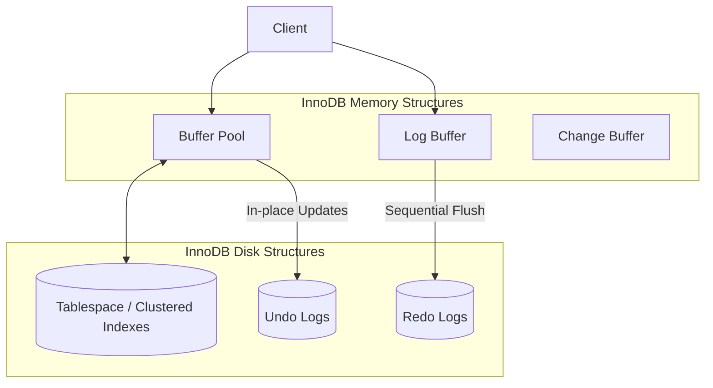

# MySQL / InnoDB Storage Engine Architecture

## 1. Problem Background

MySQL is a widely used relational database management system, and **InnoDB** is its default, ACID-compliant storage engine. Unlike PostgreSQL, which tightly couples its storage and execution engines, MySQL uses a pluggable storage engine architecture. The problem InnoDB solves is providing highly reliable, high-performance transactional storage with row-level locking, ensuring that multi-user read/write workloads operate safely without table-level blocking.

## 2. Architecture Overview

InnoDB's architecture consists of both memory structures and on-disk files. The major components are designed to ensure data consistency, crash recovery, and fast primary key lookups.

## 3. Internal Design

### 1. Storage Structures: Clustered vs Secondary Indexes
*   **Clustered Indexes:** In InnoDB, every table is an **Index-Organized Table**. The Primary Key B+Tree *is* the table. The leaf nodes of the primary key index do not contain pointers to the data; they contain the actual row data itself. 
*   **Secondary Indexes:** Any other index on the table is a secondary index. The leaf nodes of a secondary index contain the indexed column value and the **Primary Key** value, *not* a direct physical pointer. Thus, looking up data via a secondary index usually requires a double lookup: traverse the secondary index to find the PK, then traverse the Clustered Index to find the row.

### 2. Memory Management (Buffer Pool)
The Buffer Pool caches both data and index pages in memory. It uses a variation of the LRU (Least Recently Used) algorithm to keep frequently accessed pages in RAM. Modifications to data happen in the Buffer Pool first, marking the page as "dirty".

### 3. Transaction Processing & Concurrency (MVCC)
InnoDB implements MVCC fundamentally differently than PostgreSQL.
*   **In-Place Updates:** Unlike PostgreSQL's append-only model, InnoDB modifies rows *in place* on the disk page. 
*   **Undo Logs:** To support MVCC and Rollbacks, the *previous* version of the row is written to an **Undo Log**. If a concurrent transaction needs to read a snapshot of the database, it rebuilds the older version of the row by applying undo log records backwards.

### 4. Recovery Mechanisms (Redo Logs)
*   **Redo Logs:** While Undo Logs allow rollback, **Redo Logs** guarantee durability (Forward-roll). Before a transaction commits, the physical changes made to pages are written to the Redo Log buffer and flushed to disk sequentially. If the database crashes before dirty pages from the Buffer Pool hit the tablespace, the Redo Logs are replayed during startup to recreate the committed changes.

### 5. Locking Mechanisms
InnoDB supports fine-grained concurrency via **Row-Level Locking**.
*   **Record Locks:** Lock on an index record.
*   **Gap Locks:** Locks the gap between index records, or before the first/after the last record. This prevents "Phantom Reads" in the Repeatable Read isolation level by ensuring no other transaction can insert a row into the gap being scanned.
*   **Next-Key Locks:** A combination of a record lock and a gap lock before the record.

## 4. Design Trade-Offs

### Key Comparison: InnoDB vs PostgreSQL

| Feature | PostgreSQL | MySQL / InnoDB |
| :--- | :--- | :--- |
| **Storage Model** | Append-Only Heap. Indexes point to physical TIDs. | Clustered Index. Secondary indexes point to PK. |
| **Row Updates** | Creates a new tuple. Old tuple left behind. | Updates row in-place. Old version saved in Undo Log. |
| **Cleanup** | Requires `VACUUM` daemon to reclaim space. | Undo logs are purged automatically by a purge thread. |
| **Index Updates** | Fast (HOT updates) if indexed column isn't changed. | Secondary indexes are smaller but require double B-Tree traversal. |

### Trade-Off Analysis
*   **Clustered Indexes Advantage:** Primary key lookups are extremely fast since the data is right there in the index leaf node. Range scans on the PK are highly efficient.
*   **Clustered Indexes Limitation:** Secondary index lookups are slower. Updating the Primary Key is incredibly expensive (requires moving the entire row and updating all secondary indexes).
*   **In-Place Updates Advantage:** No table bloat. A heavily updated table doesn't require a `VACUUM` process scanning the entire file.
*   **Undo/Redo Log Limitation:** Maintaining dual logs (Undo for state, Redo for durability) adds complexity and slightly higher write amplification compared to pure append-only systems.

## 5. Suggested Questions & Analysis

**Q: Why does InnoDB need both undo and redo logs?**
A: **Redo logs** provide *Durability* (ensuring committed data is not lost on crash by tracking physical page changes). **Undo logs** provide *Atomicity* and *Isolation* (allowing a transaction to roll back, and allowing concurrent readers to reconstruct older snapshots via MVCC).

**Q: Why did PostgreSQL choose a different MVCC model?**
A: PostgreSQL's append-only MVCC was designed for simplicity and reliability. By keeping row versions in the main heap, it avoided building complex standalone Undo Log structures. It also allowed for extremely fast transaction rollbacks (just updating a status bit, no undo required). The trade-off is the necessity of `VACUUM`.

## 6. Key Learnings

1.  **Index-Organized Tables Matter:** Always define a short, sequential Primary Key in InnoDB (like an Auto-Increment INT). Using a massive UUID as a primary key will fragment the clustered index and bloat all secondary indexes.
2.  **Gap Locks Prevent Phantoms:** Understanding Gap Locks is crucial to debugging deadlock issues in MySQL, as queries using range conditions will implicitly lock empty spaces in the index.
3.  **Architectural Divergence:** InnoDB and PostgreSQL solve the exact same problem (ACID transactions with MVCC) using completely opposite storage philosophies (In-place + Undo vs Append-Only).
